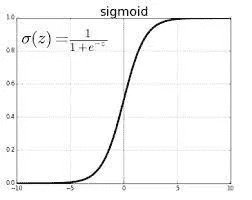

# 神经网络的激活函数和损失函数——如何选择正确的函数？

> 原文：<https://medium.com/analytics-vidhya/activation-functions-and-loss-functions-for-neural-networks-how-to-pick-the-right-one-542e1dd523e0?source=collection_archive---------1----------------------->

## 得到神经网络激活函数和损失函数的正确组合的备忘单

当一个人开始开发自己的神经网络时，很容易被模型中每个参数的各种选项所淹没。每个隐藏层使用哪个激活函数？哪个激活函数用于输出层？什么时候使用二元交叉熵 vs 分类交叉熵？

这样的问题会不断出现，直到我们对每个选项的作用、利弊以及何时应该使用它没有一个明确的理解。博客的目的正是如此。我们将通过流行的激活函数和损失函数的关键特征，以及理解什么时候应该使用哪个。如果你需要复习一下神经网络是如何工作的，或者什么是激活或损失函数，请参考这个[博客](https://indraneeldb1993ds.medium.com/understanding-the-basics-of-neural-networks-for-beginners-9c26630d08)。所以不要再耽搁了，让我们开始吧！

# 激活功能

给定输入，神经元的激活函数定义其输出。我们将讨论 4 种流行的激活功能:

1.  **乙状结肠功能:**

**描述:** *取一个实数值，在 0 和 1 之间缩放。大负数变成 0，大正数变成 1*
**公式:** 1 /(1 + e^-x)
**范围:** (0，1)
**优点:** *由于它的范围在 0 到 1 之间，所以非常适合需要预测某个事件的概率作为输出的情况。*
**缺点:** *梯度值对于范围-3 和 3 是显著的，但是在这个范围之外变得更加接近零，这几乎消除了神经元对最终输出的影响。此外，sigmoid 输出不是以零为中心的(它以 0.5 为中心)，这导致权重*
**图**的梯度更新中出现不希望的曲折动态

**2。双曲正切函数:**

**描述:** *类似于 sigmoid，但取一个实数值并在-1 和 1 之间缩放。它比 sigmoid 更好，因为它以 0 为中心，这导致更好的收敛*
**公式:**(e^x-e^-x)/(e^x+e^-x)
**范围:** (-1，1)
**优点:***tanh 的导数大于 sigmoid 的导数，这有助于我们更快地最小化成本函数*
**缺点:** *与 sigmoid 类似，梯度值变得接近* *因此，网络拒绝学习或者以非常小的速率保持学习。*
**剧情:**

**3。Softmax 功能:**

**描述:** *Softmax 函数可以想象为多个 sigmoids 的组合，它可以返回属于多类分类问题*
**中每个单独类的数据点的概率公式:**

**Range:** (0，1)，sum of output = 1
**优点:** *可以处理多个类并给出属于每个类的概率*
**缺点:** *不应该用在隐藏层中因为我们希望神经元是独立的。如果我们应用它，那么它们将是线性相关的。*

**剧情:**不适用

**4。ReLU 功能:**

**说明:** *整流线性激活函数，简称 ReLU，是一个分段线性函数，如果是正的就直接输出输入，否则输出零。这是默认功能，但修改默认参数允许我们使用非零阈值，并对低于阈值的值使用非零倍数的输入(称为泄漏 ReLU)。*
**公式:** max(0，x)
**范围:** (0，inf)
**优点:** *虽然 RELU 看起来和行为像线性函数，但它是一个非线性函数，允许学习复杂的关系，并且能够通过具有大的导数来允许学习深度网络中的所有隐藏层。*
**缺点:** *它不应该作为分类/回归任务的最终输出层*
**图:**

# 损失函数

建立神经网络基础设施的另一个关键方面是选择正确的损失函数。对于神经网络，我们寻求最小化由损失函数计算的误差(实际值和预测值之间的差异)。我们将讨论 3 种流行的损失函数:

**1。均方差，L2 损失**

**描述:** *MSE loss 用于回归任务。顾名思义，这种损失是通过取实际值(目标值)和预测值之间的平方差的平均值来计算的。*
**公式:**

**范围:** (0，inf)
**优点:** *如果目标变量的分布为高斯型，则首选损失函数，因为它具有良好的导数，有助于模型快速收敛*
**缺点:** *对数据中的异常值不稳健(与平均绝对误差等损失函数不同)并且指数地惩罚高低预测(与均方对数误差损失等损失函数不同)*

**2。二元交叉熵**

**说明:** *BCE 损失是用于二分类任务的默认损失函数。它需要一个输出图层将数据分为两类，输出范围为(0–1)，即应使用 sigmoid 函数。*
**公式:**

*其中 y 是实际标签，ŷ是分类器预测一个类别的预测概率分布，m 是记录的数量。*
**范围:** (0，inf)
**优点:** *损失函数的连续性质有助于训练过程很好地收敛*
**缺点:** *只能与 sigmoid 激活函数一起使用。其他损失函数，如铰链或方形铰链损失，可与双曲正切激活函数一起工作*

**3。分类交叉熵**

**描述:**当我们有多类分类任务时，它是默认的损失函数。它需要与最后一层经历 *softmax* 激活的类相同数量的输出节点，以便每个输出节点具有介于(0–1)之间的概率值。
**公式:**

*其中 y 是实际标签，p 是分类器预测的概率分布，用于预测类 j*
**范围:** (0，inf)
**优点:** *类似于二进制交叉熵，损失函数的连续性质有助于训练过程很好地收敛*
**缺点:** *如果有许多类，可能需要一个具有许多零值的热编码向量，需要大量的存储器(在这种情况下应该使用稀疏分类交叉熵*

# 摘要

读完这篇博客后，读者应该能够为大多数流行的机器学习问题建立正确的架构(就激活和损失函数而言)。下表简要介绍了在何处使用这些功能:

深度学习包/库中有[几个其他激活函数](https://keras.io/api/layers/activations/)如 softplus 和 elu，以及[其他损失函数](https://keras.io/api/losses/)如 hinge 和 huber。我肯定会鼓励感兴趣的读者仔细阅读并尝试这些其他函数(特别是，如果这里讨论的函数不能产生正确的结果)。

构建健壮和精确的神经网络的下一步是理解训练神经网络时可能面临的各种问题以及如何处理它们。请务必阅读本系列的第三部分以了解更多相关信息。

你对这个博客有什么问题或建议吗？请随时留言。

# 感谢您的阅读！

如果你和我一样，对人工智能、数据科学或经济学充满热情，请随时在 [LinkedIn](http://www.linkedin.com/in/indraneel-dutta-baruah-ds) 、 [Github](https://github.com/IDB-FOR-DATASCIENCE) 和 [Medium](/@indraneeldb1993ds) 上添加/关注我。

