# 深度学习中的激活函数。

> 原文：<https://medium.com/analytics-vidhya/activation-functions-in-deep-learning-d5d7450fbd0d?source=collection_archive---------4----------------------->

在人工神经网络中，激活函数帮助我们确定神经网络的输出。他们决定神经元是否应该被激活。它决定了模型的输出、精度和计算效率。

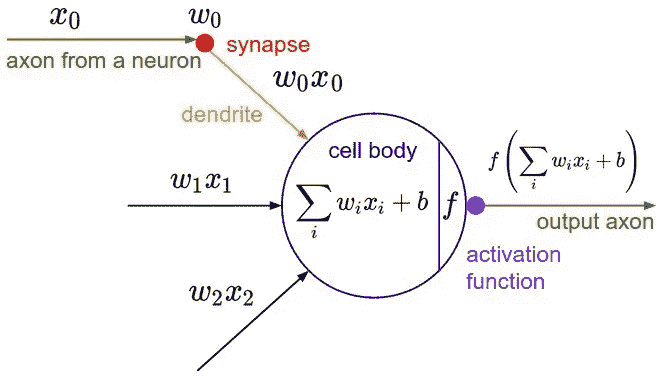

单神经元结构。来源 [wiki.tum.de](https://wiki.tum.de/display/lfdv/Artificial+Neural+Networks)

输入被输入到输入层的神经元中。然后，输入(Xi)乘以它们的权重(Wi)，加上偏差，得到神经元的输出(y=(Xi*Wi)+b)。我们在 **Y** 上应用我们的激活函数，然后它被转移到下一层。

# 激活函数应该具有的属性？

***微分或微分:****y 轴变化 w . r . t . x 轴变化。它也被称为斜坡。*(背道具)

***单调函数:*** *要么完全非增，要么完全非减的函数。*

> 深度神经网络中激活函数的选择对训练动态和任务性能有重要影响。

# **最流行的激活功能**

## 1.乙状结肠函数(**逻辑函数**)

它是常用的激活功能之一。在 20 世纪 90 年代， **Sigmoid** 函数被引入到 ANN 中，以取代 **Step** 函数。

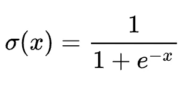

Sigmoid 激活函数

函数公式及其导数。

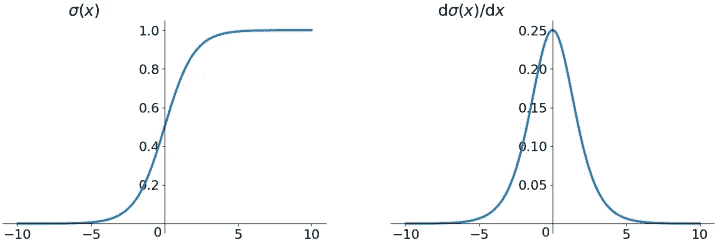

Sigmoid 函数及其导数

在 sigmoid 函数中，我们可以看到它的输出在开区间(0，1)中

*   输出的范围总是在 0 到 1 之间
*   乙状结肠呈 S 形， ***单调性***&***微分*** 功能
*   sigmoid 函数的导数(f'(x))将位于 0 和 0.25 之间
*   函数是**可微的**。这意味着我们可以在任意两点找到 sigmoid 曲线的斜率
*   函数是**单调的**，但函数的导数不是

每当我们试图在反向传播中找到 sigmoid 的导数时，值的范围在 0-0.25 之间。每个激活函数都有其优缺点，sigmoid 也不例外。

**优点**:

*   **输出值在 0 和 1 之间限制**
*   平滑渐变，防止输出值“跳跃”

**缺点**:

*   sigmoid 函数的导数遭受“ ***”消失梯度。*** 查看函数图，可以看到当输入变小时或变大时，函数在 0 或 1 处饱和，导数非常接近 0。因此，它几乎没有梯度传播回网络，所以几乎没有什么留给较低的层。即需要时间来达到收敛点(全局最小值)
*   **计算开销:**该函数执行指数运算，因此需要更多的计算时间
*   ***中的 Sigmoid 函数非零居中*** 。这使得梯度更新在不同的方向上走得太远。 **0 <输出< 1，这使得优化更加困难**

> **用[基于梯度的学习方法](https://en.wikipedia.org/wiki/Stochastic_gradient_descent)和[反向传播](https://en.wikipedia.org/wiki/Backpropagation)训练[人工神经网络](https://en.wikipedia.org/wiki/Artificial_neural_network)时遇到消失梯度问题**。在这种方法中，在训练的每次迭代中，每个神经网络的权重接收与相对于当前权重的误差函数的[偏导数](https://en.wikipedia.org/wiki/Partial_derivative)成比例的更新。问题是在某些情况下，梯度会变得非常小，有效地阻止了权重值的改变。在最坏的情况下，这可能会完全停止神经网络的进一步训练。

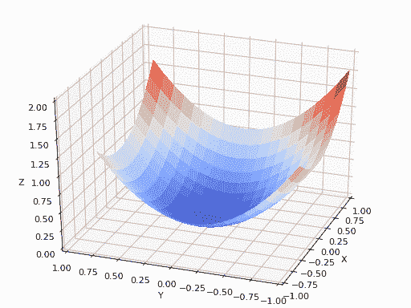

消失渐变。来源[点击](https://blog.paperspace.com/intro-to-optimization-in-deep-learning-gradient-descent/)

**2。Tanh 激活功能:**

双曲线正切 **(** Tanh)类似于 s 形，略有不同。基本上你可以说它克服了乙状结肠中存在的问题。

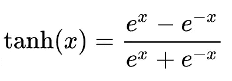

tanh 函数

函数及其导数的绘图:

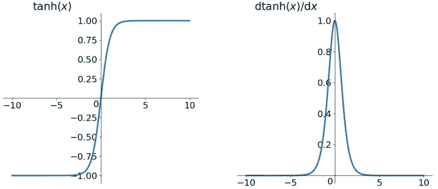

tanh 及其导数的图

*   该函数也是常见的 **S 形**曲线
*   不同之处在于 **Tanh** 的输出是以**零点为中心的**，范围从 **-1** 到 **1** (而不是在 Sigmoid 函数的情况下从 0 到 1)
*   函数**可微**与 Sigmoid 相同
*   与 Sigmoid 相同，函数是**单调的**，但函数的导数不是

**优点:**

*   整个功能是**零点**比乙状结肠好
*   优化很容易
*   双曲正切函数的导数在 0 到 1 之间

**Tanh** 倾向于使每一层的输出或多或少集中在 0 附近，这通常有助于加速收敛。

因为 sigmoid 和 tanh 几乎相似，所以他们也面临相同的问题。

**缺点**:

*   双曲正切函数的导数遭受" ***消失梯度*** "
*   **计算量大**

它用于二进制分类问题中的隐藏层，而 sigmoid 函数用于输出层。

**3** 。 **ReLU( *整流线性单元*)激活功能:**

这是深度学习中最受欢迎的激活函数(用于隐藏层)。

```
f(x) = max(0,x)
```

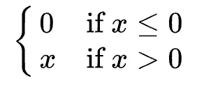

ReLU 函数

这可以表示为:

ReLU = max(0，x)

如果输入为负，该函数返回 0，但对于任何正输入，它返回该值。

函数及其导数的绘图:

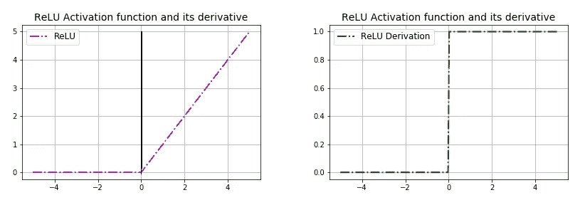

ReLU 函数及其导数。来源[这里](https://mmuratarat.github.io/2019-02-10/some-basic-activation-functions)

*   它不会同时激活所有的神经元
*   ReLU 函数在 0 附近是非线性的，但斜率总是为 0(负输入)或 1(正输入)

**优点:**

*   计算效率高:该函数计算速度非常快(与 Sigmoid 和 Tanh 相比),它不计算指数
*   收敛得非常快
*   如果输入为正，则解决梯度饱和问题

**缺点:**

*   ReLU 功能**不是以零为中心**
*   主要的问题是它正遭受死亡的折磨

> ***垂死挣扎***
> 
> **"** 每当我们在 ReLU 中得到输入为负时，输出将变为 0。在反向传播网络中不学习任何东西(因为你不能反向传播到它里面),因为它只是为负输入保持输出 0，梯度下降不再影响它。换句话说，如果导数为 0，则整个激活变为零，因此该神经元对网络没有贡献。

****4。** **漏热路:****

**为了克服 ReLU 中的问题，引进了**泄漏 ReLU** 。它拥有 ReLU 的所有属性和优点，加上它永远不会有**将死 ReLU** 的问题。**

> **ReLU 函数的改进版本，引入了“恒定斜率”**

**泄漏 ReLU 定义为:**

```
f(x) = max(*α*x, x) ,where *α is small value usually 0.01*
```

**我们给一些小的正α值，这样整个激活不会变成零。超参数`*α*` 定义了函数泄漏的多少。它是 x < 0 的函数斜率，通常设置为`0.01`。小斜率保证了漏的 ReLU 永远不死。**

**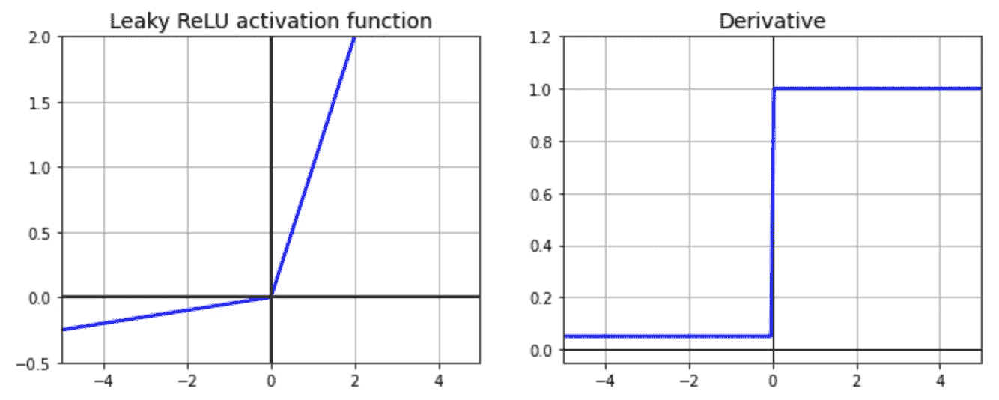**

**漏 ReLU 及其衍生物。来源[点击](https://learnopencv.com/wp-content/uploads/2017/10/leaky-relu-activation.png)**

****优点:****

*   **它解决了**死亡神经元/死亡神经元**的问题**
*   **引入斜率，小α值确保神经元永不死亡，即帮助神经元“存活”**
*   **在反向传播期间，它允许负值**

****缺点:****

*   **倾向于消失梯度**
*   **计算密集型**

****5。** **指数线性单位(ELU):****

**ELU 还提议解决 ReLU 的问题。它是 **ReLU** 的变体，输出更好。ELU 的表现优于所有的 ReLU 变体。**

```
f(x)= |x             x>0  |
      *|α*(e^x -1)     x<=0 |
```

**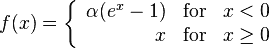**

**ELU 函数。来源[点击](https://upload.wikimedia.org/math/8/0/a/80af52c2fada6c7d7f6971e8fce61807.png)**

**ELU 倾向于更快地将成本收敛到零，并产生更准确的结果。ELU 有一个额外的阿尔法( *α* )常数，它应该是正数。**

**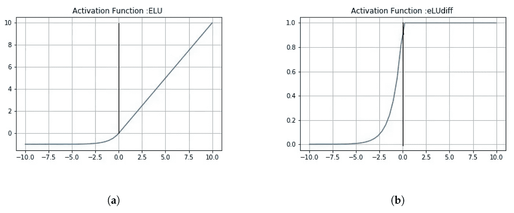**

**ELU 函数及其导数。来源[点击](https://www.mdpi.com/sensors/sensors-20-01068/article_deploy/html/images/sensors-20-01068-g0A3.png)**

****ELU** 修改了函数负部分的斜率。对于负值， **ELU** 使用的不是直线，而是对数曲线。虽然训练收敛速度较快，但由于使用了指数函数，计算速度较慢。**

****优点:****

*   **没有死 ReLU 问题**
*   **解决**濒死神经元**的问题**
*   ****零点居中**输出**

****缺点:****

*   **计算密集型**
*   **指数函数导致收敛缓慢**

****6。参数 ReLU(PReLU)** :**

**漏 ReLU 的概念可以进一步扩展。我们可以用一个超参数来代替 x 乘以一个常数项，这个超参数似乎比泄漏 ReLU 更有效。这种对泄漏 ReLU 的扩展被称为参数 ReLU。**

**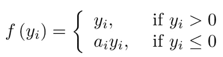**

**PReLU 函数**

**这里`*α*` 被授权在训练时学习(它不再是一个超参数，而是像其他任何参数一样成为一个可以通过反向传播修改的参数)。这在大型图像数据集上优于 ReLU，但在较小的数据集上优于训练集。**

**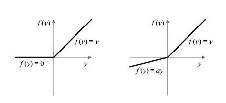**

**ReLU 对 PReLU。来源[点击](https://www.i-programmer.info/images/stories/News/2015/Feb/B/Prelu.jpg)**

**在负区，PReLU 斜率小，也可以避免死 ReLU 的问题。斜率虽小，但不趋向于 0，这是优点。**

**我们看了 PReLU 的公式。参数α相对较小，通常是 0 到 1 之间的一个数。yᵢ是第 I 个通道上的任何输入，αᵢ是负斜率，它是一个可学习的参数。如果α=0，则 PReLU 变为 ReLU。当正部分是线性的时，函数的负部分在训练阶段自适应地学习。**

*   **如果 **αᵢ=0** ，f 变成 **ReLU****
*   **如果 **αᵢ > 0** ，f 变成**泄漏 ReLU****
*   **如果αᵢ是一个可学习的参数，f 变成 PReLU**

****优点:****

*   **避免**神经元死亡的问题****
*   **更好地处理**大型数据集****
*   **增加了参数 **α** (控制负斜率)，可在反向传播时修改**

****缺点:****

*   **虽然下限参数 **α** 会引起变化，但是单侧饱和并不会导致更好的饱和**

**7。Softmax:**

**Softmax 函数计算事件在“n”个不同事件中的概率分布。换句话说，这个函数将计算每个目标类在所有可能的目标类中的概率(这有助于确定目标类)。**

**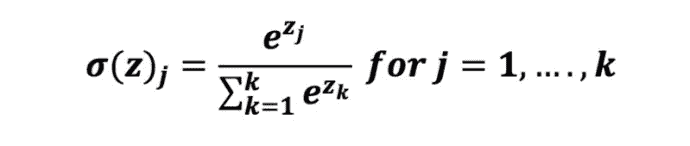**

**Softmax 函数。来源[点击](https://dataaspirant.com/how-logistic-regression-model-works/)**

**Softmax 保证较小的值有较小的概率，不会被直接丢弃。是一个“软”的“max”。它返回属于每个单独类的数据点的概率。请注意，所有值的总和是 1。**

> **Softmax 可以描述为多个 sigmoid 函数的组合。**

**Softmax 将输入值归一化为一个向量值，该向量值遵循总和等于 1 的概率分布。输出值在范围[0，1]之间，这很好，因为我们能够避免二进制分类，并在我们的神经网络模型中容纳尽可能多的类或维度。**

**对于多类问题，输出层将具有与目标类一样多的神经元。通常，它用于神经网络的输出层，将输入分类为多个类别。**

**例如，假设您有 4 个类[A、B、C、D]。在输出层中将有 4 个神经元。假设你从神经元得到的输出为[2.5，5.7，1.6，4.3]。应用 softmax 函数后，您将得到[0.26，0.14，0.41，0.19]。这些表示数据点属于每个类别的概率。通过查看概率值，我们可以说输入属于 c 类。**

****8。唰功能:****

**Swish 功能被称为一种自我门控激活功能，最近由谷歌的研究人员发布。数学上它被表示为**

**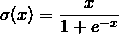**

**Swish 函数**

**根据[的论文](https://arxiv.org/abs/1710.05941v1)，SWISH 激活功能比 ReLU 表现更好。**

**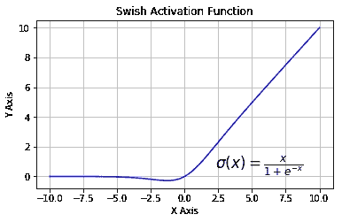**

**嗖嗖激活功能。来源[点击](https://learnopencv.com/wp-content/uploads/2017/10/swish.png)**

**从图中，我们可以观察到，在 x 轴的负区域中，尾部的形状不同于 ReLU 激活函数，因此，即使输入值增加，Swish 激活函数的输出也可能减少。大多数激活函数都是单调的，即它们的值不会随着输入的增加而减少。Swish 在零点具有单边有界性，它是光滑的，非单调的。**

**公式是:**

```
**f(x) = x*sigmoid(x)**
```

**从研究论文来看，他们的实验表明 **Swish 在许多具有挑战性的数据集上往往比 ReLU 更好地工作。例如，简单地用 Swish 单元替换 ReLUs，就可以将 Mobile NASNetA 的 [ImageNet](http://www.image-net.org/) 上的 top-1 分类精度提高 0.9%，将 [Inception-ResNet-v2 的分类精度提高 0.6%。**Swish 的简单性及其与 ReLU 的相似性，使得从业者很容易在任何神经网络中用 Swish 单元代替 ReLU。**](https://github.com/Trangle/mxnet-inception-v4/blob/master/inception-resnet-v2.pdf)****

*   **Swish 激活函数 f(x)= x*sigmoid(x)**
*   ****Swish 的曲线是平滑的:**这使得它对初始化权重和学习速率不太敏感。它在泛化和优化方面起着重要的作用**
*   ****持续匹配或优于 ReLU 的非单调函数****
*   **它是**无界的上界(**，这使得它在值接近 0 的梯度附近是有用的。该特征避免了*饱和，因为训练在接近 0 梯度值* **)时变得缓慢，并且在下面有界(**有助于强正则化，并且较大的负输入将被解决 **)****
*   **正是非单调属性实际上造成了这种差异**
*   **对于自门控，它只需要一个标量输入，而在多门控情况下，它需要多个双标量输入。它受到了**在 LSTM(hoch Reiter&schmid Huber，1997)和** [**高速公路网(Srivastava 等人，2015)**](http://people.idsia.ch/~rupesh/very_deep_learning/) **中使用 Sigmoid 函数的启发，其中** ' *自门控*'意味着门实际上是激活本身的' *sigmoid* '**
*   **无界有助于防止梯度在慢速训练时逐渐接近 0**

****9。软加:****

**和 ReLU 函数类似，但相对更流畅。Softplus 的功能:**

```
***f(x) = ln(1+exp x)***
```

**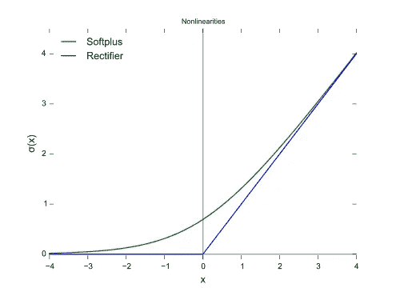**

**Softplus 激活功能，来源[点击](https://www.gabormelli.com/RKB/Softplus_Activation_Function)**

**软加函数的导数为**

```
f’(x) is [logistic function](https://en.wikipedia.org/wiki/Logistic_function) (1/***(1+exp x)).***
```

**函数的接受范围很广，从(0，+ inf)。**

**ReLU 和 Softplus 在很大程度上是相似的，除了在 0 附近，softplus 非常平滑和可微分。与具有 log 和 exp 的 softplus 函数相比，计算 ReLU 及其导数要容易和有效得多。**

**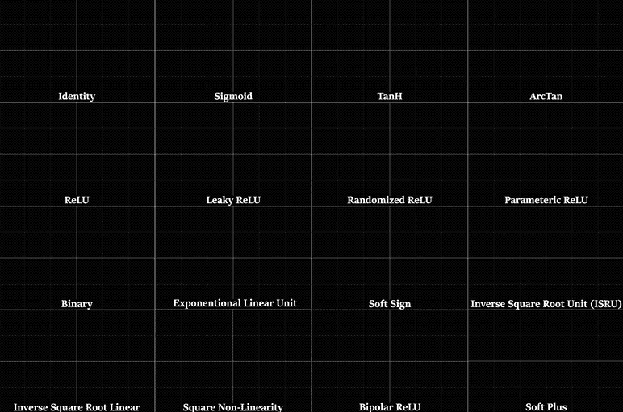**

**激活功能。来源[点击](https://mlfromscratch.com/activation-functions-explained/)**

**这些图像中所有激活的摘要。看一看，回忆一下我们到目前为止所学到的所有思想。**

**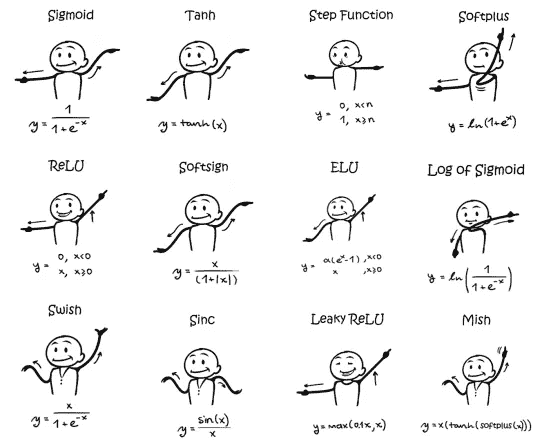**

**激活功能。来源[点击](https://sefiks.com/2020/02/02/dance-moves-of-deep-learning-activation-functions/)**

# **如何决定选择哪个或者哪个才是正确的？**

**激活功能的选择至关重要。所以，选哪个！！没有说明指出可以选择哪种激活功能。每个激活都有其利弊。所有的好与坏都将在尝试和错误的基础上决定。**

**但是根据问题的性质，我们也许能够做出更好的选择，使网络更容易、更快地收敛。**

*   **Sigmoid 函数和它们的组合通常在分类问题的情况下工作得更好。但是它遭受*消失梯度***
*   **我们通常在隐藏层使用 ReLU**
*   **在死神经元情况下，可以使用泄漏 ReLU 函数**
*   **如果你有一个庞大的训练集**
*   **Softmax 在输出层用于分类问题(主要是多类)**
*   **收敛和计算是折衷**

# **结论:**

**我希望这篇文章能帮助你学到一些新的东西。**

**感谢阅读。你觉得这篇文章有用吗，给个掌声。**

**总有改进的空间，有什么想法请告诉我。**

**快乐学习…..**