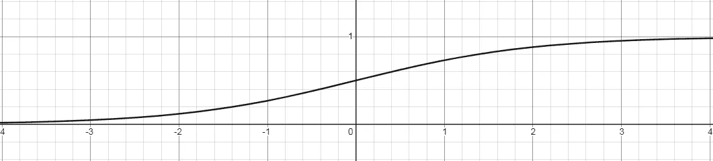
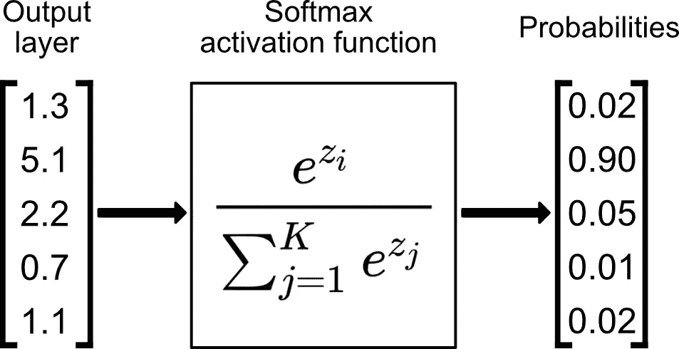

# 神经网络中的激活函数

> 原文：<https://medium.com/analytics-vidhya/activation-functions-in-neural-network-mathematical-intuition-with-graphs-c789401e21c7?source=collection_archive---------16----------------------->

## 图形的数学直觉

在神经网络中使用激活函数是为了以更完美的方式映射输入和输出，并且大多数时间(大约 99%的时间)我们使用非线性激活函数而不是线性激活函数，因为非线性图在映射方面比线性图做得更好。

[来源](https://ibelieveai.github.io/images/Activationfuns/Linear-NonLinear.JPG)

# 乙状结肠:

Sigmoid 激活函数也称为挤压函数，映射范围(0，1)内的任何输入值，因此它们可以被解释为概率，并在最终层中使用，以便更容易解释结果。Sigmoid 函数也是逻辑回归和分类模型的重要组成部分。逻辑回归是对两类分类的修改，它将一个或多个实值输入转换为概率，例如客户将购买产品的概率。

sigmoid 函数的数学公式:

f(x) = 1/(1+e^(-x))

从德斯莫斯在线图形计算器

如果你观察这个图，你可以看出这是一条 S 形曲线，它在所有点上都是连续可微的，但是如果我们观察这个函数的导数图

从德斯莫斯在线图形计算器

梯度值对于范围-3 和 3 是显著的，但是图形在其他区域变得平坦得多。这意味着对于大于 3 或小于-3 的值，将具有非常小的梯度。当梯度值接近零时，网络并没有真正学习。

此外，Sigmoid 函数不是围绕零对称的。所以所有神经元的输出符号相同。

# RELU:

ReLU 代表整流线性单元。与其他激活函数相比，使用 ReLU 函数的主要优点是它不会同时激活所有的神经元。

f(x) = max(0，x)(即对于大于 0 的任何 x 值，它返回相同的值，而对于小于 0 的任何 x 值，它返回 0)

从德斯莫斯图形计算器

从德斯莫斯图形计算器

ReLU 激活函数的问题是，如果你看梯度图的负侧，你会注意到梯度值为零。由于这个原因，在反向传播过程中，一些神经元的权重和偏差没有更新。这会产生永远不会被激活的死亡神经元。

# 漏水的 RELU:

Leaky ReLU 在 ReLU 激活函数中引入了一点修改不是给 x 的负值赋 0，我们把它定义为 x 的一个极小的线性分量。

当 x <0 and f(x) = x when x≥0

[来源](https://ml-cheatsheet.readthedocs.io/en/latest/_images/leakyrelu.png)时 f(x)= 0.01x

当 x<0 时，f'(x) = 0.01，当 x≥0 时，f'(x) = 1

[来源](https://ml-cheatsheet.readthedocs.io/en/latest/_images/leakyrelu_prime.png)

通过这个小的修改，x 的负值的梯度变成一个非零值。因此，我们在那个区域不会再遇到死亡的神经元。

# 指数线性单位:

指数线性单位或简称 ELU 也是修正线性单位(r ELU)的变体，它修改函数负部分的斜率。ELU 使用对数曲线来定义负值。

[来源](https://ml-cheatsheet.readthedocs.io/en/latest/_images/elu_prime.png)

# Tanh:

双曲正切函数非常类似于 sigmoid 函数。唯一不同的是，它是关于原点对称的。在这种情况下，值的范围是从-1 到 1。因此，产出将不仅仅是积极的。

从德斯莫斯图形计算器

除了值域之外，双曲正切函数的所有其他性质都与 sigmoid 函数相同。与 sigmoid 类似，双曲正切函数在所有点上都是连续且可微的。

从德斯莫斯图形计算器

与 sigmoid 函数相比，tanh 函数的梯度更陡，通常 tanh 比 sigmoid 函数更优选，因为它以零为中心，并且梯度不限于在某个方向上移动。

# 唰:

Swish 的计算效率与 ReLU 一样高，并且在更深层次的模型上表现出比 ReLU 更好的性能。swish 的值范围从负无穷大到正无穷大。

f(x) = x*sigmoid(x)

从德斯莫斯图形计算器

f'(x) = f(x) + sigmoid(x)*(1-f(x))

从德斯莫斯图形计算器

函数的曲线是光滑的，函数在所有点上都是可微的。这在模型优化过程中是有帮助的，并且被认为是 swish 优于 ReLU 的原因之一。

# SOFTMAX:

Softmax 是在最终输出层中使用的激活函数，主要用于多分类问题，因为它将报告每个类的“置信度得分”。因为我们在这里处理的是概率，所以 softmax 函数返回的分数总和将为 1。

任何建议和更正都是受欢迎的。

感谢您阅读这篇冗长的文章。