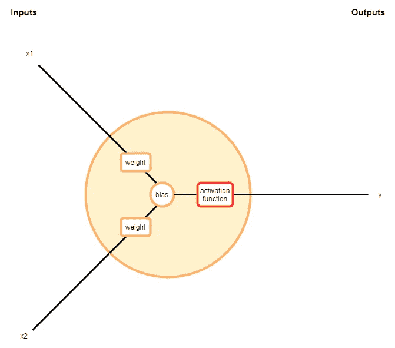
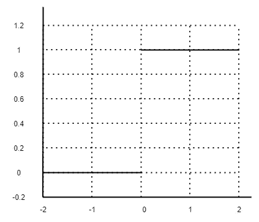
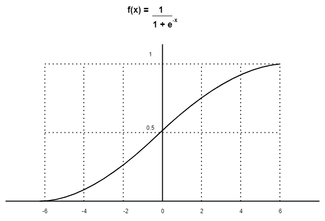
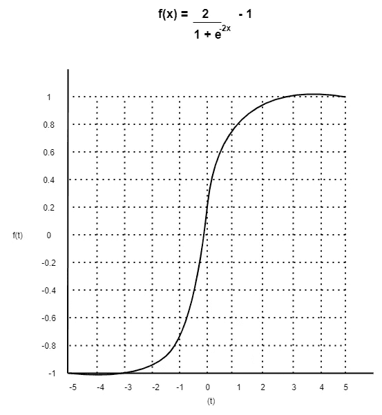
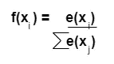
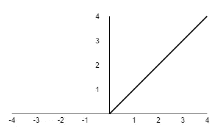

# 神经网络中的激活函数

> 原文：<https://medium.com/analytics-vidhya/activation-functions-in-neural-networks-d0d0ab8eaa4b?source=collection_archive---------16----------------------->

艾莉娜·格鲁布尼亚克在 [Unsplash](https://unsplash.com/) 上的照片

在开始激活函数之前，最好先介绍一下神经网络。

神经网络技术非常类似于我们的大脑如何理解。大脑将刺激作为输入，处理它们，并相应地输出。神经网络与我们大脑中的许多神经元相连。它接受输入，做一些数学运算来处理输入，然后输出结果。

简单双输入神经元

由于上述图像神经元有 2 个输入(x1 和 x2)，因此每个输入都要乘以权重。这些加权输入与偏差相加，如下所示。

*(x1∫权重)+(x2∫权重)+偏差*

此后，我们的主题激活功能开始与这些神经元一起工作。进行上述计算后，这个和通过一个激活函数产生如下答案。

*y = f((x1∫权重)+(x2∫权重)+偏差)*

那么“这些激活功能背后的目的是什么”这个问题就产生了。激活函数的主要目的是对输入执行非线性转换，使其能够解决复杂的问题。如果没有激活函数，权重和偏差将只有线性结果。

除此之外，激活功能决定去激活或激活神经元以获得期望的输出。此外，它有助于使输出正常化。尽管这些神经网络由于激活函数而非常复杂，但它只需要有限的计算时间。

让我们看看不同的激活功能，了解它们是如何工作的:

**1。二元步进激活功能**

该功能是基于阈值的激活功能。如果 Y 值高于阈值，则激活神经元。如果小于阈值，就不是。这可以通过一个简单的 if-else 代码库来实现。

*f(z) = 1 如果 z > 0 否则 0 如果 z < 0*

阶跃函数的图形表示

简单地创建一个二元分类器。应该说“是”或“不是”的东西。这由一个简单的 1 和 0 的函数来表示。

假设要连接多个神经元，以便为相关任务引入更多的类。和一个以上的输出 1。现在很复杂，因为我们不能决定应该是哪个类。你会希望网络只激活 1 个神经元，其他的应该是 0。如果激活不是二进制的，而是说“70%激活”或“30%激活”等等，那就更好了。然后你就可以找出激活率最高的作为选择。这可以通过线性函数来实现。

**2。线性激活功能**

它接受输入，即来自神经元的加权和，并产生与输入成比例的输出信号。该线性函数优于阶跃函数，因为如上所述，它允许多次激活，而不仅仅是 1 和 0。

*f(z)=a*z*

在这种情况下,“a”可以是任何常数值。这意味着梯度与 z 无关。下降应该是一个恒定的梯度。因此，由反向传播引起的误差的任何预测误差变化都是恒定的。这导致了糟糕的预测。

也认为神经网络有两层，但在线性激活中，最后一层不过是第一层输入的线性函数。无论我们如何组合，整个网络仍然相当于线性激活的单层。所以这两层都可以用一个单层代替。

**3。乙状结肠功能**

这主要在我们进行决策或预测时使用，因为这输出在 0 到 1 之间的最小范围内，因此预测会更准确。这种非线性激活函数工作效率很高，主要用于前馈神经网络。sigmoid 函数表示为:

sigmoid 函数的图形表示

当考虑 sigmoid 函数的图形时，在 X 值-2 到 2 之间，Y 值急剧下降。这意味着 X 区域的微小变化将显著影响 Y 区域。它倾向于激活曲线的两侧(x=-2 到 x=2)。通过这种方式，它可以在预测中创建清晰的变化，以获得更好的结果。

作为 sigmoid 函数的一个缺点，考虑到函数两端的图形，Y 值变化不大。这意味着两个区域的梯度都很小。这就产生了“渐变消失”的问题。通过这种方式，网络学习速度变得更慢或者非常慢。但是有一些方法可以解决这个问题，对于分类问题，sigmoid 仍然是一个非常好的函数。

**4。双曲正切激活函数(Tanh)**

双曲正切函数类似于 sigmoid 函数。该函数表示为:

双曲正切函数的图形表示

如上所述，这个函数的所有特征类似于 sigmoid 函数，但是双曲正切函数的梯度比 sigmoid 函数更强。因此，对于该决定，sigmoid 或 tanh 将取决于与您的要求相关的梯度强度。

**5。Softmax 激活功能**

此函数生成范围在 0 和 1 之间的输出，概率之和等于 1。此外，函数的指数充当非线性函数。这是 SoftMax 激活函数的方程式。

Softmax 激活方程式

这里 LHS 意味着神经元输出层的值。然后这些指数除以指数之和进行归一化，然后转换成概率。

**6。ReLU(整流线性单元)激活功能**

这是目前最流行的函数，范围从 0 到无穷大，所有的负值都转换为零。这以良好的计算速度工作，并且 ReLU 本质上是非线性的。

ReLU 函数的图形表示

作为具有随机初始化的权重的网络，由于 ReLU 的性质，几乎 50%的网络给出 0 个激活。这意味着更少的神经元被激活，网络变得更轻。

对于在上述激活函数(sigmoid 和 tanh)中观察到的消失梯度问题，该函数是一个很好的解决方案。

**结论**

像 ReLU、sigmoid 和 tanh 这样的激活函数得到了最大的关注。但是存在某些不同的特征，并且在使用相关任务之前必须研究每个特征。此外，您也可以尝试自定义功能。

但是 ReLU 大部分时间作为通用近似器工作，因为它有助于消除消失梯度问题，该问题导致训练过程训练中的主要问题并降低神经网络模型的性能和精度。

通过这篇文章，我试图对激活函数，它们在神经网络中是如何工作的，它们之间的主要区别等等给出一个概述性的解释。我已经讨论了 6 种常用的激活函数及其局限性。希望你对激活函数有了全面的了解。

**参考文献**

*   [https://www . analyticssteps . com/blogs/7-types-activation-functions-neural-network](https://www.analyticssteps.com/blogs/7-types-activation-functions-neural-network)
*   [https://medium . com/the-theory-of-theory-of-everything/understanding-activation-functions-in-neural-networks-9491262884 E0](/the-theory-of-everything/understanding-activation-functions-in-neural-networks-9491262884e0)