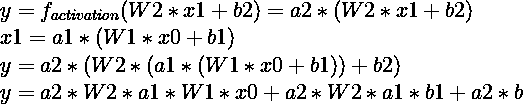

# 激活功能(第 1 部分)

> 原文：<https://medium.com/analytics-vidhya/activation-functions-part-1-d80b0e8ee89d?source=collection_archive---------20----------------------->

激活是一种应用于神经元输出的功能，随着我们在神经网络中的深入，它可以学习更复杂的功能。它们也可以被认为是修改函数范围的映射。例如，我们可以使用一个激活函数来确保所有的输出都在 0 和 1 之间，或者在-1 和 1 之间。

图 1:神经元输出的表达式，然后应用激活函数

*   图 1 中的第一个等式是用于计算神经元输出的公式。该方程采用直线 y = mx + c 的形式

图 2:y 方程的曲线图

*   随着我们增加神经网络的层数，我们希望学习更复杂的特征来更好地表示数据。如果我们在神经网络中使用线性函数作为激活，学习更复杂的特征将变得非常具有挑战性。看下图，我们很难用一条直线把这些点分割开来。

图 3:非线性特征

图 4:两层神经网络

图 5:定义使用的术语

*   如果我们使用线性激活函数，如图 5 中定义的方程，其中 f_activation = **a*y** ，我们最终可以将整个网络表示为一个单层。

图 6:扩展衍生品

*   通过图 6 中的等式， **y** 表示线性激活后网络的最终输出。 **x1** 表示线性激活后第一层的输出。
*   我们现在可以用第二个等式中的 **x1** 的表达式替换第一个等式中的 **x1** 项，然后展开该等式。

图 7:简化导数

*   简化方程后，由于 a2 和 a1 是常数，我们可以把**写成 a2*W2*a1*W1** 作为新的权重矩阵 **W3** 。
*   ( **a2*W2*a1*b1 + a2*b** )本质上再次表示可能是偏差 **b3** 的新矩阵。
*   这基本上意味着最后一层可以用一个等式代替 **y = W3*x0 + b3**
*   这是为什么使用非线性激活函数来打破输入到输出的直接线性关系的主要原因之一。

# **常用激活:**

*   **乙状结肠功能**

图 8: Sigmoid 函数

图 sigmoid 函数及其导数的图形

**乙状结肠神经元的正向传递:**

*   sigmoid 函数的范围是从 0 到+1
*   如果我们分析 sigmoid 图，对于大于 5 或小于-5 的输入值，我们会得到几乎相同的输出。(也就是说，对于 10、100 或 1000 的输入，我们将得到几乎相同的输出 1)。
*   与其他一些激活函数相比，公式中指数计算的存在也使得计算速度变慢，但是这并不是一个明显的缺点。

**乙状结肠神经元的反向传递:**

图 10:乙状结肠神经元的衍生物

*   这个导数可以重写为:

图 11:乙状结肠神经元的简化衍生物

*   导数的图形由图 9 中的反向曲线表示
*   从图中可以看出，正向通道在较高值时饱和，导数也在较高值时饱和。这是因为函数在较高值处的梯度可以忽略不计，导致在较高值处导数几乎为 0。这就是通常所说的**消失梯度**问题。
*   一旦使用 sigmoid 神经元的层的权重变得太大，其正向输出饱和为 0 或 1，并且其导数变为 0，导致我们不能以任何显著的量更新其值。
*   由于 sigmoid 函数在 0 和 1 之间缩放其输出，因此它是**而不是以零为中心的**(即，输入为 0 时 sigmoid 的值不等于 0，并且它不输出任何负值)。

图 12:使用 sigmoid 神经元的权重导数

图 13:y 相对于重量的导数

*   从图 12 和 13 中，我们可以看到，损耗相对于层权重的导数取决于层本身的输入
    (即 **x** )。
*   现在，例如，如果我们有一个 2 层神经网络，并在第 1 层后使用 sigmoid 激活函数，我们知道第 1 层的输出将始终位于 0 和 1 之间。
*   如果我们要计算层 2 相对于其权重的导数，即 **dy/d(权重)**，从图 13 中我们可以看到它等于 **x** (即层 1 的输出)。由于我们在第 1 层使用了 sigmoid 激活， **x** 将总是 0 和 1 之间的正结果。
*   这也意味着层 2 的权重的导数的符号将完全取决于项 **d(损失)/dy** 的符号，因为 **dy/d(权重)**总是正的。
*   这导致我们约束第 2 层的所有权重要么正要么负地更新。Sigmoid 不允许用正值更新某些权重，用负值更新某些权重。这可能导致很多曲折，因为我们将首先在第一步中正向更新权重，然后在下一步中负向更新权重。
*   **双曲正切函数**

图 14:双曲正切函数

图 15:双曲正切函数及其导数的图表

**一个双曲正切神经元的正向传递:**

*   双曲正切函数的范围是-1 到+1
*   如果我们分析双曲正切图，我们会注意到来自乙状结肠神经元的相同的持续问题，即，在大于 3 或小于-3 的值，我们最终会得到相同的输出+1 或-1，这导致了**饱和**。
*   它的公式中存在多个指数，这使得它的计算速度比 sigmoid 神经元慢。

**一个双曲正切神经元的反向传递:**

图 16:函数 u/v 的导数

*   双曲正切函数的导数如图 16 所示

图 17:计算双曲正切导数

图 18: Tanh 导数(续)

图 19:双曲正切导数(续)

图 20:简化的双曲正切导数

*   方程式的图形由图 15 中的反向图表示
*   在**消失梯度**方面，双曲正切函数的**饱和**提出了与 sigmoid 神经元相同的问题(即，导数在大的正值或负值处变得接近 0，导致没有权重更新)。
*   与 sigmoid 函数相比，tanh 函数的优势在于它以零为中心。
*   回到图 12 和图 13 的解释，由于层权重的导数(即 **dy/d(weight)** )直接取决于该层本身的输入(即 **x** )，使用双曲正切函数将给出包含正值和负值的输出。
*   这将允许我们摆脱用正值更新所有权重或者用负值更新所有权重的约束，因为 **x** 将位于(-1，1)之间。

## **总结**:

*   在下一篇文章中，我将介绍一些更常用的激活方式，比如 Relu 和 Leaky Relu。
*   下面是一个简单代码的[链接](https://github.com/vineeth2309/Activation-Functions),用于实现激活函数及其衍生函数，并可视化它们的输出。