# 用于神经网络的激活函数

> 原文：<https://medium.com/analytics-vidhya/activation-functions-used-in-neural-networks-c162d044256b?source=collection_archive---------24----------------------->

激活函数在神经网络中起着至关重要的作用。它也被称为传递函数。其目的是引入非线性变换来学习数据中复杂的潜在模式。它应该是可微的，也应该遵循计算的廉价性。并且它的输出需要以零为中心，以便它将有助于计算出的梯度在相同的方向上并且偏移。

激活函数表示为 *f(x)* 其中 *x=(输入*权重)+偏差*。现在，让我们来看看常用的激活函数。

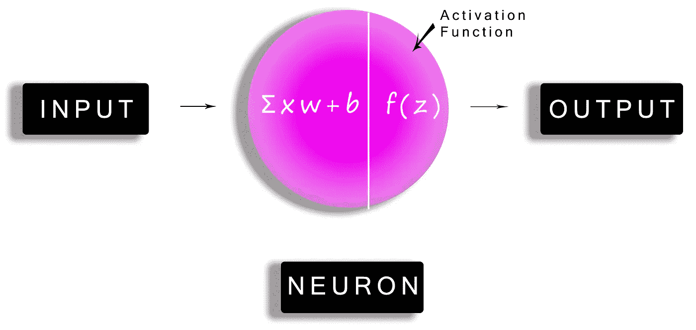

# **乙状结肠功能**

sigmoid 函数可以定义为

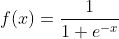

1.  它在 0 和 1 之间缩放值。
2.  它有一个 S 形曲线。
3.  以 *0.5* 为中心。
4.  它是可微的和单调的。
5.  它也被称为逻辑功能。

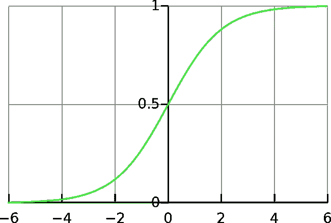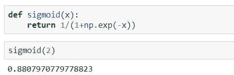

# **双曲正切函数**

双曲正切函数可以定义为

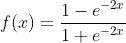

1.  它将值调整到-1 到+1 之间。
2.  它也类似于 S 形曲线。
3.  它以 0 为中心。
4.  它是可微的和单调的。

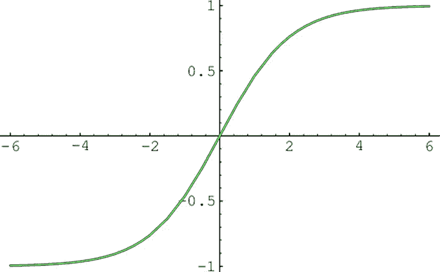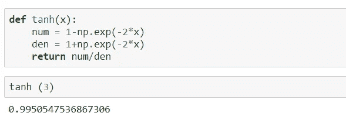

# **整流线性单元功能**

ReLU 函数表示为

1.  它是一个分段函数。
2.  当 *x* 的值小于零时返回 0，否则返回 1。
3.  它的障碍是所有负值都为零，这是一个叫作“死 ReLU”的问题。

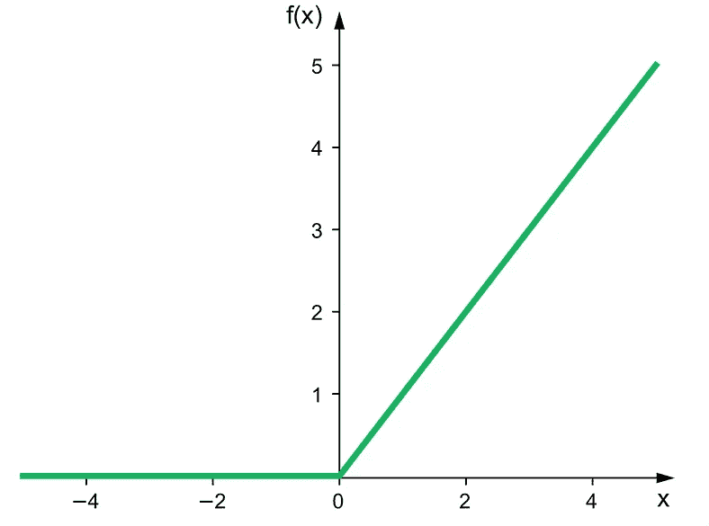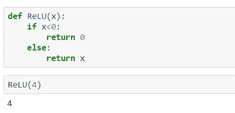

# **漏 ReLU 功能**

该函数表示为

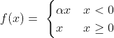

1.  它是 ReLU 函数的变体。
2.  它对所有负值 *(α)* 都有一个小斜率。
3.  *α* 多为 0.01。
4.  参数 ReLU 函数:-这里，参数被发送到神经网络，该网络学习 *α* 的最佳值。
5.  随机化的 ReLU 函数:-这里设置了 a 的随机值。

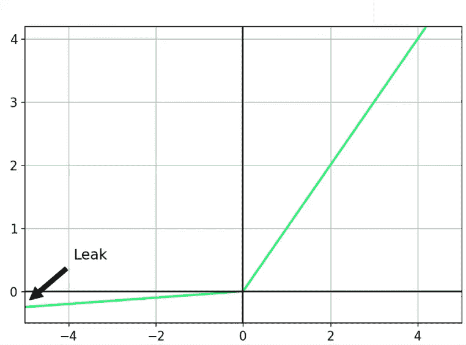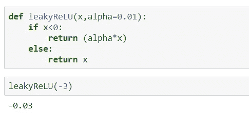

# **指数线性单位函数**

该函数可以表示如下

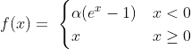

1.  它类似于漏 ReLU 函数。
2.  负值的斜率很小。
3.  它以零为中心。

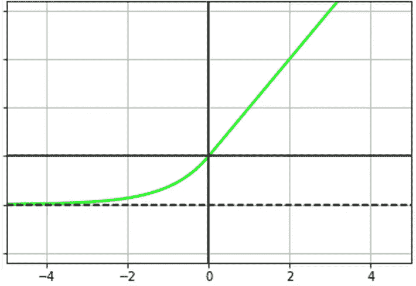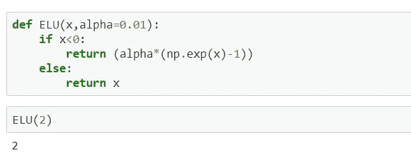

# **嗖嗖功能**

swish 函数表示为

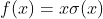

1.  它是由谷歌推出的。
2.  它比 ReLU 表现更好。
3.  它是非单调的。
4.  *α(x)* 是一个 sigmoid 函数。
5.  它可以被重新参数化如下。

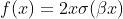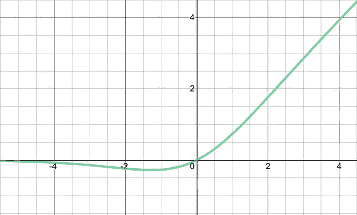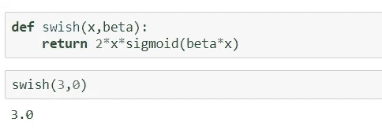

# **Softmax 功能**

该功能可以定义为

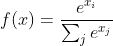

1.  它是 sigmoid 函数的推广。
2.  主要应用于网络的最后一层和多类分类任务。
3.  softmax 值的总和始终为 1。
4.  它将它们的输入转换成概率，如下所示。

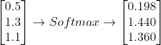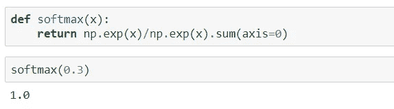