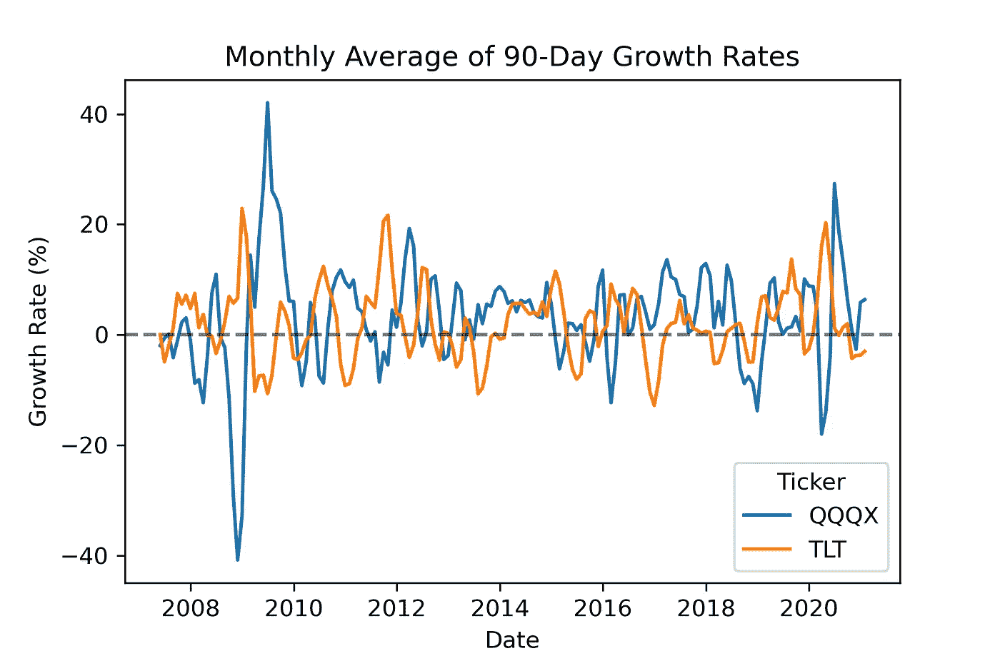
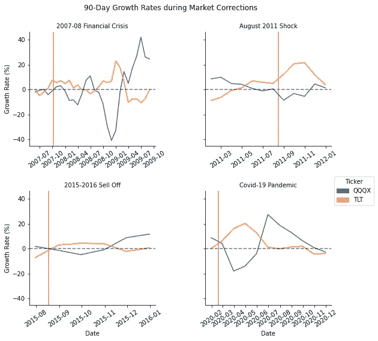
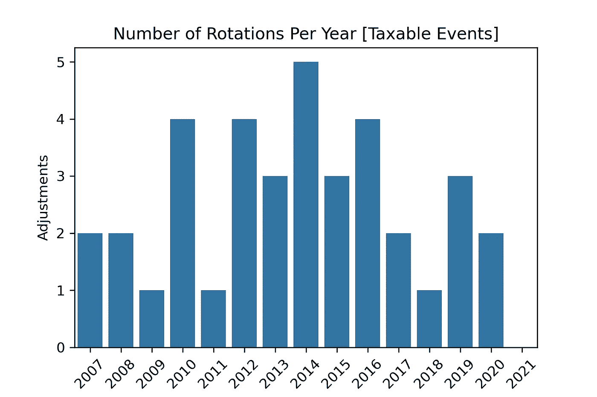

# 用 Python 积极投资:第 1 部分

> 原文：<https://medium.com/analytics-vidhya/active-investing-with-python-part-1-e7e54eaedf66?source=collection_archive---------12----------------------->

你是否渴望从更被动的策略过渡到主动的策略，但对时间承诺感到不安？

如果是这样，我可以感同身受。自去年夏天以来，我一直渴望更积极地发展我的投资组合，但仍需要做更多的研究来决定策略，我没有时间定期监督积极的方法。

幸运的是，假期给了我开始转变的绝佳机会。前几天读了另一篇 [medium 文章](/automated-trading/a-guide-to-automating-your-stock-analysis-with-python-4b6929e54201)后，我终于有了足够的动力，扣动了扳机——我决定写几个简单的脚本，自动化掉主动投资的一些细枝末节。以此为基础，我计划建立我的定期报告、观察名单买入/卖出提醒等等。

这篇文章的目的有四个:

1.  澄清一些关于积极投资的简单误解
2.  简单介绍一下我的轮换方法
3.  让我的积极倾向的投资者伙伴们相信，在自动化的帮助下，他们最终可以致力于他们想要的战略
4.  提供模板代码以创建自动化报告

本文分为两个帖子。在这篇文章中，我将介绍主动投资的概念以及一个具体的策略，即资产循环模型，我将使用 Python 来帮助我实现它。在[第二篇](https://ea-jones.medium.com/active-investing-with-python-part-2-6c8f20074e2)中，我只关注代码和实现【如果你只是对代码感兴趣，这里是[github repo】](https://github.com/EandrewJones/investment-tools)。

*免责声明:本文绝不构成财务建议。你有责任制定一个最适合自己需求的财务计划，并坚持以有原则的方式执行该计划所必需的行为准则。如果一种积极的方法对你有吸引力，那么继续读下去。*

# 主动投资与被动投资

人们第一次开始投资时必须做出的一个关键决定是，他们是想遵循主动策略还是被动策略。当然，人们不会被任何一种方法所束缚，但这个决定是开始投资组合的关键的第一步。你可以把这两者想象成一个光谱上的两极，中间有不同的层次或混合策略。

**积极策略**意味着投资者的某种持续买卖，目的是最大化利润或对冲下行风险。尽管对一些积极投资者来说，这意味着做空市场、日内交易或波动交易，但这不一定是投机性的。你可以积极管理自己的投资组合，同时做多市场。事实上，对许多人来说，积极策略的吸引力在于要么带来更多收入，要么对冲风险，而不是随波逐流，或者两者兼而有之。

相反，**被动策略**旨在通过最小化购买和销售来最大化利润。这里的逻辑是尽量减少应税事件、交易佣金和管理费。被动投资者通常承诺投资于低费用指数基金的多元化投资组合。虽然这些策略从长期来看是合理的，但它们可能并不适合所有的需求(比如创收)，而且会[让你面临过大的短期波动](https://seekingalpha.com/article/4358898-increasing-volatility-crushes-returns-of-passive-investing)。

本杰明·格拉哈姆对这两种方法之间差异的理解颇具启发性。他断言，如果你不愿意花时间定期研究你的投资组合决策，那么你应该避开积极投资。事实上，如果我没记错的话，他把主动投资比作一份全职工作。

对他来说，这的确是一份全职工作，但对我们许多人来说，这是一份不同的朝九晚五的工作。在我看来，这个时间因素是阻碍一个有意愿和勤奋的投资者采取更积极的方法的主要障碍。然而，通过将我们的积极投资策略转化为代码，我们可以自动化掉市场研究中一些更繁琐的方面。

# 从被动到主动

我敢说，对许多投资者来说，被动投资是一种恰当的方式。当我第一次在股市的惊涛骇浪中扬帆起航时，我坚持被动策略。我知道的足够多，知道我知道的不够多，所以 100%投入指数基金。现在，经过几个月如饥似渴的阅读和研究，我终于感觉更舒服了，并确定了一个我认为适合我财务目标的投资组合结构和积极投资策略。

有许多不同的交易策略可以归类为“积极的”，如摆动交易或出售期权，以产生额外的收入。所有的交易策略，尤其是积极的交易策略，都伴随着相应的风险。你选择的策略应该反映你的财务目标。我在积极交易中的主要目标是对冲短期市场修正。一种这样的风险对冲策略是**资产轮换模型** (ARM)。

ARM 策略是一种基于规则的方法，根据市场动态来设置您的投资组合配置。当市场动态发生变化，有利于一种资产类别而不是另一种，如债券、黄金或房地产而不是股票，那么你就要调整你的投资组合，以适当地反映这种变化(例如，见[这里](https://seekingalpha.com/article/4283733-simple-rules-based-asset-rotation-strategy))。将此归结为三个步骤:

1.  找到一组不相关的——理想情况下是反向相关的——资产类别
2.  制定原则性的规则，使你的投资组合在这些类别中多样化，并根据市场情况调整配置
3.  根据这些规则执行调整，而不是市场诱导的情绪状态

这个模型基于两个假设。第一，市场可以计时。其次，你可以找到至少两个不相关或反向相关的资产。

第一个假设是[有争议的](https://en.wikipedia.org/wiki/Market_timing)退一步说。许多人认为这是不可能的。虽然我同意市场中的时间比市场时机更重要，但如果你的目标不是最大限度的短期增长，而是长期内击败被动指数(比如标准普尔 500 指数)的稳定收益率，那么我相信这是可能的。你在短期增长中失去的，你会通过在主要的市场调整中大幅减少你的最大亏损而得到。

第二个假设也是有问题的。可能很难找到不相关或反向相关的资产类别，但我们通常会寻求分散投资，在股票、债券和/或大宗商品之间轮换。有时所有资产类别都定价过高，短期内可能表现不佳，在它们之间做出选择可能很困难。

这就是遵循一套有原则的简单规则的重要性。通过坚持一套历史上反向相关的资产——股票对债券——加上像黄金这样的通胀对冲，你应该有一个好的开始。接下来就是设计一个信号，你可以根据这个信号来选择何时调整你的资产配置。当然，人们可以开发更复杂的算法，但我更喜欢坚持一个简单的策略，即我的投资组合中只有一个桶(35-40%)被轮换，其他一切主要是买入并持有，偶尔再平衡。

# TLT 旋转

在做了大量的研究后，我决定开始我的积极投资之旅，采用本文[所述的轮换策略](https://seekingalpha.com/article/4394149-retirement-near-perfect-portfolio-revisited)。我正慢慢进入这个轮动桶(目标约 40%)，并计划随着时间的推移进一步分散这个桶。

我轮换的两只股票分别是 [*Nuveen 纳斯达克 100 动态覆盖*](https://www.morningstar.com/cefs/xnas/qqqx/quote) ( **QQQX** )和 [*iShares 20 Plus 年期国债 ETF*](https://www.morningstar.com/etfs/xnas/tlt/quote)*(**TLT**)。第一种是封闭式基金，试图复制纳斯达克 100 指数，但将波动性降至最低，并提供定期股息。第二种方法跟踪长期美国政府债券，这是一种在不被直接套牢的情况下投资债券的好方法。*

*每个月，我都会计算每只股票在前 90 天的平均增长率。无论哪种证券的滞后增长率更高，我都会以 75:25 的比例对赢家进行重新加权。下图显示了自 QQQX 开始以来每月 90 天的滞后增长率。*

**

*首先要注意的是，这两种证券在大多数时期是反向相关的，这正是我们想要的。为了举例说明这种策略的有效性，我研究了 4 次市场修正，包括 2007 年至 2008 年金融危机以来的修正。*

**

*垂直红线表示向下转弯的(大致)开始日期。*

*几乎在每一种情况下，我们都在市场调整前安全地转入 TLT，或者在股市开始调整后立即转入，然后在股票增长率超过债券之后安全地转回。当然，时机仍然很重要。例如，新冠肺炎熊市的开始是突然的，在 2 月 20 日至 3 月 23 日市场触底期间，损失迅速增加。取决于一个人何时运行这个模型的数据，他们可能会措手不及。即便如此，如果你在一周后的 2 月 27 日重新计算这些数字，然后进行轮换，你仍然会比在整个低迷时期持有的情况要好(分别为-12%和-30%的最大提取率)。*

*然而，与以往的下跌不同，疫情在市场调整前几周就已经众所周知——在欧洲的传播在二月初就很明显。这说明了将*先验知识*结合到决策中(hello Bayes)的可取性，并强调了为什么我更喜欢人在回路中的方法，自动化报告而不是事务(在第 2 部分中对此有更多介绍)。*

# *潜在的缺点*

*就像生活中的所有事情一样，轮换策略并不是完美无缺的。否则，每个人都会在市场上一直赢下去。*

*这种策略的一个特点是，你错过了从市场低点上涨的机会。在每一次回调中，直到市场触底后很久，你才回到股票。但是*没关系*。记住，这是一个防御性的风险对冲桶。这样做的目的是缓冲投资组合的缩水，而不是最大化增长。如果你是一个眼光长远的年轻投资者，你可以分配一个单独的、较小的现金储备桶，用于在回调期间购买折价股票。*

*另一个担心是该策略可能导致*过多的*调整，从而每年产生过多的、不想要的应税事件。这就是为什么在扣动扳机之前回测和分析这两种证券的行为是很重要的。过多的旋转波动是不可取的。*

*如下图所示，对于 QQX-TLT 配对，任何给定年份的调整次数最多为 5 次，平均每年约为 2.5 次。*

**

*这是一个合理的应税事件数量，特别是考虑到 QQQX 虽然与纳斯达克 100 指数挂钩，但其本身并不是一种增长型证券，而是一种创收型封闭式基金。无论是中国还是 TLT，都不应该在每次轮换中获得过高的资本利得。如果你在退休个人退休帐户中运行这个模型，那么这根本不是一个问题。*

*我希望你喜欢这篇文章。如果有，留下评论或者给我鼓掌！*

*对于对采用资产轮换模型等积极策略感兴趣的读者，或者仅仅对创建和自动化定制市场报告感兴趣的读者，我在[第二部分](https://ea-jones.medium.com/active-investing-with-python-part-2-6c8f20074e2)中展示了如何使用 python 和一点云计算实现这一点。*