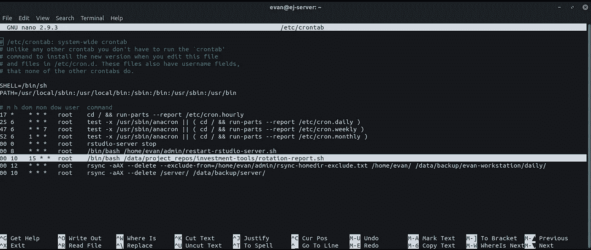

# 用 Python 积极投资:第 2 部分

> 原文：<https://medium.com/analytics-vidhya/active-investing-with-python-part-2-6c8f20074e2?source=collection_archive---------16----------------------->

使用 python 和少量云计算实现报告自动化。

在[第一部分](https://ea-jones.medium.com/active-investing-with-python-part-1-e7e54eaedf66)中，我介绍了积极投资的概念，并强调了一个特殊的策略，资产轮换模型(ARM)，我最近在一些代码和我的服务器的帮助下开始实施它。我的投资组合在两种证券之间轮换:与纳斯达克 100 指数挂钩的封闭式基金 **QQQX** ，以及与美国长期国债指数挂钩的 **TLT** 。

在本文中，我将重点介绍如何用代码来自动化“旋转”警告。在 python 的帮助下，我分析了这两只股票，并用电子邮件发送了一份迷你报告。python 脚本随后由 Linux 的任务调度程序 cron 自动执行。

如果你对积极投资或资产循环模型不熟悉，我鼓励你阅读第一部分了解更多背景知识。如果你宁愿直接钻研源代码，你可以在我的 [github repo](https://github.com/EandrewJones/investment-tools) 找到。

*免责声明:本文绝不构成财务建议。你有责任制定一个最适合自己需求的财务计划，并坚持以有原则的方式执行该计划所必需的行为准则。如果一种积极的方法对你有吸引力，那么继续读下去。*

# 如何自动生成报告

自动化报告就像回答以下问题一样简单:

1.  报告中需要包含哪些内容？
2.  我将如何提交报告？
3.  我将如何自动交付？

弄清楚这三件事，代码就应该开始自己写了。几乎所有的时间和精力都将用于创建报告。根据报告的范围，这可能需要很长时间，也可能不需要。幸运的是，我的报告相当简单。之后，交付和自动化就不在话下了。

## 1.生成报告

第一项任务是检索股票数据。有许多库可以在这方面提供帮助。在这里，我使用 yfinance，因为它是免费的，易于使用，并且适合我的需要。备选方案是存在的，并且可能是必要的，这取决于您的项目。查看这个博客了解关于 yfinance 和一些替代方案的惊人概述。

我的信号是基于 90 天增长率的比较，所以我写了一个函数来检索截止到最近交易日的前 90 天的价格数据。我还包含了一个 lag 参数，这样我就可以以天为增量向后滚动 90 天的窗口。检索股票价格数据后，我需要对其进行分析。

我使用的“旋转”信号很简单。我每月比较这两种证券之前 90 天的增长率，并重新加权我的投资组合，将 75%投资于获胜的股票，25%投资于失败的股票。为了提高稳健性，我没有只根据检索日期的数据来比较 90 天的增长率，而是对前 30 天的每一天进行比较。然后，我将 90 天增长率在前 30 天的大部分时间里都较高的股票确定为赢家。我还报告了这种情况发生的天数百分比。这样，我可以更好地感受信号的波动性。

下面的实用函数将帮助我完成这些任务，但仍然是模块化的，以便我可以在需要时在其他报告中使用它们。

## 2.提交报告

每个月运行计算后，如果获胜的证券与前一期相比发生了变化，我会给自己发一封电子邮件进行轮换。因为我打算在将来自动化更多的分析，所以我编写了下面的通用电子邮件发送函数:

如果你以前从未用 python 发过电子邮件，有很多很棒的教程——我喜欢在 [Real Python](https://realpython.com/python-send-email/) 的那个——但是这里是基础。首先，使用 **smtp** 和 **ssl** 库连接到 SMTP 邮件服务器。如果你没有自己的邮件服务器，或者即使你有，如果你有他们的账户，gmail 也能提供很好的 SMTP 服务。幸运的是，我知道。第二，用你的凭证登录。最后，通过将收件人的地址和所需的消息传递给。sendmail()方法。

这里要记住的最重要的事情是**永远不要通过在 python 脚本**中包含你的电子邮件凭证来泄露它们。相反，将它们作为变量包含在. env 文件中，然后在需要时将它们加载到 python 中。

有了这个小小的电子邮件功能，我已经准备好出发了。此外，我可以很容易地扩展这个功能来发送附件，如带有图表和表格的 PDF 报告(内容供将来发布)。下面，我把所有的东西放在一起。通过分离实用函数和报告，报告代码本身是微不足道的。

只有当本期和上一期的获胜者不同时，我才需要轮换，因此只在这种情况下发送电子邮件。这样，我避免了塞满我的收件箱，并且知道如果我收到一封电子邮件，我需要认真看看市场，并可能轮换我的股票。

## 3.自动化报告

一旦你有了所有的代码，自动化报告就不会太难了。为了确保您的报告持续运行，您需要访问云计算。如果你已经可以使用云计算，很好，使用它。如果没有，你可以把所有东西都写在一个 python 函数中，并使用 AWS Lambda [ [1](https://aws.amazon.com/premiumsupport/knowledge-center/lambda-send-email-ses/) ， [2](https://aws.amazon.com/premiumsupport/knowledge-center/lambda-send-email-ses/) (我相信是免费的)。我有一台运行 linux 的个人服务器，所以用[cron](https://linuxize.com/post/scheduling-cron-jobs-with-crontab/)**。您的[调度程序](https://automatetheboringstuff.com/schedulers.html)会因操作系统而异。**

使用 cron，安排一个例行任务需要编辑 crontab 文件。我正在使用我的系统级 crontab，它位于 */etc/crontab。*使用 nano 文本编辑器，看起来会像这样。



循环报告作业将突出显示。

要运行作业，您需要添加具有以下格式的新行:

```
* * * * * [user] [command]
```

其中每个星号分别对应于一分钟、一小时、一月中的一天、一月和一周中的一天。你会注意到，我把我的设置为每月 15 日上午 10 点运行。为了调用 python 脚本，我将它封装在一个 shell 脚本 *rotation-report.sh* 中，并用/bin/bash 命令调用这个文件。该脚本设置工作目录，然后激活我为这个项目创建的 conda 环境，并调用该脚本。很简单。

瞧啊。这样，如果我需要轮换，我会在每月 15 日收到一封电子邮件。

# 人在回路与全自动

你可能会问自己为什么不完全自动化交易？如果你的经纪人提供 API 访问你的投资组合，这当然是可能的(不幸的是，我的经纪人查尔斯·施瓦布没有提供)。完全自动化的过程完全消除了人类的判断。如果您有一个开发良好的、经过回溯测试的模型，并且对此很有信心，那么这将是非常好的。

然而，我更喜欢保持一个人在回路中，特别是考虑到我的信号是不发达的。当然，它通过跟踪股票债券的走势，间接地利用债券作为衰退信号。但它也忽略了无数其他信息来源，如收益率反转、基本面经济趋势和地缘政治事件。每一个都提供了*先验信息*，这些信息会影响你的决定。

在第一篇文章中，我建议遵循原则性的决策规则来做出投资决策，以尽量减少情绪引发的错误。虽然上述段落可能听起来像是通过将人类的判断重新纳入画面而偏离了这一点，但实际上我们只有在收到信号时才会旋转。因此，我可能会在根据额外信息更新评估后决定*而不是*进行轮换，但我绝不会仅根据额外知识进行轮换。理想情况下，我们会将所有这些不同信息源合并到一个统计模型中，该模型返回一个循环预测和确定性级别。

然而，这是一个长期项目。最好从简单开始，然后慢慢构建复杂。这样你就能产生动力。最终，你将拥有一个多元化的主动投资策略，主要由算法执行，但由你监督。在那之前，人类仲裁者仍然是明智的。

第一部分的分析有助于说明我的模型是如何不完善的。在显示先前市场调整期间模型表现的[图](https://ea-jones.medium.com/active-investing-with-python-part-1-e7e54eaedf66#3b80)中，人们可以看到它要求在 2008 年经济衰退中期(6 月、7 月和 8 月)短暂转回 QQQX，然后在 9 月开始转回 TLT。然而，纳斯达克指数从八月到九月下跌了 12.5%。根据你在 9 月份的轮换时间，纳斯达克 3 个月轮换的任何潜在收益都可能很容易被掏空。这是一个很好的例子，说明加入额外的信息可以帮助你做出更明智的决定。

# 在模板上构建

尽管我不是一名软件工程师，也没有资格谈论最佳实践，但我还是要发表一些看法:在编码时要始终考虑未来。在许多事情中，这包括考虑规模。通过编写模块化的、可扩展的代码，您可以通过最少的重构进行纵向和横向扩展。这并不意味着绘制出一个完整的架构，但是值得花一些时间来思考在不久的将来你可能还想用这个代码库做什么，并在头脑中进行设计。

也就是说，下面列出了从这段代码中轻松扩展的一些想法:

1.  定期搜索股票，加入自己的观察名单数据库；
2.  当你的观察名单上的股票符合给定的标准时，给你自己发电子邮件提醒买入；
3.  当你的投资组合中的股票符合给定的标准时，给自己发电子邮件发出卖出警告；
4.  设计一份股市和经济报告，把它写成 PDF 格式，定期用电子邮件发给自己；
5.  为你的投资组合建立一个分配框架，并在需要重新平衡时提醒自己；

你喜欢这篇文章吗，或者觉得代码有用吗？如果是的话，请在评论里或者鼓掌让我知道。我的背景是 R/c++，目前还在学习 Python。所以关于更好的库、更高效的实现等等的反馈。也是受欢迎的。