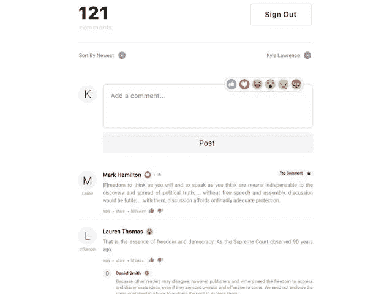

# 在你的申请上添加评论部分

> 原文：<https://medium.com/analytics-vidhya/add-comment-section-on-your-application-7a97edd73083?source=collection_archive---------13----------------------->

本指南将让你们在 ruby on rails 应用程序上创建一个评论区



对于这个特性，我们将使用 acts _ as _ comment table _ with _ threading

## acts _ as _ comment able _ with _ threading

允许向多个不同的模型添加线程注释。与 acts_as_commentable 的插件兼容(但是需要更改数据库模式)

## 安装宝石


在 gem 文件中，添加:

```
gem 'acts_as_commentable_with_threading'
```

并运行`bundle install`。

# 迁移

首次安装时:

`rails generate acts_as_commentable_with_threading_migration`

*   这将生成表所需的迁移脚本

如果您已经在使用 commentable gem 并决定升级 acts _ as _ commentable _ with _ threading

`rails generate acts_as_commentable_upgrade_migration`

这将生成必要的迁移来升级您的注释表，以便使用 acts _ as _ comment table _ with _ threading

注*如果生成器失败，您可以同样轻松地手工创建迁移。参见`[lib/generators](https://github.com/elight/acts_as_commentable_with_threading/tree/master/lib/generators)`下生成器中的模板。

让我们开始工作

```
class Article < ActiveRecord::Base
  acts_as_commentable
end
```


向模型实例添加注释，例如文章:

`@article = Article.find(params[:id])`

`@user_who_commented = @current_user @comment = Comment.build_from( @article, @user_who_commented.id, params[:comment][:body])`

您需要创建一个 comments 控制器和一个新的动作，在这里您可以根据您发送的内容构建一个评论。因此，如果您有一个文章列表，您可以链接到 new_comment_path(article ),其形式如下:

```
<%= form_for @comment, comments_path(@article) do |f| %>
  <%= f.text_area :body %>
  <%= submit_tag "Post comment" %>
<% end %>
```

> *定义帖子 _ 博客 _ 评论*
> 
> `*@article = Article.find(params[:id])*`
> 
> `*@user_who_commented = @current_user @comment = Comment.build_from( @article, @user_who_commented.id, params[:comment][:body])*`
> 
> *if @comment.save*
> 
> *重定向至文章路径(@文章)*
> 
> *结束*
> 
> *结束*

## 您可以做的其他事情:

*   要将新创建的评论作为另一个评论的子评论/回复:
*   `@comment.move_to_child_of(the_desired_parent_comment)`
*   要检索文章的所有评论，包括子评论:
*   `@all_comments = @article.comment_threads`
*   要仅检索根注释而不检索其子注释:
*   `@root_comments = @article.root_comments`
*   要检查注释是否有子注释:
*   `@comment.has_children?`
*   要验证注释中的子代数量，请执行以下操作:
*   `@comment.children.size`
*   要检索注释的子项:
*   `@comment.children`

好了

快乐编码


照片由[豪伊 R](https://unsplash.com/@howier?utm_source=medium&utm_medium=referral) 在 [Unsplash](https://unsplash.com?utm_source=medium&utm_medium=referral) 上拍摄