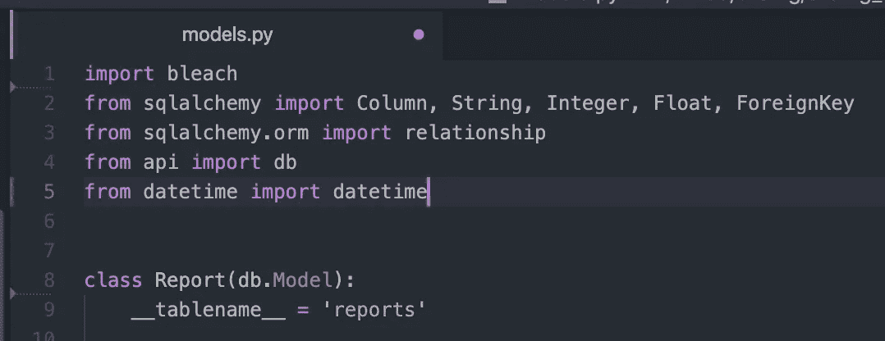
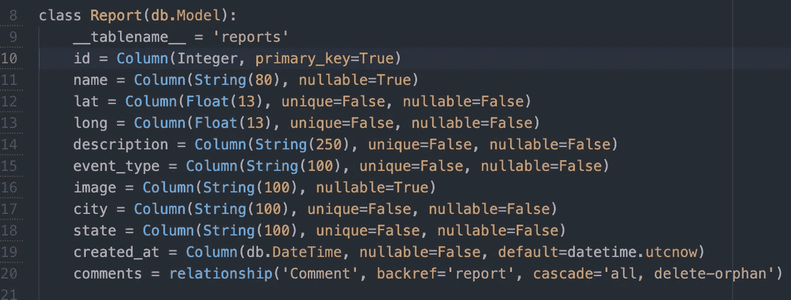
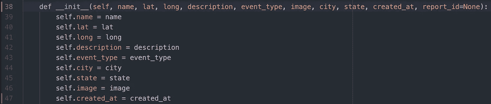
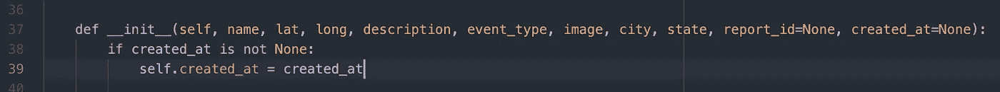
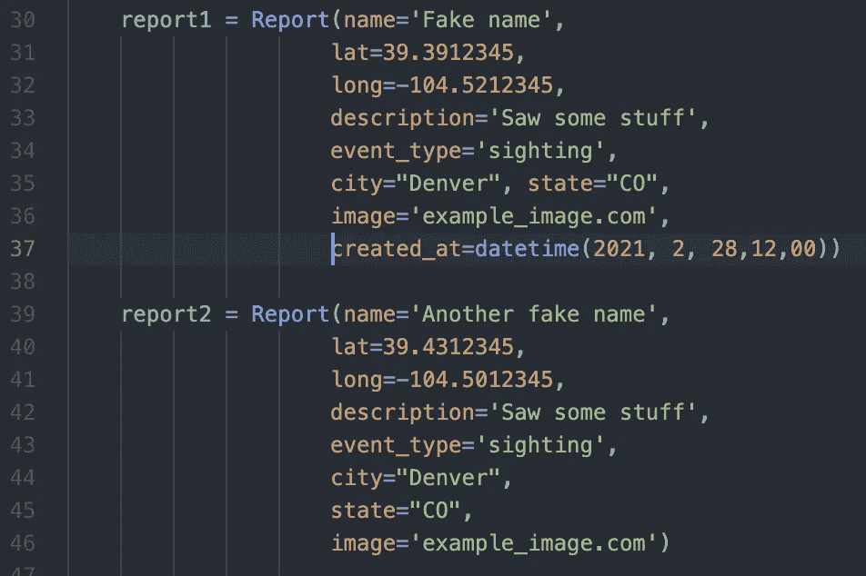
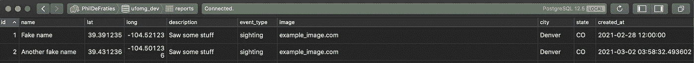

# 向 Flask 中的 PostgreSQL 表添加自动填充的 created_at 列。

> 原文：<https://medium.com/analytics-vidhya/adding-an-auto-populating-created-at-column-to-a-postgresql-table-in-flask-95848ecebe7a?source=collection_archive---------7----------------------->

我最近接受了一个任务，向 PostgreSQL 数据库中的一个表添加一个`created_at`列，这是一个用非常流行的 Python 语言 Flask 构建的项目。从后端的角度来看，在模型中包含时间戳是非常标准的，但是您可能没有意识到，在测试/播种的时候，自动填充列可能会受到限制。事实证明，以允许覆盖的函数方式实现可能有点棘手。

首先我们需要在模型文件的顶部导入`datetime`:

从日期时间导入日期时间

接下来，我们将`created_at`属性定义为类中的一列，并告诉它接受`DateTime`作为数据类型。我们还将其设置为默认值`datetime.utcnow`，这将是该方法被调用的当前时间:

这太棒了，在创建时，我们的对象现在将保存到数据库中，并带有一个自动填充的`created_at`列，其中包含请求发出时的给定日期和时间！但是有一个问题，如果我们需要创建一个在过去或未来带有特定时间戳的对象来进行测试或播种，该怎么办呢？为了解决这个问题，我们可以添加`created_at`作为类方法的可接受参数，`__init__`(类的初始化方法，它将传入的参数连接到适当的属性)，并在方法内将属性设置为等于传入的参数，就像我们对所有其他属性所做的那样。

别担心，无论如何最后都不会是`None`:)

现在我们可以手动设置`created_at`值为我们想要的任何值！但是现在有一个新的问题，如果我们这样做，我们会失去我们首先需要的自动填充功能。不仅如此，现在当在参数中没有`created_at`键/值对的情况下调用该方法时，该方法会完全中断，这并不理想。为了使它成为一个可选参数，我们在定义中将它设置为等于`None`，就像我们对`report_id`所做的那样，这允许我们使用或不使用该参数的键/值对进行初始化。在该方法中实现的条件检查我们是否传递了一个`created_at`键/值对，如果是，则用传递的内容覆盖默认值:

我们最终得到的是用当时的日期时间自动填充`created_at`的原始功能，以及为了测试或播种目的而传递特定日期时间的能力(如果我们愿意的话):

我们可以看到两个种子(上面定义的)都成功地保存到了我们的数据库中(如下面的 Postico 所示)，第一个具有指定的`created_at`值，另一个具有自动填充的`created_at`值:

* * *附录:对于`updated_at`列，可以遵循相同的实现方式！