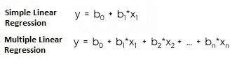
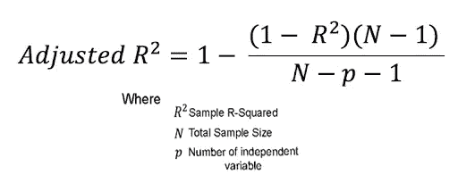
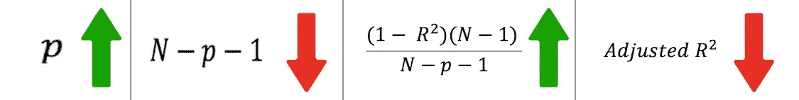
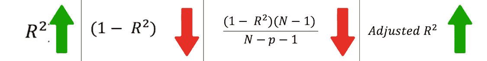

# 调整后的 R 平方:公式解释

> 原文：<https://medium.com/analytics-vidhya/adjusted-r-squared-formula-explanation-1ce033e25699?source=collection_archive---------6----------------------->

顾名思义，Adjusted R-Squared 就是 R-Squared 的调整版。问题是为什么我们需要调整 R 的平方。

因此，在本文中，我们将了解为什么需要调整后的 R 平方，我们将分解其公式，并尝试了解每项对值调整后的 R 平方的影响。

> 我鼓励你阅读我的文章 [R 平方:公式解释](/analytics-vidhya/r-squared-formula-explanation-6dc0096ce3ba)。它会帮助你理解 R 平方。

让我们从回答我们的第一个问题开始， ***“为什么我们需要调整 R 的平方？”。*** 为此，我们需要讨论一下 R 平方的弊端。

简单和多元线性回归

r 平方值仅适用于简单的线性回归。对于多元线性回归，随着自变量数量的增加，即使自变量**不显著**，R 平方**的值也会增加。而**调整后的 R 平方**仅在自变量**显著**并影响因变量时增加。**

调整后的 R 平方公式

# **情况 1:当独立特征不重要时**

因此，随着 p 增加分母***【N-p-1】***将成为一个较小的项，这意味着整个***[(1-R)(N-1)/(N-p-1)]***将成为一个较大的数，当从 1 中减去这个较大的项时， ***的值调整后的 R*** 将成为一个较小的项。

当独立特征不重要时

# 情况 2:当独立特征很重要时

当特征具有某种意义时， ***R*** 的值将会增加，而当更大的*R 将会从 1 中减去，***【1-R】***将会变成一个更小的项。当我们用***[(N-1)/(N-p-1)]***乘多个较小的项时，它将成为一个较小的项，最后当整个项从 1 ***中减去调整后的 R*** 时，它将成为一个较大的值。*

**

*当独立特征很重要时*

***调整后的 R 平方为负或零***

*在两种情况下，调整后的 R 平方可以为零或负值*

1.  ****R*** 非常小或者接近于零。(可以把 ***R =0*** 放到调整后的 R 平方公式中，自己查一下。)*
2.  *当 ***N*** 小于或等于 ***p.*** (在现实场景中 p 总是小于 N)*

***最终想法***

*当涉及到多元回归时，r 平方有缺点。我们通过修改公式克服了这些缺点，并创建了一个新术语调整后的 R 平方。当我们分解各项，分别研究每项的影响时，就很容易理解它的公式了。*