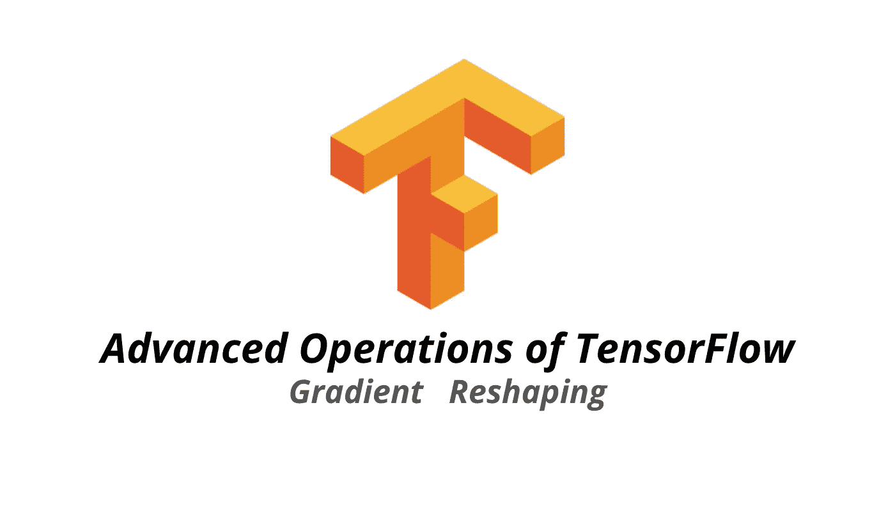

# 张量流中的高级运算

> 原文：<https://medium.com/analytics-vidhya/advanced-operation-in-tensorflow-9b7d3157b08?source=collection_archive---------25----------------------->

## 什么是渐变和重塑？



之前我们已经介绍了 TensorFlow 中的基本操作，如乘法、matmul 和 reduce sum。在这篇文章中，我将谈论像整形，渐变和随机高级操作。

[](/analytics-vidhya/basic-operations-of-tensorflow-e6311e2eb8a0) [## 张量流的基本运算

### 张量流简介第 2 部分

medium.com](/analytics-vidhya/basic-operations-of-tensorflow-e6311e2eb8a0) 

# 梯度操作

我们将结合梯度带使用梯度函数，计算函数在某一点的斜率。

# 寻找最佳方案

在许多机器学习问题中，你需要找到一个最优值，即最小值或最大值。例如，您可能希望最小化损失函数或最大化目标函数。

**最小值:**坡度变化> 0

**最大:**坡度变化< 0

# 计算梯度

首先我们定义一个变量 x

```
#define x
x = tf.Variable(-1.0 )#define y within instance of GradientTapewith tf.GradientTape() as tape :
      tape.watch(x)
      y = tf.multiply(x,x) #next we compute the gradientg = tape.gradient(y,x)
print(g.numpy())
```

*   请注意，我们将 watch 方法应用于渐变磁带的一个实例，然后传递变量 x。这将允许我们计算 y 到 x *的变化率

输出为-2.0，这意味着在 x 等于-1 时斜率为-2，这意味着 y 开始下降。

# 重塑

整形被认为是对图像分类问题特别有用的操作。通过整形，你可以很容易地将矩阵整形为向量。

我会给你看一个重塑的例子。

```
#example we generate grayscale image gray = tf.random.uniform([2,2],maxval = 255 , dtype='int32' )#reshape grayscale image 
gray = tf.reshape(gray , [2*2 , 1] )
```

这就是 TensorFlow 中使用的所有高级操作。

这就是张量流中的损失函数。你可以关注我的媒体或者在我的 Linkedin 中与我联系，以保持对媒体的关注。

 [## Swee Liang Chua — NYP 信息技术学院(SIT) —新加坡，新加坡| LinkedIn

### 查看 Swee Liang Chua 在全球最大的职业社区 LinkedIn 上的个人资料。瑞良的教育是…

www.linkedin.com](https://www.linkedin.com/in/sweeliang/) 

# 另请参见:

[](/analytics-vidhya/introduction-to-tensorflow-8f2dbaba8844) [## 张量流简介

### 在这篇文章中，我将介绍张量流的基础知识，在深入研究之前，你需要了解这些知识…

medium.com](/analytics-vidhya/introduction-to-tensorflow-8f2dbaba8844) [](/analytics-vidhya/basic-operations-of-tensorflow-e6311e2eb8a0) [## 张量流的基本运算

### 张量流简介第 2 部分

medium.com](/analytics-vidhya/basic-operations-of-tensorflow-e6311e2eb8a0)