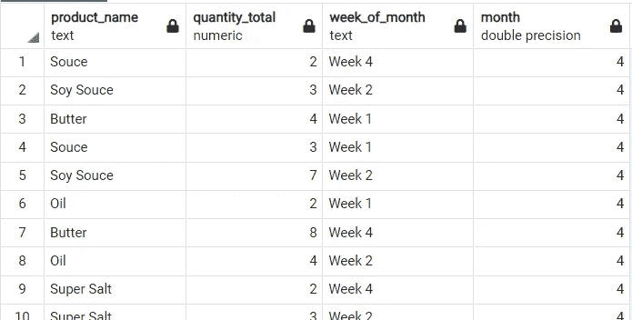
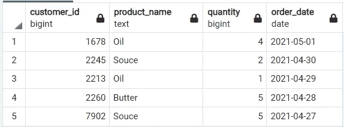
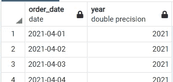
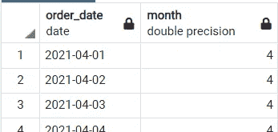
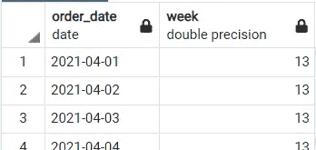
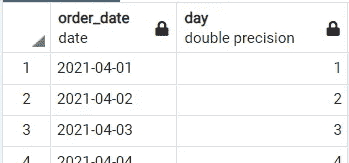
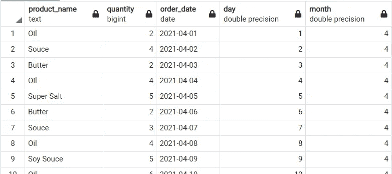

# 高级 SQL 查询:如何在 SQL 中从日期获得一个月中的第几周

> 原文：<https://medium.com/analytics-vidhya/advanced-sql-query-how-to-get-week-number-of-the-month-from-date-in-sql-9ffb2f94132f?source=collection_archive---------0----------------------->

## 附有商业案例


照片由[贝南·诺鲁齐](https://unsplash.com/@behy_studio?utm_source=unsplash&utm_medium=referral&utm_content=creditCopyText)在 [Unsplash](https://unsplash.com/s/photos/calendar?utm_source=unsplash&utm_medium=referral&utm_content=creditCopyText) 上拍摄

讨论 SQL 查询课程的基础可能已经被很多人讨论过了，比如 SELECT 语句、分组、连接等等。因此，在这里我打算讨论一些很少被讨论或者很少被发现的东西，即如何在 SQL 中从日期中获取一个月的星期数。作为一名数据分析师，我经常在工作中使用这个查询来解决业务问题。

# 目录

1.  商业问题
2.  处理从日期中提取的功能
3.  用子查询和 CASE 语句修改

## 商业问题

此时的业务问题是，例如，在一家从事零售的企业中，主管要求我们找出每个月每周每种产品的销售量，但周数不是从一天开始计算的，而是从日期数开始计算的，因此 1–7 是第一周，尽管第一周不是从星期一开始。如何用 SQL 回答上述业务问题？让我们在下一节讨论这个问题！。我们期望的输出是这样一个例子:



## **处理从日期**开始的提取功能

事实上，我们最常用的日期提取函数是从日期/时间值中检索诸如年、月、周和日之类的字段。在继续之前，让我们回顾一下 EXTRACT 函数在常用字段中的用法。你可以在这里 下载数据 [**。**](https://drive.google.com/file/d/1wPGQPIFoYiuT0AyH-m5_Mk14gkYdomwA/view?usp=sharing)

让我们看看整列和前 5 名的数据:

```
SELECT * FROM sample
LIMIT 5
```

结果如下:



*   **从** `order_date` **列中提取年份**

```
SELECT order_date, EXTRACT(YEAR FROM order_date) AS year FROM sample
```

结果如下:



`YEAR`函数从检索的日期中返回年份值。

*   **从** `order_date` **列中提取月份**

```
SELECT order_date, EXTRACT(MONTH FROM order_date) AS month FROM sample
```

结果如下:



`MONTH`函数将返回指定日期的月份部分(从数字 1 到 12)。

*   **从** `order_date` **列中提取周**

```
SELECT order_date, EXTRACT(WEEK FROM order_date) AS week FROM sample
```

结果如下:



`WEEK`函数将返回指定日期的周数(从数字 0 到 53)。

*   **从** `order_date` **列中提取日**

```
SELECT order_date, EXTRACT(DAY FROM order_date) AS day FROM sample
```

结果如下:



`DAY`函数将返回给定日期的天数(从 1 到 31)。

至此，让我们来看看周数的取法。取星期号基本上是从年初开始取星期号(按照公历计算)，这样取日期 2021–04–01 就会得出星期号 13。

那么如何从某一个月的某一天得到星期数而不与公历绑定呢？所以我们仍然认为 1-7 日是第一周，尽管第一周不是从周一开始。到目前为止，我还没有从 SQL 中找到可以返回这个结果的函数/命令，所以我们必须考虑如何在 SQL 中可用的函数/命令的帮助下修改语法来获得这个结果，这听起来可能很难，但实际上很容易，让我们在下一节讨论！

## 用子查询和 CASE 语句修改

为了获得我们在业务问题部分所期望的输出，我们需要使用子查询技术和一些 CASE 语句。我们必须完成两个步骤，即:

因此，我们首先需要做的是创建一个语法，该语法选择除 customer_id 列之外的所有列，然后从 order_date 列中提取日和月，语法如下:

**1。**所以我们首先需要做的是创建一个语法，该语法选择除了`customer_id`列之外的所有列，然后从`order_date`列获取日期和月份，语法如下:

```
SELECT product_name, 
quantity, 
order_date, 
EXTRACT(DAY FROM order_date) AS day, 
EXTRACT(MONTH FROM order_date) AS month
FROM sample
```

结果如下:



**2。**其次，我们要做的是用前面的语法创建一个子查询，它包含并提取:

*   `product_name`列
*   用于`quantity_total`列的`SUM`聚合函数
*   `CASE`通过提取`day`列生成`Week_of_month`列，第一个条件提取 1–7 日期，第二个条件提取 8–14 日期，第三个条件提取 15–21 日期，第四个条件是余数。
*   `month`列

然后在语法的最后，我们对`product_name`、`quantity`、`Week_of_month`、dan `month`列使用`GROUP BY`语句。完整语法如下:

```
SELECT product_name,
SUM(quantity) AS quantity_total,
CASE 
WHEN day < 8 THEN 'Week 1'
WHEN day < 15 THEN 'Week 2'
WHEN day < 22 THEN 'Week 3'
ELSE 'Week 4'
END AS week_of_month,
month
FROM
(SELECT product_name, quantity, order_date, EXTRACT(DAY FROM order_date) AS day, 
EXTRACT(MONTH FROM order_date) AS month
FROM sample) a
GROUP BY product_name, quantity, week_of_month, month
```

结果如下:


耶！从上面的结果，我们可以得到我们期望的结果。

# 结论

到目前为止，我们已经通过使用创造性的想法子查询和 CASE 语句成功地回答了业务问题，随着我们对查询有了创造性的想法，听起来很难的事情将变得容易，继续练习！