# 高级 SQL:时间序列分析

> 原文：<https://medium.com/analytics-vidhya/advanced-sql-time-series-analysis-fd40eaa08fa3?source=collection_archive---------0----------------------->

在 [Unsplash](https://unsplash.com/s/photos/time-series?utm_source=unsplash&utm_medium=referral&utm_content=creditCopyText) 上由 [Aron 视觉](https://unsplash.com/@aronvisuals?utm_source=unsplash&utm_medium=referral&utm_content=creditCopyText)拍摄的照片

## 时间序列

时间序列是一系列按时间顺序排列的数据点。最常见的是，时间序列是在连续的等间隔时间点取得的序列。因此，它是一个离散时间数据序列。

时间序列数据是数据点的序列。每个数据点包括一个时间戳。时间戳通常包括日期和时间。

时间序列分析包括用于分析时间序列数据的方法，以便提取有意义的统计数据和数据的其他特征。时间序列预测是使用模型根据以前观察到的值来预测未来值。

虽然回归分析常用于检验一个或多个不同时间序列之间的关系，但这种类型的分析通常不称为“时间序列分析”，时间序列分析特指单个序列中不同时间点之间的关系。

**时间序列用例**

*   股票市场数据
*   潮汐时间表
*   性能监控
*   健康监控
*   人口统计
*   经营成绩

## 使用 SQL(？)

不知何故，Python 或 R 是最常用和已知的进行深度时间序列分析的工具。但是，了解如何使用 SQL 处理时间序列数据是必不可少的。当处理非常大的数据集或不断更新的数据时，这一点非常重要。

作为数据科学家，我们已经知道 SQL 是处理数据集的流行语言之一。SQL 是一种广为人知的、有良好文档记录的、富有表现力的查询语言，也是第三大流行的开发语言。组织也很容易采用其他工具并与之集成。由于这些原因，我相信 SQL 是处理时间序列数据的最佳语言之一。

在这篇文章中，我们总结了一些我们喜欢使用 SQL 进行时间序列分析的技巧和原因，包括帮助您如何使用时间序列数据集的技术资源和指南。正如我之前所说，SQL 很容易与其他工具集成。在这篇文章中，我不会使用 MySQL Workbench。我更喜欢集成 Python 和 MySQL 服务器。

# 时间序列数据集:超市

我已经从 Kaggle 下载了时间序列数据集。你也可以在这里下载这个数据集: [*超市时间序列数据集*](https://www.kaggle.com/blurredmachine/superstore-time-series-dataset) 。在本帖中，我只使用 **superstore_test.csv** 。

# 数据预处理

在我们将这个数据集( *superstore.csv* )导入到 SQL Server 之前，我们需要先做数据预处理。

1.  使用日期格式转换订单数据和发货日期:`%Y-%m-%d %H:%M:%S`
2.  重命名列名。在 SQL 中，列名不能有空格。所以我们需要用下划线来转换它。

完成这些数据处理后，将其保存到新的 csv 文件中。

# 将 CSV 文件导入 SQL Server

本教程将指导您如何将 *superstore.csv* (数据预处理结果)导入 SQL Server。本指南使用 MySQL Workbench，并将一步一步地指导您。

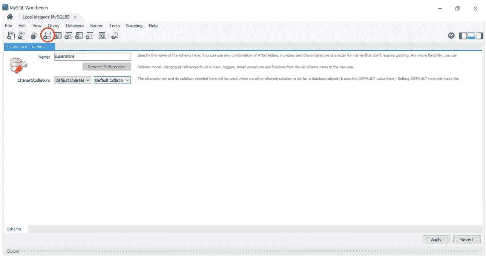

单击“新建架构”按钮，然后键入架构的名称。在这篇文章中，我使用“超级商店”的名称。

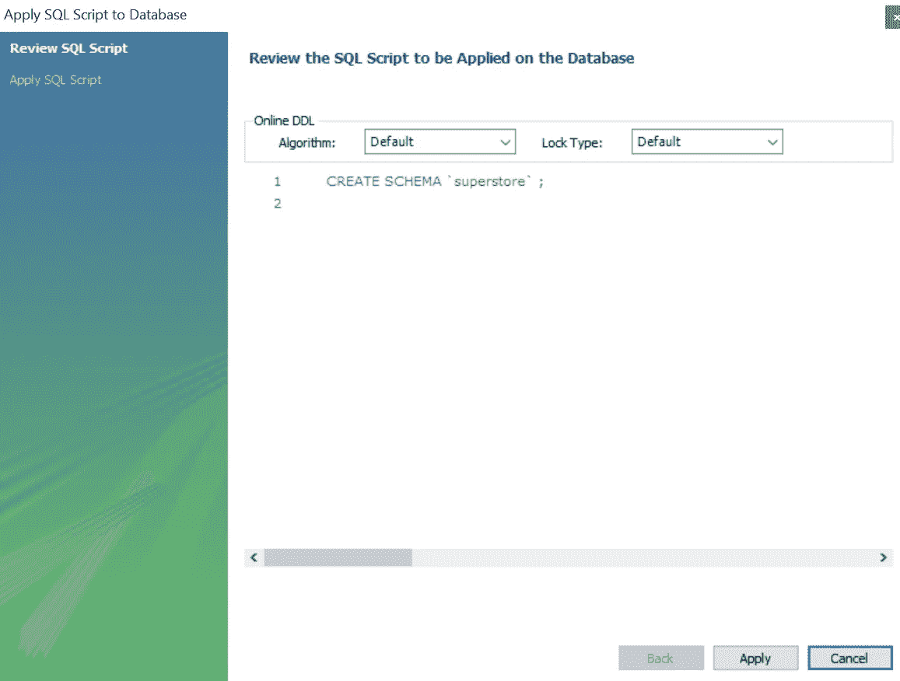

点击“应用”

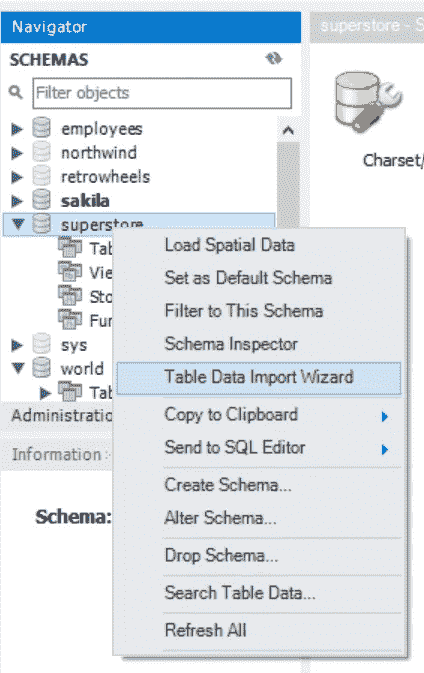

右键单击“超级商店”模式，然后单击“表数据导入向导”

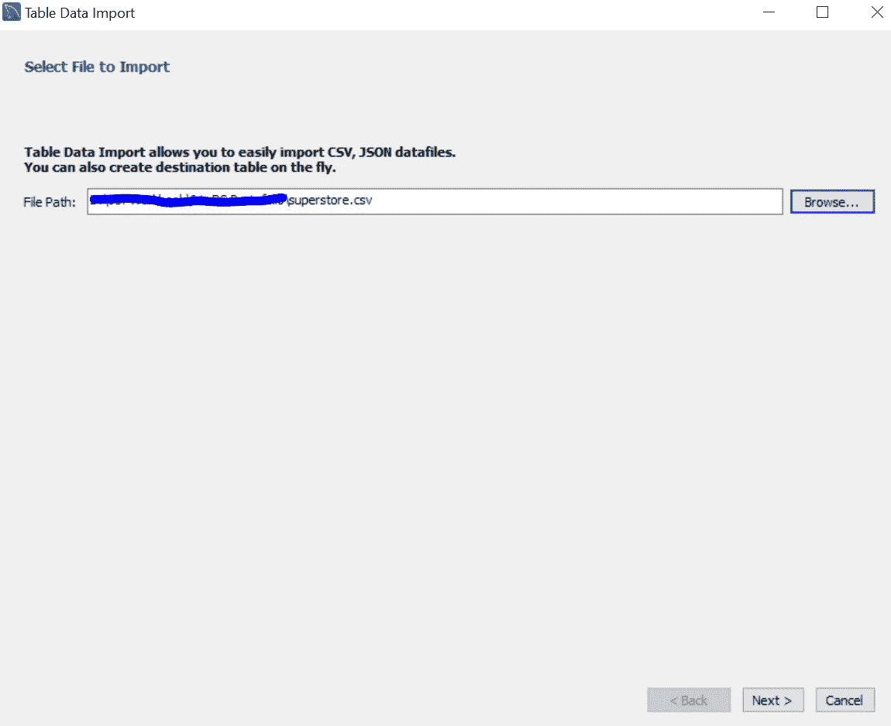

数据预处理后，浏览你的 CSV 文件在哪里。然后，单击“下一步”。

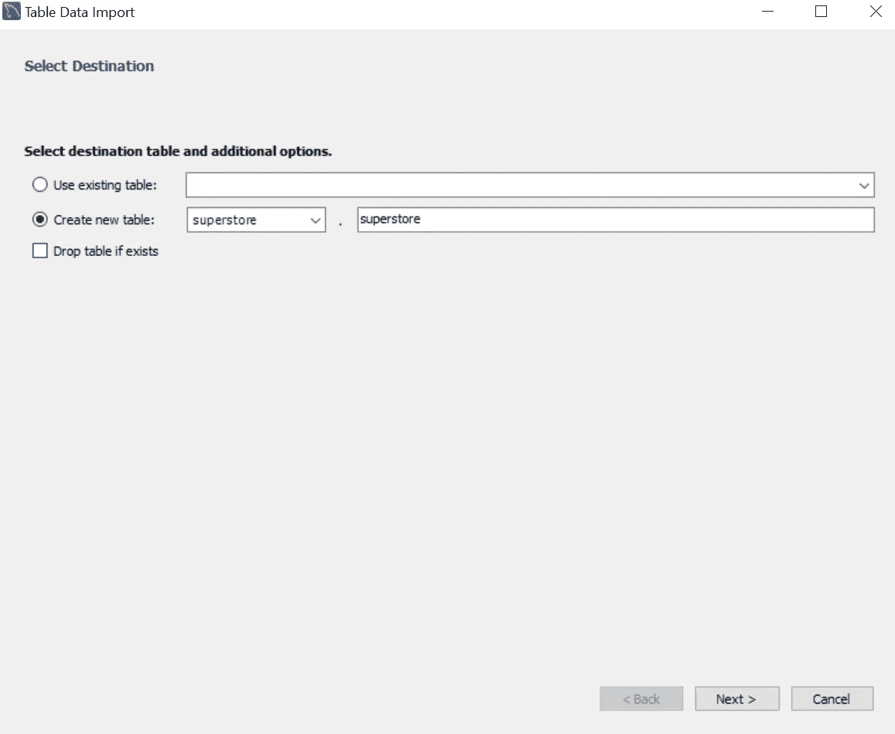

单击“创建新表”。然后给出表格的名称。在这篇文章中，我将给出“超级商店”作为我的表的名称。

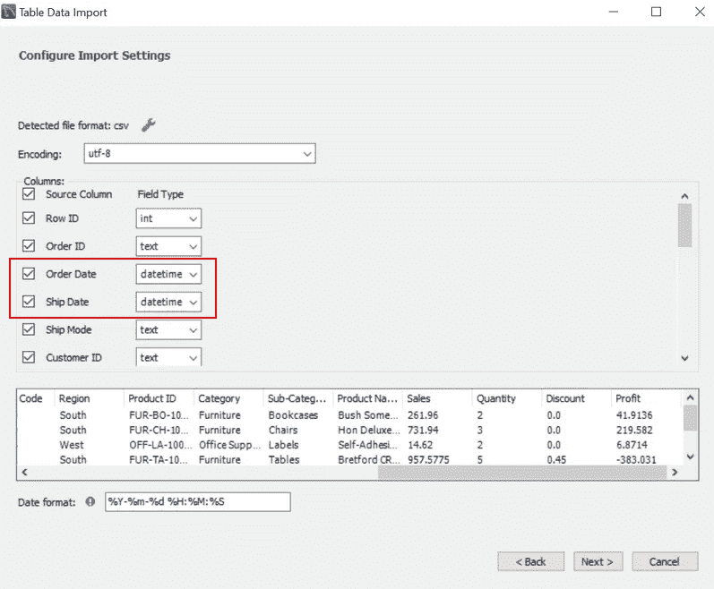

不要忘记更改“订单日期”和“发货日期”栏中的“文件类型”。然后点击“下一步”。

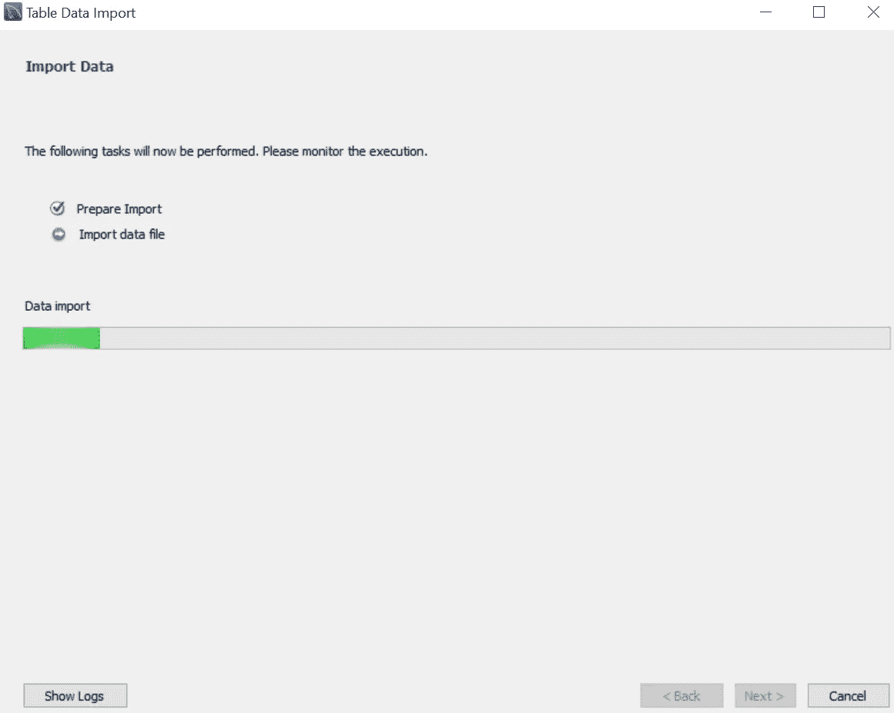

就等着吧。完成后，点击“下一步”。

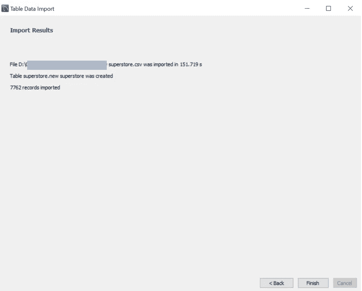

看，导入了 7762 条记录。我们已经完成了。单击“完成”。

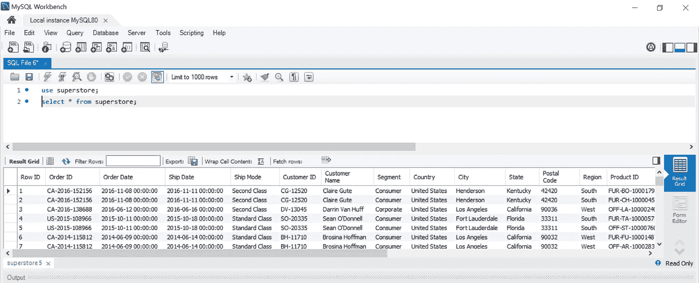

尝试 SELECT 语句来查看新的“超级商店”表。

恭喜你。你的数据集准备好了。

在这篇文章中，我不使用 MySQL Workbench 来分析时间序列数据。但是，我会使用 Python MySQL 连接器。怎么用？下面我来解释一下。

# Python MySQL 连接器

MySQL 连接器使 Python 程序能够访问 SQL Server。首先，我们以 Python 函数的形式创建到 SQL Server 的连接。然后，使用该函数编写 SQL 查询。

> 生活是艰难的。不要让它变得更难。

为了方便我们编写 SQL 查询，我们创建了一个函数。请参见下面的代码。

# 时间序列分析的常用函数

时间序列数据集已准备就绪。在笔记本上写 SQL 查询的函数迫不及待要用了。

处理时间序列数据集需要一些 SQL 函数。我将引入领先，落后，等级和百分比等级作为你的新武器。

## 1.导致

LEAD()是一个窗口函数，它提供对当前行之后指定物理偏移量处的行的访问。例如，通过使用 LEAD()函数，您可以从当前行访问下一行的**或下一行**之后的**行的数据，依此类推。**

LEAD()函数对于比较当前行的值和下一行的值非常有用。

在这个查询中，我们创建名为 *sales_lead* 的新列。我们在 *sales_lead 中使用 LEAD 来显示下一个销售值。*参见下面的完整查询。

## 2.落后

LAG()是一个窗口函数，它提供对当前行之前指定物理偏移量的行的访问。换句话说，滞后和超前是一样的，只是方向不同。

通过使用 LAG()函数，可以从当前行开始，访问**前一行**的数据，或者从当前行之前的**第二行开始，以此类推。**

在这个查询中，我们创建名为 *sales_lag* 的新列。我们使用 LAG 在 *sales_lag 中显示以前的销售额。*参见下面的完整查询。

## 3.军阶

RANK()函数是一个窗口函数，它为结果集分区内的每一行分配一个等级。分区中具有相同值的行将获得相同的等级。分区中第一行的秩是 1。

在下面的查询中，我们添加了名为 *sales_rank* 的新列，以根据最大销售额(降序)创建排名。

## 4.百分比排名

PERCENT_RANK()实际上与排名函数具有相同的目标。但是，PERCENT_RANK 计算结果集中各行的百分比排名。该函数返回一个百分位数，其范围从 0 到 1。

对于特定行，PERCENT_RANK()使用以下公式来计算百分比等级:

`**(rank - 1) / (total_rows - 1)**`

根据这个公式，PERCENT_RANK()函数总是为结果集的第一行返回零。作为 PERCENT_RANK 输出，请参见下面的 *sales_rank* 列。

# 时间序列分析

如果工具箱里有很多工具来处理时间序列数据集就更好了。除了我之前提到的函数，我认为你还需要了解高级 SQL 查询:通用表表达式(CTE)和窗口函数。

基本上，我们将在这个时间序列分析中使用 CTE 和窗口函数。我希望你们所有人从我这里得到更多的奖金，所以添加如何比较前值，移动平均线，和线性回归。

## 1.公用表表达式(CTE)

通用表表达式(CTE)允许您定义临时命名结果集。

该结果集在 SELECT、INSERT、UPDATE、DELETE 或 MERGE 等语句的执行范围内临时可用。CTE 也可以在视图中使用。

**a)月平均销售使用**

下面的查询使用 CTE 创建临时表来显示月平均销售额。为了改变日期格式，我们使用 DATE_FORMAT()。

**b)月平均销售额使用** `**EXTRACT Function**`

这个查询实际上与前一个相同，但是我们使用不同的函数来操作日期格式。参见下面的查询，我们使用提取函数。

**c)2014 年至 2017 年期间的日平均销售额**

够清楚了。该查询将显示每日平均销售额。

**d)每月 1 日至 31 日的平均销售额**

很不一样。该查询将为您提供每个月第一天，第二天，第三天等销售平均值。参见下面的完整查询。

## 2.通过窗口函数计算聚合

> 窗口函数是使用一行或多行的值来使**为每行**返回一个值的函数。

这与聚合函数形成对比，聚合函数**为多行返回单个值**。

窗口函数有一个 OVER 子句。请记住，任何没有 OVER 子句的函数都不是窗口函数，而是聚合函数或单行(标量)函数。

窗口函数对一组行进行操作，并为每一行返回一个聚合值。而“窗口”术语描述了函数将在其上操作的数据库中的一组行。我们使用 OVER()子句定义窗口(函数在其上操作的一组行)。

**窗口功能类型:**

1.  **聚合窗口函数**
    SUM()，MAX()，MIN()，AVG()。计数()
2.  **排名窗口函数**
    RANK()，DENSE_RANK()，ROW_NUMBER()，NTILE()
3.  **值窗口函数**
    LAG()、LEAD()、FIRST_VALUE()、LAST_VALUE()

**日均利润使用** `**Aggregate Window Function**`

下面这个查询是聚合窗口函数的例子。我们用 AVG()和 OVER()来表示*日均利润*。使用“每日”术语是因为我们在 PARTITION BY 中使用了 *Order_Date* 列。

## 3.前一天比较

如何比较日累计价值？在这个查询示例中，我们使用 CTE 将日平均折扣和日平均销售额与上一个进行比较。

**对比前一天的平均折扣**

**将平均销售额与前一天进行比较**

## 4.移动平均线

移动平均是高级 SQL 用例。计算移动平均值有助于估计数据集中的趋势。移动平均值是一段时间内任何数字子集的平均值。移动平均线是一种用于分析和确定数据趋势的时间序列技术。

有时移动平均线被称为滚动平均线、滚动平均线或移动平均线。该函数计算为每个时间点的当前值和指定数量的前一个值的平均值。

移动平均使用=窗口函数(OVER)函数+ ORDER BY()函数+ BETWEEN (……A……)。)和(……B……)。).

**A** 和 **B** 可以通过以下方式填充:

1.  **当前行**:当前行或最新行
2.  **跟随**:跟随/下一行
3.  **在**之前:前一行
4.  **未绑定在**之后:最后一行
5.  **无界前置**:第一行

**移动平均和利润汇总**

在下面的查询中，我们创建了新的列:累计总利润和累计平均利润。正如我们在这个查询中看到的，移动平均使用聚合窗口函数(求和/AVG +结束)。

## 5.线性回归预测

线性回归是一种对因变量和自变量之间的关系进行建模的线性方法。一个独立变量的情况称为简单线性回归。

在统计建模中，回归分析是一组统计过程，用于估计因变量(通常称为“结果”或“响应”变量)与一个或多个自变量(通常称为“预测值”、“协变量”、“解释变量”或“特征”)之间的关系。

回归分析最常见的形式是线性回归。这种回归会根据特定的数学标准找到最符合数据的直线(或更复杂的线性组合)。

线性回归公式:

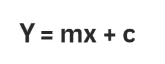

**c =截距**
c 是常数值——这部分函数不变。

**m =坡度**
m 是直线的坡度。

在这种情况下，**折扣**是特性或 x 变量。**利润**是目标值或 y 变量。首先，我们需要计算 x 轴和 y 轴，这是找到斜率和截距值所需要的。

第二步，使用此查询查找截距和斜率值。

最后，用斜率和截距值来显示利润趋势线。请参见此查询。

折价和趋势线利润的关系如何？看看这张散点图。我们给顾客的折扣越大，我们的利润就会越低。这很有意义。

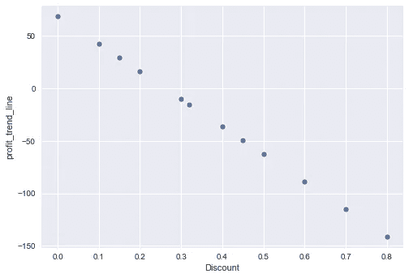

那么，月盈利趋势线是怎样的呢？让我们看看这个线图。

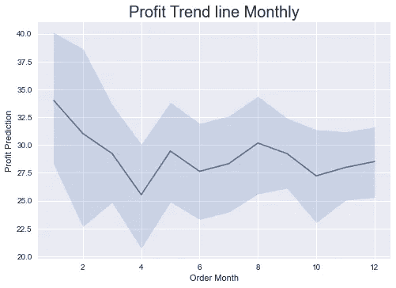

所以，高级 SQL 和查询示例中的函数都是如何分析时间序列数据集的。

感谢你阅读这篇文章。我希望您获得可操作的洞察力，并轻松地指导您分析您的数据集。在我的下一篇文章中再见。