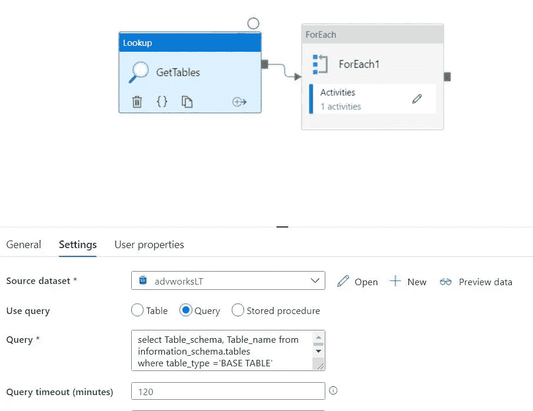
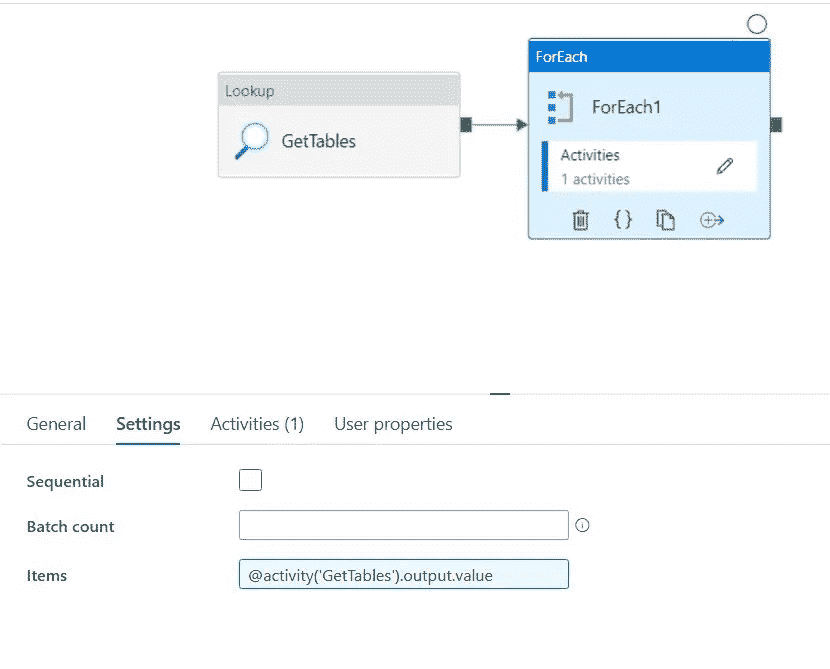
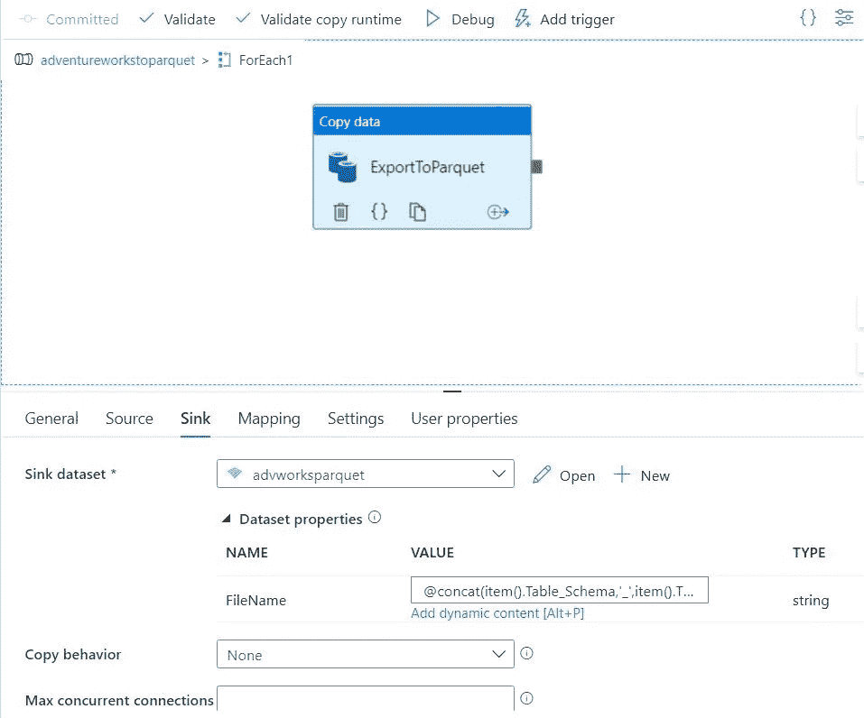
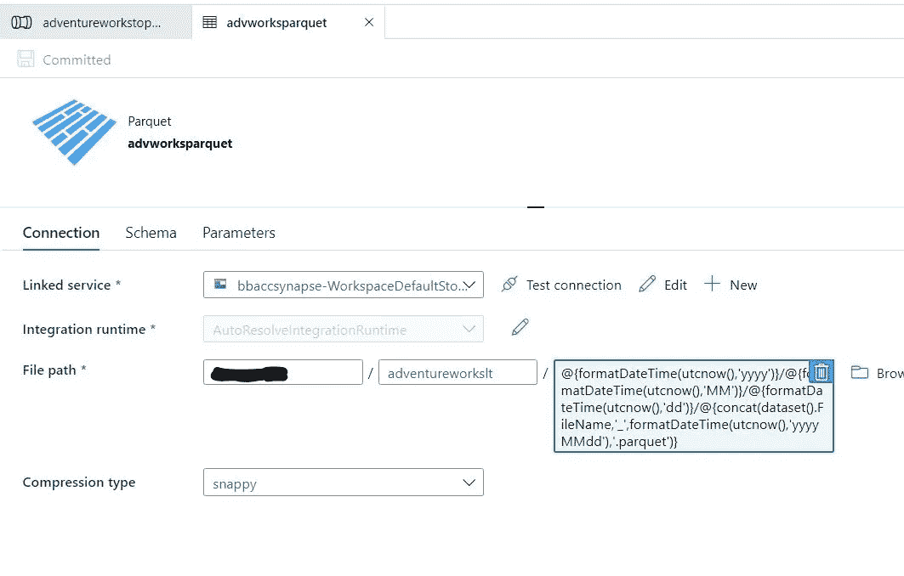

# Adventure works Lite SQL to Parquet

> 原文：<https://medium.com/analytics-vidhya/adventure-works-lite-sql-to-parquet-ef2cbf8b84d7?source=collection_archive---------21----------------------->

# 将 Azure SQL 数据库迁移到 parquet 格式以进行 spark 处理

# 创建 Azure SQL 示例数据库

*   创建一个名为 sqldemo 的资源组
*   创建新资源作为数据库
*   选择 Azure SQL 数据库
*   创建名为 db1 的数据库
*   创建一个名为 db1servername 的数据库服务器
*   将用户名创建为 sqluser
*   创建密码
*   选择一个区域
*   在网络中选择允许 azure 服务访问数据库
*   在网络中，选择将客户端 ip 添加到防火墙
*   在高级选择样本数据库中

# 使用 Azure 数据工厂迁移到 ADLS gen2

*   这里的想法是连接到 Azure SQL 并复制所有表
*   创建一个链接服务作为我们上面创建的 SQL 的源
*   创建一个集成
*   拖放查找
*   选择 adventure works LT 数据库



```
select Table_schema, Table_name from information_schema.tables where table_type ='BASE TABLE'
```

*   确保未选择第一行
*   现在拖放每个
*   在“设置”选项卡中



```
@activity('GetTables').output.value
```

*   现在单击该活动并创建一个新的
*   将活动命名为 ExportToParquet
*   选择源作为 Adventure works SQL 数据库
*   选择水槽作为 ADLS 第二代，带 parguet
*   选择使用查询



```
@concat('select * from ',item().Table_Schema,'.',item().Table_Name)
```

*   选择接收器
*   作为数据集属性

```
@concat(item().Table_Schema,'_',item().Table_Name)
```

*   现在，在 ADLS 第二代实木复合地板的数据集属性中
*   打开并在文件路径中

```
@{formatDateTime(utcnow(),'yyyy')}/@{formatDateTime(utcnow(),'MM')}/@{formatDateTime(utcnow(),'dd')}/@{concat(dataset().FileName,'_',formatDateTime(utcnow(),'yyyyMMdd'),'.parquet')}
```



*   请务必记下网址
*   全部提交
*   创建拉式请求
*   合并更改
*   然后切换到主分支
*   单击发布
*   现在打开集成管道，单击添加触发器并选择立即触发

# 使用笔记本设置 spark 数据库和表格

*   创建笔记本
*   在一个单元格中更改为 c#
*   首先创建数据库

```
spark.Sql("CREATE DATABASE adventureworkslt")
```

*   让我们创建 spark 表(托管表)
*   确保拼花文件的名称
*   创建客户表

```
%%pyspark
spark.sql("CREATE TABLE IF NOT EXISTS adventureworkslt.customer USING Parquet LOCATION 'abfss://containername@storagename.dfs.core.windows.net/adventureworkslt/2020/12/29/SalesLT_Customer_20201229.parquet '")
```

创建地址表

```
%%pyspark
spark.sql("CREATE TABLE IF NOT EXISTS adventureworkslt.address USING Parquet LOCATION 'abfss://containername@storagename.dfs.core.windows.net/adventureworkslt/2020/12/29/SalesLT_Address_20201229.parquet '") 
```

创建 customeraddress 表

```
%%pyspark
spark.sql("CREATE TABLE IF NOT EXISTS adventureworkslt.customeraddress USING Parquet LOCATION 'abfss://containername@storagename.dfs.core.windows.net/adventureworkslt/2020/12/29/SalesLT_CustomerAddress_20201229.parquet '")
```

创建产品表

```
%%pyspark
spark.sql("CREATE TABLE IF NOT EXISTS adventureworkslt.product USING Parquet LOCATION 'abfss://containername@storagename.dfs.core.windows.net/adventureworkslt/2020/12/29/SalesLT_Product_20201229.parquet '")
```

创建产品类别表

```
%%pyspark
spark.sql("CREATE TABLE IF NOT EXISTS adventureworkslt.productcategory USING Parquet LOCATION 'abfss://containername@storagename.dfs.core.windows.net/adventureworkslt/2020/12/29/SalesLT_ProductCategory_20201229.parquet '")
```

创建产品描述表

```
%%pyspark
spark.sql("CREATE TABLE IF NOT EXISTS adventureworkslt.productdescription USING Parquet LOCATION 'abfss://containername@storagename.dfs.core.windows.net/adventureworkslt/2020/12/29/SalesLT_ProductDescription_20201229.parquet '")
```

创建产品模型

```
%%pyspark
spark.sql("CREATE TABLE IF NOT EXISTS adventureworkslt.productmodel USING Parquet LOCATION 'abfss://containername@storagename.dfs.core.windows.net/adventureworkslt/2020/12/29/SalesLT_ProductModel_20201229.parquet '")
```

创建产品模型产品描述

```
%%pyspark
spark.sql("CREATE TABLE IF NOT EXISTS adventureworkslt.productmodelproductdescription USING Parquet LOCATION 'abfss://containername@storagename.dfs.core.windows.net/adventureworkslt/2020/12/29/SalesLT_ProductModelProductDescription_20201229.parquet '")
```

创建销售订单详细信息表

```
%%pyspark
spark.sql("CREATE TABLE IF NOT EXISTS adventureworkslt.salesorderdetail USING Parquet LOCATION 'abfss://containername@storagename.dfs.core.windows.net/adventureworkslt/2020/12/29/SalesLT_SalesOrderDetail_20201229.parquet '")
```

创建销售订单标题表

```
%%pyspark
spark.sql("CREATE TABLE IF NOT EXISTS adventureworkslt.salesorderheader USING Parquet LOCATION 'abfss://containername@storagename.dfs.core.windows.net/adventureworkslt/2020/12/29/SalesLT_SalesOrderHeader_20201229.parquet '")
```

验证几个表

```
%%pyspark
display(spark.sql("select * from adventureworkslt.customer"))%%pyspark
display(spark.sql("select * from adventureworkslt.customeraddress"))%%pyspark
display(spark.sql("select * from adventureworkslt.product"))%%pyspark
display(spark.sql("select * from adventureworkslt.productmodel"))%%pyspark
display(spark.sql("select * from adventureworkslt.salesorderdetail"))%%pyspark
display(spark.sql("select * from adventureworkslt.salesorderheader"))
```

# 使用笔记本并将相同的数据加载到 scala 处理的数据帧中

*   创建笔记本
*   选择 scala
*   选择火花池
*   加载数据

```
val customerDF = spark.read.parquet("abfss://containername@storagename.dfs.core.windows.net/adventureworkslt/2020/12/29/SalesLT_Customer_20201229.parquet ")
val addressDF = spark.read.parquet("abfss://containername@storagename.dfs.core.windows.net/adventureworkslt/2020/12/29/SalesLT_Address_20201229.parquet ")
val customeraddressDF = spark.read.parquet("abfss://containername@storagename.dfs.core.windows.net/adventureworkslt/2020/12/29/SalesLT_CustomerAddress_20201229.parquet ")
val productDF = spark.read.parquet("abfss://containername@storagename.dfs.core.windows.net/adventureworkslt/2020/12/29/SalesLT_Product_20201229.parquet ")
val productcategoryDF = spark.read.parquet("abfss://containername@storagename.dfs.core.windows.net/adventureworkslt/2020/12/29/SalesLT_ProductCategory_20201229.parquet ")
val productdescriptionDF = spark.read.parquet("abfss://containername@storagename.dfs.core.windows.net/adventureworkslt/2020/12/29/SalesLT_ProductDescription_20201229.parquet ")
val productmodelDF = spark.read.parquet("abfss://containername@storagename.dfs.core.windows.net/adventureworkslt/2020/12/29/SalesLT_ProductModel_20201229.parquet ")
val productmodeldescriptionDF = spark.read.parquet("abfss://containername@storagename.dfs.core.windows.net/adventureworkslt/2020/12/29/SalesLT_ProductModelProductDescription_20201229.parquet ")

val salesorderdetailDF = spark.read.parquet("abfss://containername@storagename.dfs.core.windows.net/adventureworkslt/2020/12/29/SalesLT_SalesOrderDetail_20201229.parquet ")
val salesorderheaderDF = spark.read.parquet("abfss://containername@storagename.dfs.core.windows.net/adventureworkslt/2020/12/29/SalesLT_SalesOrderHeader_20201229.parquet ")
```

*   显示并验证数据帧是否已加载

```
display(customerDF)
```

*最初发表于*[*【https://github.com】*](https://github.com/balakreshnan/synapseAnalytics/blob/master/synapseworkspace/advworkssetup.md)*。*