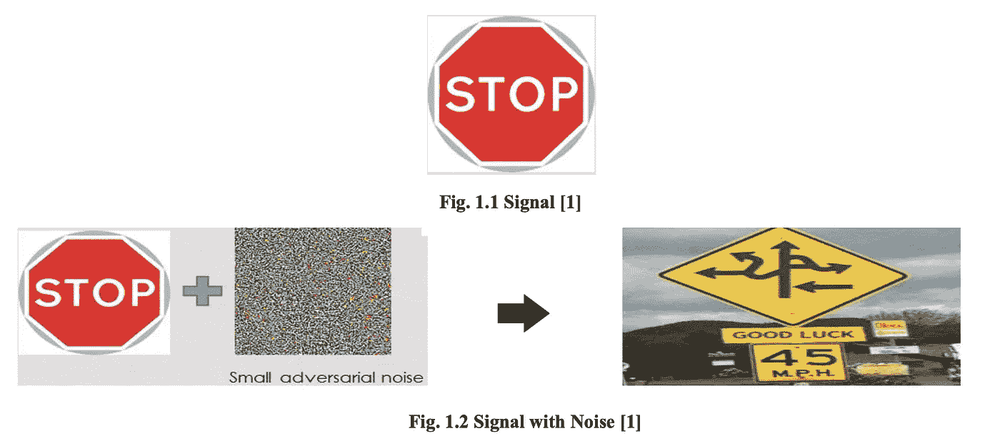

# 对抗性机器学习(第一部分)——温和介绍

> 原文：<https://medium.com/analytics-vidhya/adversarial-machine-learning-part-1-a-gentle-introduction-dc646972315a?source=collection_archive---------25----------------------->

防止最大似然算法被对手攻击的简介。

# 介绍

该系列分为 3 个部分:

1.  对抗性机器学习领域导论
2.  决策时间攻击及其防御方法
3.  中毒攻击及其防御方法

随着机器学习模型在各种应用中的使用越来越多，来自对手的风险也相应增加。因此，迫切需要设计一些安全策略来保护机器学习模型免受损害。这为对抗性机器学习科学的研究铺平了道路。已经提出了几种机制来理解这种攻击的性质并提供防范它们的措施。

***那么，什么是对抗性机器学习呢？***

对抗性机器学习是机器学习和计算机安全交叉的一个研究领域。它旨在支持在敌对环境中安全采用机器学习技术，如垃圾邮件过滤、恶意软件检测和生物识别。攻击者利用机器学习算法和模型的漏洞来造成伤害。该领域旨在理解这些攻击，并找到使机器学习模型对这些攻击具有鲁棒性的方法。

# ***用例***

随着越来越多的新技术和新资源的到来，对安全性的需求也越来越多，现在的趋势是在机器学习的热门领域引发攻击。攻击者现在正在寻找越来越新的方法来攻击机器学习模型，以便使它们变得无用或出于他们逃避攻击的个人动机。

不注意保护机器学习算法可能会在实时应用程序中产生灾难性的影响。以自动驾驶汽车为例[1]。图 1.1 是汽车看到信号时应该做的事情。图 1.2 显示了当对手在图像中加入可能是致命的噪声时会发生什么。

其他应用包括:

*   预测样本或报告中的任何异常
*   恶意软件检测
*   反垃圾邮件软件

# 对抗性攻击的分类

对抗性攻击可以通过三种不同的方式进行分类:

1.  攻击时机

这是指攻击实际发生的时间，因此它们有两种类型—决策时间攻击和中毒攻击。

决策时攻击发生在模型被训练之后

中毒攻击发生在模型被训练之前。

2.信息

这是指攻击者拥有的信息级别，分为白盒攻击和黑盒攻击。

在白盒攻击中，攻击者完全了解一切，如训练数据、使用的算法和训练的模型。

在黑盒攻击中，攻击者的知识有限。

3)目标

根据攻击者的目标，这可以分为有针对性的攻击和可靠性攻击。

在有针对性的攻击中，攻击者的目标是在特定实例上造成错误，使它们被错误分类。

相反，可靠性攻击旨在通过最大化预测误差来降低模型的质量。

希望你已经简单了解了什么是对抗性机器学习，它背后的动机，它在哪里使用，以及它是如何分类的。

请继续关注第 2 部分！

# 参考资料:

[1]Yevgeniy Vorobeychik——对抗性机器学习书，2017 年 3 月。