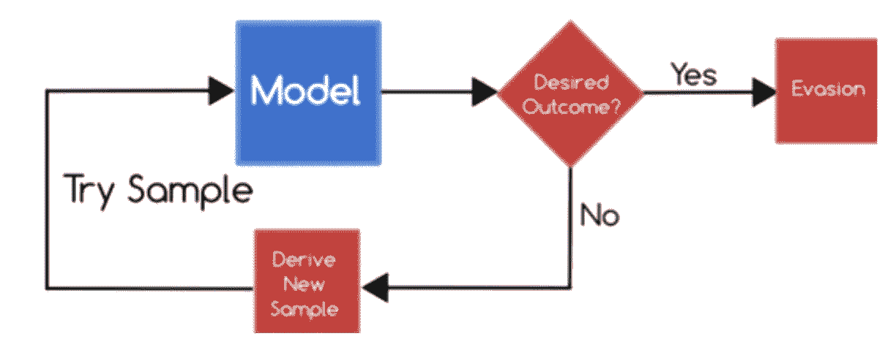
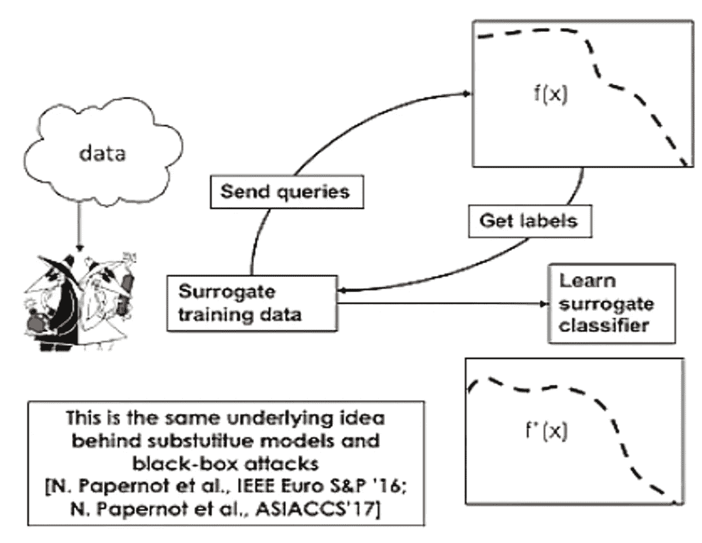
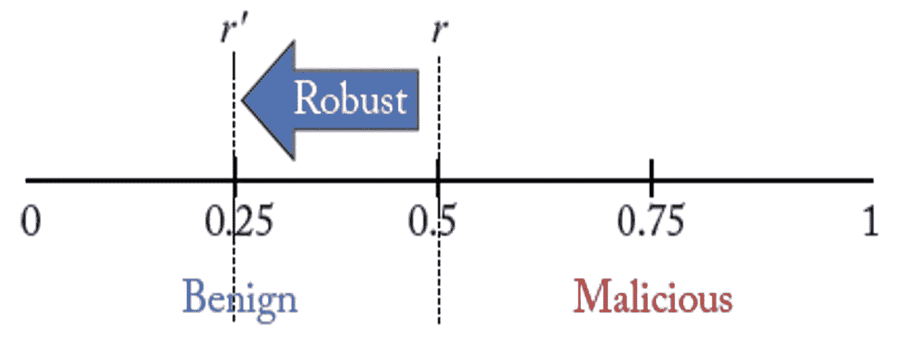

# 对抗性机器学习(下)——决策时间攻击

> 原文：<https://medium.com/analytics-vidhya/adversarial-machine-learning-part-2-decision-time-attacks-f0c70b86749d?source=collection_archive---------19----------------------->

描述常见的对抗性决策时间攻击及其应对方法

这是我关于对抗性机器学习系列的第 2 部分。对于对抗性机器学习的温和介绍，你可以参考 [Part1](https://dholakiariya.medium.com/adversarial-machine-learning-part-1-a-gentle-introduction-dc646972315a)

# 介绍

正如在以前的博客中提到的，决策时间攻击是指攻击者攻击已学习的模型或由已学习的模型做出的决策，并改变其运行方式或改变观察到的环境，从而使模型给出错误的结果。最重要的决策时间攻击是规避攻击。

# 对机器学习模型的规避攻击

学习模型用于找出恶意活动，如入侵或恶意对象，攻击者的目标是改变攻击类型，以便保持不被检测到。

例子:
a)多态混合攻击以逃避基于异常的入侵检测器:

基于异常的入侵检测系统可以检测在不同时间间隔包含不同签名的消息，因此它无法逃避长度可变的可疑消息的多态攻击[1]。因此，对手使用多态混合技术，其中可疑消息只有一个签名。消息以特征向量的形式在字节序列中以
特定频率通过网络传输。

为了通过网络传输恶意对象以逃避检测，首先创建一个攻击向量，其中可疑代码是加密格式的，而向量的另一部分包含用于多态解密的代码。假设对手知道通过网络传输的
字节数，他将攻击向量调整到这个长度，这样就不会被异常入侵检测器检测到。

b)对 PDFRate 分类器的规避攻击:

PDFRate 分类器是一个使用随机森林算法训练的模型，用于识别大约 202 个 PDF 元数据(文件大小、作者姓名和创建日期)特征和内容属性(可以使用正则表达式从测试 PDF 文件中提取)，以分类给定 PDF 文件是良性的还是恶意的[2]。PDF 文件包含标题、正文、交叉引用表和片尾。攻击者将该模型的一些最重要的特性与可疑代码一起插入到恶意的 PDF 文件中，以避免规避。攻击者能够避免规避的原因是由于攻击者引入的模型的这些重要特征导致 PDFRate 给出较少数量的误报，从而将恶意 PDF 文档预测为良性。

这些攻击可以进一步分为白盒和黑盒决策时间攻击。

***那么，攻击者是如何建模白盒攻击的呢？***

基于决策的白盒攻击可以根据所使用的机器学习模型的类型以几种方式建模，即二元分类器、多类分类器、聚类等。让我们以二进制分类器的白盒攻击为例[3]。

# **对二元分类器的白盒攻击**

对手的主要目标之一是最小化将特征向量转换成攻击特征向量的成本。假设 *xa* 是理想的攻击特征向量，这意味着 *xa* 是在没有任何修改的情况下被分类为良性的攻击向量。x 是对手试图创建以成功规避的特征向量。 *c(x，xa)* 是将 *xa* 转换为 *x* 的成本。

为了最小化成本函数，基于距离的公式被考虑如下:

*c(x，xa)=σjαj | XJ-xaj |*

在这里， *αj* 是代表改变特征 j 的难度的权重。因此，对手用相似的特征 *xj* 替换特征向量 *xaj* 的一些特征，以获得最小的成本。

# 黑盒攻击

白盒攻击假设攻击者拥有关于训练集、测试集、使用的算法、学习的参数的所有信息，但实际情况可能并非如此，这导致了所谓的黑盒攻击[4]。

在黑盒攻击中，对手不知道完整的数据集，也不知道训练的模型。因此，对手试图通过向原始模型发送查询来创建一个表示类似数据集的代理数据集。从他得到的响应中，他创建并理解了存在的类标签，并因此试图制作一个类似的模型 *f* ' *(x)* 来学习原始模型的参数和行为。现在，对手获得了多数信息，所以他能够发送他的对抗性输入来逃避攻击。这实质上变成了白盒攻击。

例如，考虑垃圾邮件攻击的情况。对手可以创建一个假的电子邮件帐户，并向服务器发送请求以获得响应，他可以分析这些响应来理解不同类型的标签。然后，他可以创建一个代理模型，以了解模型的行为，如其参数，然后最终对实际的分类器进行攻击。

# 防御决策时间攻击

以下是防止决策时攻击的主要方法。因为大多数攻击都是针对监督学习的，所以这里讨论的方法只适用于那些学习模型。

1.强化监督学习模型

2.再训练

3.正规化

# 强化监督学习模型

这种方法包括寻找阈值，该阈值对于正确分类未知输入数据项是最佳的，并且增加了对手的攻击成本[5]。学习者分析来自先前攻击的各种趋势，以及该模型将如何对各种恶意输入做出反应，然后试图找到最佳阈值，该阈值不会在给出正确输出以及增加对手的攻击成本上妥协，使得对手不会发起攻击。

例如，在下图中，假设攻击者最多可以支付 q 个单位的费用变化。如果阈值是 0.5，对手很容易改变输入特征向量并逃避攻击。但是如果将阈值改变为 0.25，如果对手的成本大于 q 个单位，那么很有可能他不会考虑进行攻击。

优点是只需改变阈值。不需要任何形式的再培训。

这种方法的局限性:

1.由于预测正确输出和增加对手攻击成本之间的权衡，很难总是找到最佳阈值。

2.可量测性

# 再训练

这种方法包括用恶意的例子再次训练初始模型，以使其更加健壮[6]。

这种方法的步骤如下:

1.  训练初始模型。
2.  根据对模型的严格分析来识别恶意示例。
3.  然后，这些恶意示例将作为输入添加到模型中。
4.  然后重新训练该模型。
5.  输出是一个健壮的学习模型

优点是它是可扩展的，限制是重新训练模型的成本。

# 正规化

在该技术中，那些在训练中被认为不是非常重要的特征也被考虑，但是通过正则化参数λ以少量被考虑，该正则化参数λ然后被添加到在训练模型中被最小化的成本函数。这在两个方面对模型有用:

1.它可以防止过度拟合。

2.增加了对手的特征数量，因此他必须对攻击向量进行许多改变，从而增加了他的攻击成本。

优点是不需要任何类型的模型再训练，而缺点是找到正则化参数的最佳值。

希望你已经掌握了基于不同决策时间的对抗性攻击的要点，处理它们的方法以及它们的优缺点。

请继续关注第 3 部分！

# **参考文献:**

[1]普拉拉德·福格拉— *规避基于特征的入侵检测系统 ids 的选择性手段)*

https://dl.acm.org/citation.cfm,2006 年

[2] Nedim Srndi 和 Pavel Laskov — *基于学习的分类器的实际规避:案例研究*

[3]一、Goodfellow — [*讲解和驾驭对抗性事例*](https://arxiv.org/abs/1412.6572)

https://arxiv.org/abs/1412.6572[2015 年](https://arxiv.org/abs/1412.6572)

[4]bat tista Biggo*——对抗性机器学习教程。*

[https://pralab . diee . unica . it/en/adversarial machine learning，2017](https://pralab.diee.unica.it/en/AdversarialMachineLearning,2017)

[5]梁彤、陈哈贾杰— *硬化分类器反规避:好的、坏的、丑的。*

[https://www . ground ai . com/project/hardening-classifiers-against-evasion-the-good-the-bad-and-the-ugly/，](https://www.groundai.com/project/hardening-classifiers-against-evasion-the-good-the-bad-and-the-ugly/,) 2017。

[6] Maleki David *—对抗性机器学习中的再训练分类器*

[https://people . eecs . Berkeley . edu/~刘畅/paper/aisec17.pdf](https://people.eecs.berkeley.edu/~liuchang/paper/aisec17.pdf) ，2017