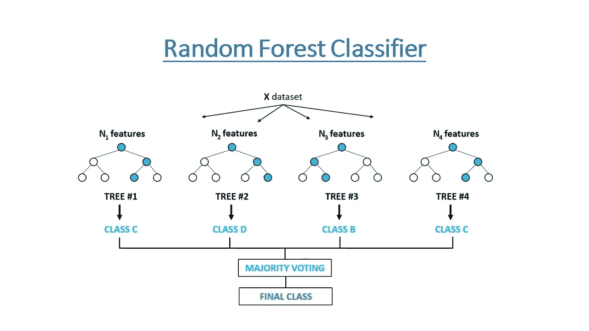
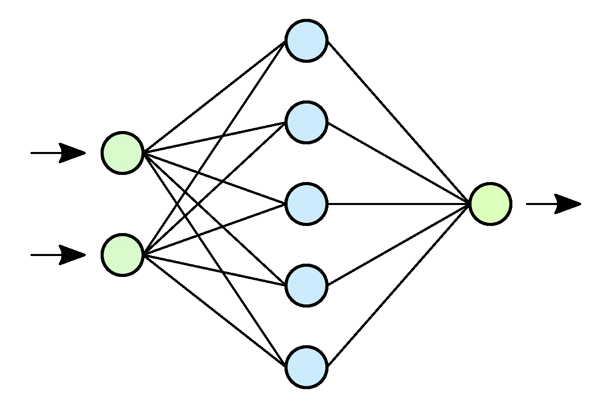

# 为简单分类任务选择模型的建议

> 原文：<https://medium.com/analytics-vidhya/advice-for-picking-model-for-simple-classification-task-fadce6a504ee?source=collection_archive---------5----------------------->

## 比较和对比逻辑回归、随机森林和神经网络以及如何在 R

分类是统计分析中最古老、最经典的问题之一。有许多现有的机器学习模型可以利用。对于这个博客，我们将提供一些关于在一个简单的多类分类任务中选择三种类型的机器学习模型的见解:线性分类、随机森林和神经网络。


凯文·Ku 在 [Unsplash](https://unsplash.com?utm_source=medium&utm_medium=referral) 上的照片

# 资料组

例如，我们将使用来自 Kaggle 的[客户细分](https://www.kaggle.com/abisheksudarshan/customer-segmentation)数据集。以下是从 Kaggle 网页上重试的“客户细分”的描述:

> 客户细分是将客户群划分为在与营销相关的特定方面(如年龄、性别、兴趣和消费习惯)相似的个人群体的做法。
> 
> 采用客户细分的公司在这样一个事实下运作，即每个客户都是不同的，如果他们针对特定的较小群体，向这些消费者提供相关的信息，并引导他们购买某些东西，他们的营销工作将会得到更好的服务。公司还希望更深入地了解客户的偏好和需求，以发现每个细分市场最有价值的东西，从而更准确地为该细分市场定制营销材料。

可以使用公共 Kaggle API 下载数据集，命令行代码如下:

```
pip install kaggle
kaggle datasets download -d abisheksudarshan/customer-segmentation
unzip customer-segmentation.zip
```

*注:“~/。kaggle/kaggle.json”是该下载操作所必需的认证令牌。可以按照* [*这条指令*](https://www.kaggle.com/docs/api) *生成。*

然后，我们可以使用以下代码读取数据，删除包含缺失数据的行，并将数据类型更改为因子:

```
data <- read_csv("train.csv")
data <- data[complete.cases(data),]
data[sapply(data, is.character)] <- lapply(data[sapply(data, is.character)], as.factor)
```

删除包含“NA”的行后，数据集还剩 5，534 个实例。共有 9 个解释变量:*、曾经结过婚*(客户是否曾经结过婚)*、年龄、毕业*(客户是否毕业)*、职业、工作经历*(年)*、花费分数*(低、中或高)*、家庭规模*(家庭人数) *var_1* (客户的匿名类别)。我们试图根据 9 个变量预测他们的*细分* (A、B、C 或 D)。以下是 *glimpse(data)* 的输出:

```
Rows: 5,534
Columns: 11
$ ID              *<dbl>* 462809, 466315, 461735, 461319, 460156, 464347, 465015, 465176, 464041, 464942, 460…
$ Gender          *<fct>* Male, Female, Male, Male, Male, Female, Female, Female, Female, Male, Female, Femal…
$ Ever_Married    *<fct>* No, Yes, Yes, Yes, No, No, Yes, Yes, No, No, Yes, No, No, No, Yes, Yes, Yes, No, Ye…
$ Age             *<dbl>* 22, 67, 67, 56, 32, 33, 61, 55, 26, 19, 58, 41, 32, 31, 58, 79, 49, 18, 33, 36, 56,…
$ Graduated       *<fct>* No, Yes, Yes, No, Yes, Yes, Yes, Yes, Yes, No, No, No, No, No, Yes, Yes, Yes, No, Y…
$ Profession      *<fct>* Healthcare, Engineer, Lawyer, Artist, Healthcare, Healthcare, Engineer, Artist, Eng…
$ Work_Experience *<dbl>* 1, 1, 0, 0, 1, 1, 0, 1, 1, 4, 0, 1, 9, 1, 1, 0, 12, 3, 13, 5, 1, 9, 1, 0, 5, 0, 1, …
$ Spending_Score  *<fct>* Low, Low, High, Average, Low, Low, Low, Average, Low, Low, Low, Low, Low, Low, Aver…
$ Family_Size     *<dbl>* 4, 1, 2, 2, 3, 3, 3, 4, 3, 4, 1, 2, 5, 6, 4, 1, 1, 4, 2, 2, 3, 8, 3, 1, 4, 3, 2, 3,…
$ Var_1           *<fct>* Cat_4, Cat_6, Cat_6, Cat_6, Cat_6, Cat_6, Cat_7, Cat_6, Cat_6, Cat_4, Cat_3, Cat_1,…
$ Segmentation    *<fct>* D, B, B, C, C, D, D, C, A, D, B, C, D, B, B, C, A, D, A, B, C, A, C, B, C, C, A, D,…
```

在拟合任何模型之前，我们将首先将数据分成分数为 0.9 和 0.1 的训练和测试子集:

```
set.seed(303)
train_ind <- sample(seq_len(nrow(data)), size = nrow(data)*0.9)
train <- data[train_ind, ]
test <- data[-train_ind, ]
```

# 逻辑回归

由于我们在这个问题中的响应变量是分类的，我们将在这里使用多项逻辑回归。多项式逻辑回归根据解释变量的值来估计给定实例属于不同类别的概率。


来源:[https://medium . com/ds 3 ucsd/multinomial-logistic-regression-in-shell-53c 94 b 30448 f](/ds3ucsd/multinomial-logistic-regression-in-a-nutshell-53c94b30448f)

我们首先加载必要的库，并用 *nnet* 库中的 *multinom* 拟合模型:*(*[*source*](https://stats.idre.ucla.edu/r/dae/multinomial-logistic-regression/)*)*

```
# install.packages(c("foreign", "nnet", "reshape2"))
library(foreign)
library(nnet)
library(reshape2)
logistic <- multinom(Segmentation ~ ., data = train)
```

以下是*汇总(逻辑)*的输出:

```
Call:
multinom(formula = Segmentation ~ Gender + Ever_Married + Age + 
    Graduated + Profession + Work_Experience + Spending_Score + 
    Family_Size + Var_1, data = train)

Coefficients:
  (Intercept) GenderMale Ever_MarriedYes         Age GraduatedYes ProfessionDoctor ProfessionEngineer
B  -0.4221270 -0.1988533       0.1391316  0.01708554    0.2583479       -0.4604366         -0.6672424
C  -0.6969034 -0.3095092      -0.1037293  0.02631203    0.7297757       -0.6300941         -1.8221096
D  -0.5720053  0.3096303      -0.3161027 -0.02382555   -0.5087015        1.1676784          0.8334373
  ProfessionEntertainment ProfessionExecutive ProfessionHealthcare ProfessionHomemaker ProfessionLawyer
B              -0.8121714          -0.2638353           0.08730237          -0.1527637        -1.139400
C              -1.5926832          -0.5908095           0.39070485          -1.2175544        -1.599622
D               0.6859054           1.5881880           2.89578113           1.6162463         1.835006
  ProfessionMarketing Work_Experience Spending_ScoreHigh Spending_ScoreLow Family_Size Var_1Cat_2 Var_1Cat_3
B          -0.7095880     -0.03532825         -0.4111455        -0.9156952  0.14580953  0.4088346  0.1768805
C          -0.6461845     -0.04013034         -0.7505069        -1.8174721  0.33535530  0.1425072 -0.1727507
D           2.1397329      0.03880093         -0.1673184         0.4548072  0.08658522 -0.4029584 -0.4651911
  Var_1Cat_4  Var_1Cat_5 Var_1Cat_6 Var_1Cat_7
B -0.1247568  0.08728294  0.2141020 -0.1617883
C -1.0174653 -0.26241151  0.2840689 -0.4145876
D -0.2923172 -0.92159680 -0.2840632 -0.4794811

Std. Errors:
  (Intercept) GenderMale Ever_MarriedYes         Age GraduatedYes ProfessionDoctor ProfessionEngineer
B   0.4513680 0.09339209       0.1246480 0.003990277   0.09878927        0.1606340          0.1536374
C   0.4775832 0.09820846       0.1439393 0.004257025   0.11203885        0.1675221          0.1997269
D   0.4782653 0.10212671       0.1351695 0.004884103   0.10094036        0.1850112          0.1948838
  ProfessionEntertainment ProfessionExecutive ProfessionHealthcare ProfessionHomemaker ProfessionLawyer
B               0.1333589           0.2003719            0.2004370           0.2649502         0.198043
C               0.1545122           0.2057309            0.1966512           0.3439174         0.209678
D               0.1731890           0.2473922            0.1938104           0.2701236         0.257483
  ProfessionMarketing Work_Experience Spending_ScoreHigh Spending_ScoreLow Family_Size Var_1Cat_2 Var_1Cat_3
B           0.2997303      0.01307695          0.1632608         0.1292463  0.03423526  0.4175040  0.3948757
C           0.3105096      0.01398284          0.1659144         0.1408120  0.03597520  0.4374611  0.4177020
D           0.2453768      0.01315404          0.2283467         0.1802314  0.03420730  0.4068696  0.3837485
  Var_1Cat_4 Var_1Cat_5 Var_1Cat_6 Var_1Cat_7
B  0.3899082  0.5444062  0.3749715  0.4591273
C  0.4189915  0.5908614  0.3907861  0.4850656
D  0.3736922  0.5654122  0.3597524  0.4494961

Residual Deviance: 10842.03 
AIC: 10980.03
```

这些系数也可以被可视化:

```
# install.packages(c("broom", "dplyr", "ggstance"))
logisticCoef <- broom::tidy(logistic,conf.int=TRUE)
logisticCoef <- dplyr::filter(logisticCoef, term!="(Intercept)")library(ggplot2)
library(ggstance)
ggplot(logisticCoef, aes(x=estimate,y=term,colour=y.level))+
  geom_pointrangeh(aes(xmin=conf.low,
                     xmax=conf.high),
    position=position_dodgev(height=0.75))
```


这些系数可以解释为对数优势的增长率，即相应概率与基线概率(在这种情况下为 A)的对数比。为了更清楚，我们可以通过执行 *exp(coef(summary(logistic)))对系数取幂，得到*:

```
(Intercept) GenderMale Ever_MarriedYes      Age GraduatedYes ProfessionDoctor ProfessionEngineer
B   0.6556507  0.8196701       1.1492753 1.017232    1.2947892        0.6310081          0.5131216
C   0.4981254  0.7338070       0.9014693 1.026661    2.0746153        0.5325417          0.1616843
D   0.5643926  1.3629211       0.7289846 0.976456    0.6012758        3.2145211          2.3012150
  ProfessionEntertainment ProfessionExecutive ProfessionHealthcare ProfessionHomemaker ProfessionLawyer
B               0.4438931           0.7681000             1.091227           0.8583325        0.3200111
C               0.2033792           0.5538787             1.478022           0.2959531        0.2019728
D               1.9855688           4.8948716            18.097633           5.0341582        6.2651691
  ProfessionMarketing Work_Experience Spending_ScoreHigh Spending_ScoreLow Family_Size Var_1Cat_2 Var_1Cat_3
B           0.4918468       0.9652885          0.6628904         0.4002383    1.156976  1.5050627  1.1934885
C           0.5240414       0.9606642          0.4721271         0.1624359    1.398437  1.1531614  0.8413473
D           8.4971679       1.0395635          0.8459302         1.5758695    1.090444  0.6683399  0.6280151
  Var_1Cat_4 Var_1Cat_5 Var_1Cat_6 Var_1Cat_7
B  0.8827116  1.0912054  1.2387490  0.8506213
C  0.3615101  0.7691944  1.3285245  0.6606126
D  0.7465317  0.3978832  0.7527191  0.6191046
```

例如，0.8197 位于第一行的第二列。这意味着，在所有其他变量的条件下，如果该个体是男性，女性个体被分类为 B 段对 A 段的概率 odd 将改变 0.8197 倍。因此，我们可以说，由于 0.8197 小于 1，与分段 A 相比，男性而不是女性使得个体更不可能被分类为分段 B。

然后，我们可以对测试数据集运行预测:

```
logisticPred <- predict(logistic, type="probs", newdata=test)
```

并且 *logisticPred* 的值将如下所示:

```
A          B           C           D
1   0.13271824 0.35385636 0.495882878 0.017542517
2   0.11437084 0.13800631 0.236004931 0.511617926
3   0.05315289 0.02370280 0.009055350 0.914088962
4   0.04043156 0.03323670 0.029556623 0.896775118
5   0.22012487 0.35575141 0.395457037 0.028666685
6   0.06785814 0.04958093 0.029743505 0.852817429
7   0.07138501 0.22619329 0.427858435 0.274563265
...
```

在预测中，第一个实例有 0.1327 的概率是 A，0.3539 的概率是 B，0.4959 的概率是 C，0.0175 的概率是 d。

最后，让我们来检查混淆矩阵和预测的准确性:

```
segmentationsLabel <- c("A", "B", "C", "D")
logisticPred <- as.factor(segmentationsLabel[max.col(logisticPred)])
# install.packages(c("caret"))
library(caret)
confusionMatrix(logisticPred, test$Segmentation)
```

我们将得到输出:

```
Confusion Matrix and Statistics

          Reference
Prediction  A  B  C  D
         A 63 44 23 45
         B 17 25 15 16
         C 18 48 79  5
         D 23 17 21 95

Overall Statistics

               Accuracy : 0.4729          
                 95% CI : (0.4307, 0.5155)
    No Information Rate : 0.2906          
    P-Value [Acc > NIR] : < 2.2e-16       

                  Kappa : 0.2971          

 Mcnemar's Test P-Value : 2.013e-08       

Statistics by Class:

                     Class: A Class: B Class: C Class: D
Sensitivity            0.5207  0.18657   0.5725   0.5901
Specificity            0.7413  0.88571   0.8293   0.8448
Pos Pred Value         0.3600  0.34247   0.5267   0.6090
Neg Pred Value         0.8470  0.77339   0.8540   0.8342
Prevalence             0.2184  0.24188   0.2491   0.2906
Detection Rate         0.1137  0.04513   0.1426   0.1715
Detection Prevalence   0.3159  0.13177   0.2708   0.2816
Balanced Accuracy      0.6310  0.53614   0.7009   0.7174
```

多项式逻辑回归的最终检验精度为 0.4729。

# 随机森林

随机森林是一种由决策树组成的分类模型。简单决策树的一个例子是，给定一些猫或人的图片，我们试图通过一个策略来决定给定图片中的内容:*所有包含尾巴的图片都是猫的图片，否则都是人的图片。*这可能不是一个完美的模型(因为不是所有的猫图片都有尾巴)，所以我们可能想要添加更多的策略:是否有尖耳朵，是否有皮毛……这些策略中的每一个都是决策树，我们可以通过将它们放在一起得到一个随机森林:*所有包含尾巴、尖耳朵或皮毛的图片都是猫的图片，否则都是人的图片。最终的决定是由多数票做出的。*



来源:https://www.youtube.com/watch?v=goPiwckWE9M

为了适应一个随机森林，我们将使用包 *party* :

```
# install.packages(c("party", "partykit"))
library(party)
library(partykit) 
rf <- ctree(Segmentation ~. , data=train)
```

通过运行下面的代码，我们将得到下面的图:

```
plot(rf, gp = gpar(fontsize = 3))
```


在图中，如果我们放大，我们可以清楚地看到随机森林的结构——每个决策是如何做出的，决策树是如何组成的。在这种情况下，决策树太多，图形变得太密集，所以我们也可以运行 *print(rf)* 来获得文本结构:

```
Model formula:
Segmentation ~ ID + Gender + Ever_Married + Age + Graduated + 
    Profession + Work_Experience + Spending_Score + Family_Size + 
    Var_1

Fitted party:
[1] root
|   [2] Profession in Artist, Doctor, Engineer, Entertainment, Executive, Homemaker, Lawyer
|   |   [3] Spending_Score in Average, High
|   |   |   [4] Graduated in No
|   |   |   |   [5] Var_1 in Cat_1, Cat_5, Cat_6, Cat_7
|   |   |   |   |   [6] Profession in Artist, Entertainment
|   |   |   |   |   |   [7] Age <= 32: A (n = 9, err = 55.6%)
|   |   |   |   |   |   [8] Age > 32: C (n = 91, err = 56.0%)
|   |   |   |   |   [9] Profession in Doctor, Engineer, Executive, Homemaker, Lawyer: B (n = 223, err = 61.9%)
|   |   |   |   [10] Var_1 in Cat_2, Cat_3, Cat_4: A (n = 171, err = 63.7%)...Number of inner nodes:    34
Number of terminal nodes: 35
```

然后，让我们用这个模型在测试集上运行预测:

```
predictRf <- predict(rf, test)
```

并计算混淆矩阵和测试准确度:

```
confusionMatrix(predictRf, test$Segmentation)
```

它会产生以下输出:

```
Confusion Matrix and Statistics

          Reference
Prediction   A   B   C   D
         A  64  39  18  43
         B  16  20  12  11
         C  17  54  86   5
         D  24  21  22 102

Overall Statistics

               Accuracy : 0.491           
                 95% CI : (0.4486, 0.5335)
    No Information Rate : 0.2906          
    P-Value [Acc > NIR] : < 2.2e-16       

                  Kappa : 0.3196          

 Mcnemar's Test P-Value : 3.522e-10       

Statistics by Class:

                     Class: A Class: B Class: C Class: D
Sensitivity            0.5289   0.1493   0.6232   0.6335
Specificity            0.7691   0.9071   0.8173   0.8295
Pos Pred Value         0.3902   0.3390   0.5309   0.6036
Neg Pred Value         0.8538   0.7697   0.8673   0.8468
Prevalence             0.2184   0.2419   0.2491   0.2906
Detection Rate         0.1155   0.0361   0.1552   0.1841
Detection Prevalence   0.2960   0.1065   0.2924   0.3051
Balanced Accuracy      0.6490   0.5282   0.7202   0.7315
```

随机森林的最终测试精度为 0.4910。

# 神经网络

多层前馈神经网络是通用逼近器，这意味着它们可以很好地逼近任何函数。它们由基于输入和权重计算的互连节点层组成。权重在训练期间被调整，因此网络可以从输入数据中学习重要的模式。在本演示中，我们将使用一个两层前馈神经网络。



来源:[*https://commons.wikimedia.org/wiki/File:Neural_network.svg*](https://commons.wikimedia.org/wiki/File:Neural_network.svg)

我们将使用 PyTorch 来适应网络。您可能希望确保您的计算机上已经安装了 Python3。

由于已经有很多关于如何编写神经网络的文章，我就不详细介绍这些步骤了。以下是用于产生结果的脚本:

[](https://github.com/jinyu-hou/medium-blog-scripts/blob/main/2021-Apr-advice/neuralnet.py) [## 金玉-侯/中-博客-剧本

### 在 GitHub 上创建一个帐户，为 jinyu-hou/medium-blog-scripts 的开发做出贡献。

github.com](https://github.com/jinyu-hou/medium-blog-scripts/blob/main/2021-Apr-advice/neuralnet.py) 

通过使用上面的脚本来训练 200 个 epoch，我们得到了下面的训练曲线，该曲线是训练/验证准确度与 epoch 数量的关系图。


最终测试精度为 0.5045。

你可能已经知道，神经网络的参数是不可解释的。这意味着我们正在训练一个黑盒，没有人能说出模型是如何产生输出的。

# 讨论

关于模型的选择，我想从最终的**检验精度**、**拟合容易度**和**可解释性**三个方面对三个模型——逻辑回归、随机森林和前馈神经网络进行比较和对比。

三种模型产生的最终检验精度相似，其中神经网络产生的精度最高，逻辑回归产生的精度最低。然而，关于测试准确性的模型性能可能高度依赖于它被训练的数据。神经网络的结果还取决于参数初始化和超参数选择的随机性(学习速率、神经网络结构、缓存数、正则化等)。最好的办法是尝试拟合和调整所有候选模型，并选择一个产生最高测试精度的模型。这可能不是在所有情况下都可行。因此，我们也可以根据数据集的属性选择模型:它是多项式的吗？能否根据一组决策树策略轻松地对数据进行分类？模型有固定的形状吗？等等。

当您训练计算能力有限的模型时，您可能希望在选择模型时考虑拟合的容易程度。当数据集很大时，这一点尤其重要。如果您无法访问 GPU 资源，拟合的难易程度将是逻辑回归>随机森林>神经网络。如果没有 GPU 资源，使用神经网络进行深度学习可能会非常昂贵。

最后，可解释性也是您可能要考虑的一个重要因素，尤其是当您想要使用模型从数据集学习人类可读的模式时(例如，响应和解释变量之间的相关性)。正如我们上面提到的，神经网络很难解释。逻辑回归系数和随机森林政策都有不同的解释方式。您可能希望根据它们可能被解释的方式来选择模型。

您可以在下面的资源库中找到所有演示脚本:

 [## 金玉-侯/中-博客-剧本

### 在 GitHub 上创建一个帐户，为 jinyu-hou/medium-blog-scripts 的开发做出贡献。

github.com](https://github.com/jinyu-hou/medium-blog-scripts/tree/main/2021-Apr-advice)