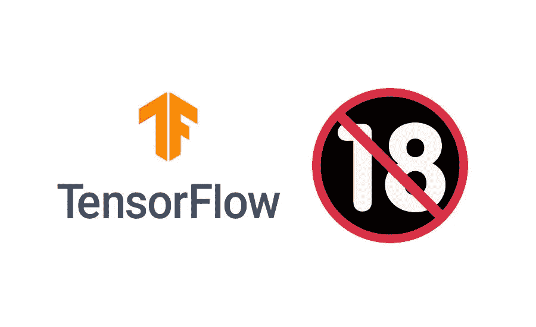
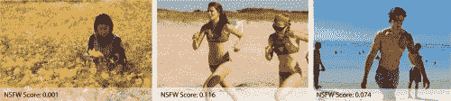
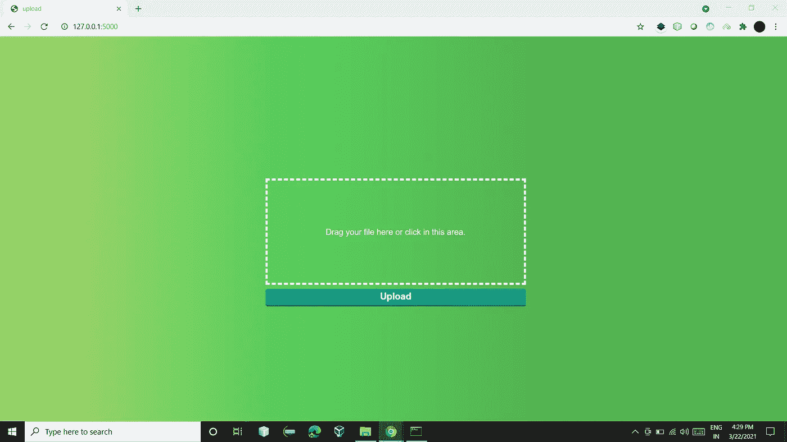
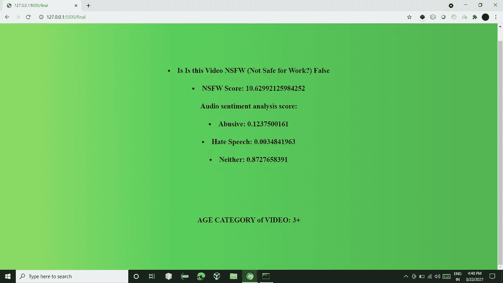

# 基于年龄组的视频分类

> 原文：<https://medium.com/analytics-vidhya/age-group-wise-video-classification-7248f8c6d114?source=collection_archive---------10----------------------->

通过编辑视频的 NSFW 内容和对视频中存在的转录音频执行的文本分析，基于给定视频所属的特定年龄组对其进行分类的应用。

*制作人:* [*维奈·库马尔·普拉沙尔*](https://medium.com/u/1eee29760d92?source=post_page-----7248f8c6d114--------------------------------) *和安摩尔·恰布拉*



# 介绍

在 21 世纪，每个人都可以访问互联网。互联网上有如此多的内容，其中一些可能不适合儿童，但他们可以访问，因为这些内容没有特定的年龄组。在我们的项目中，我们将处理互联网上的视频。因此，免费获取此类视频内容可能会对儿童产生不利影响。
我们已经开发了一种应用，通过编辑视频的 NSFW 内容和对视频中存在的转录音频执行的文本分析，将给定视频分类到其所属的特定年龄组中。

**你如何定义视频？**

> *我们可以说视频是按特定顺序排列的图像的集合或集合。这些图像集也被称为帧。*

这就是为什么视频分类问题与图像分类问题没有什么不同。对于图像分类任务，我们获取图像并使用特征提取器(如卷积神经网络或 CNN)从图像中提取特征，然后基于这些提取的特征对图像进行分类。*视频分类只涉及一个额外的步骤。*

在视频分类的情况下，我们首先从给定的视频中提取帧。接下来，可以遵循与图像分类任务相同的步骤。这是处理视频数据最简单的方法。

# **视频分类**

我们项目的主要目标是为后代提供一个安全/健康的环境，不让他们观看那些可能伤害他们智力、影响他们个人健康甚至生活的东西。因为我们的项目为后代提供了不同的过滤器，让他们看到哪些可以帮助他们建立自己的精神和身体人格，这样他们就不会沉迷于那些可能对他们有害的工作。通过这个项目，我们可以帮助阻止那些可能影响新一代年轻人的视频被发布，并阻止他们发布这种有年龄限制的视频。

该项目包括两部分，即
1。视频帧的**渲染**使用在 TensorFlow 中重写的雅虎 NSFW 模型找到 NSFW 内容**。雅虎的 NSFW 模型自动识别一张图片是否适合/不适合/安全工作(NSFW)，由攻击性和成人图片组成。
2。为分析而设置的视频**的**转录音频的**辱骂文本分析**。**

最终的**年龄组分类**是基于两个分析的**编译结果完成的。使用一组特定的条件汇编结果，以便能够很好地定义特定的年龄组。**

# 雅虎的 NSFW 模式

雅虎的 NSFW 模型自动识别一张图片是否适合/不适合/安全工作(NSFW)，由攻击性和成人图片组成。定义 NSFW 材料是主观的，识别这些图像的任务是不平凡的。雅虎的 NSFW 模型在 NSFW 图像和 SFW 图像上进行训练，以向开发者提供准确的结果。雅虎的 NSFW 模式可以在雅虎自己提供的 GitHub 上找到。然而，雅虎已经实现了它的模型，因此它只是只读的。该模型中不会修改任何新的更新。
采用通用的 Caffe 深度神经网络模型。该[模型](https://github.com/yahoo/open_nsfw#:~:text=The%20identification%20of%20NSFW%20sketches,not%20addressed%20with%20this%20model.&text=In%20this%20repository%20we%20opensource,preliminary%20filtering%20of%20NSFW%20images.)将图像作为输入，并作为输出提供一个概率(0-1 之间的分数),该概率可进一步用于检测和过滤 NSFW 图像。



模型输出

网络接收图像并提供输出，即概率(得分在 0-1 之间),可用于过滤不适合工作的图像。分数< 0.2 indicate that the image is likely to be safe with high probability. Scores > 0.8 表示该图像极有可能是 NSFW。对于不同的 NSFW 水平，中间范围的分数可以被分箱。

# 检测视频中的 NSFW 内容

检测视频中 NSFW 内容的步骤如下:

> ***将雅虎的 NSFW 模式改写为 TensorFlow:***

TensorFlow 可以很好地处理图像和序列，并被评为使用最多的深度学习库，而 Caffe 可以很好地处理图像，但不能很好地处理序列和递归神经网络。通过使用 python-pip 包管理，TensorFlow 更容易部署，而 Caffe 部署并不简单，我们需要编译源代码。
TensorFlow 是一个高级 API，负责开发人员不再需要担心的事情。
[Caffe to Tensorflow](https://github.com/ethereon/caffe-tensorflow) 模型用于将模型转换成 Tensorflow 权重。

> ***从视频中获取帧:***

****帧*** *是众多静止图像中的一个，它创建了完整的运动画面**

*****帧率*** *是每秒钟捕捉的单个视频帧的数量***

**帧提取是从视频中提取帧/图像片段。每一帧都是在特定时间从视频中提取的图像。
我们选择的从视频中提取帧的帧速率是 5，即每秒将捕获 5 帧。
OpenCV 库用于从视频中提取帧。每当提取帧时，帧的总数将增加 1。**

```
**video = cv2.VideoCapture(videoFile)
frameRate = video.get(5) #frame rate**
```

> *****运行模式上每一帧*****

**然后在每一帧上运行该模型。该帧作为参数传递，以检查模型的预测结果。该模型以介于 0 和 1 之间的值的形式返回结果。
0 表示夹子完全可以安全工作。而 1 将是夹子工作不安全的最高置信度。
我们将检查预测值，如果预测值为> 0.50，则不安全工作(NSFW)帧的计数将增加 1，并且该帧将被分类为 NSFW。否则，该框架将被归类为工作安全。**

```
**predictions = sess.run(model.predictions,
                        feed_dict={model.input: image})                if(predictions[0][1]>=0.50):
      frameNsfw= frameNsfw+1**
```

> *****编制 NSFW 百分比*****

**通过使用两个变量，即从视频中提取的总帧数和分类为 NSFW 的总帧数，来编制 NSFW 百分比分数。**

**为了编译 NSFW 百分比，所使用的公式是:
(被分类为 NSFW 的帧/总帧数)* 100
，这将告诉我们 n%的帧被分类为 NSFW。**

```
**nsfw_score = int((frameNsfw/frameTotal)*100)**
```

****关于*的编译 nsfw_score:*** 1。If (nsfw_score > 80)那么视频很有可能包含 nsfw。
2。If (nsfw_score < 20)那么视频包含 nsfw 的概率非常小。
3。如果(nsfw_score < 80 和 nsfw_score > 20 ),那么它可以针对不同的 nsfw 级别进行分类。**

**将设置另一个全局变量，该变量将描述该图像是否是 NSFW，只是根据一个布尔值。**

```
**if(nsfw_score>0):
    nsfw=True
else:
    nsfw=False**
```

# ****检测辱骂和仇恨言论****

> *****从视频中提取音频*****

**python 的 MoviePy 模块用于提取音频。提取的音频存储在*中。wav* 格式。我们还可以将提取的音频存储为各种音频格式，如 mp3。**

**我们特意选择了*。wav* 格式因为它易于对 wav 格式的文件执行操作，而且我们得到的音频质量比其他格式要好。提取的音频将存储在存储视频的同一位置。**

```
**import moviepy.editor as mp
my_clip = mp.VideoFileClip(videoFile)
my_clip.audio.write_audiofile(r"result.wav")**
```

> *****将音频分割成相等的较小音频文件*****

**由于提取的音频格式是 wav 格式，文件大小会相当大。并且转录音频或将音频转换成文本的库不能处理如此大的文件。**

**因此，将主要提取的音频文件分割成相等持续时间的音频文件，以便它可以被库访问并且不会抛出任何错误。音频文件的分割将是每个 50 秒，因为 50 秒的平均大小。wav 格式是 8.5 MB，可以很容易地被库访问，不会产生任何异常。分割文件将存储在相同的位置，名称以 0、1、2…迭代开始。**

**Pydub 是用于分割音频的库。Pydub 只对*有效。wav* 格式文件。**

> *****转录音频*****

***“转录是将音频文件中的语音转换成书面文本的过程。这可能是任何以音频为特色的录音——学术研究、一首歌曲的视频剪辑，或者公司市政厅的录音。***

**语音识别库用于执行语音识别，支持多种引擎和 API，在线和离线。
各种语音识别引擎/API 支持:
1。CMU 狮身人面像(离线作品)
2。谷歌语音识别
3。谷歌云语音 API
4。Wit.ai
5。微软必应语音识别
6。Houndify API
7。IBM 语音转文本**

**我们将转录每个音频剪辑，并将最终结果存储在一个地方。因此，最终结果将包含从所有音频剪辑转录的音频，我们将从视频的整个音频文本。**

> *****文字分析上*文字****

**文本分析将由平行点库完成。要使用平行线点，我们必须从平行线点官网生成 *api_key* 。平行点 *api_key* 是在我们使用任何平行点的函数 api 之前插入并测试的。
*api _ key*在函数中传递，函数 API 的点击数也被记录下来，并可以在他们的网站上跟踪。**

**函数平行点滥用将用于分析。平行线点滥用内容说明符指定内容是否是滥用的。
我们使用的滥用函数给出了 JSON 格式的响应，其中包含关于三个要素(即滥用、仇恨言论和两者都不是)的置信度得分(0 到 1)。**

```
**import paralleldots
api_key = "<parallel_dots_api_key>"
paralleldots.set_api_key( api_key )
audio_score= paralleldots.abuse(whole_text)**
```

**辱骂性文本分析的输出**

# **分类年龄**

**结果的形成是我们所做的最宝贵和最具挑战性的一步。结果的形成完全取决于两个因素，即视频分析的百分比分数和文本分析的分数。
根据这些东西制作一个矩阵或等式来对进行分类是相当具有挑战性的。
我们创建了一种简单的视频分类方法。**

**这是我们使用的分类技术的基本思想。详细情况将在报告的后面分享。**

**通过去除该条件并使预训练的模型对年龄组进行分类，年龄的分类会变得更好。**

# **使用 Flask 创建 GUI**

**为了方便用户，我们使用 Python 的 Flask 框架创建了一个 GUI。python 的 web 微框架中的 Flask。**

**GUI 将由两个模板 HTML 页面组成，即，一个将用于上传视频，一旦视频上传，模型已生成其结果，第二个页面将被查看，其中将包括视频的结果。**

> *****输入*****

**输入由一个视频组成，该视频将在启动名为 Controller.py 的 Flask 文件后上传到浏览器页面，即 upload.html**

```
**>> python Controller.py**
```

****

**上传视频的 Upload.html 页面**

> ****输出****

**输出包括以下内容:
1。视频是 NSFW 的吗？
2。NSFW 得分
3。音频转录分析:{辱骂，仇恨言论，都不是}
4。建议的年龄类别**

****

**最终输出**

# **结论**

**在技术不断发展的时代，互联网上有如此多的可用内容。任何人都可以很容易地访问这些在线内容。并非所有这些内容都适合所有年龄组**

**在我们的项目中，我们已经处理了在线视频。在这里，我们根据视频中的 NSFW 内容和对视频中出现的转录音频的文本分析，将视频分为不同的年龄组。这些结果是根据几组条件计算出来的，以便很好地确定年龄组的区别。**

**项目使用 Python 和 TensorFlow。我们使用了视频中出现的各种帧来描述视频中出现的 NSFW 内容——基于在 TensorFlow 中重新编写的雅虎 NSFW 模型。雅虎的 NSFW 模型已经被用来确定一个图片或框架是否适合特定的年龄组。接下来，我们还使用了基于从给定视频中提取的转录音频的辱骂或仇恨文本分析或检测。在分析了帧和转录的音频之后，为该特定视频定义了结果或期望的年龄组。**

**该项目对视频提供不同的过滤器，根据安全的限制年龄组进行分类。这反过来将有助于创建一个健康和安全的在线平台，并防止人们访问或沉迷于可能对他们有害的内容。**

**完整的项目代码可以在下面的 Github 资源库中找到:[视频分类](https://github.com/vkumarprashar/VideoCategorization)**

**谢谢你**

**开放供审查**