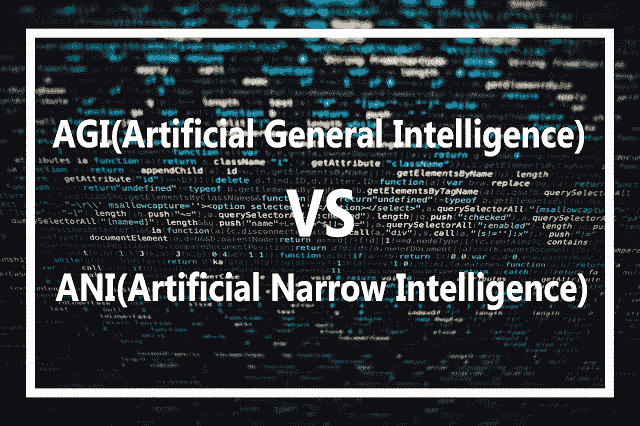

# AGI Vs 阿尼(人工通用智能 Vs 人工狭义智能)

> 原文：<https://medium.com/analytics-vidhya/agi-vs-ani-artificial-general-intelligence-vs-artificial-narrow-intelligence-e86eb1d63039?source=collection_archive---------6----------------------->

人工智能有两种类型。

1.  AGI(人工通用智能)
2.  人工狭义智能

在这里，我们可以讨论这些人工智能类型的细节。

# ANI(人工狭义智能):

模型执行特别是一个单一的任务被归类为 ANI。在过去的几年里，我们可以看到**在人工狭义智能方面取得了很多进步。**

例如

*   **智能音箱**

在这里，你会认为智能扬声器正在做不止一个任务，例如，他们正在听我们的声音，然后开始播放音乐。这两项任务不能由一个模式来完成。实际上，当你说话时，一个模型会听到你的声音，然后向另一个能播放音乐的模型发送输入。然后他们有两种模式来播放你的音乐。

*   **自动驾驶汽车**

另一个问题是，自动驾驶汽车也可以完成多项任务，那么它们是如何做到的呢？这个答案很简单，一个模型不能完成所有的任务。每个任务都有不同模型来完成任务。如果汽车想知道其他交通工具的位置，则雷达返回该位置，然后如果刹车需要另一个模型对汽车的刹车系统进行操作。

*   **AI 做网页搜索**

人工狭义智能(ANI)也用于网络搜索。当你在网上搜索你的任务时，他们使用人工智能来完成这个任务。

*   **人工智能在农业或工厂中的应用**

现在，人工智能被用于几乎所有类型的农业目的，也用于几乎所有类型的工厂，使工作更容易和更早完成。

*   **农业中的人工智能**

我们在农业中使用的许多机器人基本上是使用人工智能技术和基于人工智能的应用程序来工作的，这些应用程序可以检查作物的状况，也可以检查影响作物的作物疾病。并告诉人工智能如何保护你的作物免受这些作物疾病。

# AGI(人工通用智能):

一个模特可以做任何类型的工作，就像一个模特可以听、说、说话和走路一样。在 AGI 几乎没有进展，但将来我们可以看到 AGI 的进展。但是现在说所有类型的任务都由一个模型来完成是不可能的。我们可以看到 AGI 在多年或数百年后实现这些技术的进展。

这是建造人工智能的目标。

AGI 可以做任何人类能做的事情，甚至可能是超级聪明的，做的事情比任何人都多。

**例如:**你可以看一部名为《机器人 2.0》的宝莱坞电影，在这部电影中，机器人可以做人类能做的任何事情，甚至比人类做得更多，而且这个机器人更聪明。

*   实现 AGI 需要时间
*   对研究人员来说，AGI 是一个令人兴奋的目标，但在我们到达那里之前，它需要技术上的突破。
*   可能是几十年或者几十万年以后。
*   ANI 的快速进步让人们觉得 AI 也有很大进步，这是真的。但是人们担心人工智能会控制地球。