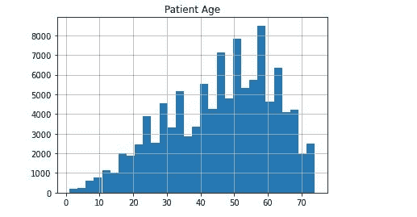
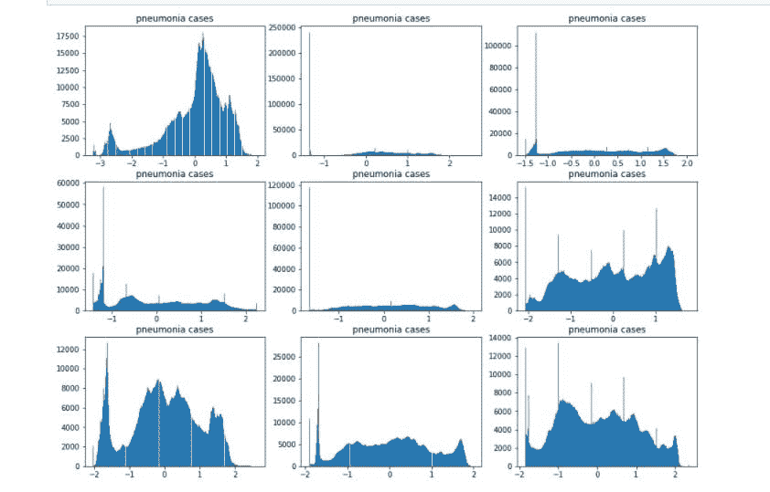

# 艾与 2D 医学影像

> 原文：<https://medium.com/analytics-vidhya/ai-and-2d-medical-imaging-4adf502f5773?source=collection_archive---------20----------------------->

根据 FDA 的规定，医学成像是指几种不同的技术，用于观察人体，以诊断、监测或治疗医学状况。成像可以有不同的格式，包括:CT 扫描、核磁共振成像、x 光等。这种技术自 20 世纪 60 年代以来就已经存在，并且经过多年的发展已经成为更好的使用方式。

人工智能已经被注入到这个医疗保健领域，并提高了医疗的准确性和精确度。在处理医学成像的部门中，它还具有成本效益、速度更快、效率更高、烧坏更少的特点。

在 2D 医学成像中应用人工智能直接来自算法的使用。这些算法被编程为执行特定于预期任务的各种功能。这些任务中的一些可以从胸部 x 射线中的肺癌检测到 CT 扫描中的异常检测。

尽管人工智能在医疗保健领域很美，但所有的实践都要经过 FDA 的批准。根据该监管机构的规定，医疗器械分为三类。

第一类:低风险设备，包括医院病床。

**第二类:**中等风险设备，包括血压袖带。

**第三类:**包括起搏器在内的最高风险设备。

# 背景:

该项目涉及对由胸部 x 射线组成的 2D 成像数据应用迁移学习来检测肺炎。该项目还包括向 FDA 提交一份提案，寻求批准该项目中使用的算法。我的算法可以被归类为 I 类医疗设备，因为它不需要人类测试，而是使用 FDA 设定的阈值数据进行测试。

# 利益相关方:

放射科医生、临床利益相关者、患者、行业利益相关者(如软件公司)、医院和监管机构(如 FDA)。

# 任务:

建立一个卷积神经网络(CNN)模型来检测肺炎的存在与否。

# 数据:

本项目中使用的数据来自 [Kaggle](https://www.kaggle.com/nih-chest-xrays/data) 。

# 探索性分析:

我分析了得到的数据，可以在 EDA.ipynb 文件中查看。我加载了用于像素级评估的数据集和样本数据集。我把这个算法的目标病人的年龄限制在 75 岁以下。

然后我想象了一些带有标签的图片

检查肺炎病例数与总病例数的关系，发现 1.280495652014046%。想象这些肺炎病例。

患者的平均年龄为 43 岁，其中男性患者数量较多。

我还将肺炎病例的数量与非肺炎病例的数量进行了对比

# 构建和训练模型:

这个阶段是在 build_and_train_model.ipynb 中完成的，由于这个模型是用迁移学习构建的，所以我对它使用了 VGG16 算法。

我查了一下单诊数，发现 15 个。

然后我创建了一个新的类，它是二元类，用于检测肺炎的存在与否。

我使用 scikit-learn 的 train_test_split 函数分割我的数据集，测试规模为 20%。我创建了一个训练和验证比率，使训练数据具有相同数量的阳性和阴性案例，并使验证集包含 80%的阳性和 20%的阴性案例。

我使用 224 x 224 的图像大小构建了我的模型，并使用图像数据生成器功能扩充了数据集。

然后我看了一些增强图像。

我加载了使用 VGG16 算法完成的预训练模型，

接下来，我使用 Adam optimizer 在这个模型的基础上构建了我的模型，学习率为 le-4，二进制交叉熵损失和二进制准确性度量。我添加了一个回调函数，包括保存最佳模型和只保存模型权重，并用 20 个历元进行训练。

它没有达到 20 个时代，因为验证损失没有改善。然后，我加载权重，并在数据集上绘制模型的准确性和损失。

最后，我检查并绘制了 F1 分数，并将模型保存为 json 文件。

# 推论:

这个文件可以在 inference.ipynb 中找到。我编写了读取该文件的函数，检查了重要字段并返回了一个 numpy 数组。这个 numpy 数组通过模型输入的适当预处理需求运行。编写了另一组函数来加载模型，并使用二进制预测的阈值对其进行编译。测试这些功能。

# FDA 提案:

我的建议强调了该算法的预期用途，该算法用于检测胸部放射学图像中的异常，以帮助放射科医师对肺炎的存在或不存在做出决定

我说明了使用适应症，包括:

*   按照 HIPAA 规则，仅对 DICOM 格式的胸部放射图像使用该算法。患者年龄必须在 1 至 74 岁之间。
*   X 射线检测完成后，数据被发送至算法，以检查初始标准。如果满意，那么它将进行预测，然后将其预测和 X 射线图像一起发送给放射科医生进行最终决策。

我还陈述了设备的局限性，包括:

*   患者的体位必须是 AP 或 PA。
*   胸膜增厚和纤维化会降低模型的性能，因为像素强度分布与肺炎非常相似，并且算法将不能正确识别肺炎。

我陈述了性能的临床影响，强调了精确度和召回之间的权衡。

然后讨论了算法设计和功能及其训练。

我还谈到了使用自然语言处理(NLP)获得的基础事实，根据 FAD 验证数据集的患者群体，基础事实获取方法和算法性能标准。

我的算法在使用 CheXNet 的算法性能标准的 F1 分数 0.43 的相同范围内。

# 结论:

这个项目是 Udacity 医疗保健人工智能的一部分，我熟悉了 FDA 的工作方式以及开发健康相关设备时应遵循的指导原则。代码可以在我的[库](https://github.com/Nwosu-Ihueze/Udacity/tree/main/pneumonia_detection)中找到，你可以在 [LinkedIn](https://www.linkedin.com/in/rosemary-nwosu-ihueze/) 上与我联系。