# 基于人工智能的比较顾客反馈分析

> 原文：<https://medium.com/analytics-vidhya/ai-based-comparative-customer-feedback-analysis-using-deep-learning-models-def0dc77aaee?source=collection_archive---------7----------------------->

想象一下:你是一家食品配送移动应用公司，想要收集人们对你和你的竞争对手的看法的信息，并想要分析这些信息以获得可操作的见解。

鉴于收集此类信息需要复杂的编程技能和对自然语言处理的理解，传统上这是一个为熟练的数据科学家保留的过程。

不再是了！这很简单，使用开源平台上的 [Obsei](https://github.com/obsei/obsei) (观察、分析和通知)这样的工具，几分钟就可以得到这样的报告，节省了大量的时间和精力。

[Obsei](https://github.com/obsei/obsei) 是一个开源的低代码 AI 驱动的工作流自动化平台。它观察来自社交媒体、应用商店和新闻等各种来源的非结构化数据，然后使用深度学习模型对其进行分析，并以分析师所需的格式生成结构化数据，如 CSV、Pandas DataFrames 等。

作为我基于项目的学习的一部分，我接受了一项任务，从应用商店的反馈中比较和分析两个竞争品牌( [Swiggy](https://www.swiggy.com/) 和 [Zomato](https://medium.com/u/ef2c5a9dfd53?source=post_page-----def0dc77aaee--------------------------------) )的情绪。我把任务分成两部分。

第一部分是按类别/特征(价格、易用性、交付、报价等)收集和组织文本数据。)，然后清理评论文本，对类别内的每个文本执行情感分析，并获得 panda 数据框或 CSV 中的输出，以进一步分析它。

第二个是可视化数据，以获得可操作的见解。

# **第 1 部分:使用 Obsei 执行基于人工智能的情感分析，并收集 CSV 文件中的相关数据。**

Obsei 帮助我整理了收集数据的第一个也是最重要的部分。

只需将应用程序的基本细节，如应用程序 id，位置和数据需要细分的类别。我们可以很容易地从谷歌 Play 商店和苹果应用商店删除评论数据，并以 CSV 格式保存在驱动器中，如下所示。

我专注于我认为对任何食品交付应用程序都很重要的六个类别，即下单、支付选项、实时订单跟踪、奖励和折扣、社交媒体集成和主题分类用户界面。

我从 Play store 和 App store 收集了最近的 1400 条评论(每条 700 条)。

**工作流程**

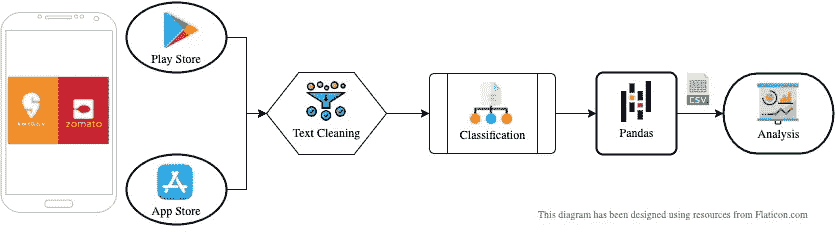

作者图表

*   观察:App Store/Play Store 的应用评论
*   预处理:用适当的
*   分析:对给定类别列表中的评论文本进行分类
*   通知:提供熊猫数据框架中的所有数据
*   Store:将数据以 CSV 格式存储在 Google Drive 中

下面分享了 Google Colab 项目链接，您可以从这里直接获得生成 CSV 文件的源代码。

**游戏商店:**

[https://colab . research . Google . com/github/obsei/obsei/blob/master/tutorials/02 _ PlayStore _ PreProc _ Classification _ pandas . ipynb](https://colab.research.google.com/github/obsei/obsei/blob/master/tutorials/02_PlayStore_PreProc_Classification_Pandas.ipynb)

**应用商店:**

[https://colab . research . Google . com/github/obsei/obsei/blob/master/tutorials/03 _ app store _ PreProc _ Classification _ pandas . ipynb](https://colab.research.google.com/github/obsei/obsei/blob/master/tutorials/03_AppStore_PreProc_Classification_Pandas.ipynb)

# **第 2 部分:数据可视化以获得洞察力**

现在，第二部分是可视化数据，并通过对获取的数据进行比较分析来获得可操作的洞察力。

可视化的步骤包括。

*   导入所有需要的库，如 NumPy，pandas，word cloud，matplotlib，seaborn，nltk，collection。
*   读取并合并从 App Store 和 Play Store 收集的数据的 CSV 文件。
*   文本清理和数据预处理。
*   使用分布图进行数据分析，如条形图、饼图、面积图、箱线图、热图、词云、词频图。

## 数据:

导入所有必需的库

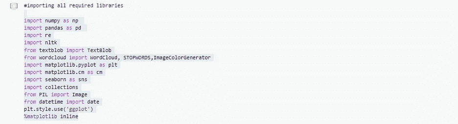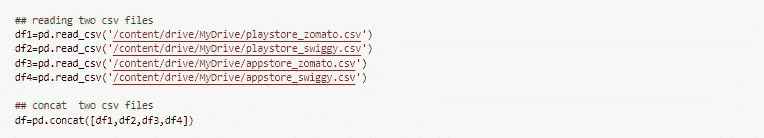

文本清理和数据预处理。

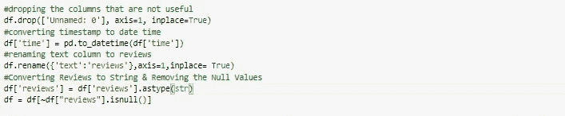

## **数据分析**

我通过向数据集中添加更多的要素来开始分析。比如评论的长度，每篇评论的字数，加上极性和情绪。

极性显示了每个文本的情绪。极性值的范围从-1 到 1，其中-1 代表消极情绪，1 代表积极情绪。

***分配***

我从字数分布、评论长度和数据集的极性开始。

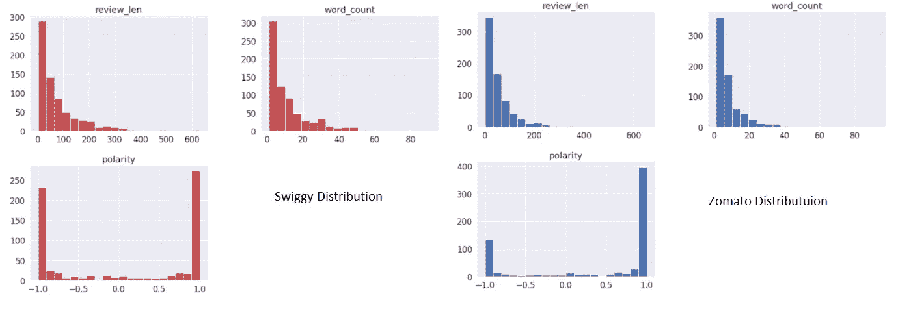

两个品牌的评论长度和字数的分布与预期相似。大多数 l 评论篇幅都很短。这两个品牌的极性似乎都是右偏的，但 Zomato 的极性却非常向右偏。这意味着对于佐马托来说，最多的评论都是正面的。当我们用饼状图直观地显示数据时，情况就更清楚了。

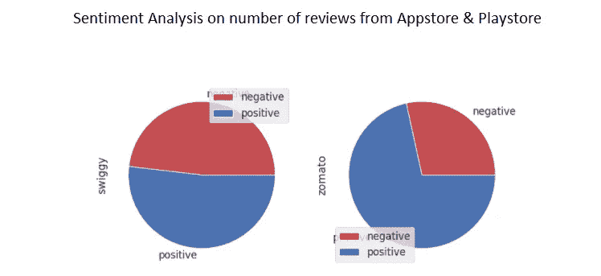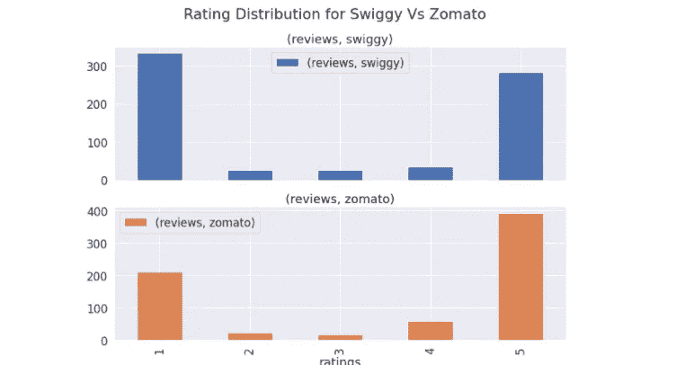

同样，如果你看到 [Zomato](https://medium.com/u/ef2c5a9dfd53?source=post_page-----def0dc77aaee--------------------------------) 的评分分布，5 个评分的评论数比 Swiggy 的多。

***点评时长 vs 评分***

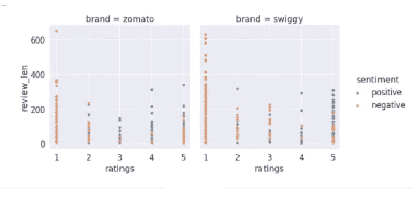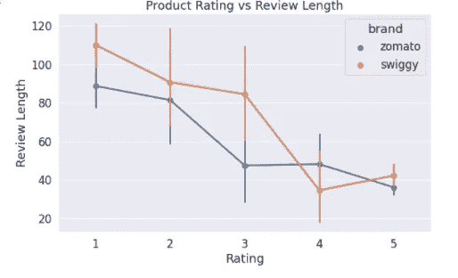

我试图了解评论的长度是否会随着评分的变化而变化，以及观点是否与评论的长度有任何关系。

有趣的是，当评分为 5 时，评论长度显著下降。所以，当顾客高兴时，他们不会写太多！

***极性 vs 额定值***

我想检查极性是否与额定值相符。在 [Zomato](https://medium.com/u/ef2c5a9dfd53?source=post_page-----def0dc77aaee--------------------------------) 的情况下，平均极性随着较高的额定值而不断上升，但对于 Swiggy 来说，情况并非如此。

尽管在等级 1 和 5 中有很多异常值。

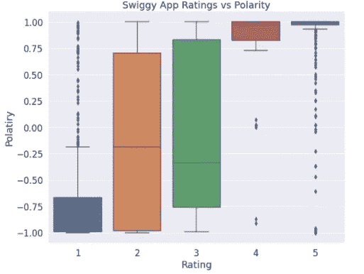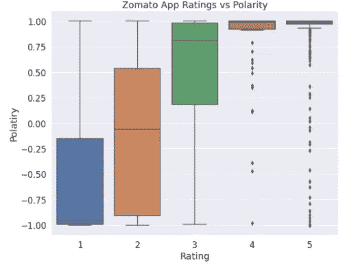

***基于特征/类别的情感分析***

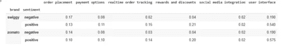

分析用户对话的情感可以让我们了解整体的品牌认知。但是，为了更深入地挖掘，可视化分类数据是很重要的。

基于数据集，用户界面，订单下单的便利性和灵活的支付选项是任何基于食品的交付应用程序最关键的因素。

奖励和折扣以及实时订单跟踪让消费者感到满意。

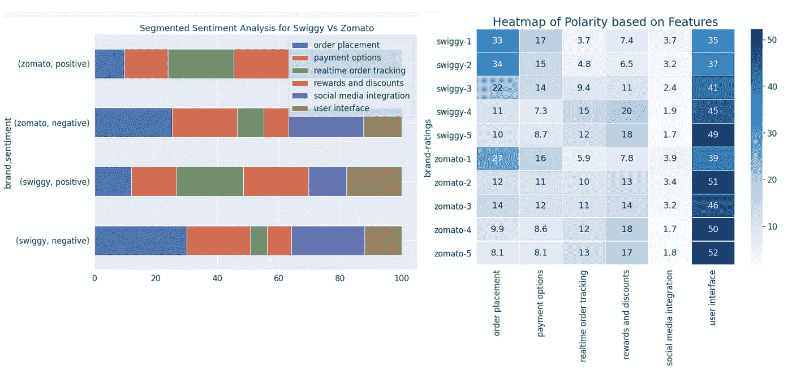

***阳性&阴性词云为 Swiggy & Zomato***

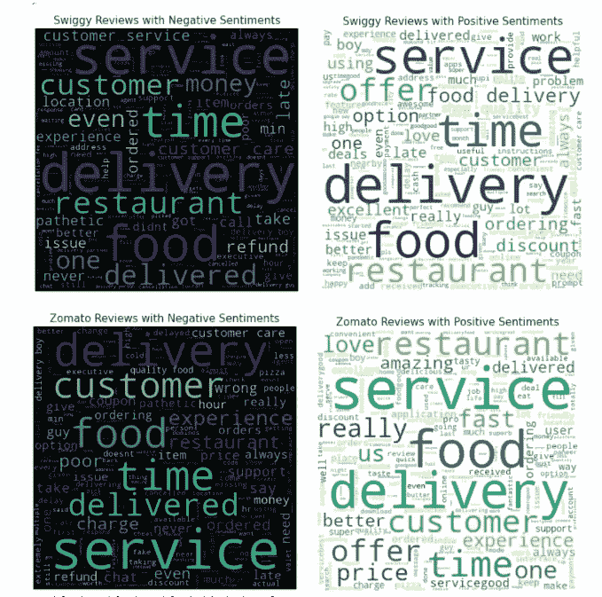

单词云是一种最常见和最漂亮的文本数据可视化工具，用于绘制单词的频率。文本中出现频率越高的单词越大。

服务、交付和时间是送餐应用中最常见的词汇，既有积极的也有消极的情绪。

***频率表显示前 10 个负面&前 10 个正面词语***

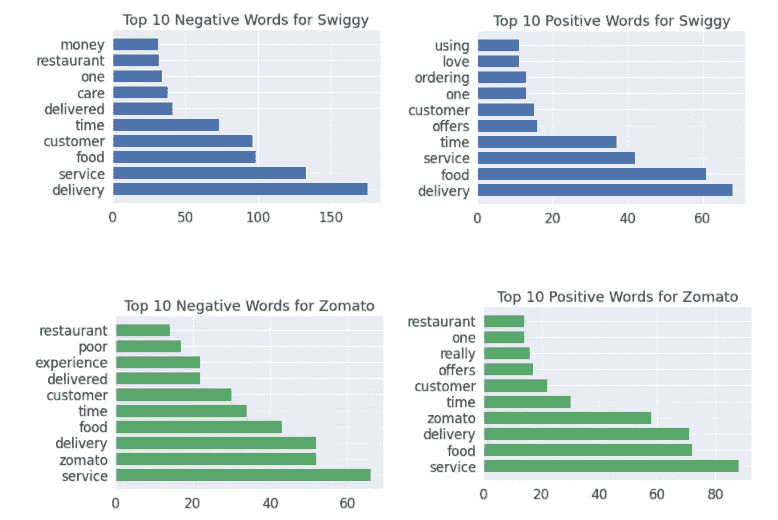

我试图提出一些理解或提取信息的好方法，你可以选择任何你觉得合适的方法。

希望你能在自己的数据集上尝试所有这些，并做一些很酷的分析。

我真诚地感谢 [Lalit Pagaria](https://medium.com/u/200f57c1324e) 构建了 [Obsei](https://github.com/obsei/obsei#how-to-use) ，这是一个非常棒的分析工具，它帮助我构思并阐述了这个分析。

非常感谢 Sanjaybharkatiya 在整个编辑过程中提供了广泛的见解和支持。

*随时关注我的*

[*雷娜·巴普纳*](https://medium.com/u/7322ec0f27f3?source=post_page-----def0dc77aaee--------------------------------)

【linkedin.com/in/reena-bapna-66a8691a 

***参考文献***

**Playstore**

[https://colab . research . Google . com/github/obsei/obsei/blob/master/tutorials/02 _ PlayStore _ PreProc _ Classification _ pandas . ipynb](https://colab.research.google.com/github/obsei/obsei/blob/master/tutorials/02_PlayStore_PreProc_Classification_Pandas.ipynb)

**应用商店**

[https://colab . research . Google . com/github/obsei/obsei/blob/master/tutorials/03 _ app store _ PreProc _ Classification _ pandas . ipynb](https://colab.research.google.com/github/obsei/obsei/blob/master/tutorials/03_AppStore_PreProc_Classification_Pandas.ipynb)

**观察回购:**

[https://github.com/obsei/obsei](https://github.com/obsei/obsei)

#数据科学#数据分析#编程#数据可视化#数据分析#比较分析# NLP #低代码

[Swiggy bytes](https://medium.com/u/b1fb0cb8c8e)[Marketing @ Swiggy](https://medium.com/u/f2799c3783fb)[zom ATO India](https://medium.com/u/b10973a247e1)[zom ATO](https://medium.com/u/ef2c5a9dfd53)[Swiggy](https://medium.com/u/cdea1acd52d9)