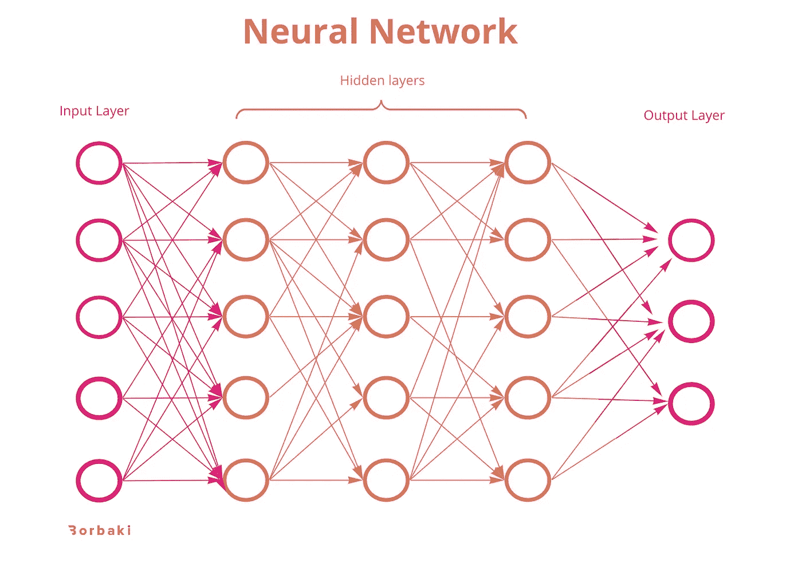

# 人工智能流行语

> 原文：<https://medium.com/analytics-vidhya/ai-buzz-words-116dd48af14b?source=collection_archive---------2----------------------->

人工智能再次成为终极流行语。
随之而来的是机器学习、大数据、数据科学、监督和非监督学习、神经网络等等。

如果你不使用人工智能，很难记住这些流行词的意思。就我个人而言，我花了几周时间才理解了最常见单词之间的不同概念和联系。

所以，为了让你更容易理解这些，我编写了这本简短的人工智能词典，帮助你对最“现代”的人工智能词汇的含义进行概述。

# 人工智能

人工智能是描述创造智能机器或计算机系统的主要词汇。人工智能试图构建像人类一样思考和行动的计算机系统。

人工智能伞包含许多不同的组件和工作流程，如机器学习和模式识别。

顾名思义，大数据就是数据。大数据涵盖了大量收集的数据。

大数据是所有类型的数据，比如来自销售点系统的销售交易、通过谷歌分析收集的数据、客户支持部门的注册电话、生产机器数据等等。

# 计算机视觉系统

是一种人工智能技术，可以查看真实世界的图像并从中提取信息。计算机视觉系统的目的是理解和自动化人类可以视觉完成的任务。

# 数据科学

数据科学是一个人工智能领域，它使用不同的方法、流程、算法和系统，从大量的结构化和非结构化数据中提取信息、知识和见解。数据科学的目的是将数据转化为可操作的见解。

# 深入学习

是机器学习的一个分支。深度学习使用神经网络来支持系统，并在数据中查找聚类，以惊人的准确性进行预测。

在深度学习(Deep Learning)中，神经网络至少由三层组成，允许网络“学习”以提高自动化程度，无需人工干预即可执行分析和物理任务。

深度学习是许多机器学习应用程序和服务背后的技术，例如数字助理、自动驾驶汽车和信用欺诈检测。

# 专家系统

专家系统从人类专家那里获取知识，并将它们表示为一组规则，这些规则可以被编程，以便计算机可以帮助人类进行决策。

# 遗传算法

通用算法是一种基于搜索的算法，用于解决机器学习中的优化问题。该算法基于达尔文的自然进化理论:适者生存。

通过模拟自然选择、繁殖和变异，遗传算法可以对搜索和优化等各种问题产生高质量的解。

# 智能代理

智能代理是决定将人工智能付诸行动的软件或实体。它在感知环境后代替用户或程序进行操作。

代理具有一定程度的自主性，允许它为用户或应用程序执行特定的、可预测的和重复的任务。智能体的两个主要功能是感知和行动。

# 机器学习

是最常见的人工智能技术。机器学习是在大规模数据库中识别模式的软件。该系统通过最少的人工干预从数据中学习并识别各种数据集中的模式。

# 计算机视觉

顾名思义，机器视觉是计算机“看”的能力。

机器视觉背后的技术支持通过使用图像处理对自动化检测、过程控制和机器人引导等应用进行自动检测和分析。

# 自然语言处理

是一种机器学习算法，它使计算机能够理解和分析自然的人类语言。

# 神经网络

是深度学习算法的热点。神经网络由分布在输入层、隐藏层和输出层的节点集组成。每个节点都相互连接，并有相关的权重和阈值。

如果单个节点的输出高于指定的阈值，则该节点被激活，并向下一层发送信号(数据)。否则，节点不会转发数据。

该神经网络受人脑启发，模仿生物神经元如何相互发送信号。

# 机器人过程自动化

当机器可以代替人和计算机系统进行控制和信息处理时。

机器人过程自动化使用自动化技术来模拟人工的后台任务，例如提取数据、填写表单、移动文件和播种。

机器人过程自动化还包括 f.x 的自动化，即使用机器人作为机器人真空吸尘器的家庭自动化或生产中的机器人自动化。

# 语音识别

是机器或程序识别大声说出的单词并将它们转换成可读文本的能力。语音识别使用不同的人工智能工具来理解记录音频中存在的独特输入。

# 监督和非监督学习

**监督学习:**
在监督学习中，您是否使用带标签的数据来实施您的算法。这意味着一些输入数据已经被正确答案“标记”。

**无监督学习:**
与有监督学习相反。当使用无监督学习时，不要用标签数据监督算法。相反，您允许算法在没有人工交互的情况下工作并识别模式。

# 结构化和非结构化数据

**结构化数据:**
结构化数据的组织和格式非常严密，便于搜索。

**非结构化数据:** 处理非结构化数据时，数据没有预先定义或组织，这使得收集、处理和分析变得更加困难。

以后我会零星更新‘字典’。如果你想要一个词或概念的解释，不要犹豫与我联系。

*原载于 2021 年 10 月 12 日 https://www.borbaki.com**的* [*。*](https://www.borbaki.com/ai-buzz-words/)