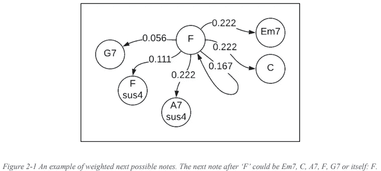
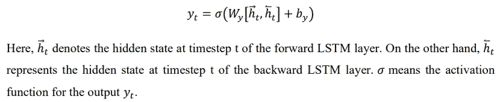
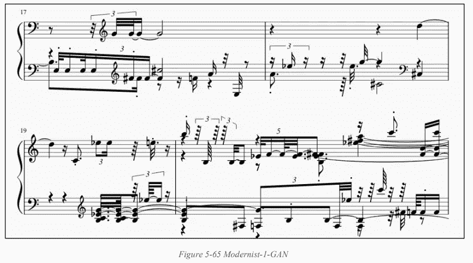
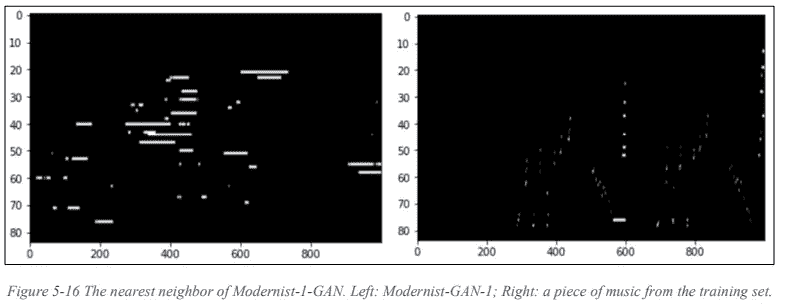

# 艾古典音乐作曲家——毕&甘

> 原文：<https://medium.com/analytics-vidhya/ai-classical-music-composer-63d983ee5fc0?source=collection_archive---------1----------------------->

## 如何在没有古典音乐理论知识和背景的情况下，为作曲家、音乐家，甚至是非专业人士创作古典音乐。

2 个提议的人工智能模型

注:这个项目的源代码可以在这里访问[。](https://github.com/chiatsekuo/AI_Classical_Music_Composer)

# 1.摘要

作为人类音乐家或人工智能音乐家本身的助手，人工智能可以将音乐创作带到另一个水平，具有无限的可能性。生活在数字时代，古典音乐在商业电影、电影预告片、游戏原声等等中起着主导作用。但是，没有现存的产生不同时代古典音乐的作品。为了填补这一空白，该项目提出了一种适用于古典音乐的人工智能音乐生成器。因此，对于作曲家、音乐家，或者甚至没有古典音乐理论和背景的先前知识的非专业人士来说，为了许多实际目的，可以根据他们喜爱的音乐时代快速创作古典音乐。它使用生成模式，即 Bi-LSTM 和 CNNGAN，为某些特定的古典音乐流派创作古典音乐，并分别和共同评价它们的演奏。

# 2.文献评论

## 2.1 现有方法及其局限性

先前的研究显示了通过实现马尔可夫链、递归神经网络和生成对抗网络来生成音乐的潜力。然而，每项研究都有其局限性；因此，与早期的方法相比，仍有改进的空间。

## 马尔可夫链

根据特定的概率规则，马尔可夫链是一个以固定的时间步长从一个状态改变到另一个状态的系统。当将马尔可夫链应用于音乐生成时，训练集中的每个音符被分配一个唯一的状态。然后，模型将生成新的状态(注释)，从过去的状态中依次学习。马尔可夫链最直接的设计是限制模型使用单一的先前状态来预测另一个状态。由于音乐家通常会自发地演奏，因此应用马尔可夫链来辅助爵士乐等实时即兴演奏是合理可行的。

然而，当马尔可夫链从具有完整作品的现有音乐语料库中生成音乐时，结果并不令人满意。它展示了非音乐性的音符和和弦的怪异排列(Moorer，1972)。

## 2.1.2 递归神经网络

递归神经网络(RNN)是一种神经网络，其中当前输入被馈入来自先前隐藏单元的输出。RNN 的每个节点都有一个隐藏状态，这使得网络能够记忆过去的一系列结果。记忆的这一特征意味着 RNN 可以应用于自然语言处理(NLP)、时间序列模式预测等任务。由于传统的 RNNs 的缺点是不能记忆长序列的数据，并遭受爆炸和消失梯度的问题，大多数研究应用长短期记忆(LSTM，一种 RNN)作为产生更长序列信息的替代方法，如文本、语音和音乐。通常，LSTM 由删除无用信息的遗忘门、将有用信息相加的输入门以及提取有价值信息作为当前单元输出的输出门组成。Eck 和 Schmidhuber (2002)证明了 LSTM 模型能够以类似于其训练(输入)数据的风格创作新颖的蓝调音乐。然而，Hadjeres 等人(2016)评论说，例如，音乐缺乏灵活性，不能在巴赫中进行重新和声。

Choi 等人(2016 年)进行了另一项研究，该研究显示了一种基于文本的自动音乐创作 LSTM 算法，该算法使用不同的字符作为唯一的音符来学习和弦进行和鼓轨道之间的关系。然而，他们发现基于字符的 RNN 无法通过产生不希望的任意 0 和 1 作为输出来生成有意义的鼓轨道结构。

布朗热-莱万多夫斯基等人(2012)提出了一种组合方法，通过引入 RNN-RBM 模型，改进了他们以前在产生复调音乐方面的研究。每个 RNN 隐藏单元都与一个 RBM 组合在一起。RBM 或受限玻尔兹曼机器是一个双向连接的随机(或生成)系统，具有可见节点和隐藏节点，其中所有可见节点都连接，但隐藏节点不连接。RNN 单元的每个状态都从其先前状态和 RBM 观测向量获得输入，这允许模型通过从音符的先前时间步长中学习来更好地预测即将到来的音符。然而，Magenta 项目(Shiebler，2016 年)评论说，这种模型很难生成更长时间步长的有节奏和旋律的音乐。

## 2.1.3 生成对抗网络

生成对抗网络(GAN) (Goodfellow 等人，2014 年)是一种从零开始产生似是而非的数据的神经网络。GAN 中有两个系统——发生器和鉴别器。发生器试图通过产生假数据来欺骗鉴别器，而鉴别器则鉴别真假样本。通过竞争，鉴别器惩罚生成假数据的生成器，而生成器在创建看起来真实的新实例方面变得更好。董等人(2017)的一项研究采用具有 Wasserstein 损耗的卷积 GAN 来生成多轨道钢琴卷帘窗的四个小节。对于模型训练，输入数据大小以钢琴卷帘窗格式设置为 96(时间步长)乘以 84(音符)乘以 5(音轨)。与大多数图像分类问题类似，钢琴卷帘窗上的每个音符都被认为是一个有效像素，表示音符的存在。因此，使用卷积层结合 GAN 的概念，该系统就像从头开始生成图像，然后将它们转换回音频格式。研究表明，该方法是可行的，能够学习短和弦进行的结构和特征。然而，它不能产生更长时间的音乐。

## 2.2 建议的方法

该项目将评估两种神经网络架构——深度双向 LSTM 模型和具有卷积层的 GAN 模型。假设深度双向 LSTM 模型可以通过预测具有更长时间步长和更有意义的旋律的音乐结构来改善现有研究的缺点。另一方面，GAN 模型试图通过从零开始开发音乐(随机噪声)来解决 LSTM 模型陷入循环(生成相同的音乐结构)的问题。这两个提议的模型都应该解决当前研究的缺点，所有结果都将通过适当的评估指标进行比较和评估——弗雷歇初始距离(FID)评分和最近邻搜索——以及人类调查。

# 3.设计、解决方案和系统

## 3.1 深度双向 LSTM RNN

## 3.1.1 深度神经网络

据信，较深的神经网络比浅的神经网络更能够分析和处理信息的全面特征。通常，浅层神经网络只包含一个或两个隐藏层，而深层神经网络包含两个以上的隐藏层。因此，为了让所提出的模型更好地理解输入数据，在本项目中采用了深度神经网络。

## LSTM 建筑

每个 LSTM 层都包含 LSTM 单元块，这些单元块有多个门来存储信息序列。细胞状态将有价值的信息传递给其他细胞和具有独特功能的多个门，以保持 LSTM 网络学习和记忆信息。下图说明了 LSTM 单元的架构。

## 3.1.3 双向 LSTM

双向 LSTM 模型是一个包含两个 LSTM 层的系统，这两个层以相反的方向传递数据。系统的每个输出接收来自向后和向前层的隐藏状态的信息。与单向 lstm 相比，双向 lstm 不仅从过去学习信息，也从未来学习信息。这个特征允许模型 15 更准确地预测顺序信息。从下图可以看出，这是一个无环图。每个时间步长的输出可推导如下:

## 3.1.3 综合方法

深层双向 LSTM RNN 是多个双向 LSTM 层堆叠在一起的模型。据推测，结合深度神经网络和双向层的特征将比以前研究的方法执行得更好。因此，这个项目中的第一个模型将基于这个设计。

该模型包含三个双向 LSTM 层，每个层具有 128 个神经元，随后是两个完全连接的层，以修改输入向量的维度并适应所需的输出形状。激活函数和优化器的最初计划是使用校正线性单元(ReLU)和 RMSProp，因为它们最广泛地用于 LSTM 模型。但是，其他优化器和激活函数将在实现步骤中进一步测试。

## 3.2 基于 CNN 的 GAN

GAN 由一个生成器和一个鉴别器组成，具有最适合对训练数据进行分类的任何神经网络架构。它主要用于通过 CNN 生成图像。然而，其他神经网络，如 LSTM 或 RNN，也被用来预测序列数据。一般来说，GAN 的训练过程可以分为两个部分——鉴别器的训练和发生器的训练。首先，随机生成的数据将被输入生成器。

随机生成的输入大小不一定需要与期望生成的输出相同。由于输入数据的维度可以在生成器中更改，因此通常会使用比输出数据维度更小的维度。在发生器产生一个假(生成的)输出后，假输出将被传入鉴别器，与真实数据进行比较。此时，鉴别器将根据鉴别器损失函数在训练过程的所有迭代中学习区分数据的真假。发生器还将根据仅连接到鉴别器的发生器损耗函数，通过鉴别器和发生器从反向传播获得的梯度中学习。下图是一个通用的 GAN 架构(“真实图像”代表真实世界的数据)。

该模型利用卷积层作为鉴别器和发生器的主要神经网络。由于 midi 文件是具有随时间推移而变化的不同频率的文件，因此每个 midi 文件都可以转换为二维数组，其中 x 轴表示时间步长，y 轴表示音符的不同音高。在这种情况下，我们可以很容易地将 2-D 阵列视为要在基于卷积神经网络的 GAN 模型中训练的图像。

生成器由一个具有许多神经元的全连接层组成，其后是四个卷积层，这些卷积层逐渐将数据向量的形状修改为所需的数据形状。发生器的最终输出形状将是生成的音乐的形状。这里，我们将输出形状设置为 1000 乘以 84，其中 1000 代表音乐 17 中的时间步长数，84 代表音高数。值得注意的是，为了节省计算成本，音调的数量被设置为 84。由于几乎所有作品的音符和和弦都在 midi 索引 24 到 108 之间，总共包含 84 个音符，因此最好截断不必要的 0 以加快训练过程。在训练和生成过程之后，生成的片段将被添加到两个 0 数组中，成为大小为 1000 乘 128 的数组。每个卷积层的内核大小为 5 乘 5，步长为(2，1)、(1，2)或(2，2)以适应最终的图像形状。最后一个卷积 2D 转置层使用 tanh 作为激活函数来确定每个神经元的最终输出。

鉴别器包含两个卷积层和一个全连接层。每个卷积层的内核大小为 5 乘 5，步长为(2，2)，与生成器的设置类似。

## 3.3 Midi 文件的一键编码

一键编码是将分类信息转换为二进制形式的过程，表示在特定时间步长内，只有该信息的值(1)高于其他不相关信息的值(0)。例如，在特定的时间步长 t 中，演奏音符“C4 ”,则时间步长 t 上的数据向量将在该向量中的特定位置包含一个 1，其对应于音符“C4 ”,具有 127 个 0，考虑了 128 个唯一音符。由于音符和和弦被分类存储在所有 midi 文件中，因此所有此类信息将通过一键编码进行处理，以获得更好的模型训练性能。两个神经网络模型将使用这种技术用相同的训练数据集来训练。

## 3.4 评估指标

## 3.4.1 弗雷歇起始距离(FID)

弗雷歇初始距离(FID)被设计用于评估由具有真实数据的 GAN 模型产生的生成结果(虚假数据)。计算评估分数的公式如下所示。

## 音高直方图

音符一致性和音符多样性可以通过绘制音高直方图来可视化。音高直方图是通过以直方图形式对音符和弦的每个唯一频率计数求和而绘制的。人们认为这是对不同音乐流派进行分类的有效措施。在这个项目中，它可以用作区分所有模型生成的所有音乐片段的时代的工具。

## 最近邻搜索

检查生成的片段和来自训练集的片段之间是否有任何相似性的一种方法是通过搜索该生成的片段的最近邻。通过计算生成的片段和来自训练集的所有片段之间的均方根误差，我们应该通过搜索最低误差来检索最接近的片段。

# 4 方法和实施

## 4.1 Midi 文件预处理

该项目使用 Music21 和 Pypianoroll python 库将所有 midi 文件中的信息提取到音符和和弦序列中。它们的音高和八度音程对应每个时间步长。由于这个项目的范围只包括单个乐器的生成，所以训练数据将只包含钢琴演奏的音乐片段。

所有的训练数据都是从字节跳动 GitHub 库的 GiantMIDI-Piano 库中获取的。根据他们的文档，有 10854 个古典音乐的 midi 文件可用。然而，在数据清理和分类过程之后，在获取的数据集中发现了重复和空文件。最终的数据集包含 546 首巴洛克音乐、412 首古典音乐、637 首浪漫音乐和 238 首现代主义音乐。

每个四个类别的音乐片段然后被独立处理。提取并连接所有的音符和和弦，该程序将形成一个字典，记录每个独特的音符和和弦(音符的组合)与索引。例如，音符“A2”与索引“0”成对出现，和弦“C#3”与索引“1”成对出现。以后会简化 onehot 编码的过程。

由于 LSTM 模型从给定的序列及其下一次预测中学习，因此需要一个额外的过程来构建一系列序列及其相应的输出(下一次预测)。这个项目将序列长度设置为 50，这意味着 LSTM 网络学习在给定其前 50 个音符或和弦的情况下预测下一个音符。首先，程序将存储前 50 个音符或和弦，然后根据前面构建到输入序列数组中的唯一音符-和弦字典将它们转换为整数。最后序列 20 的下一个相应的音符或和弦然后被存储在输出数组中。检索所有音符和和弦序列，输出数组中的每个元素都在 0 和 1 之间归一化，以便于后面的训练过程。

将 midi 文件视为图像，基于 CNN 的 GAN 模型可以有效地生成在垂直和水平方向上都具有合理结构的音乐。输入训练数据包含 2-D 数组，可以将其视为只有两种颜色的图像数组。x 轴表示时间步长，y 轴表示音符(和和弦)的不同音高。假设一个音符或和弦出现在任何时间步长中，该特定时间步长的数组存储“1”。另一方面，空音符用“-1”表示。

最后一步是将所有图像存储到一个形状为(x，y，z)的 NumPy 数组中，其中 x 表示唯一音乐片段的数量，y 表示每个训练片段的时间步长，z 表示音符的范围。在这个项目中，为了简单起见，阵列形状设置为(x，1000，84 ),因为目标是评估 CNN-GAN 模型生成结构化音乐和有意义旋律的能力，而不是生成通常需要过多计算能力来完成任务的长片段。在标准的 Midi 表达中，总共有 128 个音符。然而，通过观察来自训练集的所有图像，它们中的大多数仅具有从最小 C1(索引 24)到最大 C7(索引 108)的音符跨度。这意味着索引 24 以下和索引 108 以上的音符可以被忽略，因为它们是空音符，不利于后面的训练过程。因此，在训练之前对所有图像进行修剪处理。它产生(x，1000，84)的最终输入数据形状，其中 x 表示独特音乐片段的数量。

## 4.1 模型构建

在这个项目中，所有的神经网络都将使用 TensorFlow 库及其更高级的 API — Keras API 用 python 编程。高级 Keras API 允许更快地实现任何神经网络。一般来说，开发者只需要提供训练数据的输入形状、损失函数、优化器和一些特定的超参数。

## 4.1.1 深度双向 LSTM RNN

该模型的当前实现是将一个双向 LSTM 层和两个 LSTM 层堆叠在一起。接着是两个完全连接的层。每个 LSTM 层包含 256 个节点，之后的丢失率为 0.3。在最后一个 LSTM 图层和第一个完全连接的图层之后，将添加批量归一化。第一个完全连接的层包含 128 个具有整流线性激活函数(ReLU)的节点。最后一层包含 x 个节点，其中 x 由来自训练语料库的不同音符或和弦确定。因为已知如果音符或和弦不在训练语料库内，它将不会出现或在将来被神经网络预测，所以我们可以以这种方式安全地实现最终的完全连接层，以节省存储器和计算时间。该模型是用交叉熵损失的损失函数和 RMSprop 为其优化器编译的。

类似于训练步骤，预测网络拥有与训练模型相同的结构。唯一的区别是来自训练过程的最后一个时期的最佳权重被添加到神经网络中用于序列预测。

生成随机数作为确定预测序列的起始点的索引，以基于训练集预测音乐序列。音符初始序列的长度也是预先确定的。决定了上述设置后，模型可以在预测的每次迭代中预测单个音符或和弦(一组音符)。

在每次迭代中，模型通过选择该元素(音符或和弦)的最高概率来预测输入序列的下一个音符或和弦。然后，最有可能成为序列中下一个元素的音符或和弦将被连接到前一个序列。同时，该序列的第一个元素将在下一次迭代之前被删除。这允许窗口大小(序列长度)与从预测开始滑动到结束的窗口相同。

## 4.2.2 CNN 基 GAN

这个 CNN-GAN 模型由两个神经网络组成——一个鉴别器和一个生成器。两个网络都通过计算预测标签和真实标签之间的差异来采用交叉熵损失作为它们的损失函数。由于生成器试图通过生成假图像来欺骗鉴别器，使鉴别器难以辨别真伪，因此生成器的损失函数将鉴别器对假图像的决策与一系列决策进行比较。至于鉴频器，有两步(两次损耗)。它将真实图像与一组 1 进行比较，将虚假图像与一组 0 进行比较。将两种损耗相加，得出鉴频器的总损耗。

生成器的网络结构从引入一个小的随机种子作为输入开始，输入到一个具有大得多的输出大小的全连接层。对输出数据进行整形后，四个转置卷积层堆叠在一起，以对数据进行上采样。每个卷积层具有 5 的核大小(高度和宽度)和(2，1)或(1，2)或(2，2)的步长，以对数据进行上采样，从而满足输入数据的相同形状(1000，84)。填充是相同的，以保持数据的原始大小。最后，除了最后一层使用 tanh 作为激活函数之外，所有层之后都是 LeakyReLU 激活层。

另一方面，与发生器相比，鉴别器的神经元层较浅。它在开始时有两个卷积层，每个卷积层都有一个 5 乘 5 的内核和一个 2 的步长。最后，具有单个输出的完全连接的层确定这个输入图像是来自训练集(真实的)还是来自生成器(虚假的)。

## 4.2 数据转换

对于双 LSTM 模型，在生成新的数字序列之后，序列中的所有元素将首先通过参考来自训练集的唯一的一组音符和弦来相应地转换成音符或和弦的表示，然后转换成 Midi 格式的音符或和弦。这里，需要指定音符数和和弦的限制，速度也是如此。以现代主义音乐为例:最多 300 个音符，音符间偏移 0.3 是很好的设置。这里，偏移控制音乐的速度。数字越大，速度越慢，反之亦然。

对于 CNN-GAN 模型，最后一步是将大小为(1000，84)的数组转换回 Pypianoroll 库可接受的数据格式(1000，128)，然后将其转换为 midi 文件。预测数组连接一个大小为(1000，24)的空数组，组合数组由另一个大小为(1000，20)的空数组连接。

## 4.3 评估

## 音高直方图

使用音高直方图来分析生成的音乐的目的是，该图是可视化给定音乐片段的音符相似性和差异性的有效方式。通过计算乐曲中出现最频繁的音符，通常可以确定乐曲。然而，假设大多数音符只属于几个(1 或 2 个)音符类别。在这种情况下，它可能表明音乐生成的失败，因为几乎大多数作品都具有特定的音符分布多样性。

## 4.3.2 FID

计算 FID 分数需要两个组成部分——真实图像集和生成的图像。对于每个流派，来自训练集的所有音乐都属于“真实”图像集，而生成的图像属于“生成”图像集。将为“真实”和“生成”集提取的特征是图像本身的一部分，并且将只提取每个图像的一部分。片段是具有(400，48)形状的图像，其中 400 表示时间步长，48 表示音符范围。将音符范围设置为 48 的原因是，从观察来看，大多数音符和弦都落在这个范围内，从训练集中检索每首音乐的特征可以节省大量计算成本。接下来，首先计算“真实”和“生成”集合的所有特征向量的平均值和所有特征向量的协方差矩阵。然后可以从下面的等式中检索 FID 分数。

## 调查

我们进行了两项调查来评估 Bi-LSTM 和 GAN 模型的结果，这两项调查都是在第三方调查平台 phonic.ai 上进行的。每项调查都包含八个选择题，每个问题只有一个答案。受访者需要播放调查每页提供的音频，并选择他们听到的音乐是由人类作曲家还是人工智能算法创作的。如果他们觉得无法决定，他们可以选择“我不知道”选项。它允许回答者仔细回答每个问题，并希望尽量减少他们猜测的机会，这可能会降低调查结果的质量。

从每个流派和每个类别(“真实的”和“生成的”)中选择一个片段，并且只有该片段的摘录(15 到 30 秒之间)可供回答者使用，因为让回答者在调查中听完整个片段会使他们疲劳，并因此恶化调查结果。在每次调查中,“真实的”和“生成的”音乐的数量是平衡的，并且为了公平随机排序。下面的片段是一个问题的例子。

# 5 结果和评估

## 5.1 深度双向 LSTM RNN

## 5.1.1 注意多样性和分析

下面是四个不同风格的生成音乐的例子。从巴洛克、古典风格开始，接着是浪漫主义和现代主义风格。下面显示的结果证明了双 LSTM 模型通过从给定的训练集中学习来创作新颖音乐段落的能力。

*   一个生成的巴洛克风格音乐的例子

根据音高直方图(Figure 5–6 左上角)，很明显，音符在大调音阶中均匀分布，但没有多少升半音。虽然直到巴洛克时期晚期，调号才发展到目前的状态，通常为每首音乐作品定义了调号，但这种生成的音乐作品的音符多样性相对均匀，考虑到这种音乐类型的性质，这是可以接受的。此外，从上面显示的乐谱摘录来看，这首乐曲没有复杂的复调音乐结构，而是表现出了独奏曲的迹象。

*   一个生成古典风格音乐的例子

这个时代的音乐通常使用简单的和声旋律来实现平衡的音乐结构。这种创作理念在贝多芬的音乐中经常出现。下面生成的音乐演示了类似华尔兹的相似主题(音乐短语或结构)的重复，这对应于古典时代最常见的音乐创作思想之一。在我看来，这是最成功的作品之一，类似于贝多芬的音乐。

*   一个生成浪漫风格音乐的例子

根据 Music 21 库分析，下面这段音乐的预期调是 C 小调，置信度为 70.2%，这与下面的音高直方图精确对应。

*   一个现代风格音乐的例子

*   四个生成片段的音高直方图

从下图中，我们可以观察到所有的作品都有不同的音高分布。没有一个音高能明显地支配整首曲子。因此，可以得出结论，双 LSTM 模型很好地处理了音符多样性，并且不倾向于记忆来自训练集的部分信息。

## 调查

从下面的堆积柱形图中可以明显看出，超过一半的受访者很难判断给定的音乐是由人工智能还是人类创作的。在所有由人类创作的作品中，只有一半得到超过百分之五十的置信度，表明它们是由人工智能创作的。由人工智能创作的所有作品的结果都是一样的。虽然一些受访者认为“真实”的音乐是由人工智能创作的，但统计数据显示，当让大多数受访者听人工智能创作的音乐时，他们选择了“真实”。这表明提出的双 LSTM 模型具有欺骗人类判断的能力。

## 5.2 生成性对抗网络

## 弗雷歇初始距离

生成的四个片段由 FID 评分进行评估。在下表中，第一行 FID 是生成的片段和训练集的 FID 分数，第二行 FID (random)是随机片段(图像)的 FID 分数，它代表 GAN 训练过程和训练集的初始状态。由于 FID 分数越低，片段(图像)与训练集越相似，因此我们可以观察到，每个生成的片段的 FID 分数远低于与之对应的随机片段的 FID 分数。因此，我们可以说，生成的片段看起来与训练集中的片段相似，这意味着 GAN 模型很好地模仿了训练集中的音乐。

可能影响 FID 分数的主要因素可能是特定训练集中的片段数量、片段本身以及为 FID 评估提取的特征。此外，与通常使用预训练的 InceptionV3 模型评估生成图像质量的其他图像生成任务不同，由于项目的性质，本项目不采用该模型作为 FID 分数计算的一部分。生成的片段与具有 RGB 颜色通道并与 ImageNet 标签相关联的传统图像并不完全相同。因此，在这种情况下，我认为 FID 分数是模型性能的参考，而不是确定生成的音乐作品好坏的硬性标准。

## 5.2.2 注意多样性和分析

下面是四个不同风格的生成音乐的例子。从巴洛克、古典风格开始，接着是浪漫主义和现代主义风格。下面显示的结果证明了 GAN 模型通过从给定的训练集学习来创作新颖的音符/和弦和结构的能力。

*   一个生成的巴洛克风格音乐的例子

从上面的巴洛克-1-甘乐谱摘录中，我们可以观察到一些令人印象深刻的音乐结构，它们比巴洛克-1-比-LSTM 更复杂。一个值得注意的特点是，当看一个小节时，上五线谱和下五线谱都有自己的旋律，或者至少下五线谱是上五线谱的伴奏。相比之下，双 LSTM 模型没有展示这种特征。相反，它将所有重合的和弦或音符组合成一个整体，并将其表示为一个和弦。虽然这可能不会简化音乐结构，但 GAN 模型可能是一个更好的选择，可以生成更复杂的音乐结构和更可读的乐谱。

检查生成的片段和来自训练集的片段之间是否有任何相似性的一种方法是通过搜索该生成的片段的最近邻。通过计算 Baroque-GAN-1 和来自训练集的所有片段之间的均方根误差，我们通过搜索最小误差来获得最接近的片段。下面是 Baroque-GAN-1(生成的作品)和通过前面提到的计算找到的最接近的作品之间的比较。观察这两部作品的旋律模式，我们可以说这两部作品在发展连续琶音方面有相似的倾向。这是一个很好的迹象，表明甘模型的学习能力，而不是完全复制训练集的音乐短语。

*   一个生成古典风格音乐的例子

从最近邻搜索来看，经典-1- GAN 与其最近片段之间的相似性不明显。

*   一个生成浪漫风格音乐的例子

从上面的乐谱中值得注意的一点是红色框中的键。正如前面在双 LSTM 部分提到的，浪漫风格的音乐通常有多个降半音。此外，比较 Romantic-1-GAN 和它最近的邻居片段，我们可以观察到两个片段都以相当稳定的音高沿着时间步长前进，没有太大的垂直音高变化。

*   一个现代风格音乐的例子

很多时候，现代主义音乐拒绝调性。它的音乐不固定在任何“调”上，总是倾向于感觉不稳定或“偏离”观察上面的乐谱，听它的配乐，我也是这么想的。与巴洛克或古典音乐等其他音乐风格不同，现代主义音乐在作曲时不需要遵循严格的规则。它被鼓励通过在音乐中注入创新来挑战“传统”。因此，根据所提出的甘模型的性质，我们不需要担心所产生的音乐的令人不安的旋律或节奏。

*   四个生成片段的音高直方图

根据下面的音高直方图，所有四首曲子都有多个主调，这是音符多样性的一个好迹象。GAN 模型不生成特定的音符，而是按比例预测以几个键为主的音符。这是一个好的迹象，因为甘模型使它类似于人类的作曲风格。

## 调查

下图是 GAN 模型的概况。虽然大多数受访者可以清楚地区分“真实”音乐和“人工智能”音乐，但仍有一部分受访者(平均 33.4%)无法识别他们的作品是由人工智能还是人类创作的。这是通过对每一个给定的选项的百分比总和进行平均计算得出的，这些选项包括“无法判断”和错误的选项(“人工智能”或“人类”)。

# 6 结论

## 6.1 成就

从双 LSTM 模型生成的结果展示了制作古典音乐的强大能力，大多数人很难分辨它们是由人还是由人工智能创作的。双 LSTM 模型被证明能够产生从连续的角度来看有意义的音乐。

将音符和和弦的序列视为 2D 阵列的新概念被证明是训练数据集的可行设计。这种输入数据形状允许生成对抗网络以与生成图像相同的方式生成音乐。通过扩大训练集的维度(1000 乘 84)，它也可以产生比以前的研究(4 乘 128)长得多的时间步长的音乐。

在四个古典音乐时代中，我发现双 LSTM 模式适合产生巴洛克、古典和一些浪漫音乐，这是由于双 LSTM 模式的设计和这些音乐风格的性质。这些类型的音乐需要严格的规则，没有现代音乐复杂。LSTMs 的设计非常适合完成这些任务。另一方面，GAN 模型在生成音乐方面似乎更具创造性和随机性。因此，我认为它适合创作现代主义音乐。

## 6.2 未来的改进

为了进一步提高所生成的音乐的质量，建议对训练集进行扩充和进一步细化。虽然这个项目的训练集包括数百首 midi 格式的古典音乐，但大多数 midi 文件都是现场录制的，这意味着一些背景噪音也可能在原始演奏期间与音乐一起录制，这可能会影响制作 midi 文件的精度。例如，当使用“MuseScore”软件可视化数据集中的一些乐谱时，很明显会观察到与原始乐谱相比过多的音符和和弦。这可能是一个潜在的原因，损害了后来的训练过程，但是，进一步的试验和检查需要证明这一假设。此外，数据清理过程是必不可少的，因为我从数据集中发现了许多重复和无效(空)的音乐。

据信，双 LSTM 模型优于单向 LSTM 模型从以前的研究。然而，单向 LSTM 模型和双 LSTM 模型之间的性能比较应在未来进行，以证实这一论点。

# 7 参考文献

纽约州布朗热-莱万多夫斯基、纽约州本吉奥和文森特出版社(2012 年)。高维序列中时间相关性的建模:复调音乐生成和转录的应用。arXiv 预印本 arXiv:1206.6392。

Briot，J. P .，Hadjeres，g .，& Pachet，F. D. (2017 年)。音乐生成的深度学习技术--一项调查。arXiv 预印本 arXiv:1709.01620。

Choi，k .、Fazekas，g .、Sandler，M. (2016 年)。基于文本的自动音乐创作 LSTM 网络。arXiv 预印本 arXiv:1604.05358。

董洪伟，萧伟英，杨立成，杨耀辉(2017)。MuseGAN:用于生成多轨道钢琴卷的基于卷积 GAN 的模型的演示。ISMIR 最新消息/演示。

埃克博士和施密德胡伯律师事务所(2002 年)。使用 lstm 递归神经网络的音乐创作初探。人工智能研究学院，103，48。

Goodfellow，I .、Pouget-Abadie，j .、Mirza，m .、Xu，b .、Warde-Farley，d .、Ozair，s .、… & Bengio，Y. (2014 年)。生成对抗网络。神经信息处理系统进展(第 2672-2680 页)。

哈杰雷斯，g .，帕切特，f .，&尼尔森，F. (2017，7 月)。Deepbach:巴赫合唱曲生成的可操纵模型。在机器学习国际会议上(第 1362-1371 页)。PMLR。

Hochreiter，s .，& Schmidhuber，J. (1997 年)。长短期记忆。神经计算，9(8)，1735-1780。

穆尔，J. A. (1972 年)。音乐和电脑作曲。美国计算机学会的通讯，15 (2)，104-113。47

屏蔽器。(2016).洋红色/洋红色。GitHub。[https://github . com/magenta/magenta/tree/master/magenta/reviews](https://github.com/magenta/magenta/tree/master/magenta/reviews)