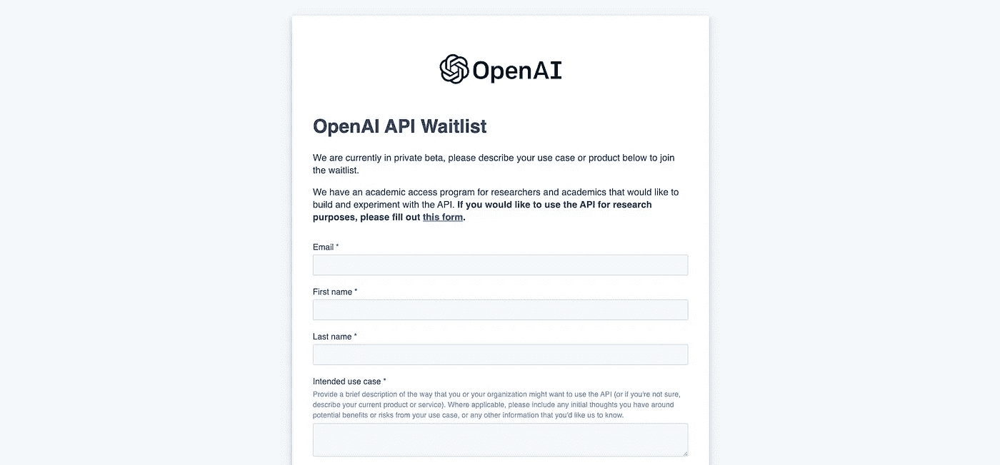
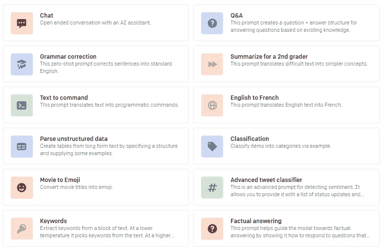
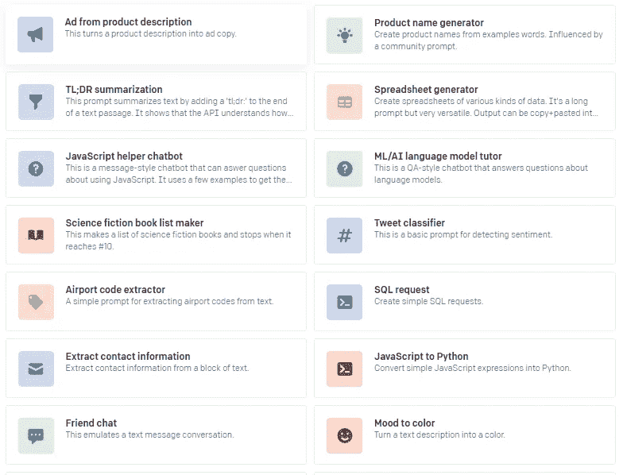
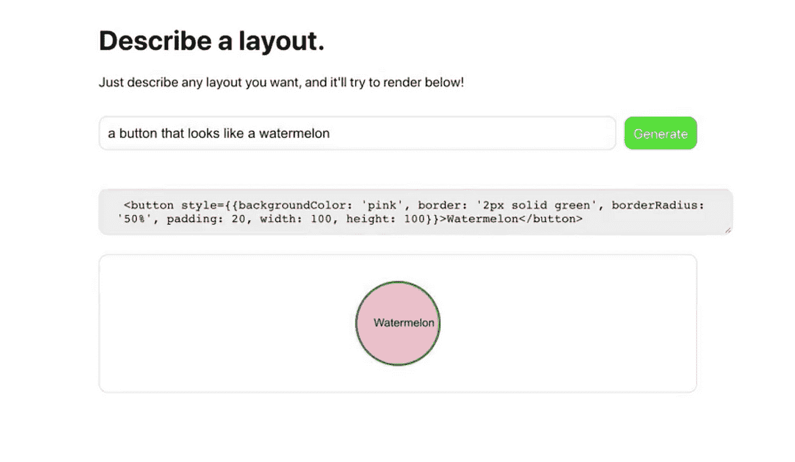
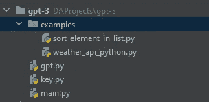
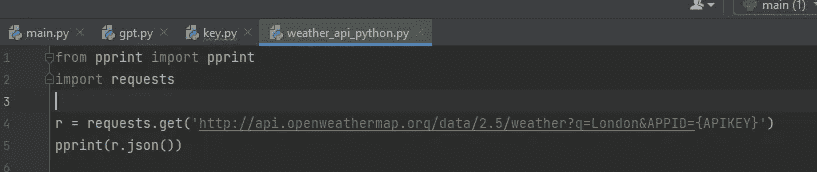
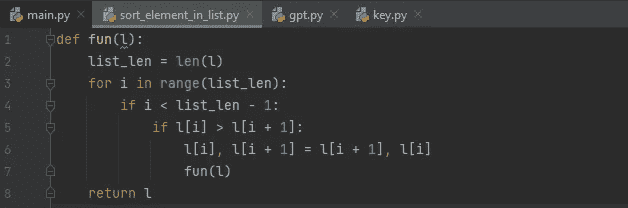
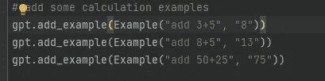

# AI 使用 Python 和 OpenAI 的 GPT-3 生成代码

> 原文：<https://medium.com/analytics-vidhya/ai-generates-code-using-python-and-openais-gpt-3-2ddc95047cba?source=collection_archive---------0----------------------->

今天，人工智能正在生成你需要的所有代码，你不需要写代码，你只需要监督就可以了。如果你想更专注于逻辑，获得更高的生产力。自从 GPT-3 发布以来，它改变了我们在人工智能领域处理文本的方式。给定任何文本提示，如短语或句子，GPT-3 会返回自然语言的文本补全。开发者可以通过展示几个例子或“提示”来“编程”GPT-3

你一定听说过 [Github 副驾驶](https://copilot.github.com/)，人工智能真的会取代人类吗？让我知道你的想法。


**在这篇文章中，我们将谈论 GPT-3 的基本用法。文章的内容有-**

1.  如何获得 GPT-3 的 API 访问权限？
2.  GPT 3 号能做什么？
3.  用例
4.  Python 代码示例(解释)
5.  Github 代码
6.  YouTube 视频演示和快速解释
7.  接下来呢？
8.  你可能会对…感兴趣
9.  联系我
10.  来源和资源

# 1.如何获得 GPT-3 的 API 访问权限？

*   **方法一(申请表)——**第一件事就是在 OpenAI 官方 [API Waitlist form](https://share.hsforms.com/1Lfc7WtPLRk2ppXhPjcYY-A4sk30) 上发送申请。该表单相当简单，基本上只询问您的预期用例。



*   **方法 2(外展)-** 有一种方法可以通过给 OpenAI 的首席技术官 Greg Brockman 发电子邮件来快速访问。

*   **方法 3(脱颖而出)——**如果你没有获得上述方法，我们的建议是做一些展示你的热情并让你和你的用例感到兴奋的事情

# 2.GPT 3 号能做什么？

 [## 你可以用 OpenAI API 做的所有事情

### 用于访问 OpenAI 开发的新人工智能模型的 API

beta.openai.com](https://beta.openai.com/examples) 

# 3.用例

一些伟大的人做了辉煌的工作，让我们看看一些样本-

*   **代码生成器-**

*   设计师:这是 Figma 插件和 GPT-3 的完美结合，可以生成漂亮的网页模板。开发人员输入以下文本:

一个应用程序，它有一个带有相机图标、“照片”标题和信息图标的导航栏。照片的馈送，其中每张照片具有用户图标、照片、心形图标和聊天气泡图标”

并生成这个漂亮简单的应用程序。


*   JSX 布局设计师:这是 GPT-3 生成代码的第一个例子，引起了 tweeple 的注意。它展示了如何通过简单的英语定义来生成 JSX 布局。



*   **正则表达式生成器:Y** ou 用简单的英语输入您想要的正则表达式，提供一个匹配的示例字符串，并在几秒钟内生成正则表达式。


# 来源和其他使用案例-

1.  [电码神谕](https://twitter.com/amasad/status/1285789362647478272)
2.  [设计师](https://twitter.com/jsngr/status/1284511080715362304)
3.  [JSX 版面制作者](https://twitter.com/sharifshameem/status/1282676454690451457)
4.  [正则表达式生成器](https://twitter.com/parthi_logan/status/1286818567631982593)
5.  [网站模仿者](https://twitter.com/jsngr/status/1287026808429383680)
6.  [对象用例生成](https://twitter.com/siddkaramcheti/status/1286168606896603136)
7.  [自动抽签器](https://twitter.com/aquariusacquah/status/1285415144017797126)
8.  [完整评估](https://twitter.com/calvinfo/status/1286332337563684865)
9.  [智力竞赛制片人](https://twitter.com/learn_awesome/status/1286189729826738176)
10.  [向任何人学习](https://twitter.com/mckaywrigley/status/1284110063498522624)
11.  [哲学家](https://twitter.com/raphamilliere/status/1289129723310886912)
12.  [人工智能递归](https://twitter.com/mattshumer_/status/1287125015528341506)
13.  [模因制造者](https://twitter.com/wowitsmrinal/status/1287175391040290816)
14.  [乳胶制造商](https://twitter.com/sh_reya/status/1284746918959239168)
15.  [动画师](https://twitter.com/sonnylazuardi/status/1287563878545514496)
16.  [交互式语音响应创建器](https://twitter.com/nutanc/status/1287801677542612992)
17.  [三维场景生成器](https://twitter.com/antonio_gomezm/status/1287969287110443008)
18.  [简历创建者](https://twitter.com/doncubed/status/1284908940149395456)
19.  [开发运营工程师](https://twitter.com/chinyasuhail/status/1287110006370836480)
20.  [板球评论员](https://twitter.com/nutanc/status/1285196429393137665)

# 4.Python 代码示例(解释)

让我们谈谈一些技术方面，然后我会给你看完整的代码。

我项目的文件夹结构是-

*   我将一些 Python 代码放在“examples”目录的示例中，以程序名/标题作为文件名。这些例子我稍后会提供给 GPT 3 号。
*   gpt.py-使用 Openai 的 GPT-3 的一些有用的函数。它包含添加示例、预测、配置等功能。基本上，你需要担心这个文件。您可以在您的代码文件(在我们的例子中是 main.py)中使用这段代码。



*   main.py-这是你在这里的宝藏。嗯，看看代码，然后我会解释-

```
from key import *
import glob
import openai
from gpt import GPT
from gpt import Example

# configure GPT
openai.api_key = key
gpt = GPT(engine="davinci",
          temperature=0.5,
          output_prefix="Output: \n\n",
          max_tokens=100)

# add some code examples
for file in glob.glob("examples/*"):
    title = file.replace("_", " ")
    with open(f"{file}", "r") as f:
        code = f.read()
    gpt.add_example(Example(title, code))

# add some calculation examples
gpt.add_example(Example("add 3+5", "8"))
gpt.add_example(Example("add 8+5", "13"))
gpt.add_example(Example("add 50+25", "75"))

# Inferences
prompt = "sort list in python"
output = gpt.get_top_reply(prompt)
print(prompt, ":", output)
print("----------------------------------------")

prompt = "Code weather api in python"
output = gpt.get_top_reply(prompt)
print(prompt, ":", output)
print("----------------------------------------")

prompt = "What is 876+89"
output = gpt.get_top_reply(prompt)
print(prompt, ":", output)
print("----------------------------------------")
```

大部分代码都是不言自明的。嗯，我正在迭代“示例”目录，在迭代的同时，我在 GPT-3 API 中添加示例。

```
gpt.add_example(Example("add 3+5", "8"))
```

在示例中，上面的行有两个参数，“add 3+5”是输入，“8”是您期望 GPT-3 执行的输出。

类似地，您可以将不同种类的示例添加到模型中，并探索各种可能性。

我已经给出了两种例子，在第一个例子中，我给出了一些 python 代码和代码描述

```
# add some code examples
for file in glob.glob("examples/*"):
    title = file.replace("_", " ")
    with open(f"{file}", "r") as f:
        code = f.read()
    gpt.add_example(Example(title, code))
```

在第二个例子中，我已经给出了一个基本的数学计算例子

```
# add some calculation examples
gpt.add_example(Example("add 3+5", "8"))
gpt.add_example(Example("add 8+5", "13"))
gpt.add_example(Example("add 50+25", "75"))
```

> 让我们检查 API 的输出-

***下面是“prompt = ' Code weather API in python '”***的输出

**了解输出-** 我在代码里有“set max_tokens=100”，你可以根据自己的选择来更改。嗯，这样会增加或减少输出长度。

输出看起来非常棒，它改变了变量名并给出了许多其他输出。

**我提供给这个 API 的例子是-**



**我得到的输出是-**

```
prompt = "Code weather api in python"
output = gpt.get_top_reply(prompt)
print(prompt, ":", output)
```

下面是上述提示的输出-

```
Code weather api in python : Output:
import requests
r = requests.get('http://api.openweathermap.org/data/2.5/weather?q=London&APPID={APIKEY}')
data = r.json()
print(data['weather'][0]['description'])
print(data['main']['temp'])
print(data['main']['temp_min'])
print(data['main'][
```

***以下是不使用排序函数的 python 中排序列表的输出-***

**理解输出-** 嗯，这次感觉好像它完全记住了我的代码，但这就是我得到的。

**我提供给这个 API 的例子是-**



**我得到的输出是-**

```
prompt = "sort list in python"
output = gpt.get_top_reply(prompt)
print(prompt, ":", output)
```

下面是上述提示的输出-

```
sort list in python : Output: 

def fun(l):
    list_len = len(l)
    for i in range(list_len):
        if i < list_len - 1:
            if l[i] > l[i + 1]:
               l[i], l[i + 1
```

***以下是 python 中数学计算的输出-***

**了解输出-** 我已经为加法 API 提供了非常基本的例子，但它也可以做大数的加法。我非常肯定它也能解决相当长的数学表达式。

**我给这个 API 的例子是-**



**我得到的输出是-**

```
prompt = "What is 876+89"
output = gpt.get_top_reply(prompt)
print(prompt, ":", output)
```

下面是上述提示的输出-

```
What is 876+89 : Output: 

865
```

# 5.Github 代码-

[](https://github.com/Dipeshpal/AI-Generates-Code-Using-Python-and-GPT-3) [## dipeshpal/AI-使用 Python-and-GPT-3 生成代码

### AI 使用 Python 和 GPT-3 生成代码。为 Dipeshpal/AI 生成代码-使用-Python-和-GPT-3 开发做出贡献…

github.com](https://github.com/Dipeshpal/AI-Generates-Code-Using-Python-and-GPT-3) 

只需分叉它，启动它，在“key.py”文件中添加您的密钥，然后运行“main.py”文件。

# 6.YouTube 视频演示和快速解释

# 7.接下来呢？

如果你想要这些方面的指导，请在 Instagram 上评论或给我发邮件或给我发 DM。

## *剪辑:连接文本和图像

OpenAI 引入了一个名为 CLIP 的神经网络[，它可以从自然语言监督中高效地学习视觉概念。通过简单地提供要识别的视觉类别的名称，CLIP 可以应用于任何视觉分类基准，类似于 GPT-2 和 GPT-3 的“零射击”能力。](https://openai.com/blog/clip/#:~:text=a%20neural%20network%20called%20clip%20which%20efficiently%20learns%20visual%20concepts%20from%20natural%20language%20supervision.%20clip%20can%20be%20applied%20to%20any%20visual%20classification%20benchmark%20by%20simply%20providing%20the%20names%20of%20the%20visual%20categories%20to%20be%20recognized%2C%20similar%20to%20the%20%E2%80%9Czero-shot%E2%80%9D%20capabilities%20of%20gpt-2%20and%20gpt-3)

## * DALL E:从文本创建图像

OpenAI 引入了一个名为 DALL E 的神经网络，它可以从文本标题中为用自然语言表达的各种概念创建图像。

# 8.你可能会对…感兴趣

[](/analytics-vidhya/how-to-create-virtual-assistant-in-python-10-min-50-lines-of-code-no-need-to-buy-alexa-build-7ad5102c57ba) [## 如何用 Python 10 min 50 行代码创建虚拟助手|不用买 ALEXA，搭建…

### 在本教程中，我将告诉你如何创建自己的虚拟助手。不需要买任何东西，你只需要…

medium.com](/analytics-vidhya/how-to-create-virtual-assistant-in-python-10-min-50-lines-of-code-no-need-to-buy-alexa-build-7ad5102c57ba) [](/analytics-vidhya/face-recognition-with-python-and-deep-learning-in-5-lines-5-minutes-39a5bf798267) [## 用 Python 和深度学习进行人脸识别，5 行 5 分钟

### 这篇文章将向您展示如何通过深度学习用 Python 创建 5 行人脸识别。脸…

medium.com](/analytics-vidhya/face-recognition-with-python-and-deep-learning-in-5-lines-5-minutes-39a5bf798267) [](/analytics-vidhya/blur-or-change-background-of-images-using-machine-learning-with-tensorflow-f7dab3ddab6f) [## 通过 Tensorflow 使用机器学习模糊或更改图像背景

### 在这篇文章中，我们将讨论如何改变图像的背景，如何模糊背景…

medium.com](/analytics-vidhya/blur-or-change-background-of-images-using-machine-learning-with-tensorflow-f7dab3ddab6f) [](/analytics-vidhya/humans-image-segmentation-with-unet-using-tensorflow-keras-fd6cb43b06e5) [## 基于张量流 Keras 的 Unet 人体图像分割

### 使用 Tensorflow Keras 在 Unet 的帮助下进行人体图像分割，结果非常棒。学习分段…

medium.com](/analytics-vidhya/humans-image-segmentation-with-unet-using-tensorflow-keras-fd6cb43b06e5) [](https://huggingface.co/course/chapter1) [## 变形金刚模型-拥抱脸课程

### 这门课将教你自然语言处理(NLP)使用拥抱脸生态系统中的库-🤗…

拥抱脸。总裁](https://huggingface.co/course/chapter1) 

# 9.联系我-

给我买杯咖啡:

 [## 迪佩什·帕尔是 YouTube 的技术创造者

### 嘿，👋我刚刚在这里创建了一个页面。你现在可以给我买杯咖啡了！

www.buymeacoffee.com](https://www.buymeacoffee.com/dipeshpal) 

没钱？

在 YouTube 上订阅我:

[](https://www.youtube.com/channel/UCGEoRAK92fUk2kY3kSJMR_Q) [## 迪佩什·帕尔

### 嘿，伙计们，我是 Dipesh Pal 我在 2013 年加入 youtube，但在 2016 年 2 月 26 日开始我在 YouTube 上的频道，最后我上传了我的…

www.youtube.com](https://www.youtube.com/channel/UCGEoRAK92fUk2kY3kSJMR_Q) 

在 Instagram 上关注我:

[https://www.instagram.com/dipesh_pal17](https://www.instagram.com/dipesh_pal17/)

# 10.来源和资源-

https://openai.com/

【https://github.com/shreyashankar/gpt3-sandbox 

[https://github.com/bhattbhavesh91/gpt-3-simple-tutorial](https://github.com/bhattbhavesh91/gpt-3-simple-tutorial)

[https://forms.office.com/Pages/ResponsePage.aspx?id = vsqmpnrmtkiofjyelk 8 sx 3 elsv 0 pehhphhnz 30 fttvunkywtlnpmvi 1v 0 lxnjexmlexul c 4 se 5 yss 4 u](https://forms.office.com/Pages/ResponsePage.aspx?id=VsqMpNrmTkioFJyEllK8sx3ELsv0PEhHphhNz30FttVUNkYwTlNPMVI1V0lXNjExMlExUlc4SE5YSS4u)