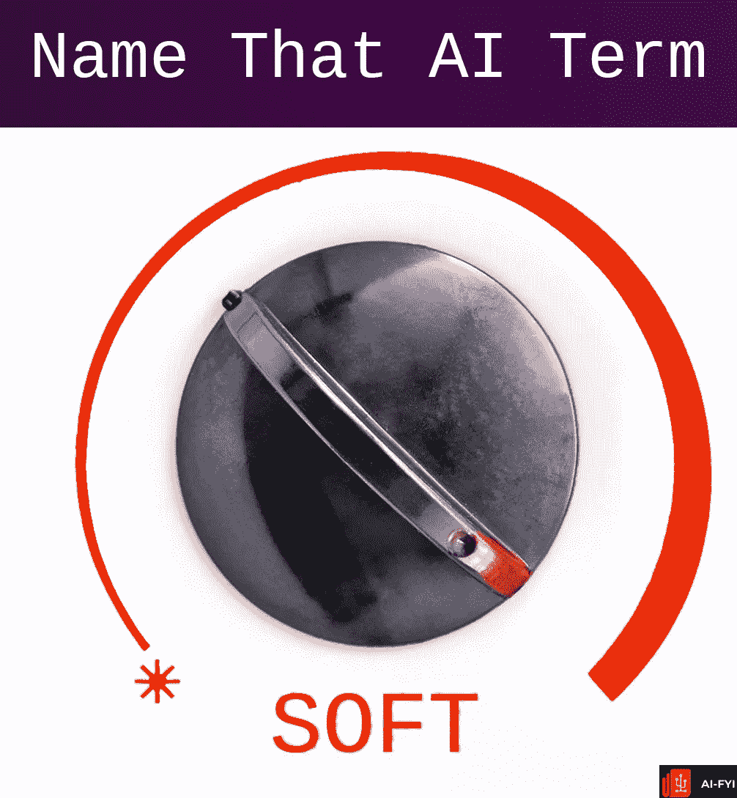
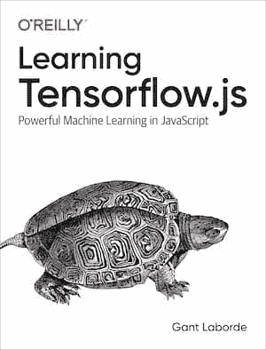

# 人工智能机器学习重建

> 原文：<https://medium.com/analytics-vidhya/ai-machine-learning-rebuses-5da4875a364a?source=collection_archive---------23----------------------->

## 你能说出这些常见的机器学习术语吗？

机器学习需要更多围绕那些疯狂词汇的乐趣。这里是我为我的时事通讯《AI-FYI.com》制作的一些 rebuses(文字图片)谜题，希望与大家分享其中的乐趣。

如果你是机器学习的新手，这是一个学习和记忆这些新术语的好方法，如果你是专业人士，这应该是很费脑子的。这些图像代表了你应该熟悉的常见机器学习、数据科学和人工智能术语。

和上次我写的一样，我不会把答案包括在内。这就是评论区的作用！祝你好运！

## 谜题 1:

## 谜题 2:

## 谜题 3:

## 谜题 4:

## 谜题 5:

## 谜题 6:

## 谜题 7:

## 谜题 8:

***有兴趣学习如何用 TensorFlow.js 将 AI 和机器学习带入 web？***

JavaScript 让你创建前端网站，可以直接在浏览器上利用人工智能的力量。用这本书从头学起。

[立即在亚马逊上预订您的副本](https://amzn.to/3dR3vpY)

[Gant Laborde](https://medium.com/u/6ca0fe37eac1?source=post_page-----a1d0ab879cb9----------------------) 是 [Infinite Red](http://infinite.red/) 的共同所有人兼首席创新官、出版作家、兼职教授、全球公共演说家和培训中的疯狂科学家。鼓掌/关注/ [发微博](https://twitter.com/GantLaborde)或者在会议上拜访他[。](http://gantlaborde.com/)