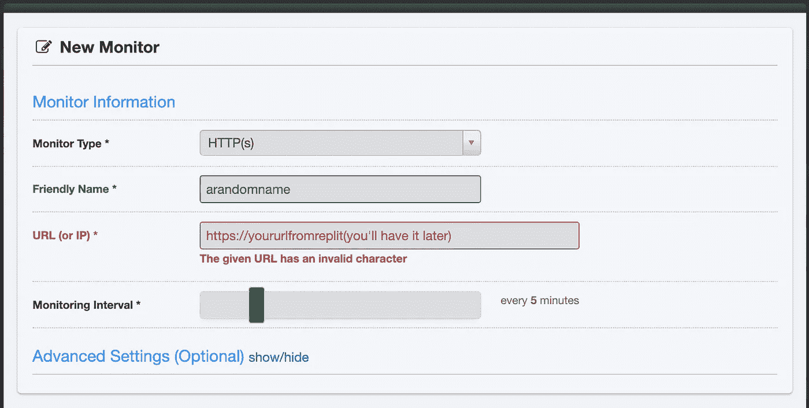
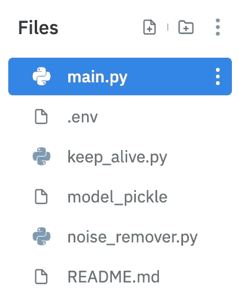
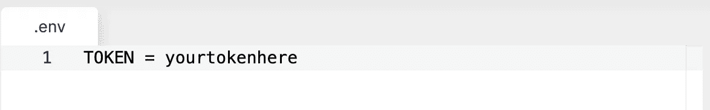
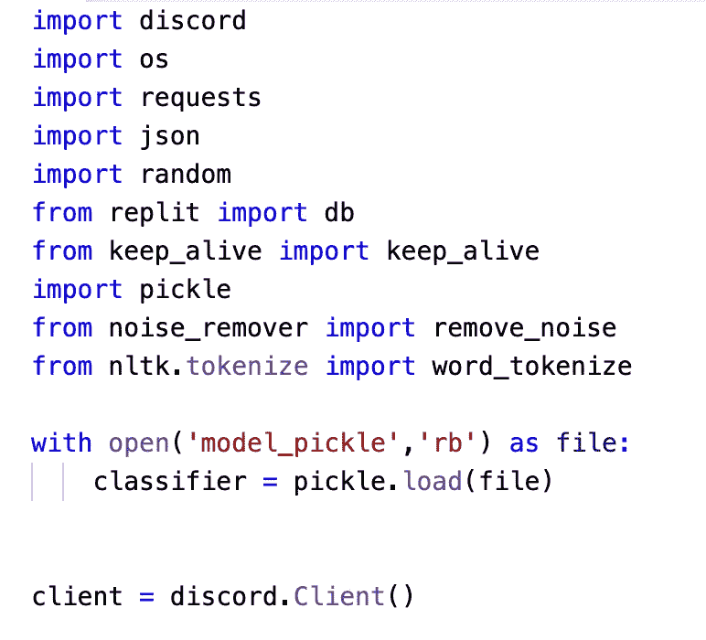
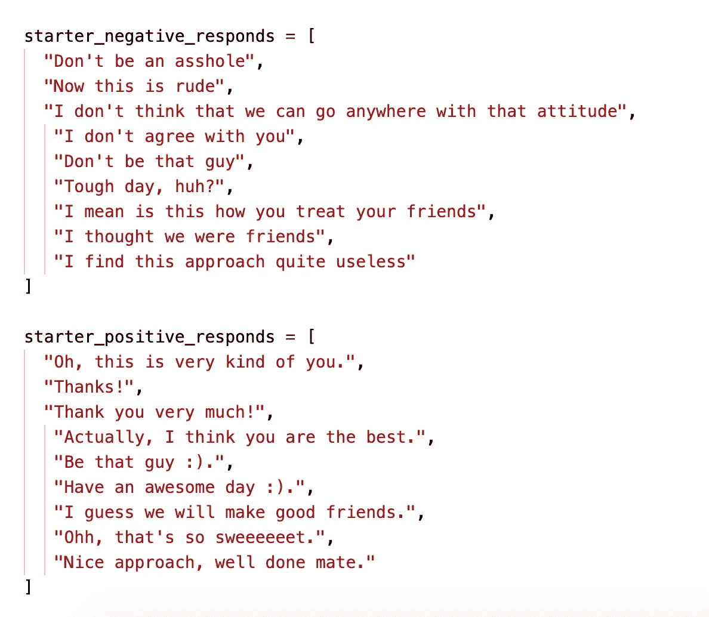
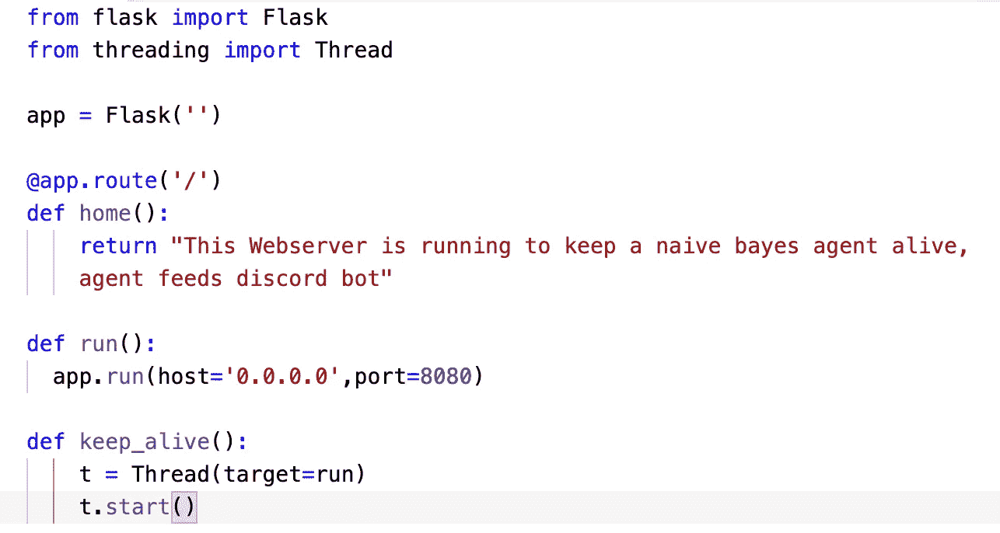
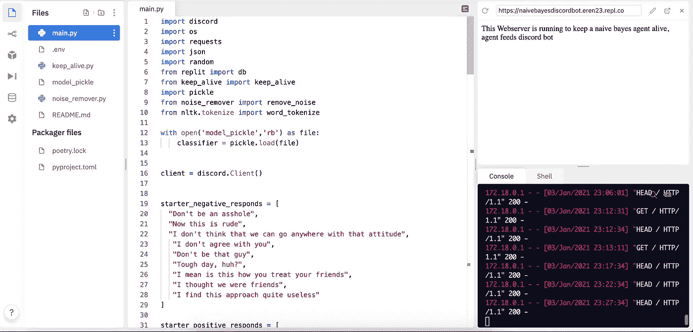
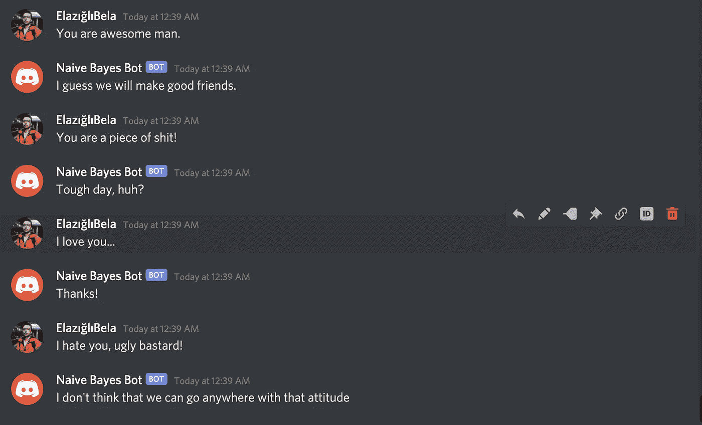

# 人工智能驱动的不和谐机器人教程

> 原文：<https://medium.com/analytics-vidhya/ai-powered-discord-bot-tutorial-d709efbd878a?source=collection_archive---------12----------------------->

与我在这个博客中已经和将要发表的大多数其他帖子不同，这篇帖子将是一个简单的人工智能驱动的不和谐机器人的教程式应用程序。我的意思是，我不会认为这是一个具有相当多功能的现成的不和谐机器人，但我发现它对理解概念很有用。首先，本教程基于我在网上看到的另外两个教程，我认为它们可以很好地融合在一起。

我将提到的第一个[视频](https://www.youtube.com/watch?v=SPTfmiYiuok&ab_channel=freeCodeCamp.org)是这个，所有主要的不和谐机器人逻辑，如果我不太擅长解释关于机器人的东西，我强烈建议你先看这个视频。内容和导师都很牛逼。

我要参考的第二个[资源](https://www.digitalocean.com/community/tutorials/how-to-perform-sentiment-analysis-in-python-3-using-the-natural-language-toolkit-nltk)是这个，数字海洋上的一个基本情感分析应用程序，出于可承受性的目的，我将省去模型训练，并使用来自我刚才提供的资源的源代码的训练模型。然而，如果你对 ML 和其他东西感兴趣，我再次强烈建议你继续阅读教程。

# 本教程中使用的平台、技术和工具

我将简单解释一下为什么以及如何使用我在本教程中使用的所有这些部分。不过，我会在以后的文章中深入解释其中的一些。

# 回复它

Replit 是一个在线 IDE/编译器/解释器，具有许多易于使用的特性。因为我知道阅读冗长的博文很无聊，所以我会在这里复制并粘贴一些链接，[这](https://docs.repl.it/misc/quick-start)就是你如何轻松开始使用 Repl.it 的方法

# Uptimer 机器人

Uptimer Robot 是一项在线服务，它可以通过不断 ping 来帮助您保持服务的活力。我们将使用它来避免 Replit 的自由层限制。因为 Replit 的免费层只能让你的代码存活 1 个小时，而你不需要提交任何活动。

# Python 和 Flask

本教程是用 Python 编写的，我们还使用了一个基本的 Flask 服务器，以便在 Uptimer Robot 的帮助下保持服务器的活力。如果你想了解更多的细节，你可以继续观看原始视频。

# 不和谐桌面

所有不和谐机器人的截图都来自不和谐桌面，如果你在这里，你很可能知道如何安装不和谐桌面。

# 编码

为了简单起见，我将从所需的帐户和 API 键开始。我们需要准备好我们的 API 密匙，还有一堆需要整理的东西。因此，我不会在这里堆积一堆图片和文字，我只会发布一个[链接](https://discordpy.readthedocs.io/en/latest/discord.html)，用于创建不和谐机器人和频道邀请。从现在开始，我们需要的是一个令牌(链接，创建一个机器人，第 6 步)。

为了能够使用 Uptimer 机器人，我们基本上只需要创建一个帐户，然后为我们的服务创建一个观察者。现在，我们只需要在编码部分结束后创建一个帐户，我们可以回到这里，按照这里的图片创建我们的观察者。

我还会发布回购的[源代码](https://github.com/eren23/naive_bayes_discord_bot)，以防你不想跟我一起看。您还应该能够从那里获得经过训练的模型文件。

现在我们可以开始创建我们的应用程序了。我将简单介绍一下本教程的独特之处，因为本教程已经是其他 2 个教程的合并，所有的步骤在那些资源中都有详细的解释。如果你不想这样做，你可以直接使用源代码。

在我们的教程结束时，文件结构应该是这样的。因此，您可以继续创建这些文件。

## 。包封/包围（动词 envelop 的简写）

。env 文件包含我们不一致连接的令牌。我们如何访问令牌在前面已经解释过了。

最后，在我们开始向主文件夹添加代码之前，我们可以从上面给出的源代码链接下载预训练模型。最初的教程和代码涵盖了更多的特性，但因为它们大多不相关，所以不在这里讨论。

下面给出了 main.py 所需的所有导入，我们首先导入我们需要的内容，然后将我们的模型作为“分类器”,最后初始化我们的客户端。

去拿我们的代币。我们可以在 main.py 文件的末尾添加这一行代码。

`client.run(os.getenv("TOKEN"))`

之后，我们可以创建一个字符串数组，包含我们的否定和肯定的回答。

使用下面的代码块，我们基本上可以捕获消息事件，并将消息的内容赋给一个变量。

现在我们有一个信息可以提供给我们的模型。我们的模型采用标记化的句子，并决定消息的内容是积极的还是消极的。在我们有了这样的情感分析结果之后，我们基本上只是从硬编码的字符串数组中返回一个答案。所以我们的模型只是一个使用朴素贝叶斯分类器的基本情感分析器。

tokenizer 来自 nltk.tokenize 模块，remove_noise 来自 noise_remover。

噪声去除器是一个包含很多正则表达式和字符串操作的文件。你可以从原始教程中找到答案。

keep_alive.py 文件包含这个代码块，一个基本的 Flask 服务器。我们应该在 main.py 文件的末尾用下面一行调用它。

`keep_alive()`

一切就绪后，我们的项目应该可以开始了。在右上角，我们可以查看我们的 API 端点，因此，如果您希望您的机器人启动并一直运行，您可以复制并粘贴到正常运行时间机器人观察器的链接，如上所述。

一切就绪后，我们可以继续检查我们的机器人，看看它是如何工作的。下面是一个例子。

***我希望你喜欢这个教程，我会在下一篇文章中看到你。保重:)***

*在*[*https://margin.io/blogs*](https://margin.io/blogs)结账加密相关物品