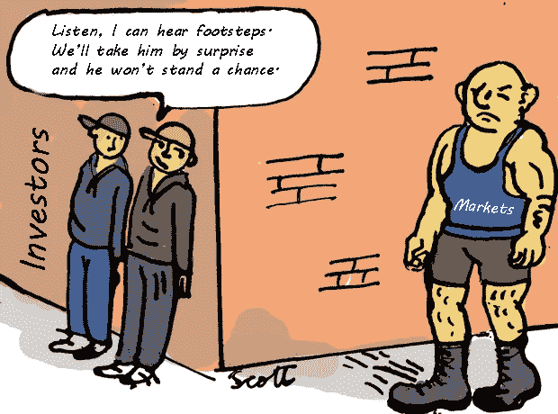
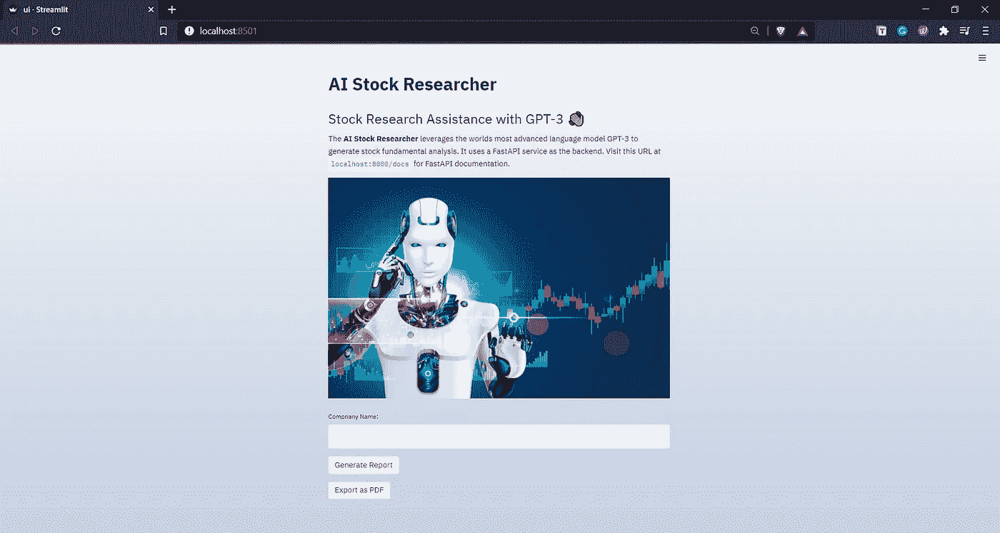
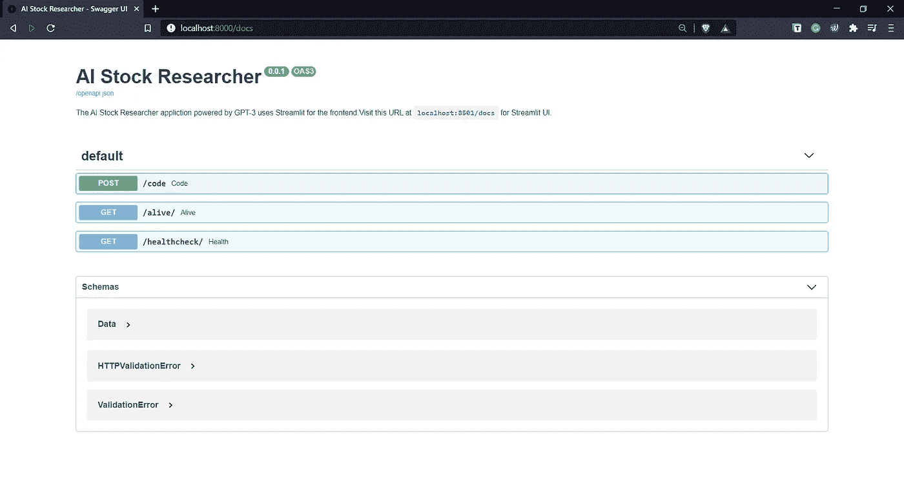

# 由 GPT-3 驱动的人工智能股票研究员

> 原文：<https://medium.com/analytics-vidhya/ai-stock-researcher-powered-by-gpt-3-3b451a2c6fe1?source=collection_archive---------2----------------------->

## 通过利用世界上最先进的语言模型，从简单的自然语言输入中自动生成股票基本面分析。

"最困难的事情是决定采取行动，其余的仅仅是毅力."→阿米莉亚·埃尔哈特

# 先决条件

我以文章的形式收集了这些点，请按照相同的顺序浏览下面的文章，将这些点连接起来，并了解背后的关键技术栈***AI-股票研究员-由 GPT-3*T3 提供支持的应用程序:**

1.  [FastAPI——超越烧瓶的美妙方式！](/towards-artificial-intelligence/fastapi-the-spiffy-way-beyond-flask-b00f4f883e1d)
2.  [Streamlit —革命性的数据应用创建](/towards-artificial-intelligence/streamlit-revolutionizing-data-app-creation-e269177d9112)
3.  [GPT-3 简介](https://pub.towardsai.net/email-assistant-powered-by-gpt-3-ba39dfe999d3)

# 基本股票分析

基本面分析试图通过考虑与行业表现相关的整体经济的广泛因素以及公司的财务因素(如收益、利润率、资产和负债)来评估股票的内在价值。价格变动历史和交易量对基本面分析师来说是无关紧要的。

设计各种股票分析背后的基本原则是确定 ***一种证券在更广泛的市场*** 中是否被正确估值。基本面分析通常从 ***宏观到微观*** 的角度进行，牢记公司赖以建立的非常基本的价值观，以识别长期机会和回报。

**最佳技术分析...**【图片鸣谢:Scoopnest】

任何股票基本面分析的最终目标都是得出一个结论，清楚地列出“公司的真实价值”和投资者对“公司价值”的理解之间的差距。这将有助于潜在投资者识别证券的基本面是被低估还是被高估。

# 为什么 GPT-3 是很好的候选人？

对通过证券交易所进行数百万次交易的上市公司进行基本面分析是一项非常艰巨的任务，这不是一项需要采取结构化步骤才能得出结论性研究的任务。就基本价值观和文化而言，每家公司都是独一无二的，每家公司都有自己的使命和愿景，并努力坚持下去。

现在，根据非常流行的[有效市场假说(EHA)](https://www.investopedia.com/terms/e/efficientmarkethypothesis.asp) ，任何公司在特定时间的市场价值反映了宇宙中存在的所有信息。考虑到这种情况，个人和机构投资者都不可能持续产生α。

`有效市场假说认为，交易资产的价格考虑了所有可获得的信息。当然，这里的情况就是这样…

## 这些点和 GPT 3 号有什么联系？

金融市场从来都不容易分析，总会有你预料不到的意外因素。多年来，人工智能和机器学习领域一直在进行大量研究，以预测市场走势。但是到目前为止，我们还没有任何复杂的技术来分析和预测市场的未来，因为涉及到大量的属性和它们各自的异质性。从一家公司的财务状况、市场表现、品牌形象到一些小的消息泄露，任何事情都可能导致市场对该公司价值的看法发生剧烈变化。

> "要理解市场的欺骗，就去看看基本面."→基本股票分析

传统的机器学习和深度学习算法已被证明对这项任务效率低下，因为大量意想不到的数据会影响结果。传统机器学习模型的知识仅限于训练语料，超出训练语料的任何内容都将被视为离群值，并将严重阻碍模型的性能。

另一方面，GPT-3 在被称为→“互联网”的数据宇宙中接受训练，具有精确回忆数据中模式的巨大趋势(感谢 1750 亿+参数)。无论数据的来源和类型是什么，GPT-3 作为一种语言模型，由于其古怪和独特的训练，很好地适应了这种概括水平，从而得出几乎准确的结果。

# 应用程序演练

现在，我将一步一步地向您介绍人工智能股票研究员应用程序:

在创建任何 GPT-3 应用程序时，首先要考虑的是培训提示的设计和内容。提示设计是启动 GPT-3 模型以给出有利的上下文响应的最重要的过程。

> *根据经验，在设计训练提示时，你的目标应该是从模型中获得零反应，如果这不可能，就用几个例子，而不是提供一个完整的语料库。训练提示设计的标准流程应该是这样的:* ***【零投→少投→基于语料库的启动。***

为了设计 AI-Stock 研究人员应用程序的培训提示，我使用了以下培训提示结构:

*   **描述:**通过添加一两行关于其功能的内容，对股票研究员应该做的事情进行初步描述。
*   **输入(公司名称):**该组件包括公司名称，将由用户输入。它帮助 GPT-3 建立获取正确信息的环境。
*   **输出:**该组件包括与作为 GPT-3 模型输入提供的公司名称相对应的基本分析报告。

> *I/p→公司名称；O/p→基本面分析报告*

Streamlit powered UI →全部在 Python 中！

FastAPI 的魔力→即时 API 文档

让我们看一个实际例子，来真正理解 GPT-3 作为一个智能基本面股票研究员的力量。在下面的例子中，我们将通过向我们的 AI 股票研究员提供公司名称来生成股票基本面分析。

# 结论

GPT-3 的设计考虑到了技术和非技术受众，它不需要复杂的梯度微调或更新，界面设计简单直观，任何人都可以很容易地使用，几乎没有先决条件。它在执行许多 NLP 任务方面非常灵活，为您提供了用自然语言做任何事情的能力。GPT-3 的这一独特特征使它从其他 NLP 模型中脱颖而出。世界各地的许多创业公司和企业正在试验 GPT-3，以推出新一代产品来迎合 21 世纪的观众。

# 参考

1.  [https://en.wikipedia.org/wiki/GPT-3](https://en.wikipedia.org/wiki/GPT-3)
2.  [https://openai.com/blog/openai-api](https://openai.com/blog/openai-api/)
3.  https://ir.lib.uwo.ca/cgi/viewcontent.cgi?article=8423&上下文=etd
4.  [https://up commons . UPC . edu/bitstream/handle/2117/133070/138115 . pdf](https://upcommons.upc.edu/bitstream/handle/2117/133070/138115.pdf)

如果你想了解更多，或者想让我写更多关于这个主题的东西，请随时联系我们。

我的社交链接:[LinkedIn](https://www.linkedin.com/in/shubhamsaboo/)|[Twitter](https://twitter.com/Saboo_Shubham_)|[Github](https://github.com/Shubhamsaboo)

如果你喜欢这篇文章或觉得它有帮助，请花一分钟按一下拍手按钮，它增加了文章对其他媒体用户的可见性。