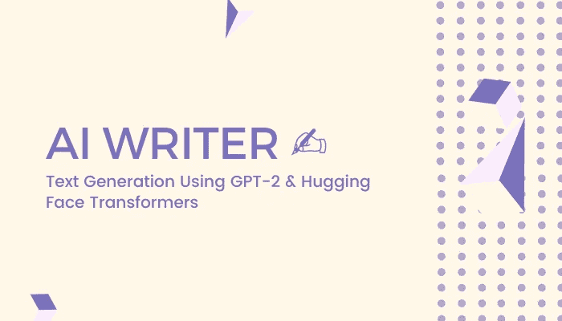
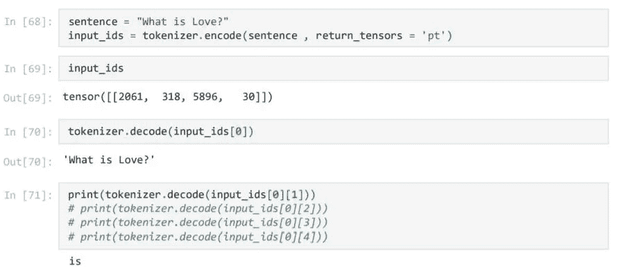
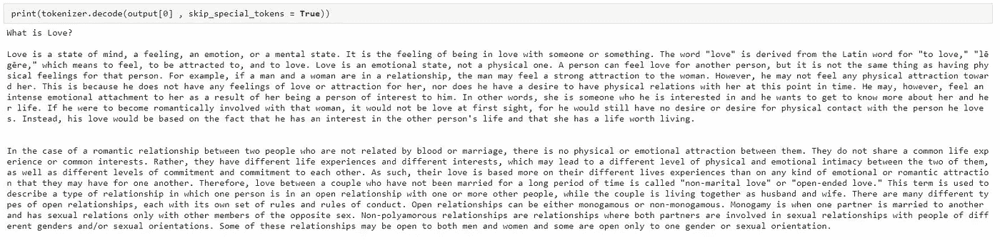
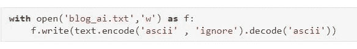

# 人工智能作家✍:使用 GPT-2 &🤗变形金刚(电影名)

> 原文：<https://medium.com/analytics-vidhya/ai-writer-text-generation-using-gpt-2-transformers-4c33d8c52d5a?source=collection_archive---------1----------------------->

> “我们的智力是我们成为人类的原因，而人工智能是这种素质的延伸。”
> 
> 纽约大学教授 Yann LeCun



演职员表: [Canva](https://www.canva.com/)

> **概述:**

这篇博客是关于人工智能如何从给定的输入序列中生成一串文本行的。对于文本生成，我们在 python 中使用了两样东西。作为语言模型，我们使用 GPT-2 大型预训练模型，对于文本生成管道，我们使用拥抱面部变形器管道。

> GPT-2 :

GPT-2 是一个基于大型[转换器](https://arxiv.org/abs/1706.03762)的语言模型，拥有 15 亿个参数，在 800 万个网页的数据集上进行训练。GPT-2 训练有一个简单的目标:预测下一个单词，给定一些文本中的所有以前的单词。数据集的多样性导致这个简单的目标包含跨不同领域的许多任务的自然发生的演示。GPT-2 是 GPT 的直接放大版，参数超过 10 倍，数据量超过 10 倍。

基本上，GPT-2 是一种用于从给定文本生成下一个文本的语言模型。

点击阅读更多

> **抱脸变形金刚:**

🤗(拥抱脸)Transformers(以前称为 PyTorch-transformers 和 PyTorch-pretrained-bert)为自然语言理解(NLU)和自然语言生成(NLG)提供通用架构(bert、GPT-2、罗伯塔、XLM、DistilBert、XLNet…)，拥有 100 多种语言中超过 32 个预训练模型以及 TensorFlow 2.0 和 PyTorch 之间的深度互操作性。

基本上拥抱面部变形是大型 python 包，它有一些预定义或预训练的函数、管道和模型。我们可以用它来完成自然语言处理任务。

GPT-2 记号赋予器和模型也包括在内🤗变形金刚。

点击此处阅读更多

> ***代号:***

**第一步**:首先，我们导入 GPT2LMHeadModel 进行文本生成，导入 GPT2Tokenizer 进行文本分词。

```
from transformers import GPT2LMHeadModel , GPT2Tokenizer
```

**第二步:**现在我们将模型加载到 Jupyter 笔记本中。

```
tokenizer = GPT2Tokenizer.from_pretrained('gpt2-large') 
model = GPT2LMHeadModel.from_pretrained('gpt2-large' , 
pad_token_id = tokenizer.eos_token_id)
```

步骤 3: 对于文本生成，我们必须首先向我们模型提供一些文本，然后从文本模型生成文本。我们输入到模型中的文本首先要进行预处理。所以在第三步中，我们对文本进行标记。



在第一行中，我们对文本进行编码并返回火炬张量。“pt”表示 PyTorch 张量。我们的文字转换成了数字的索引。如你所见，解码功能会将这些数字解码成文本。

**第四步:**我们使用 GPT2LMHeadModel 的 generate 函数生成文本。

```
output = model.generate(input_ids, 
max_length = 10000, 
num_beams = 5,
no_repeat_ngram_size  = 2,
early_stopping = True)
```

> **论据:**

***max_length:*** 生成文本的最大字数。

***num_beams:*** 波束搜索通过在每个时间步长保持最可能的`num_beams`个假设，并最终选择具有总体最高概率的假设，降低了遗漏隐藏的高概率单词序列的风险。

*波束搜索将总是以比贪婪搜索更高的概率找到输出序列，但不能保证找到最可能的输出。*

***no _ repeat _ ngram _ size:***虽然结果可以说更加流畅，但输出仍然包含相同单词序列的重复。一个简单的补救方法是引入*n-grams*(*a . k . a*n 个单词的单词序列)惩罚，如 [Paulus et al. (2017)](https://arxiv.org/abs/1705.04304) 和 [Klein et al. (2017)](https://arxiv.org/abs/1701.02810) 所介绍的。最常见的*n-gram*惩罚是通过手动将可能创建已经看到的 *n-gram* 的下一个单词的概率设置为 0，来确保没有 *n-gram* 出现两次。

***early _ stopping:***`early_stopping=True`以便当所有波束假设到达 EOS 令牌时生成完成。

点击阅读更多关于参数[的信息](https://huggingface.co/blog/how-to-generate)

作为回报，我们从该函数中获得令牌 id。在解码令牌 id 之后，我们得到我们的结果。

下面的段落是我们的模特写的。

“爱是什么？”是输入序列。

```
What is Love?

Love is a state of mind, a feeling, an emotion, or a mental state. It is the feeling of being in love with someone or something. The word "love" is derived from the Latin word for "to love," "lēgēre," which means to feel, to be attracted to, and to love. Love is an emotional state, not a physical one. A person can feel love for another person, but it is not the same thing as having physical feelings for that person. For example, if a man and a woman are in a relationship, the man may feel a strong attraction to the woman. However, he may not feel any physical attraction toward her. This is because he does not have any feelings of love or attraction for her, nor does he have a desire to have physical relations with her at this point in time. He may, however, feel an intense emotional attachment to her as a result of her being a person of interest to him. In other words, she is someone who he is interested in and he wants to get to know more about her and her life. If he were to become romantically involved with that woman, it would not be love at first sight, for he would still have no desire or desire for physical contact with the person he loves. Instead, his love would be based on the fact that he has an interest in the other person's life and that she has a life worth living.

In the case of a romantic relationship between two people who are not related by blood or marriage, there is no physical or emotional attraction between them. They do not share a common life experience or common interests. Rather, they have different life experiences and different interests, which may lead to a different level of physical and emotional intimacy between the two of them, as well as different levels of commitment and commitment to each other. As such, their love is based more on their different lives experiences than on any kind of emotional or romantic attraction that they may have for one another. Therefore, love between a couple who have not been married for a long period of time is called "non-marital love" or "open-ended love." This term is used to describe a type of relationship in which one person is in an open relationship with one or more other people, while the couple is living together as husband and wife. There are many different types of open relationships, each with its own set of rules and rules of conduct. Open relationships can be either monogamous or non-monogamous. Monogamy is when one partner is married to another and has sexual relations only with other members of the opposite sex. Non-polyamorous relationships are relationships where both partners are involved in sexual relationships with people of different genders and/or sexual orientations. Some of these relationships may be open to both men and women and some are open only to one gender or sexual orientation.
```



输出快照

> ***保存生成的文本:***



将文本保存在 txt 文件中

> **代码:**

[](https://github.com/manthan89-py/AI-Blog-Writter) [## man than 89-py/AI-Blog-writer

### 这个项目是用来生成一个博客帖子使用自然语言处理，拥抱脸变形金刚和 GPT-2…

github.com](https://github.com/manthan89-py/AI-Blog-Writter) 

> **结论:**

在这篇博客中，我们学习了使用变形金刚和 GPT-2 预训练模型生成文本。我们还可以从这个模型中生成许多文章或段落。我希望你能从这个博客中学到一些东西。

> **领英:**

 [## 印度古吉拉特邦苏拉特曼丹·比卡第亚-查罗特科技大学|…

### 查看 Manthan Bhikadiya 在世界上最大的职业社区 LinkedIn 上的个人资料。Manthan 有一份工作列在…

www.linkedin.com](https://www.linkedin.com/in/manthanbhikadiya/) 

> **更多博客和项目:**

***项目:***

[](https://github.com/manthan89-py) [## manthan89-py -概述

### 对 AI、深度学习、机器学习、计算机视觉、区块链、Flutter 感兴趣😇。做一些竞争性的…

github.com](https://github.com/manthan89-py) 

***博客:***

[](https://manthan-bhikadiya.medium.com/) [## 曼丹·比卡第亚·🖋-中等

### 机器学习、深度学习、人工智能是未来。我们几乎在每个领域都使用这些技术…

manthan-bhikadiya.medium.com](https://manthan-bhikadiya.medium.com/) 

> **最终注释:**

**感谢阅读！如果你喜欢这篇文章，请点击**👏**尽可能多次按下按钮。这将意味着很多，并鼓励我继续分享我的知识。如果你喜欢我的内容，请在 medium 上关注我，我会尽可能多地发布博客。**