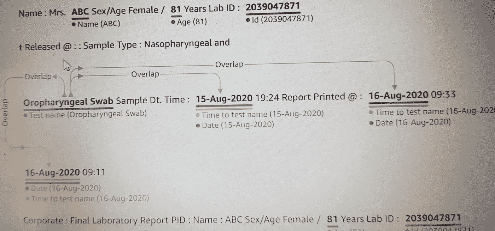
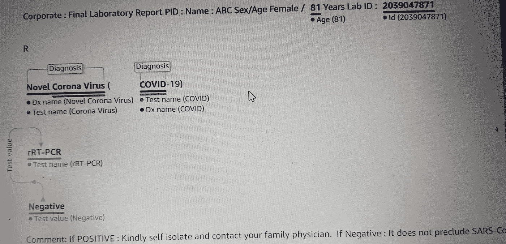

# AIaaS —开箱即用的预构建解决方案

> 原文：<https://medium.com/analytics-vidhya/aiaas-out-of-the-box-pre-built-solutions-7a8534e1a1d8?source=collection_archive---------26----------------------->

*本文作为* [*数据科学博客*](https://datahack.analyticsvidhya.com/contest/data-science-blogathon-4/) *的一部分发表。*

# 介绍

软件即服务、基础设施即服务、平台即服务等。都是大家在技术世界中听说过的常见服务。但是人工智能即服务呢？它是一个第三方人工智能解决方案，具有成本效益，是内部开发软件的替代方案。AIaaS 相对较新，它的出现是因为人工智能在 IT 行业日益流行。

人工智能即服务(AIaaS)使人工智能技术可以为每个人所用。它以最小的努力提供了快速、经济高效且随时可用的解决方案。使用 AiaaS，您不必太担心数据、模型训练等，因为这些服务是已经用数百万数据训练过的特定 ML /DL 模型，以完成特定任务，如图像处理(使用计算机视觉相关的深度学习算法)或文本或音频处理(使用 NLP 相关的深度学习算法)。我们只需要调用一个 API，不需要考虑后台发生了什么，就可以从我们的自定义数据中获得我们的预测。就这么简单

# 2020 年排名前几位的云计算 AiaaS 提供商

*   亚马逊 AWS
*   微软 Azure
*   谷歌云 ML
*   IBM 沃森

# 概述:

在这篇博客中，我将向您展示 AWS 的一些非常有趣的人工智能服务的输出，这些服务可以通过简单的 API 调用获得，并可以在无服务器架构平台上实现。这篇博客只是试图解释 AIaaS 的力量，以及我们可以多快地从深度学习模型(计算机视觉，NLP)中获得预测，而无需我们自己立即建立和训练模型。然后，我们可以根据我们的业务模型使用这些预测来做进一步的处理。

*   从给定图像中检测人脸
*   从图像中检测标签和关键点
*   无格式文本的解释(医疗报告)

***亚马逊 Rekognition*** 是 2016 年上线的基于云的软件即服务计算机视觉平台。亚马逊 Rekognition 可以检测图像中的人脸。您可以获得有关在图像中检测到人脸的位置、面部标志(如眼睛的位置)以及检测到的情绪(例如，表现出高兴或悲伤)的信息。当您提供包含面部的图像时，Amazon Rekognition 会检测图像中的面部，分析面部的面部属性，然后返回图像中检测到的面部和面部属性的百分比置信度得分。在这篇博客中，我使用 AWS Rekognition API 很快从板球之神 Sachin Tendulkar 的图像中提取了面部属性

**输入图像(人脸识别)**

**输出:**

> *{ ' face details ':[{ ' bounding box ':{ ' Width ':0.20541706681251526，' Height': 0.5380652546882629，' Left': 0.44415491819381714，' Top ':0.2403350174270325 }，' AgeRange': {'Low': 31，' High': 47}，' Smile {'Type': 'CALM '，' Confidence ':0.1781758964061737 }，{'Type': 'SAD '，' Confidence ':' Landmarks ':[{ ' Type ':' eye left '，' X': 0.47624024748802185，' Y': 0.451119601726532}，{'Type': 'eyeRight '，' X': 0\. {'Type': 'leftEyeRight '，' X': 0.49202463030815125，' Y': 0.4516719579696655}，{'Type': 'leftEyeUp '，' X': 0.47422394156455994，' Y': 0.44147491455078125}，{'Type': 'leftEyeDown '，' X ':0.4765800 ' X': 0.46838507056236267，' Y': 0.47455382347106934}，{'Type': 'midJawlineLeft '，' X ':0.4850492775406，' Y ':0.66376239066 135559 }，{'Type': 'chinBottom '，' X ':0.5252841*

我们可以看到该模型如何提取多个面部属性，包括面部的边界框坐标和许多其他属性，如年龄、情绪、性别。它还识别出图像中的人戴着太阳镜。这些数字是模型计算出的置信度得分。接下来，让我们尝试预测图像中的对象和场景。

# 输入图像(物体识别)

这张图片来自最近在悉尼举行的第三届印度和澳大利亚板球测试赛。现在让我们看看这个模型从这张图片中识别出了什么

**输出:**

> *{‘Labels’: [{‘Name’: ‘Person’, ‘Confidence’: 99.94894409179688, ‘Instances’: [{‘BoundingBox’: {‘Width’: 0.11527907848358154, ‘Height’: 0.7512875199317932, ‘Left’: 0.7737820148468018, ‘Top’: 0.23506903648376465}, ‘Confidence’: 99.94894409179688}, {‘BoundingBox’: {‘Width’: 0.1395261287689209, ‘Height’: 0.7048695683479309, ‘Left’: 0.3460443615913391, ‘Top’: 0.29426464438438416}, ‘Confidence’: 99.93523406982422}, {‘BoundingBox’: {‘Width’: 0.10976755619049072, ‘Height’: 0.7354522943496704, ‘Left’: 0.8721725940704346, ‘Top’: 0.24789121747016907}, ‘Confidence’: 99.93440246582031}, {‘BoundingBox’: {‘Width’: 0.16669583320617676, ‘Height’: 0.7431305646896362, ‘Left’: 0.48980849981307983, ‘Top’: 0.24040062725543976}, ‘Confidence’: 99.9211654663086}, {‘BoundingBox’: {‘Width’: 0.13125979900360107, ‘Height’: 0.7153438925743103, ‘Left’: 0.6609324216842651, ‘Top’: 0.280178040266037}, ‘Confidence’: 99.90505981445312}, {‘BoundingBox’: {‘Width’: 0.1306787133216858, ‘Height’: 0.6836469173431396, ‘Left’: 0.19070139527320862, ‘Top’: 0.30579841136932373}, ‘Confidence’: 99.89260864257812}, {‘BoundingBox’: {‘Width’: 0.11481481790542603, ‘Height’: 0.7306142449378967, ‘Left’: 0.08764462172985077, ‘Top’: 0.2639639377593994}, ‘Confidence’: 99.87141418457031}, {‘BoundingBox’: {‘Width’: 0.08894997835159302, ‘Height’: 0.5478061437606812, ‘Left’: 0.28502774238586426, ‘Top’: 0.2700440287590027}, ‘Confidence’: 99.86509704589844}, {‘BoundingBox’: {‘Width’: 0.05594509840011597, ‘Height’: 0.46266835927963257, ‘Left’: 0.4419107139110565, ‘Top’: 0.3235691487789154}, ‘Confidence’: 99.41387176513672}, {‘BoundingBox’: {‘Width’: 0.0792531669139862, ‘Height’: 0.6266587376594543, ‘Left’: 0.01880905032157898, ‘Top’: 0.2961716949939728}, ‘Confidence’: 99.31836700439453}, {‘BoundingBox’: {‘Width’: 0.07466930150985718, ‘Height’: 0.6673304438591003, ‘Left’: 0.06281328201293945, ‘Top’: 0.2985752522945404}, ‘Confidence’: 97.95123291015625}, {‘BoundingBox’: {‘Width’: 0.050719618797302246, ‘Height’: 0.15526556968688965, ‘Left’: 0.7476598620414734, ‘Top’: 0.283884733915329}, ‘Confidence’: 89.93550109863281}, {‘BoundingBox’: {‘Width’: 0.9160513877868652, ‘Height’: 0.2598652243614197, ‘Left’: 0.03499102592468262, ‘Top’: 0.005872916430234909}, ‘Confidence’: 74.86686706542969}], ‘Parents’: []}, {‘Name’: ‘Human’, ‘Confidence’: 99.94894409179688, ‘Instances’: [], ‘Parents’: []}, {‘Name’: ‘Shoe’, ‘Confidence’: 99.1314697265625, ‘Instances’: [{‘BoundingBox’: {‘Width’: 0.07123875617980957, ‘Height’: 0.05580293759703636, ‘Left’: 0.8770506978034973, ‘Top’: 0.9347420334815979}, ‘Confidence’: 99.1314697265625}, {‘BoundingBox’: {‘Width’: 0.037609100341796875, ‘Height’: 0.05298950895667076, ‘Left’: 0.9378718137741089, ‘Top’: 0.9069159626960754}, ‘Confidence’: 98.84042358398438}, {‘BoundingBox’: {‘Width’: 0.025996685028076172, ‘Height’: 0.051444340497255325, ‘Left’: 0.7660526037216187, ‘Top’: 0.9468560814857483}, ‘Confidence’: 96.88949584960938}, {‘BoundingBox’: {‘Width’: 0.029384374618530273, ‘Height’: 0.04353249445557594, ‘Left’: 0.7718676328659058, ‘Top’: 0.759616494178772}, ‘Confidence’: 90.52886962890625}, {‘BoundingBox’: {‘Width’: 0.0338703989982605, ‘Height’: 0.045315880328416824, ‘Left’: 0.3213094174861908, ‘Top’: 0.7607503533363342}, ‘Confidence’: 90.32197570800781}, {‘BoundingBox’: {‘Width’: 0.037531375885009766, ‘Height’: 0.042367592453956604, ‘Left’: 0.6709437966346741, ‘Top’: 0.956001341342926}, ‘Confidence’: 86.78009796142578}, {‘BoundingBox’: {‘Width’: 0.051809702068567276, ‘Height’: 0.047557536512613297, ‘Left’: 0.04164793714880943, ‘Top’: 0.8836102485656738}, ‘Confidence’: 86.4990234375}, {‘BoundingBox’: {‘Width’: 0.047059208154678345, ‘Height’: 0.04854234308004379, ‘Left’: 0.07918156683444977, ‘Top’: 0.9307251572608948}, ‘Confidence’: 79.03814697265625}, {‘BoundingBox’: {‘Width’: 0.04683256149291992, ‘Height’: 0.043805379420518875, ‘Left’: 0.48746615648269653, ‘Top’: 0.9553288221359253}, ‘Confidence’: 75.76573944091797}, {‘BoundingBox’: {‘Width’: 0.024056553840637207, ‘Height’: 0.05118529871106148, ‘Left’: 0.30561891198158264, ‘Top’: 0.7718438506126404}, ‘Confidence’: 73.63504791259766}, {‘BoundingBox’: {‘Width’: 0.041503190994262695, ‘Height’: 0.04735144227743149, ‘Left’: 0.8406999707221985, ‘Top’: 0.9409265518188477}, ‘Confidence’: 71.9170913696289}], ‘Parents’: [{‘Name’: ‘Footwear’}, {‘Name’: ‘Clothing’}]}, {‘Name’: ‘Footwear’, ‘Confidence’: 99.1314697265625, ‘Instances’: [], ‘Parents’: [{‘Name’: ‘Clothing’}]}, {‘Name’: ‘Clothing’, ‘Confidence’: 99.1314697265625, ‘Instances’: [], ‘Parents’: []}, {‘Name’: ‘Apparel’, ‘Confidence’: 99.1314697265625, ‘Instances’: [], ‘Parents’: []}, {‘Name’: ‘Building’, ‘Confidence’: 95.78233337402344, ‘Instances’: [], ‘Parents’: []}, {‘Name’: ‘Shorts’, ‘Confidence’: 94.52140045166016, ‘Instances’: [], ‘Parents’: [{‘Name’: ‘Clothing’}]}, {‘Name’: ‘Field’, ‘Confidence’: 89.95359802246094, ‘Instances’: [], ‘Parents’: []}, {‘Name’: ‘Hat’, ‘Confidence’: 89.91564178466797, ‘Instances’: [{‘BoundingBox’: {‘Width’: 0.09435784816741943, ‘Height’: 0.10483504086732864, ‘Left’: 0.5526021718978882, ‘Top’: 0.2231374979019165}, ‘Confidence’: 89.91564178466797}], ‘Parents’: [{‘Name’: ‘Clothing’}]}, {‘Name’: ‘People’, ‘Confidence’: 88.79578399658203, ‘Instances’: [], ‘Parents’: [{‘Name’: ‘Person’}]}, {‘Name’: ‘Arena’, ‘Confidence’: 88.33050537109375, ‘Instances’: [], ‘Parents’: [{‘Name’: ‘Building’}]}, {‘Name’: ‘Stadium’, ‘Confidence’: 86.9452896118164, ‘Instances’: [], ‘Parents’: [{‘Name’: ‘Arena’}, {‘Name’: ‘Building’}]}, {‘Name’: ‘Helmet’, ‘Confidence’: 81.95767211914062, ‘Instances’: [{‘BoundingBox’: {‘Width’: 0.056189119815826416, ‘Height’: 0.1054595559835434, ‘Left’: 0.3773099184036255, ‘Top’: 0.2766309082508087}, ‘Confidence’: 81.95767211914062}, {‘BoundingBox’: {‘Width’: 0.03357630968093872, ‘Height’: 0.06521259993314743, ‘Left’: 0.44274526834487915, ‘Top’: 0.32206523418426514}, ‘Confidence’: 55.274818420410156}], ‘Parents’: [{‘Name’: ‘Clothing’}]}], ‘LabelModelVersion’: ‘2.0’, ‘ResponseMetadata’: {‘RequestId’: ‘aa76f817–1ec0–4380-a676–6730ab36f3cc’, ‘HTTPStatusCode’: 200, ‘HTTPHeaders’: {‘content-type’: ‘application/x-amz-json-1.1’, ‘date’: ‘Thu, 14 Jan 2021 15:53:34 GMT’, ‘x-amzn-requestid’: ‘aa76f817–1ec0–4380-a676–6730ab36f3cc’, ‘content-length’: ‘5541’, ‘connection’: ‘keep-alive’}, ‘RetryAttempts’: 0}}*

我们可以再次看到，我们得到了很多细节的高置信度得分。该模型识别如下对象

*   人类
*   鞋子(运动员)
*   鞋类
*   头盔
*   衣服
*   运动
*   田
*   帽子
*   体育场

我们还可以将所有这些输出作为 JSON 文件

> *{*
> 
> *【标签】:【*
> 
> *{*
> 
> *“姓名”:“人”，*
> 
> *【信心】:99.9179688，*
> 
> *“实例”:*
> 
> *{*
> 
> *“边界框”:{*
> 
> *【宽度】:0.11527907848358154，*
> 
> *【身高】:0.7512875199317932，*
> 
> *“左”:0.777820148468018，*
> 
> *“顶”:0.2356903648376465*
> 
> *}，*
> 
> *【信心】:99.9977968986767*
> 
> *}，*
> 
> *{*
> 
> *“边界框”:{*
> 
> *【宽度】:0.1395261287689209，*
> 
> *【身高】:0.7048695683479309，*
> 
> *“左”:0.3460443615913391，*
> 
> *“顶”:0.29426464438438416*
> 
> *}，*
> 
> *【信心】:99.96982422*
> 
> *}，*
> 
> *{*
> 
> *"BoundingBox": {*
> 
> *【宽度】:0.10976755619049072，*
> 
> *【身高】:0.7354522943496704，*
> 
> *“左”:0.8721725940704346，*
> 
> *【最高】:0.247121747016907*
> 
> *}，*
> 
> *“信心”:99.96582031*
> 
> *}，*
> 
> *{*
> 
> *"BoundingBox": {*
> 
> *【宽度】:0.16669583320617676，*
> 
> *【身高】:0.7431305646896362，*
> 
> *“左”:0.4880849981307983，*
> 
> *【最高】:0.240062725543976*
> 
> *}，*
> 
> *【信心】:99.926663086*
> 
> *}，*
> 
> *{*
> 
> *"BoundingBox": {*
> 
> *【宽度】:0.13125979900360107，*
> 
> *【身高】:0.7153438925743103，*
> 
> *“左”:0.6609324216842651，*
> 
> *“顶”:0.280178040266037*
> 
> *}，*
> 
> *【信心】:99.91445312*
> 
> *}，*
> 
> *{*
> 
> *“边界框”:{*
> 
> *【宽度】:0.1306787133216858，*
> 
> *【身高】:0.6836469173431396，*
> 
> *“左”:0.19070139527320862，*
> 
> *“顶部”:0.31136932373*
> 
> *}，*
> 
> *“信心”:99.84257812*
> 
> *}，*
> 
> *{*
> 
> *“边界框”:{*
> 
> *【宽度】:0.11481481790542603，*
> 
> *【身高】:0.7306142449378967，*
> 
> *“左”:0.08764462172985077，*
> 
> *“最高”:0.2639639377593994*
> 
> *}，*
> 
> *【信心】:99.18457031*
> 
> *}，*
> 
> *{*
> 
> *“边界框”:{*
> 
> *【宽度】:0.08894997835159302，*
> 
> *【身高】:0.5478061437606812，*
> 
> *“左”:0.28502774238586426，*
> 
> *“最高”:0.2700440287590027*
> 
> *}，*
> 
> *【信心】:99.86589844*
> 
> *}，*
> 
> *{*
> 
> *“边界框”:{*
> 
> *【宽度】:0.05594509840011597，*
> 
> *【身高】:0.46266835927963257，*
> 
> *“左”:0.4419107139110565，*
> 
> *【最高】:0.32487789154*
> 
> *}，*
> 
> *【信心】:99.6513672*
> 
> *}，*
> 
> *{*
> 
> *“边界框”:{*
> 
> *【宽度】:0.0792531669139862，*
> 
> *【身高】:0.6266587376594543，*
> 
> *“左”:0.01880905032157898，*
> 
> *“顶”:0.2961716949939728*
> 
> *}，*
> 
> *【信心】:99.3339453*
> 
> *}，*
> 
> *{*
> 
> *“边界框”:{*
> 
> *【宽度】:0.07466930150985718，*
> 
> *【身高】:0.6673304438591003，*
> 
> *“左”:0.06281328201293945，*
> 
> *【最高】:0.298752522945404*
> 
> *}，*
> 
> *【自信度】:97.9991015625*
> 
> *}，*
> 
> *{*
> 
> *"BoundingBox": {*
> 
> *【宽度】:0.05719618797302246，*
> 
> *【身高】:0.15526556968688965，*
> 
> *“左”:0.7476598620414734，*
> 
> *“顶”:0.283884733915329*
> 
> *}，*
> 
> *【信心】:89.86863281*
> 
> *}，*
> 
> *{*
> 
> *"BoundingBox": {*
> 
> *【宽度】:0.9160513877868652，*
> 
> *【身高】:0.2598652243614197，*
> 
> *“左”:0.03499102592468262，*
> 
> *“顶”:0.00572916430234909*
> 
> *}，*
> 
> *【信心】:74.86542969*
> 
> *}*
> 
> *，*
> 
> *【父母】:[]*
> 
> *}，*
> 
> *{*
> 
> *【姓名】:【人类】，*
> 
> *【信心】:99.99179688，*
> 
> *【实例】:[]，*
> 
> *【父母】:[]*
> 
> *}，*
> 
> *{*
> 
> *【名称】:【鞋子】，*
> 
> *【信心】:99.134697265625，*
> 
> *“实例”:*
> 
> *{*
> 
> *“边界框”:{*
> 
> *【宽度】:0.07123875617980957，*
> 
> *【身高】:0.05580293759703636，*
> 
> *“左”:0.8770506978034973，*
> 
> *“顶”:0.93720334815979*
> 
> *}，*
> 
> *“信心”:99.1697265625*
> 
> *}，*
> 
> *{*
> 
> *“边界框”:{*
> 
> *【宽度】:0.037609100341796875，*
> 
> *【身高】:0.05298950895667076，*
> 
> *“左”:0.9378718137741089，*
> 
> *【最高】:0.9069159626960754*
> 
> *}，*
> 
> *【信心】:98.8398438*
> 
> *}，*
> 
> *{*
> 
> *“边界框”:{*
> 
> *【宽度】:0.025996685028076172，*
> 
> *【身高】:0.051444340497255325，*
> 
> *“左”:0.7660526037216187，*
> 
> *“最高”:0.946560814857483*
> 
> *}，*
> 
> *“信心”:96.8960938*
> 
> *}，*
> 
> *{*
> 
> *“边界框”:{*
> 
> *【宽度】:0.029384374618530273，*
> 
> *【身高】:0.04353249445557594，*
> 
> *“左”:0.7718676328659058，*
> 
> *“顶”:0.759616494178772*
> 
> *}，*
> 
> *【自信度】:90.52890625*
> 
> *}，*
> 
> *{*
> 
> *“边界框”:{*
> 
> *【宽度】:0.0338703989982605，*
> 
> *【身高】:0.045315880328416824，*
> 
> *“左”:0.3213094174861908，*
> 
> *【顶部】:0.7607503533363342*
> 
> *}，*
> 
> *【自信度】:90.38800781*
> 
> *}，*
> 
> *{*
> 
> *"BoundingBox": {*
> 
> *【宽度】:0.037531375885009766，*
> 
> *【身高】:0.042367592453956604，*
> 
> *“左”:0.6709437966346741，*
> 
> *“顶”:0.956001341342926*
> 
> *}，*
> 
> *【信心】:86.76676142578*
> 
> *}，*
> 
> *{*
> 
> *"BoundingBox": {*
> 
> *【宽度】:0.051809702068567276，*
> 
> *【身高】:0.047557536512613297，*
> 
> *“左”:0.04164793714880943，*
> 
> *【最高】:0.8836102485656738*
> 
> *}，*
> 
> *【信心】:86.4990234375*
> 
> *}，*
> 
> *{*
> 
> *"BoundingBox": {*
> 
> *【宽度】:0.047059208154678345，*
> 
> *【身高】:0.04854234308004379，*
> 
> *“左”:0.07918156683444977，*
> 
> *【最高】:0.937251572608948*
> 
> *}，*
> 
> *【信心】:79.026656265625*
> 
> *}，*
> 
> *{*
> 
> *“边界框”:{*
> 
> *【宽度】:0.04683256149291992，*
> 
> *【身高】:0.043805379420518875，*
> 
> *“左”:0.48746615648269653，*
> 
> *“顶”:0.953288221359253*
> 
> *}，*
> 
> *“信心”:75.74091797*
> 
> *}，*
> 
> *{*
> 
> *“边界框”:{*
> 
> *【宽度】:0.024056553840637207，*
> 
> *【身高】:0.05118529871106148，*
> 
> *“左”:0.30561891198158264，*
> 
> *“顶”:0.7718438506126404*
> 
> *}，*
> 
> *【信心】:73.65759767676766*
> 
> *}，*
> 
> *{*
> 
> *“边界框”:{*
> 
> *【宽度】:0.041503190994262695，*
> 
> *【身高】:0.04735144227743149，*
> 
> *“左”:0.8406999707221985，*
> 
> *“顶”:0.9409265518188477*
> 
> *}，*
> 
> *【信心】:71.9696289*
> 
> *}*
> 
> *，*
> 
> *“父母”:*
> 
> *{*
> 
> *【名称】:【鞋类】*
> 
> *}，*
> 
> *{*
> 
> *【名称】:【服装】*
> 
> *}*
> 
> *】*
> 
> *}，*
> 
> *{*
> 
> *【名称】:【鞋类】，*
> 
> *【信心】:99.1697265625，*
> 
> *【实例】:[]，*
> 
> *《父母》:*
> 
> *{*
> 
> *【名称】:【服装】*
> 
> *}*
> 
> **}，**
> 
> **{**
> 
> **【名称】:【服装】，**
> 
> **【信心】:99.1697265625，**
> 
> **【实例】:[]，**
> 
> **【父母】:[]**
> 
> **}，**
> 
> **{**
> 
> **【名称】:【服饰】，**
> 
> **【信心】:99.134697265625，**
> 
> **【实例】:[]，**
> 
> **【父母】:**
> 
> **}，**
> 
> **{**
> 
> **【名称】:【建筑】，**
> 
> **【信心】:95.463574219，**
> 
> **【实例】:[]，**
> 
> **【父母】:**
> 
> **}，**
> 
> **{**
> 
> **【品名】:【短裤】，**
> 
> **【信心】:94.49638672，**
> 
> **【实例】:[]，**
> 
> **《父母》:**
> 
> **{**
> 
> **【名称】:【服装】**
> 
> **}**
> 
> ***}，***
> 
> ***{***
> 
> ***【名称】:【字段】，***
> 
> ***【信心】:90.461286621094，***
> 
> ***【实例】:[]，***
> 
> ***【父母】:[]***
> 
> ***}，***
> 
> ***{***
> 
> ***【姓名】:【帽子】，***
> 
> ***【信心】:89.9178466797，***
> 
> ***“实例”:***
> 
> ***{***
> 
> ***“边界框”:{***
> 
> ***【宽度】:0.09435784816741943，***
> 
> ***【身高】:0.10483504086732864，***
> 
> ***“左”:0.5526021718978882，***
> 
> ***【最高】:0.2231374979019165***
> 
> ***}，***
> 
> ***“信心”:89.88466797***
> 
> ***}***
> 
> ***，***
> 
> ***“父母”:***
> 
> ***{***
> 
> ***【名称】:【服装】***
> 
> ***}***
> 
> ***】***
> 
> ***}，***
> 
> ***{***
> 
> ***【姓名】:【人】，***
> 
> ***【信心】:88.86697265625，***
> 
> ***【实例】:[]，***
> 
> ***“父母”:***
> 
> ***{***
> 
> ***“姓名”:“人”***
> 
> ***}***
> 
> ***】***
> 
> ***}，***
> 
> ***{***
> 
> ***【姓名】:【竞技场】，***
> 
> ***【信心】:87.76735839844，***
> 
> ***【实例】:[]，***
> 
> ***《父母》:***
> 
> ***{***
> 
> ***【名称】:【建筑】***
> 
> ***}***
> 
> ****}，****
> 
> ***{***
> 
> ***【名称】:【体育场】，***
> 
> ***【信心】:86.18624267578，***
> 
> ***【实例】:[]，***
> 
> ***“父母”:***
> 
> ***{***
> 
> ***"姓名":"竞技场"***
> 
> ***}，***
> 
> ***{***
> 
> ***【名称】:【建筑】***
> 
> ***}***
> 
> ***】***
> 
> ***}，***
> 
> ***{***
> 
> ***【名称】:【头盔】，***
> 
> ***【信心】:81.911914062，***
> 
> ***“实例”:***
> 
> ***{***
> 
> ***“bounding box”:{***
> 
> ***【宽度】:0.056189119815826416，***
> 
> ***【身高】:0.1054595559835434，***
> 
> ***“左”:0.3773099184036255，***
> 
> ***【最高】:0.2766309082508087***
> 
> ***}，***
> 
> ***【自信度】:81.98914062***
> 
> ***}，***
> 
> ***{***
> 
> ***"BoundingBox": {***
> 
> ***【宽度】:0.03357630968093872，***
> 
> ***【身高】:0.06521259993314743，***
> 
> ***“左”:0.44274526834487915，***
> 
> ***“顶”:0.3206523418426514***
> 
> ***}，***
> 
> ***【信心】:55.5686786786787***
> 
> ***}***
> 
> ***，***
> 
> ***《父母》:***
> 
> ***{***
> 
> ***【名称】:【服装】***
> 
> ***}***
> 
> ***】***
> 
> ***}，***
> 
> ***{***
> 
> ***【姓名】:【人群】，***
> 
> ***【信心】:62.106300354003906，***
> 
> ***【实例】:[]，***
> 
> ***《父母》:***
> 
> ***{***
> 
> ***“姓名”:“人”***
> 
> ***}***
> 
> ***】***
> 
> ***}，***
> 
> ***{***
> 
> ***【名称】:【运动】，***
> 
> ***【信心】:58.92344970703，***
> 
> ***【实例】:[]，***
> 
> ***“父母”:***
> 
> ***{***
> 
> ***“姓名”:“人”***
> 
> ***}***
> 
> ***】***
> 
> ***}，***
> 
> ***{***
> 
> ***【名称】:【运动】，***
> 
> ***【信心】:58.944970703，***
> 
> ***【实例】:[]，***
> 
> ***“父母”:***
> 
> ***{***
> 
> ***“姓名”:“人”***
> 
> ***}***
> 
> ***】***
> 
> ***}，***
> 
> ***{***
> 
> ***【名称】:【团队运动】，***
> 
> ***【信心】:57.83535156，***
> 
> ***【实例】:[]，***
> 
> ***“父母”:***
> 
> ***{***
> 
> ***【名称】:【运动】***
> 
> ***}，***
> 
> ***{***
> 
> ***【姓名】:【团队】***
> 
> ***}，***
> 
> ***{***
> 
> ***“姓名”:“人”***
> 
> ***}，***
> 
> ***{***
> 
> ***【姓名】:【人物】***
> 
> ***}***
> 
> ***】***
> 
> ***}，***
> 
> ***{***
> 
> ***【姓名】:【团队】，***
> 
> ***【信心】:57.82873535156，***
> 
> ***【实例】:[]，***
> 
> ***《父母》:***
> 
> ***{***
> 
> ***【姓名】:【人物】***
> 
> ***}，***
> 
> ***{***
> 
> ***“姓名”:“人”***
> 
> ***}***
> 
> ***】***
> 
> ***}***
> 
> ***，***
> 
> ***" label model version ":" 2.0 "***
> 
> ***}***

**正如我们所看到的，该服务为我们提供了各种不同的属性值，我们可以根据自己的需要使用它们。想象一下，如果我们从一开始就构建相同类型的模型，会发生什么。 ***从数据采集-清洗-转换-建立模型-在高端服务器上训练它几个星期。*** *所有这些阶段都绕过了***这里我们已经有现成的解决方案了。即使使用像 ***yolo3、detectron 2、*** 这样预先训练好的模型，我们仍然需要通过上述所有阶段的流水线，才能让模型为预测做好准备****

*****我们如何实时使用这些服务(用例)**我们到目前为止看到的只是一个原始的人工智能解决方案，但它本身是如此强大？我们可以通过为我们的业务案例提供其他类似的服务来使其变得更加致命。我现在能想到的非常高层次的案例很少***

*   ******非接触式进入办公楼:*** *员工的面部和员工 ID 将在出入大楼时与人力资源记录进行匹配****
*   ******限制进入会议室/会议厅*** *人员的面部将与会议受邀者的面部进行核对****

***接下来，让我们看看亚马逊最有趣的人工智能服务之一***

# ***亚马逊理解—自然语言处理和文本分析***

***在这里，我将展示 intensive medical 如何使用没有任何特定顺序或结构的医学文本，以人类可理解的格式实时输出患者的健康数据。这些可能是医生的笔记，临床记录，或任何其他简单的实验室测试报告***

******输入患者文本(姓名被屏蔽)—纯文本，化验报告******

> ****姓名:ABC 夫人性别/年龄女/ 81 岁实验室编号:2039047871****
> 
> ****:样本类型:鼻咽和****
> 
> ***口咽拭子样本 Dt。时间:2020 年 8 月 15 日 19:24 报告打印@:2020 年 8 月 16 日 09:33***
> 
> ****最终实验室报告 PID :****
> 
> ****姓名:ABC 性别/年龄女/ 81 岁实验室编号:2039047871****
> 
> ****新型冠状病毒(新冠肺炎)****
> 
> ***如果呈阳性:请自行隔离并联系你的家庭医生。***
> 
> ****如果为阴性:不排除新型冠状病毒，不应作为患者管理的唯一依据****
> 
> ****决断。对于临床疑似患者和与已知阳性患者有过接触的患者，建议****
> 
> ****在 48 至 72 小时后用新鲜样品重新测试****
> 
> ****ICMR 注册号 NEUBE002。****

## ***输出 1 —纯文本***

> ****姓名:ABC 夫人性别/年龄女/ 81 岁实验室编号:2039047871****
> 
> ****t 释放@::样本类型:鼻咽和口咽拭子样本 Dt。时间:2020 年 8 月 15 日 19:24 报告打印@:2020 年 8 月 16 日 09:33 16 日-2020 年 8 月 09:11 公司:最终实验室报告 PID:姓名:ABC 性别/年龄女/ 81 岁实验室 ID : 2039047871 R****
> 
> ****Dx 名称(新型冠状病毒)****
> 
> ****如果呈阳性:请自行隔离并联系您的家庭医生。如果为阴性；则不排除新型冠状病毒；不应作为患者的唯一依据****
> 
> ****决策。在临床疑似患者和与已知阳性患者有过接触的患者中，它****
> 
> ****在 48 至 72 小时后重新测试新样本****
> 
> ***ICMR 注册号 NEUBE002。***

## ***输出 2 —实体关系***

************

***我们可以看到该模型是如何以这种方式将不同的实体联系起来的，我们可以很容易地识别出 ***—诊断—进行的测试—测试结果—测试日期—患者姓名—患者年龄、*** 等***

# ***结论***

***在这篇博客中，我试图强调 AIaaS 的力量以及它对我们业务的影响。这些服务的独特之处在于，它们旨在执行解决方案所针对的特定任务。通常，我们的业务可能需要无法直接映射到任何这些预构建服务的解决方案。在这种情况下，我们仍然会依靠我们自己的模型。至少在我们进入完全 AGI(人工通用智能)阶段的时候，AIaaS 将与我们的 ml /dl 模型共存***

******本文中显示的媒体不归 Analytics Vidhya 所有，由作者自行决定使用。******

***您也可以在我们的移动应用程序上阅读这篇文章***

***相关文章***

****原载于 2021 年 1 月 18 日 https://www.analyticsvidhya.com***。*****