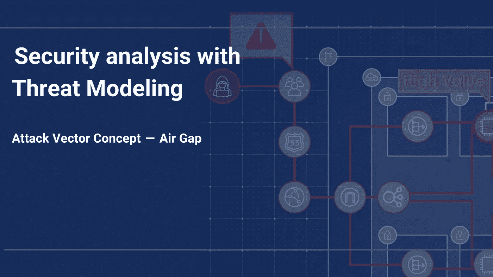
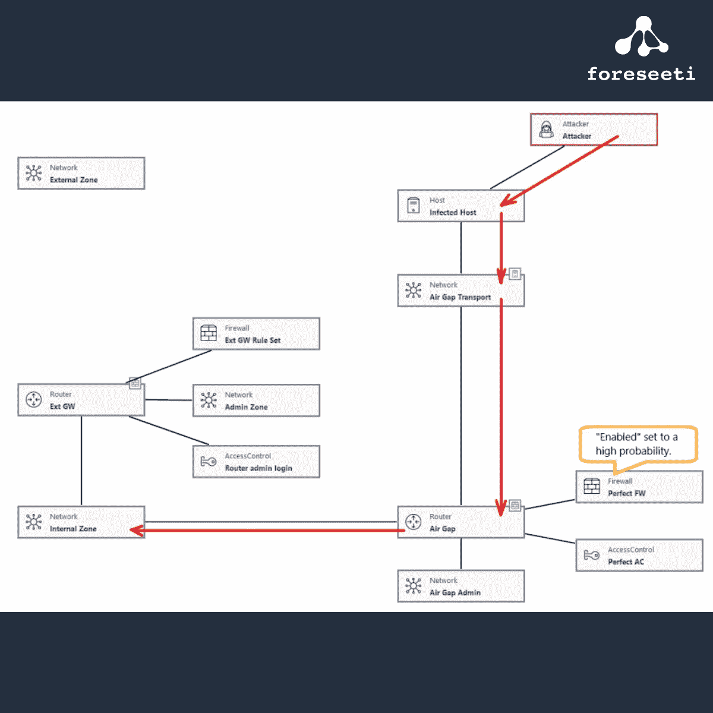
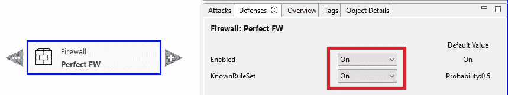
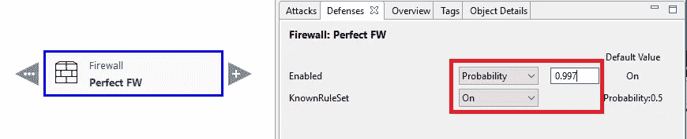

# 攻击媒介概念—空隙—通过威胁建模进行安全分析

> 原文：<https://medium.com/analytics-vidhya/air-gap-security-analysis-with-threat-modeling-9ca6fa94feb0?source=collection_archive---------23----------------------->

# 空气间隙—描述

空气间隙攻击是一种进入网络架构的攻击，即使它在网络上与外界隔离。为了成功进行这种攻击，需要或多或少地手动将一个恶意软件带入内部网络环境。当计算机或便携式媒体首先连接到外部网络，然后再连接到内部网络时，就会出现这种情况。关于这一点，有几种可能性需要考虑；首先是外部连接的计算机被感染的概率，然后是同一台计算机连接到内部网络的频率。另一种情况是从外部获取外部开发的软件或更新，并在内部安装/更新。

谈到受空气间隙保护的隔离环境，我们通常指与关键基础设施相关的高度敏感环境，如发电厂和类似设备。然而，正如我们将在下一节中看到的，将可能被感染的设备带入内部网络区域，可能会给攻击者提供深入内部网络区域的捷径，绕过几个基于网络的保护机制。

但是现在，我们先来看看传统的空气间隙环境，以及如何表示针对它的攻击。

# 模型

在模拟空气间隙时，我们没有将“外部 GW”连接到“外部区域”网络。“外部网关”可能根本不存在，否则就不会有空气间隙。然后，我们将攻击者连接到一台独立的主机上，我们认为这台主机或多或少被攻击者引入的恶意软件感染了。(攻击者和“受感染主机”之间的连接是“妥协”。然后，我们添加一个路由器对象来表示空气间隙，使(不存在的)外部网关短路。

使用 foreseeti 的[威胁建模](https://foreseeti.com/threat-modeling/)工具 [securiCAD](https://foreseeti.com/securicad/) 创建

# 攻击向量衰减

到目前为止，我们已经建立了一个代表空气间隙的路由器，并让它具有完美的参数；受感染主机端的恶意软件将无法进入内部区域。弥合空气间隙被认为是一件很难实现的事情，尽管这并非不可能。因此，我们想介绍一些有希望发生这种情况的小概率。要做到这一点，请选择防火墙连接到空气隙路由器对象，并看看它的防御。

正如我们所看到的，defence Enabled 设置为 On(默认情况下), defence KnownRuleSet 也设置为 On(对于这个特定的防火墙)。

考虑这样一种情况，即员工将他们以前连接到外部网络区域的设备连接到内部网络区域，比如一年一次。然后，恶意软件设法绕过完美的空气间隙经常(1/365=0，003)，这意味着我们可以设置空气间隙的“启用”防御为 1–0，003=0，997。

换句话说；在 0.3%的时间内，空气间隙将不起作用，而是从受感染的主机到受空气间隙保护的内部网络区域的旁路路由。

# 结论

在上面的设置中，气隙路由器实际上是业务或 IT 安全规则，规定外部设备不得连接到任何内部网络区域。所以空口路由器连接的防火墙要完善；KnownRuleSet=On。与之相连的访问控制也应完善，必要的网络管理区也应隔离，不与其他任何东西相连。根据 [securiCAD](https://foreseeti.com/) 逻辑，该路由器是不可能穿越的。受感染主机上的恶意软件将无法到达内部区域。

当引入攻击步骤衰减设置时，使用我们添加的这个完美路由器的“启用”防御，额外的路由器充当“阀门”，决定我们估计这种类型的攻击发生的可能性。