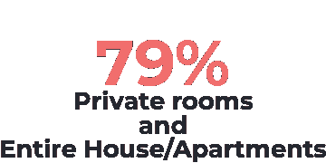
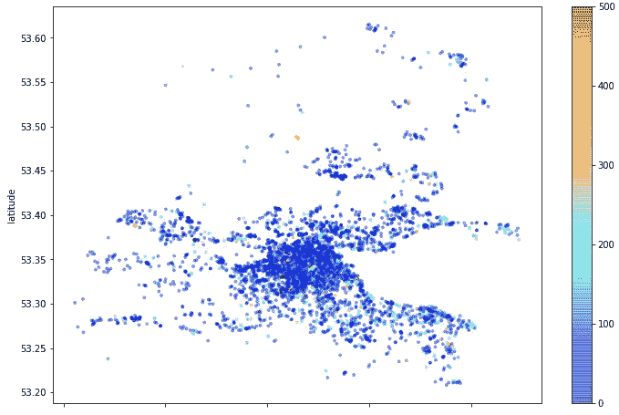

# Airbnb 数据分析—都柏林

> 原文：<https://medium.com/analytics-vidhya/airbnb-data-analysis-dublin-e14177079790?source=collection_archive---------14----------------------->

爱尔兰最古老的大学三一学院

Airbnb 是一家将寻求旅行(和住宿)的人与希望以便捷方式租赁其房产的房东联系起来的公司。这家初创公司提供了一个创新的平台，让人们可以选择住宿。

关于这家公司的一个奇怪的事实是，它已经被认为是今天最大的酒店公司。哦，而且**不拥有任何酒店！**

截至 2018 年底，**通过该公司提供的这种连接，全球已有超过 3 亿**人被托管。

Airbnb 的举措之一是向世界上一些主要城市提供该网站的数据。通过 Airbnb 门户内部的[，可以下载大量数据来开发数据科学项目和解决方案。](http://insideairbnb.com/)

你将读到一篇通过原始数据进行研究的文章，旨在提取关于 Airbnb 与都柏林市关系的宝贵见解。

## 那么，为什么去都柏林？

爱尔兰的首都是一个著名的旅游目的地，拥有充满活力的文化和丰富的历史。作为这座城市的文化遗产和爱尔兰最古老的大学**“三一学院”**的所在地，它是世界上最著名的图书馆之一**“老图书馆”**的所在地，拥有其九世纪的手稿。

然而，不要被愚弄了，历史只是参观首都的原因之一，它的旅游景点之一是吉尼斯仓库，世界上最好的啤酒的工厂，在那里你可以安排一次参观，看看制造这一奇迹的过程。所以不要以为当你了解了生产过程，你就不会品尝到世界上最著名的啤酒之一。

吉尼斯啤酒厂

圣帕特里克节，或称圣帕特里克节，是爱尔兰的传统节日，在 3 月 17 日庆祝。这一天是为了纪念爱尔兰天主教的守护神，他的使命是在该地区传播基督教。白天，爱尔兰人通常会穿上盛装，参加有烟火、杂技和‘表演’的游行。

然而，年轻的人群通常在晚上挤满了酒吧，那里有特别的节目，有饮料折扣和音乐表演。

在旅游城市，获得住宿信息是很重要的。当我们想到旅行的时候，我们不知道我们能省多少钱。通过做一个简单的分析，我们会知道住宿的平均每日价格，其中最高的价格，最好的区域，等等。现在告诉我，你相信有可能既省钱又住在一个好地方吗？！所以，我们开始吧，也许我能说服你。

## 获取数据

项目中使用的数据是从 Airbnb 内部的[获得的。因此，要分析的数据集是一个汇总版本，网站上也有。我们的数据集有 7894 个属性和 16 个变量，属于 float、integer 和 object 类型。](http://insideairbnb.com/)

## 数据分析

在这一步中，目标是确保理解数据的结构，这样您将对分析有更好的理解。因此，将呈现关于每个变量的字典。

## 变量字典

*   `id` -财产识别号
*   `name`-物业公告标题
*   `host_id` -所有者识别号
*   `host_name` -主机名
*   `neighbourhood_group` -没有有效值的列
*   `neighbourhood`-小区名称
*   `latitude` -房产的纬度坐标
*   `longitude` -房产的经度坐标
*   `room_type` -提供的住宿类型
*   `price` -租金金额
*   `minimum_nights` -更少的租赁夜
*   `number_of_reviews` -评论数量
*   `last_review` -上次审查日期
*   `reviews_per_month` -一个月内的评论数量
*   `calculated_host_listings_count` -来自同一主机的属性数量
*   `availability_365`-365 天内的可用天数

让我们从分析前 5 个条目开始，这样我们将了解我们的数据集，然后进行更深入的分析。

了解数据框架

## 数据清理

查看`neighbourhood_group`列，可能会注意到它没有值，所以我已经删除了这些记录。

在分析过程中，我可以发现变量 price 和`minimum_nights`中存在一些异常值，为了不损害分析，这些异常值也被删除了。

## 探索性分析

当我们开始分析时，我们应该从问题开始，这样我们就知道我们需要从数据中提取什么。所以我们有一个问题列表，我会通过分析来回答。

## 平均最少要租几晚？

分析完成后，我们能够提取出这样的信息:在 T2 的平均住宿天数至少是 T4 的 2 天。这表明，主人通常会提供至少 1 晚或 2 晚的房源，让客人至少住到周末。

## 都柏林最贵的地段是哪里？

我相信你想知道最贵的地方在哪里，如果你想省钱，你会想远离位于都柏林市和 Dun Laoghaire-Rathdown 的房产，这两个地方的平均价格最高，分别是€88.37 英镑和€85.99 英镑。

## 为什么要住在更贵的地方？

都柏林市，因为它很容易到达市中心，而且因为它有各种各样的旅游景点，例如，一千多家酒吧、美丽的乔治亚风格建筑，而且它靠近其他旅游目的地，如贝尔法斯特，坐火车只需两个多小时，所以住宿价格很高。

Dun Laoghaire-Rathdown 是一个安静的小镇，居民主要是爱尔兰人，大约有 26000 人，距离都柏林只有 12 公里。如果你正在寻找一个安静的地方，值得呆在这个城市，毕竟在参观完景点后，你会想安静地睡觉。

## 最便宜的街区

如果你想节省住宿，留些钱去酒吧，购物和旅游景点。像芬戈尔和南都伯林这样的社区是更便宜的选择，€平均为 70.80 英镑，€为 63.19 英镑。

## Airbnb 上出租最多的房产类别是什么？

`room_type`栏表明平台上广告的是哪一类财产。在这个网站上，你可以选择整个公寓/房子，租一个私人房间，甚至和其他人共用一个房间。

出现最多的类别依次是:

*   私人房间
*   整栋房子/公寓
*   共享房间
*   酒店房间

在都柏林，**私人房间**和**整栋房屋/公寓**占广告中房产的 79%，只有 1%是**合租房间**。有了这些信息，我们可以得出结论，作为一个家庭(3 人或以上)或夫妇旅行是很好的选择，因为这样更容易找到住宿。

## 平均租赁价格是多少？

如果你打算去都柏林，现在让我们来谈谈平均住宿费用。

每晚的平均住宿费用是€85.22 英镑，假设在这个城市住一周，那就是€596.54 英镑。

都柏林市民每月可获得约 1，958.4€(每周 48 小时)，因此，假设一位市民想住在 **Dun Laoghaire-Rathdown，**在该酒店住两晚的费用约为 171.98€。考虑到一个学生每月的花费大约是 1300€，他还有 1786.42€要花。

住宿对大多数人来说并不便宜，但如果你有旅行的积蓄，去都柏林吧，我打赌你不会后悔。

## 与都柏林房地产价格相关的热图

如果我们将获得的关于房产数量和邻近地区的信息放在一起，我们就可以定位自己，并了解最便宜的住宿地点在哪里，以及它们离市中心有多远。

## 结论

然而，当计划一次旅行时，对住宿数据的快速分析使我们更容易决定住在哪里，并且我们可以对费用有一个估计。因此，如果我们考虑大多数巴西人的现实，去都柏林旅行的成本会很高。毕竟，不是每个人都有经济条件支付机票，住宿，甚至参观城市的景点。

如果你想访问这个项目，[点击这里！](http://bit.ly/2MzDTCX)在 [LinkedIn](https://www.linkedin.com/in/jo%C3%A3o-gustavo-borges-e-souza-6700451b8/) 上关注我，并关注我的 [GitHub](https://github.com/JoaoGustavo29/Portfolio_DataScience) ，在那里你可以找到更多未来的项目。