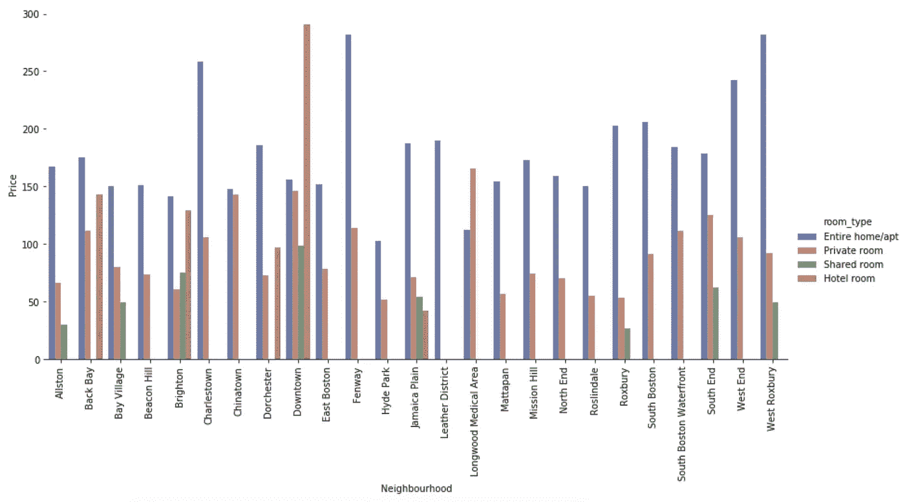

# Airbnb 数据探索、分析和特征工程

> 原文：<https://medium.com/analytics-vidhya/airbnb-data-exploration-analysis-and-feature-engineering-edbb47bf115?source=collection_archive---------6----------------------->

本文旨在开发一个基础来对 Airbnb 提供的数据进行分析。它演示了如何将废弃的数据公式化为有助于模型预测列表价格的特征。Airbnb，Inc .是一家美国度假租赁在线市场公司。Airbnb 维护并托管着一个市场，消费者可以通过其网站或应用程序访问该市场。

这里是对 **GitHub** 资源库的引用，该资源库提供了对 Python 笔记本和逐步文档的访问，以设置项目:
【https://github.com/rafayullah/Airbnb】T4

# 1.数据采集

[平台](http://insideairbnb.com/get-the-data.html)托管 Airbnb 房源的更新数据。来自任何期望位置的数据可用于该项目，然而，该分析是基于波士顿的数据进行的。也可以使用来自多个位置的数据，并且可以使用 pandas 合并这些数据。

请遵循 GitHub [资源库](https://github.com/rafayullah/Airbnb)上提供的分步指南，获取如何下载该项目的数据的详细信息。

# 2.数据预处理

为了有效地利用数据，必须应用相关的数据预处理技术。
作为预处理的一部分，执行了以下操作:

*   将日期转换为熊猫日期时间格式
*   从价格中移除货币符号并将其转换为连续数据类型 Float，将有助于模型预测连续值
*   删除一些功能的百分比符号，如接受率，将其转换为整数
*   去除异常值，这一步骤主要是为了确保数据中出现的异常不会在我们的统计和建模中重复出现:

该函数移除高于 0.999 和低于 0.001 的分位数，这确保不存在边界情况，如标价为 0 美元的虚假广告或价格值异常高的广告。对每种房间类型都执行此步骤。

# **3。特征工程**

为了进一步增强功能集，需要解析一些列，例如，可以进一步处理和解析“host_verifications”和“市容”列，以用作有效的信息源。作为示例，以下是包含默认报废值的便利设施和主机验证栏:

在使用(get_unique_features 和 get_list_as_features)函数执行相关预处理后，我们检索到以下结果:

便利设施被解析为功能

主机验证被解析为功能

此外，像主机验证功能一样，数据包含一些进一步描述主机的其他功能。一个这样的字段是“host_since”，这是广告张贴者加入平台的日期。通过计算主机在平台上的天数，我们可以增强功能。当我们执行评估时，让我们进一步了解它对模型的影响。

主机在平台上的存在天数

# 4.统计分析

**以下是 2020 年全年的上市频率分布:**

图中显示了全年挂牌的平均价格。它有一个每周发布在平台上的广告数量的计算平均值。

**现在让我们看看在一段时间内发布的列表数量和它们的平均价格之间是否存在相关性:**

计算数据集中每周的平均价格和列表总数

图显示了列表数量和平均价格之间的相关性。随着列表数量的增加，列表的平均价格也相应增加。

**继续，波士顿是一个大城市，让我们想象一下波士顿不同社区对挂牌价格的影响:**

该数字代表整个住宅/公寓、私人房间、合住房间和邻近地区酒店房间的平均标价。平均而言，整个住宅/公寓的最高要价，许多社区没有合租和酒店房间的清单。

就像不同房间类型的平均价格一样，上面的图表解释了不同社区的房源价格的平均偏差。这意味着在西罗克斯伯里附近，挂牌价波动最大。同样，海德公园的平均差异也是所有列表中最低的。

# 5.模特培训

在预处理、特征工程和将数据编码成各自的格式之后，我们像任何其他回归问题一样在训练和验证集中分割数据。

出于这个项目的目的，我们使用 XGBoost 作为我们的模型。请注意，这个实验的目的不是为了达到更高的精确度，而是为问题建立一个管道和批判性思维。这些模型可以用不同的参数或模型替换:

# 6.模型评估

训练集的模型性能(实际=蓝色，预测=橙色)

验证集上的模型性能(实际=蓝色，预测=橙色)

功能重要性(查看 GitHub 笔记本上的完整图片)

facebook、jumio、government_id 等功能。可以清楚地看到，我们之前的推导有助于模型开发。

注意:我们之前解析的功能集“便利设施”在这个模型中没有使用，但是您也可以尝试添加它。

# 7.未来模型改进

**情感分析**

Airbnb 数据还包括平台上呈现的列表的评论，在这个项目中，我已经包括了执行情感分析的方法。这可以进一步添加以提高模型性能。我使用 Spacy 的文本 blob 的目的是可以很容易地被取代。

Spacy 也犯了错误，就像在第二张唱片中，由于单词“base”的存在，它使用了负极性。但总的来说，性能是可以接受的

感谢您阅读文章，请随意使用为您的实验提供的 repo。

 [## rafayullah/Airbnb

### Airbnb，Inc .是一家美国度假租赁在线市场公司。Airbnb 维护并托管一个市场…

github.com](https://github.com/rafayullah/Airbnb)