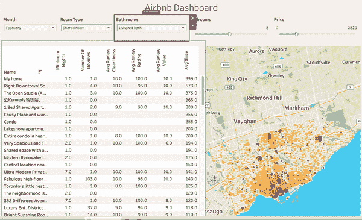
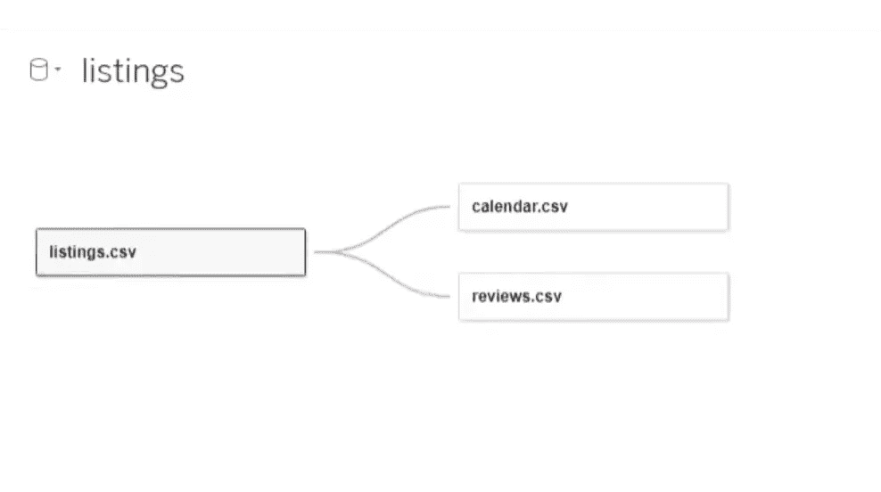
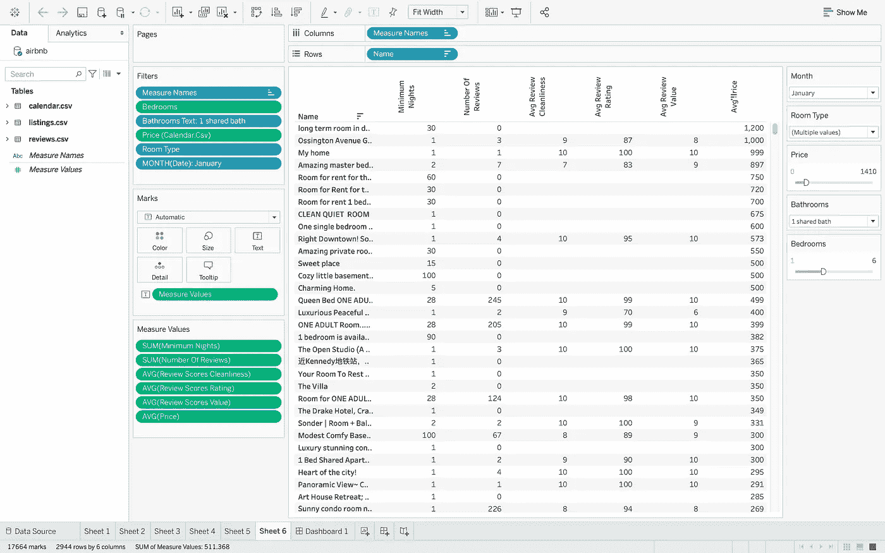
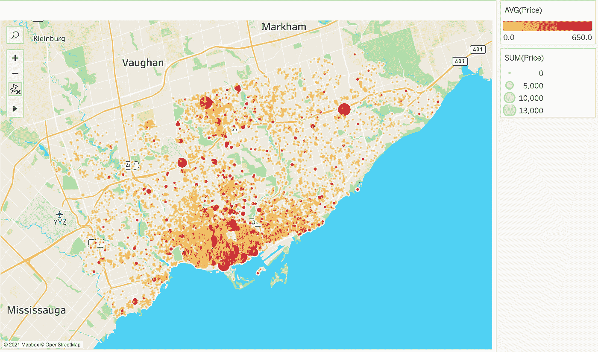
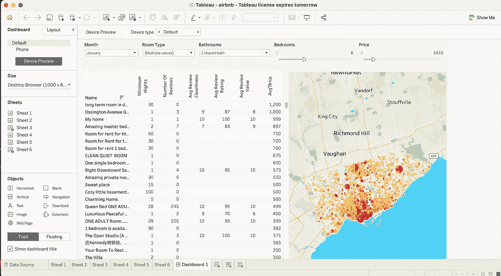

# Airbnb 数据集集成到 Tableau Dashboard

> 原文：<https://medium.com/analytics-vidhya/airbnb-data-sets-integrated-into-tableau-dashboard-8b9334ec725?source=collection_archive---------27----------------------->

**概述**

每天都会产生超过 2.5 万亿字节的数据。企业必须能够处理这些数据，以便在增加利润的同时做出明智的决策。随着市场需求的上升，能够使用分析平台是必要的。可视化分析平台使用户能够通过数据分析解决问题。Tableau 仍然是当今最受欢迎的平台之一。使用 Tableau 数据库和电子表格，复杂的信息可以被普通人理解。此外，使用 Tableau 可以更好地可视化和理解数据。

> Tableau 中的仪表板使数据能够以动态方式呈现。仪表板是许多视图的集合。通过它们，您可以同时比较各种数据类型。不必导航到单独的工作表，您可以创建一个仪表板，从不同的角度一次显示所有视图。

工作表和仪表板中的数据是同步的，因此如果您编辑一个数据，任何使用该数据的仪表板也将发生变化。电子表格和仪表板都会不断地使用来自数据源的最新数据进行更新。

本文将通过一个示例向您展示如何使用 Tableau 创建包含 Airbnb 数据集的交互式数据仪表板。

**指令**

该数据集将包括多伦多市的 Airbnb 数据的 csv 文件形式的房源、日历和评论。我使用 id 索引列(三个数据集共有的)将三个数据集连接在一起，如下所示。

Tableau 的工作表部分为我们提供了从左侧拖放适当列的灵活性。对于评论和价格，我将值调整为平均价格，因为这样做更合理。由于租金全年波动，我选择按月过滤。

应该为所有列打开筛选器。对于多选过滤器，可以使用下拉菜单形式。

我们使用数据源的经度和纬度信息来显示市场上可出租的房屋。如果不同地点的价格范围可以在地图上看到，它可以提供更多的视觉信息。我们可以通过将价格值分别添加到 size 和 color filter 中来实现这一点。由于大多数租金都在 650 美元以下，我选择了这个数字和更多的值来代表更贵的租金。所以圈子越大，家的成本越高。

在后面的步骤中，您可以通过将表和地图拖放到仪表板中来自定义仪表板。所有过滤器也将自动添加，结果将根据我们的标准进行过滤。

