# Airbnb 新用户预测——ka ggle 案例研究

> 原文：<https://medium.com/analytics-vidhya/airbnb-new-user-prediction-a-kaggle-case-study-e26e712fe8d2?source=collection_archive---------8----------------------->


图片鸣谢:我..！

随着人们对周围环境越来越好奇，他们开始跨越国界去探索遥远的地方。人类的这种好奇心催生了旅游业。多年来，该行业在世界各地蓬勃发展，并开始提供不同类型的住宿和体验，以满足人们各种各样的需求。

在这个行业中，一个非常突出的名字是一家名为 Airbnb 的初创公司(现在是一家价值数十亿美元的公司)。 **Airbnb** 成立于 2008 年，从旧金山起步，迅速扩张，目前在全球数百个城市开展业务。

## **内容:**

1.  *商业问题*
2.  *将现实世界的问题映射为 ML 问题*
3.  *数据集分析*
4.  *现实世界的业务约束*
5.  *绩效指标*
6.  *现有方法*
7.  *我的改进*
8.  *EDA*
9.  *特色工程*
10.  *建模*
11.  *Kaggle 截图*
12.  *未来工作*
13.  *参考文献*
14.  *Github 资源库链接*
15.  *Linkedin 个人资料*

1.  **业务问题:**

Airbnb 已经成为世界各地旅行者的一个非常受欢迎的选择，因为它们提供了独特的体验，也提供了昂贵酒店的替代选择。它目前在 190 个国家的 34000 多个城市开展业务。客户可以通过网站应用程序或使用 iOS/Android 应用程序进行预订。Airbnb 一直在努力改善这种预订体验，让首次入住的顾客更加方便。

本案例研究处理的问题是预测用户最有可能第一次预订的位置。准确的预测有助于通过分享更个性化的推荐以及更好地预测需求来减少预订所需的平均时间。我们使用浏览器的会话数据以及提供给我们的用户人口统计信息来创建有助于解决问题的功能。

**2** 。**将现实世界的问题映射为 ML 问题:**

这是一个多类分类问题，在给定用户数据的情况下，我们必须预测 12 个选项中任何一个的前五个最有可能的目的地，即“美国”、“法国”、“加拿大”、“英国”、“es”、“IT”、“PT”、“荷兰”、“DE”、“AU”、“NDF”和“其他”。

“NDF”和“其他”是不同的。“NDF”表示该用户没有预订,“others”表示有预订，但预订的国家不在给定的列表中。

**3。数据集分析:**

数据集取自 Kaggle 竞赛页面。

[](https://www.kaggle.com/c/airbnb-recruiting-new-user-bookings/data) [## Airbnb 新用户预订

### 新客人会在哪里预订他们的第一次旅行体验？

www.kaggle.com](https://www.kaggle.com/c/airbnb-recruiting-new-user-bookings/data) 

a)给定的文件:

培训用户、测试用户、会话、国家和年龄性别。

b)总文件大小:64.71MB

c)记录总数:2，13，451(训练用户)，62，096(测试用户)

d)***前两个文件*** 包含用户的个人信息，即年龄、性别、注册方式、语言、国家/目的地(目标)等。 ***sessions.csv*** 包含用户的 web 会话数据。此数据集中的每条记录都由 user_id 字段标识，该字段与训练数据集的 id 字段相对应。我们发现几个会话记录包含特定用户访问 Airbnb 应用程序的不同时间的信息。

sessions.csv 具有从 2014 年起的用户数据，而训练数据集具有追溯到 2010 年的记录。这意味着许多用户的会话记录不可用。只有 ***35%的训练用户*** 和 ***99%的测试用户*** 在会话数据集中有记录。

f)最后两个数据集分别包含目的地和用户的更一般的统计信息。

**4。现实世界的商业约束:**

a)低延迟很重要。

b)错误分类的成本不是很高，因为如果用户不喜欢给定的推荐，他/她可以很容易地改变目的地。

c)不太需要结果的可解释性。因为用户不太关心如何推荐这些地方。

**5。绩效指标:**

由于这是一个多类分类问题，我们可以使用像多类 Logloss 和 F1 分数这样的度量。但是 Kaggle 竞赛要求我们使用 NDCG(标准化折扣累积收益)分数。

6。现有方法:

a)只有 35%的培训用户有会话记录。只使用训练数据而不使用会话数据的人得分相对较低。

示例:

[](https://www.kaggle.com/krutarthhd/airbnb-eda-and-xgboost) [## Airbnb EDA 和 Xgboost

### 使用 Kaggle 笔记本探索和运行机器学习代码|使用 Airbnb 新用户预订的数据

www.kaggle.com](https://www.kaggle.com/krutarthhd/airbnb-eda-and-xgboost) 

b)以下内核仅使用每个用户的会话记录计数作为新特性。它放弃了所有其他会话功能。后面给出的特征重要性图证明了会话特征在建模中非常重要。因此，它的得分相对较低。

[](https://www.kaggle.com/fffjay/airbnb-new-user-bookings) [## Airbnb 新用户预订

### 使用 Kaggle 笔记本探索和运行机器学习代码|使用 Airbnb 新用户预订的数据

www.kaggle.com](https://www.kaggle.com/fffjay/airbnb-new-user-bookings) 

7。我的改进:

a)使用 data Train.csv 和 Session.csv 来突出工程。

b)会话 CSV 对于每个 ID/用户具有多个记录，其中每个记录捕获用户的动作以及在 Airbnb 上进行该动作所花费的时间。我们对每个用户的所有记录进行了分组。

c)使用 TF-IDF 矢量器的 unigram 和 bigram 来捕捉每个动作/装置的普遍性和稀有性。

d)对“*年龄*和日期列进行了广泛处理。

**8。EDA :**

让我们首先阅读 *train_users.csv* 文件并检查列。

我们看到大约有 2，13，451 条记录，总共有 16 列。在这 16 列中，有 3 列包含空值。让我们检查这些列中有多少百分比的值为空。

三个字段有空记录。

有了这些基本信息，让我们开始单变量分析。

**单因素分析:**

a)目标列:'*国家/地区 _ 目的地*'

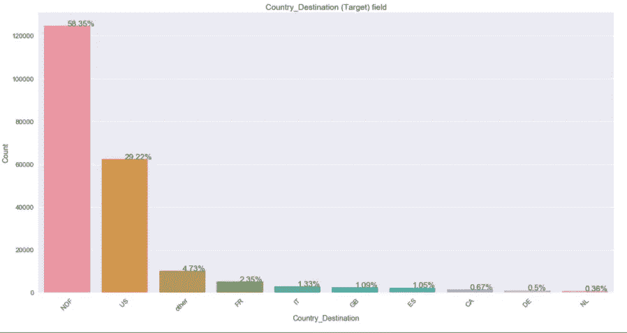

数据集非常不平衡。大多数顾客 **(58.35%)** 没有预订。其中，很大一部分用户 **(29.22%)** 预订了**【美国】**的目的地。在美国以外的国家中，**法国(‘FR’)**在 **2.35%** 中占有很高的份额。此外，相当比例的用户 **(4.73%)** 前往的目的地不在给出的选项中。

b)栏:'*性别*'

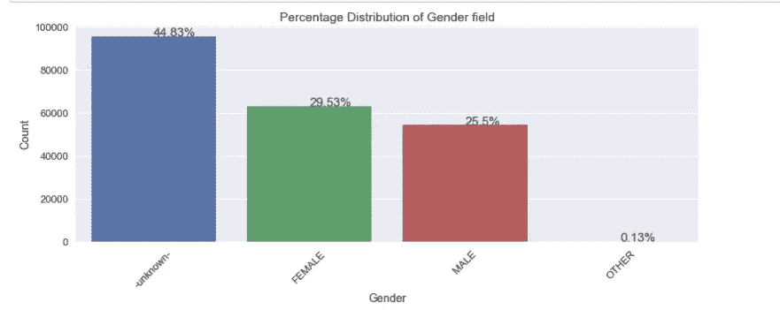

我们看到在**性别**字段中有 **4** 个类别。大多数用户 **(44.83%)** 没有透露他们的性别。在拥有手机的用户中，女性用户略多于男性用户，女性用户占 29.53%，男性用户占 25.5%。一小部分(0.13%)用户选择了**‘其他’**作为他们的性别。这意味着它们可能属于非二进制类别。

c)列:'*注册方法【T33 ' '*

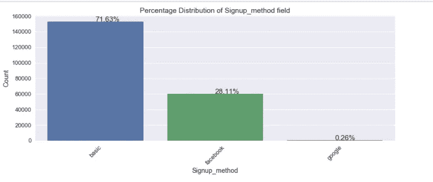

大多数用户 **(71.63%)** 都使用过**基本**方法在 Airbnb 应用上创建账户。这意味着他们可能使用了普通的电子邮件密码来注册。在剩下的用户中，绝大多数 **(28.11%)** 使用过**脸书**进行注册。很少比例的人 **(0.26%)** 使用谷歌注册。

这表明谷歌并不是注册的首选方式。此外，这可能意味着用户不太愿意以脸书或谷歌链接的形式与他们的 Airbnb 账户分享他们的个人信息，因此他们选择了基本的电子邮件密码方法来访问他们的账户。

d)列:“*语言*

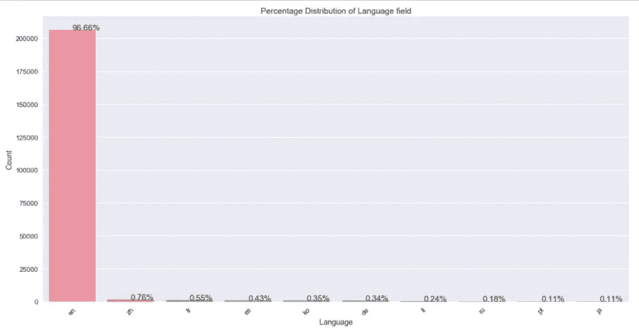

大多数用户(96.66%)将英语作为他们的语言。因为数据来自美国，所以这种行为是很正常的，因为那个国家的大多数人都把英语作为他们的主要语言。

e)栏目:'*affiliate _ channel【T1]'*

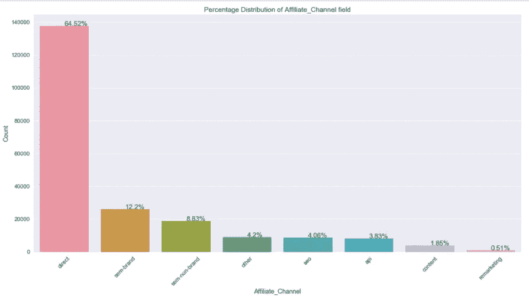

此字段解释了使用何种付费营销来接触用户，即使用了哪些不同的渠道/类别。在 **8** 个不同的类别中，**【直接】**是最有用的，因为它到达了大多数用户 **(64.52%)** 。当我们转向第二重要的类别'**半品牌**'时，这一比例急剧下降，达到了约 **12.2%** 的用户。**【内容】**和**【再营销】**的用户比例非常小，分别为 1.85%和 0.51%。作为销售应用程序的渠道，这些并没有多大用处。要么放弃它们以节省营销成本，要么对它们进行改进以让更多的用户接触到它们。

f)列:' *signup_app* '

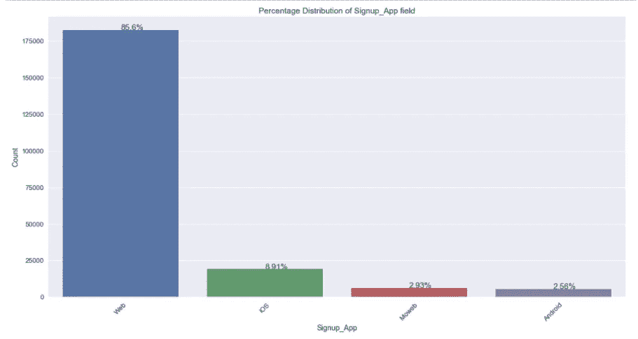

大多数用户 **(85.6%)** 使用**【Web】**创建账户。在剩下的人中，**‘iOS’**比**‘Moweb’**和**‘Android’**稍微多使用了**(大约多 5.98%)**。**【Moweb】****【Android】**并不是很受欢迎的注册应用，因为分别只有 2.93%和 2.56%的用户使用。

g)列:“*第一设备类型*

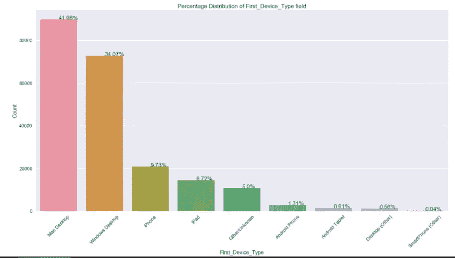

最常用于创建账户的设备是**“Mac 桌面”**，有 **41.98%** 的客户使用该设备。紧随其后的是**‘Windows 桌面’**，拥有 34.07%的客户。在剩下的类别中，在移动领域，**【iPhone】**比**【安卓手机】**更受欢迎*。同样的，**‘iPad’**在平板领域*比**‘安卓平板’**更受欢迎*。总的来说，我们可以从这个图中得出结论，在所有类别(桌面、移动、平板)中，苹果产品比安卓产品更受欢迎。*

h)列:' *first_browser* '

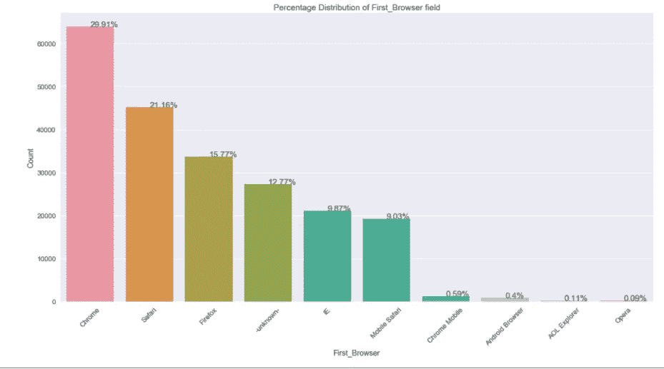

此字段跟踪客户用于访问应用程序的第一个浏览器。大部分份额 **(29.91%)** 被**【Chrome 浏览器】**占据，其次是**【Safari】**占 **21.16%** 和**【火狐】**占 **15.77%** 。从之前的剧情可知**‘Mac 桌面’**是最受用户欢迎的设备。从该图中可以看出，大部分客户更喜欢使用“Chrome”作为他们的浏览器，即使是在他们的苹果产品上，而不是苹果自己的浏览器“Safari”。另一个有趣的事实是，相当比例的 **(12.77%)** 客户不知道第一款浏览器。

I)列:'*日期 _ 账户 _ 创建*

我们从该日期字段创建了 3 列，即'*帐户 _ 创建 _ 日*'、*帐户 _ 创建 _ 月*'和'*帐户 _ 创建 _ 年*'。在这之后，让我们分别分析月和年列。

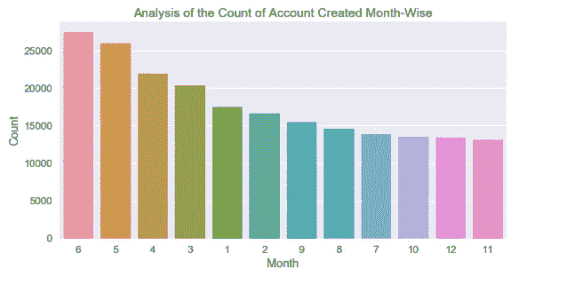

**‘六月’(06)**是客户开户最有利的月份，其次是**‘五月’(05)**。在**‘十一月’(11)**和**‘十二月’(12)**期间创建的账户数量最少。对于世界上大多数人来说，这段时间是假期，所以他们可能会在这段时间旅行。

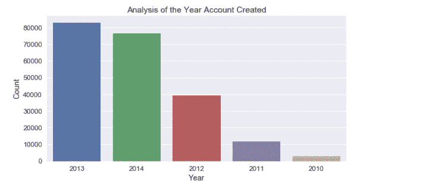

从 2010 年到 2014 年，创建的账户数量逐年增加。对于 2014 年，训练数据集中仅给出 1 月至 6 月间创建的账户。

现在，让我们检查月和年的增量，以检查季节变化。

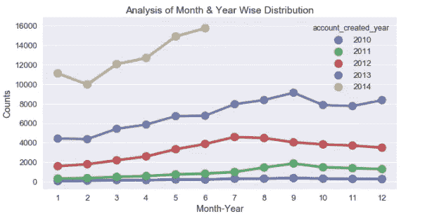

对于 4 月(04 年)和 5 月(05 年)，我们看到所有年份的帐户创建量都在增加。类似地，六月(06)和七月(07)我们看到这样的增量。8 月(08 年)和 9 月(09 年)出现增长，但仅在 2011 年和 2013 年，而 2012 年我们看到该数字有所下降。截至 2014 年 6 月，2 月份创建的账户数量最少，而 6 月份创建的账户数量最多。此外，与其他年份相比，2014 年为所有月份创建的账户数量要多得多。

j)列:'*年龄*'

如前所述，共有 87，990 名用户没有透露他们的年龄。让我们检查该列的值的分布。

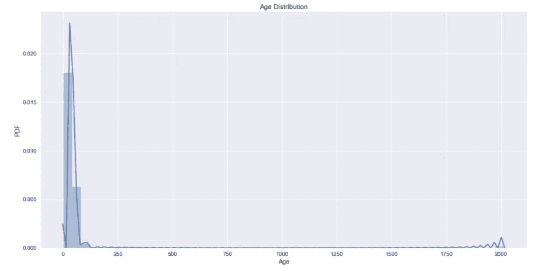

***检查百分位值以检测最小值中的异常值:***

0.04 百分位值为 **5.0** ，0.05 百分位值为 **15.0** 。这表明任何低于 0.05 百分点值的*都是一个*异常值*。因此，我们将**年龄的最小允许值设为 15.0** ，除此之外的任何其他值都将通过如下所述的处理来处理。*

***检查百分点值，检测最大值中的异常值:***

99.29 百分位值是 110.0，99.39 百分位值是 1949(近似值)。因此，这表明任何高于 99.29 百分位值的*都是异常值，并通过如下所述的处理来处理。*

我们看到有些人给出的年龄值是 19xx 或 20xx。

***我们可以假设，那些给了 19xx 作为年龄的人，错把出生年份而不是年龄给错了。***

***给定 20xx 作为年龄的人，输入任意值作为年龄。***

**我们使用以下四种情况中的任何一种来处理“*年龄*字段的值:**

1.  用**中值**即 34 填充**空值**。
2.  我们用中值(即 34)替换任何小于最小年龄的值(即 15.0)或任何大于 2007 的值。
3.  我们保持 15.0 到 117.0(当今最长寿的人的年龄)之间的值不变。
4.  对于大于 117.0 的**和小于 2007** 的**的年龄，我们假设用户错误地输入了他们的出生年份，而不是年龄。因此，我们从' *account_created_year* '字段值中减去该值，以获得他们创建帐户当天的年龄。**

```
Max Age before processing :  2014.0
```

以上述方式处理这些值后，我们看到:

```
Max Age After Year Imputation :  115.0count    213451.000000
mean         36.006526
std          10.794212
min          15.000000
25%          32.000000
50%          34.000000
75%          35.000000
max         115.000000
```

“年龄”的统计数据现在似乎好得多。

至此，我们完成了单变量分析阶段。

**双变量分析:**

a)让我们首先将“年龄”值分成 10 年间隔的区间，即“15-20”、“20-30”等。

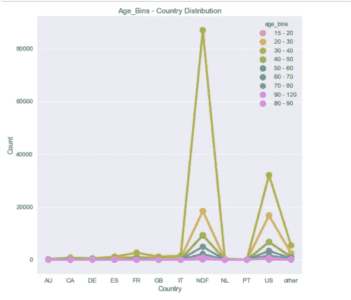

“30-40”年龄段构成了几乎所有目的地的大多数人口。对于“NDF”、“美国”和“其他”，我们看到第二个最常见的用户年龄段是“20-30 岁”。

b) ' *国家 _ 目的地*'和'*性别*':

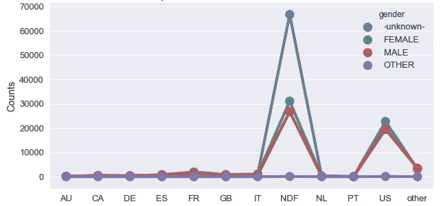

我们只看到选项**‘NDF’**和**‘US’**我们对不同的性别阶层都有大量的统计。对于其他目的地，不同性别的人数没有太多明显差异。

c) ' *国家 _ 目的地*'和'*账户 _ 创建 _ 月份*':

从月-年列的单变量分析中，我们了解到大多数账户是在 6-7-8 月份创建的。让我们看看 7 月份，为每个目的地创建的客户百分比。

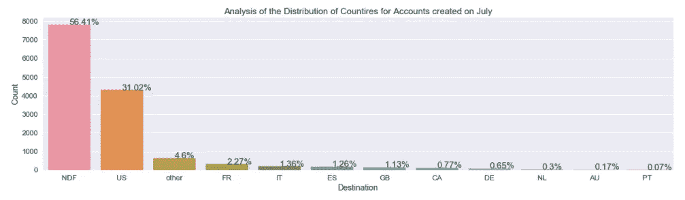

对于 7 月的**，我们看到绝大多数( **56.41%** )没有预订。 **31.02%** 的用户为“我们”做过预订。由于数据集高度偏向“NDF”和“US ”,这种行为是意料之中的。**

**多元分析:**

分析'*年龄*'、*国家 _ 目的地*'和'*性别*':

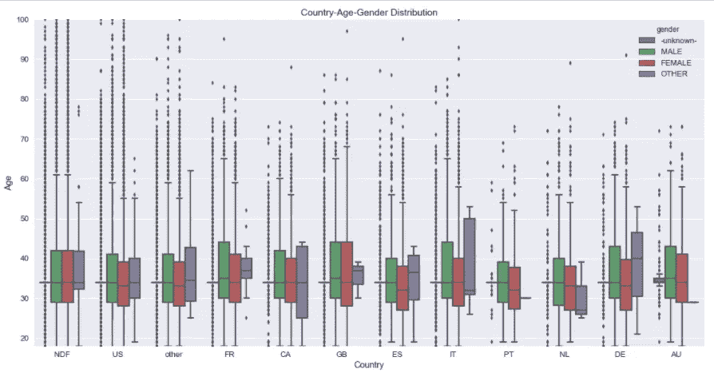

对于**‘NDF’**，我们看到‘男性’和‘女性’性别的‘年龄’分布是相同的。这几乎适用于所有其他目的地。

但是对于**“其他”**性别，我们看到*不同目的地的“年龄”变量的*分布*有相当大的差异*。

例如，对于像“法国”、“英国”和“荷兰”这样的目的地，“其他”性别的“*年龄*”的分布非常小。另一方面，对于' CA '，' it '，和' DE '来说是相当大的。

这样，我们就完成了 EDA 部分。

9。特征工程:

让我们检查 sessions.csv 文件的头，以便更好地理解会话数据。

我们看到一个*用户标识*有多个会话记录。我们需要对这些记录进行分组，这样每个用户 id 只有一条记录。

我们看到有些会话数据缺少**‘用户标识’**。这没有任何意义，因为除非我们有了 user_id，否则我们不知道这个会话数据适用于哪个用户。因此，我们将**仅**考虑具有非空 user_id 会话信息。

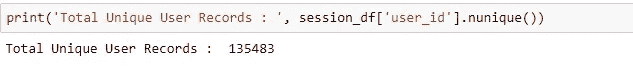

我们总共有 1，35483 个不同用户的会话数据。这些用户存在于训练和测试文件中。

***串联每个用户的会话数据行:***

现在，我们为每个*用户 id* 创建了一个记录。

**创建会话特征:**

对于'*秒 _ 已用时间*'字段，我们正在创建 3 个特征:

1.  每个用户跨多个会话花费的总秒数
2.  每个用户花费的平均秒数
3.  每个用户的会话数计数

对于 ***动作*** 字段，我们从上面的快照中看到在“*动作*”、“*动作 _ 类型*”、“*动作 _ 细节*”和“*设备 _ 类型*”列中有重复。对于功能工程部分，我们正在创建一个*列表，其中仅包含用户在访问应用程序时执行/使用的独特动作/设备*。

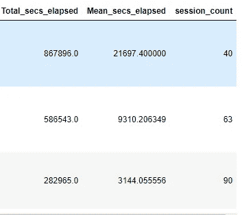

从' *secs_elapsed '字段创建的特征示例。*

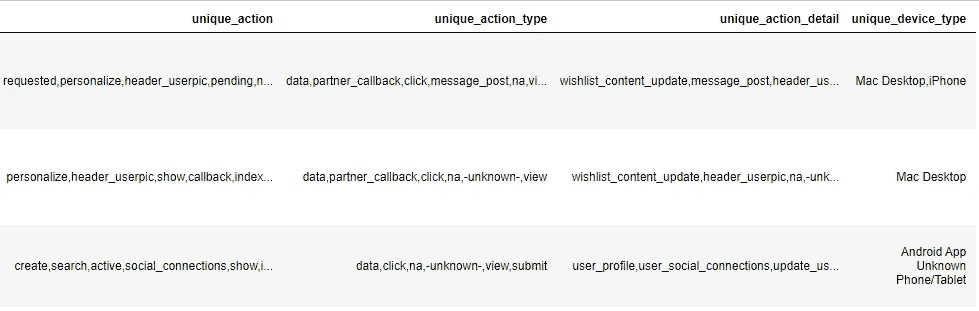

从“*动作/设备”字段创建的特征示例。*

所有这些函数的代码都在 GitHub repo 中，其链接在最后给出。

在特征创建阶段之后，让我们合并训练和会话文件中存在的公共用户:

之前我们已经看到，我们总共有 1，35483 个不同用户的会话记录。其中，只有 73815 个用户出现在培训文件中。其余的都存在于测试文件中。

我们将只使用这 73815 条记录进行建模。创建新要素后，合并的数据集总共有 31 个要素。

删除' *timestamp_first_active* '、 *date_account_created* '、 *action* '、 *action_type* '、 *action_detail* '、 *device_type* '、 *secs_elapsed* '、 *user_id* '因为我们已经预处理了这些特性并创建了需要处理的特性。

***创建 X 和 Y，将列车数据拆分成列车和 CV 进行建模:***

***让我们为分类特征创建一个热点向量。***

像这样，我们一次性编码所有剩余的分类特征。

***TFIDF 对文本字段进行矢量化:***

为不同的文本/分类字段创建向量后，我们将从训练和 cv 数据集中删除原始的非矢量化(数字)特征。

这 8 个特征都是数值特征。

***将矢量化的特征与剩余的 8 个原始数字特征连接:***

保存我们创建的最终数据框和矢量器以备将来使用。

有了这些，我们就完成了特征工程阶段。

**10。造型:**

我们已经将不同的 ML 模型应用于我们之前处理过的数据集。我们有合适的逻辑回归、朴素贝叶斯、随机森林和 GBDT 分类器，如 XGBoost 和 LightGBM 分类器。最佳测试结果来自随机森林模型。令人惊讶的是，最差的结果来自 XGBoost 模型。我们已经调整了所有模型的超参数，并绘制了热图，以了解调整的效果。我们还绘制了 RF 和 XGBoost 模型的特性重要性。

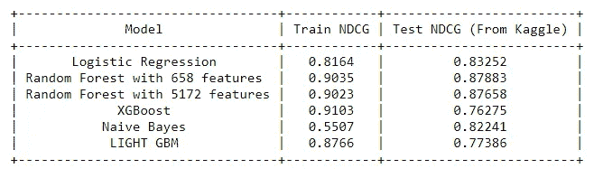

由于最佳模型被证明是随机森林模型，我们采用最佳随机森林模型的前 80%的特征，并进一步超参数调整它。

最佳参数是:

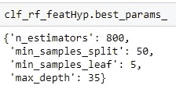

让我们绘制特征重要性图:

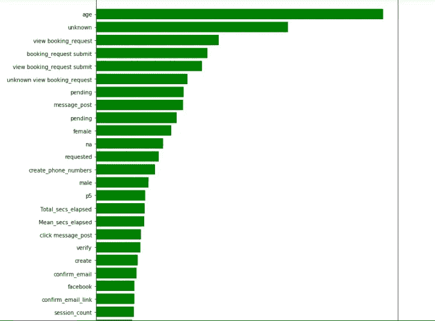

我们看到‘年龄’是最重要的特征。很好的一点是，我们已经小心翼翼地处理了这个特性。此外，我们知道会话功能比其他功能更重要，因为我们看到许多会话功能，如“查看 _ 预订 _ 请求”、“预订 _ 请求 _ 提交”等。是绘制的前 25 个特征之一。

我们绘制了训练和 cv 数据集的“max_depth”和“n_estimators”等超参数之间的热图。

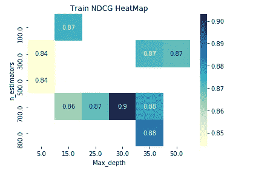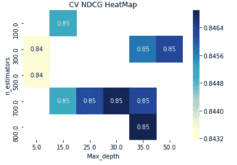

这样，让我们保存这个模型，以便我们可以在以后使用它来部署应用程序。

让我们看看这个模型对测试文件的预测的快照。

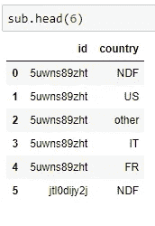

测试数据预测

**11。Kaggle 截图:**

随机森林模型给出了最好的私有分数——0.87883，接近排行榜的 20%。

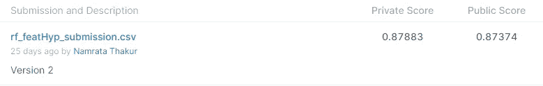

**12。未来工作:**

a)更严格的超参数调整。

b)使用 TF-IDF 矢量器的二元模型和三元模型特征，这将显著增加维度和模型复杂性，但可能给出更好的分数。

c)使用类似 LSTMs 的深度学习技术从动作列中捕获时间序列信息。

**13。参考文献:**

a)[https://r studio-pubs-static . S3 . amazonaws . com/197502 _ 9 BF 4 cf 621 a 824 e 3093 ABC 48 d5a 04 e 6 de . html](https://rstudio-pubs-static.s3.amazonaws.com/197502_9bf4cf621a824e3093abc48d5a04e6de.html)

b)[https://www . diva-portal . org/smash/get/diva 2:1108334/full text 01 . pdf](https://www.diva-portal.org/smash/get/diva2:1108334/FULLTEXT01.pdf)

c)[https://www . ka ggle . com/rounakbanik/Airbnb-new-user-bookings:](https://www.kaggle.com/rounakbanik/airbnb-new-user-bookings:)

https://www.kaggle.com/krutarthhd/airbnb-eda-and-xgboost

https://www.appliedaicourse.com/

**14。Github 回购:**

链接到我的 GitHub 知识库来进行这个案例研究—

[](https://github.com/NamrataThakur/Airbnb-New-User-Prediction) [## NamrataThakur/Airbnb-新用户-预测

### Kaggle 竞赛:Airbnb 新用户预订预测问题:商业问题:AIRBNB 已经成为非常受欢迎的…

github.com](https://github.com/NamrataThakur/Airbnb-New-User-Prediction) 

**15。LinkedIn 个人资料:**

[](https://www.linkedin.com/in/namrata-thakur-6383a855) [## 印度西孟加拉邦 Nam rata tha kur-Kolkata |职业简介| LinkedIn

### 查看 Namrata Thakur 在世界上最大的职业社区 LinkedIn 上的个人资料。纳姆拉塔有一份工作列在…

www.linkedin.com](https://www.linkedin.com/in/namrata-thakur-6383a855) 

本案例研究到此为止。如果你有任何改进的建议，请在评论中留下..！！