# Airbnb 租赁价格分析-蒙特利尔 Vs 多伦多

> 原文：<https://medium.com/analytics-vidhya/airbnb-rental-prices-analysis-montreal-vs-toronto-c405f698a314?source=collection_archive---------12----------------------->

*一种基于数据的方法，用于分析和比较蒙特利尔和多伦多的 Airbnbs 房源的价格和特点，并确定影响其价格的关键因素。*

图片来源:Unsplash，设计于 Canva

Airbnb 是一个值得信赖的社区市场，供人们在线或通过手机或平板电脑列出、发现和预订世界各地独特的住宿。Airbnb 成立于 2008 年 8 月，由于其低廉的价格、与当地社区的直接互动以及传统酒店网络的最佳替代方案，它越来越受欢迎。

在这篇文章中，我将分析蒙特利尔和多伦多 Airbnb 房源的数据集，并特别指出影响 Airbnb 房源价格的关键因素。选择这两个神奇的城市，是基于我对这个美丽的国家“加拿大”的热爱。我已经在魁北克呆了一年了，无论什么季节，我的魅力都与日俱增。

具体来说，分析中使用了每个城市的三个主要数据集:客人给出的**评论**、关于主办方的列表&价格以及包括价格和可用性的**日历**(来源于 [InsideAirbnb](http://insideairbnb.com/get-the-data.html) )。

蒙特利尔在 2010 年 6 月至 2020 年 10 月期间提供了 291，965 条评论。蒙特利尔的房屋可用性数据是从 2010 年 10 月到 2021 年 10 月的 13，594 套房屋。对于多伦多的数据，从 2008 年 8 月到 2020 年 10 月，为 18，746 所房屋撰写了 499，311 篇评论。然后，2020 年 10 月至 2021 年 10 月的房屋可用性数据可用。

在浏览了这些数据之后，我记下了一些问题，我将努力寻找答案:

> -人们租房子要收多少钱？这与蒙特利尔和多伦多相比如何？
> 
> -游览蒙特利尔和多伦多的理想时间是什么时候？
> 
> -蒙特利尔和多伦多哪个区最贵，哪个区最受好评？
> 
> -影响 Airbnb 租房价格的主要因素有哪些？

**人们租房子要收多少钱？这与蒙特利尔和多伦多相比如何？**

从全年来看，多伦多的平均价格比蒙特利尔要贵一些。在这两个城市，价格在周末飙升。价格曲线相对平坦，除了圣诞节期间的价格上涨。在多伦多，从 12 月初至 12 月底，房价平均飙升 40 多美元，蒙特利尔约为 30 美元。另一个例外是春季和夏季的上升趋势。

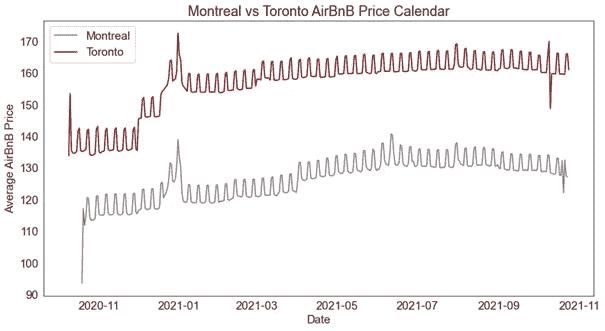

从下图中，你可以看到蒙特利尔和多伦多房屋的平均挂牌价格分布非常相似。然而，多伦多的平均房价更贵(最高价、平均价和中值价格更高)。

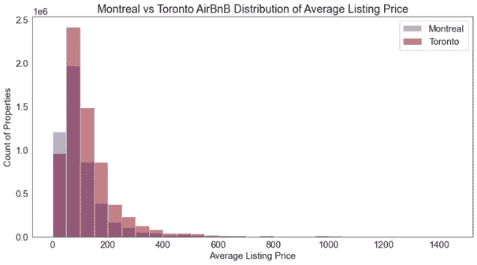

蒙特利尔 AirBnB 的价格中位数是 80 美元，而多伦多是 100 美元。因此，假设价格中位数，在蒙特利尔 AirBnB 住 6 晚需要 480 美元。蒙特利尔最便宜的 AirBnB 房屋标价为 13 美元，所以你住 6 晚需要 78 美元的预算。如果你正在寻找蒙特利尔最贵的 AirBnB 房屋，它的价格是每晚 13，294 美元，一周 79，764 美元。

在多伦多，在 AirBnB 住 6 晚要花 600 美元(假设是中间价)。多伦多最便宜的 AirBnB 房屋标价为每晚 10 美元，所以你需要 60 美元的预算，最贵的标价为每晚 13，137 美元，所以你一周需要 78，822 美元的预算。

## 游览蒙特利尔和多伦多的理想时间是什么时候？

在蒙特利尔和多伦多，任何特定日期的可售房源比例从未超过 50%。日历数据是在 2020 年 11 月检索的，所以曲线开始接近完全不可用也就不足为奇了。直到 12 月，多伦多和蒙特利尔的曲线都上升到近 50%。

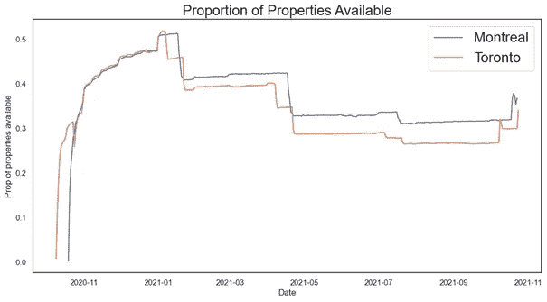

2021 年 1 月，可用性以楼梯的形式再次降低。第一次大幅下降发生在 1 月初，但在两个城市再次跃升至 70%之前，这一降幅几乎保持不变，直到春季。

> 当然，假期(圣诞节)和夏季是游览这两个城市的最佳时间。然而，如果你正在寻找更低的价格和更多的选择，秋天和冬天(除了 12 月)是游览这些美丽城市的理想时间。

**蒙特利尔和多伦多哪个街区最贵，哪个最好，应该去看看？**

在多伦多，“海滨社区-岛屿”是迄今为止 Airbnb 房源数量最多的社区。在蒙特利尔，AirBnB 密度最高的是“Ville-Marie”，其次是“Le Plateau Mont Royal”。“史坦顿岛”的机场数量最少。

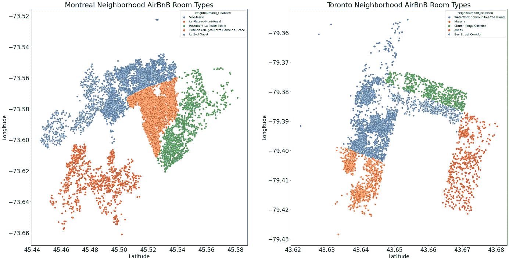

“海滨社区-岛屿”、“附属建筑”、“尼亚加拉”、“海湾街走廊”和“教堂央街走廊”的平均位置得分高于最高评级的蒙特利尔街区(“皇家高原”)。

在多伦多，“海滨社区-岛屿”获得最高分，因为它靠近最著名的城市热点(加拿大国家电视塔、多伦多国际电影节、多伦多岛公园和公园上的海滩……)，并且交通更方便(地铁电车、渡轮)。而在蒙特利尔，“皇家蒙特高原”得到最高分，它是加拿大人口最稠密的自治市。

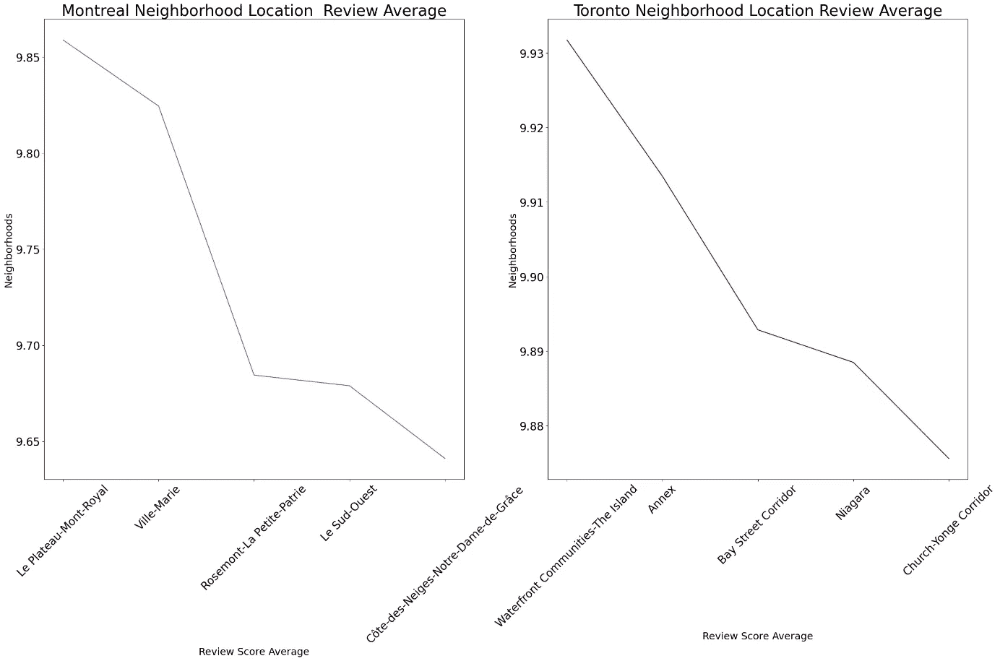

> ***显而易见，高评级的地点也会趋于昂贵这是因为在供给不变的情况下，需求越高，价格就越高。***

在多伦多，5 个被评估的社区(Airbnb 房源数量最多的前 5 名)价格更高，尤其是“海滨社区”，平均价格为 194.37 美元。对于低预算的游客来说，在“Annex”和“Church-Yonge Corridor”找到低价房源还是有一些机会的。

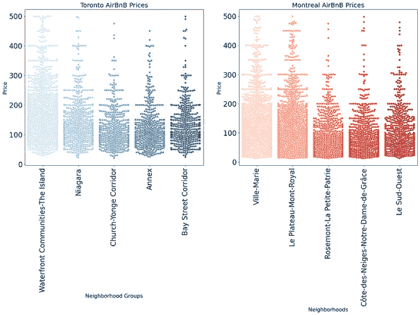

在蒙特利尔，“Ville marie”和“Le plateau Mont royal”的低价和中高价房源分布最为均衡。平均而言，“玛丽镇”似乎是最贵的(分析了前 5 名)，平均价格为 134 美元。对于低预算旅行者，有机会在“Rosemont La Petite Patrie”、“Cote des neiges notre Dame de Grace”和“le Sud Ouest”找到低价房源。

***…。*房源的一些特点…**

既然我们已经对房屋的可用性、价格和最佳邻居有了一个概念，我就要看看房源的其他特征了。

蒙特利尔和多伦多的几乎所有房源都是整栋房屋(出租整栋房屋)。剩下的大部分是私人房间(租一个卧室，可能还有一个浴室，但会有其他人在物业内)。不到 2%是合住房间(与业主或其他客人合住一个房间)。

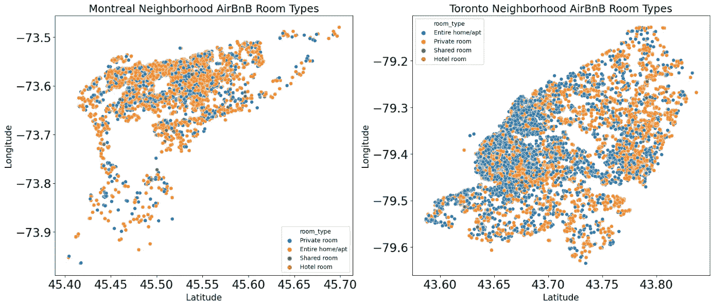

我还试图找到在蒙特利尔和多伦多都能使用的描述住宿的词语。总的来说，这两个地方听起来都是入住 AirBnB 的好地方。

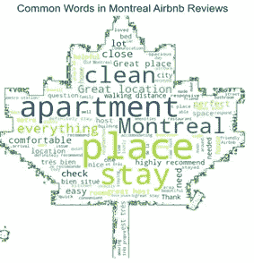

*蒙特利尔“公寓”是“干净”的“地方”，是“停留”的地方。客人欣赏“一切”，“舒适的房间”，“优越的位置”和“主人”。他们还提到“地铁”。*

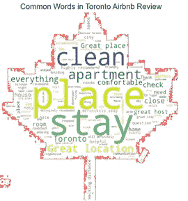

多伦多的“公寓”是“干净”的“地方”。这里提到了“好的地理位置”、“好的地方”和“有益的和伟大的主人”。他们会“强烈推荐”这套“公寓”，在这里“一切都很舒适”。

**影响 Airbnb 租房价格的主要因素有哪些？**

为了回答这个问题，我对这两个城市的因变量(Airbnb 挂牌价格)和 24 个自变量(点评、年龄、位置、评分、便利设施……)之间的关系进行了调查，使用了几种回归模型(线性、套索、岭、决策树和随机森林)。

出于篇幅的考虑，我将在这里跳过模型结果，但是如果您感兴趣，可以在 [my GitHub repo](https://github.com/Fuenj/Airbnb-Rental-Price-prediction) 中找到该项目的所有代码。此外，为了避免重复，我将只给出应用于蒙特利尔数据的模型的结果，因为我发现多伦多数据也有相同的结果。

总之，在清理数据、检查多重共线性和移除共线特征后，使用 sklearn 的 StandardScaler()对数据进行标准化。选择的评估标准是均方误差(MSE)。我还对精确度感兴趣，所以我也查看了每个生产模型的 r 平方值。

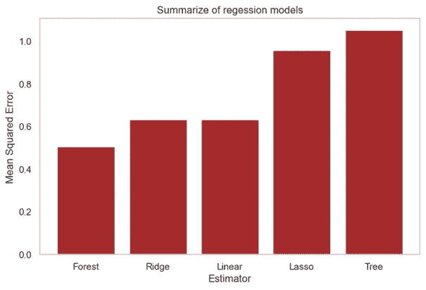

> 结果从上图可以看出，随机森林模型误差最小(R =92.5%)。因此它是最好的模型。

因此，最重要的特征是酒店能容纳多少人，这是你搜索酒店的第一件事。与位置(纬度和经度)和评分/评论相关的功能位于前十位也不足为奇。更高的评分和更多的评论会导致更高的价格。

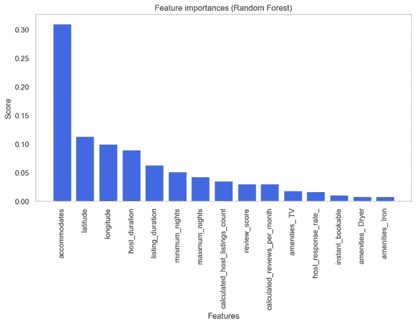

“年龄/主机持续时间”变量，即自房源建立以来的持续时间，是影响 Airbnb 房源价格的第四个最重要的特征。

## **结论**

在本文中，我们查看了来自蒙特利尔和多伦多的 AirBnB 数据，以了解一些感兴趣的领域，特别是定价，遵循跨行业数据挖掘标准流程(CRISP-DM)。

> 通过使用五个回归模型，在每个层面上都发现了一些有用的见解，帮助我们确定了一些可能影响 Airbnb 房源价格的因素。

这项工作可以通过实现推荐系统来改进，该系统使用用户提供的关键字来建议 airbnb 列表。它将返回最相关的 airbnb 房源。