# 气流、火花和 S3，将它们缝合在一起

> 原文：<https://medium.com/analytics-vidhya/airflow-spark-s3-stitching-it-all-together-1acbfba67e33?source=collection_archive---------3----------------------->

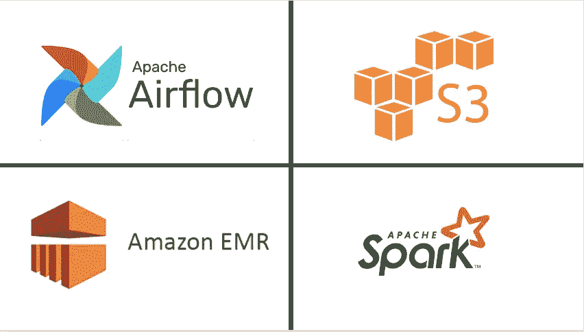

在我的上一篇文章*、*中，我描述了建立自己的 spark 集群(在 AWS 中)和从边缘节点提交集群中的 Spark 作业(在 AWS 中)的许多方法之一。然而，我们都知道业务需求如何很快超过手动运行作业的能力，我们最终寻求开发数据管道。

这篇文章将一步一步地帮助建立一个管道，从边缘节点到 spark 集群自动运行 spark 作业，所有这些都在 AWS 中完成。我希望这篇文章对初学者和中间用户有所帮助，但是专家(和中间用户)会知道更多的方法来编排这样的管道。

这篇文章的内容不应该作为设置生产管道的指南，但是，它可以作为设置开发/测试管道的指南，同时生产基础设施准备好安全性、高可用性和其他最佳实践。

前言说够了，让我们直接开始吧。

先决条件:

1.  如果你还不知道气流的基本原理，请浏览一下。
2.  一个活动的 S3 存储桶，里面有一些数据。
3.  确保您已经按照我上一篇文章中的描述设置了 EMR 集群和边缘节点。

[](https://ganguly-04.medium.com/commissioning-emr-spark-cluster-in-aws-and-accessing-it-via-an-edge-node-63a5f1e47d8b) [## 在 AWS 中调试 EMR Spark 集群并通过边缘节点访问它

### 在我作为一名数据工程师的旅程中，当大数据炒作达到白热化时，我遇到了 spark(它仍然很高…

ganguly-04.medium.com](https://ganguly-04.medium.com/commissioning-emr-spark-cluster-in-aws-and-accessing-it-via-an-edge-node-63a5f1e47d8b) 

一旦先决条件到位，我们需要考虑下一步。您需要一个编排工具来根据您的业务需求以特定的频率自动运行 spark 作业。我们从现有的各种选项中选择了气流，因此我们的下一步是在边缘节点中安装气流

在详细介绍 airflow 安装之前，我们需要考虑 airflow 的一个基本需求，即保存 airflow 元数据和所有作业信息(日志等)的数据库。).尽管 airflow 预装了 sqlite 作为数据库，但它不支持并行作业执行，因此我们不能在大多数用例中使用它。

第一步，我们将在 AWS 中设置一个 MySQL RDS 实例

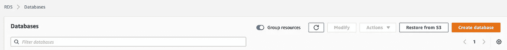

在 AWS 中，选择 RDS 作为服务，然后在下一页中单击“创建数据库”。然后按照下面的截图选择剩余的选项

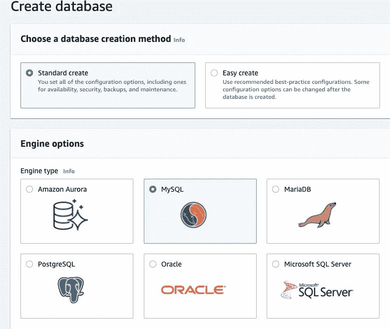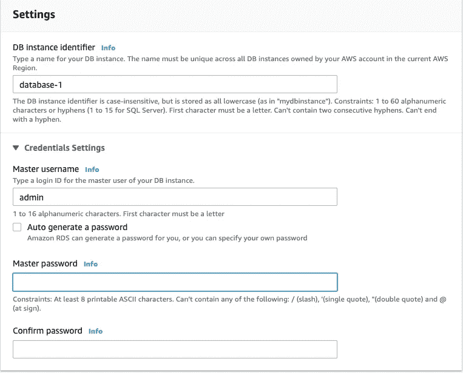

请记下您在此处提供的凭据，因为在设置 airflow 时将需要这些凭据。保持所有其他选项不变，直到您到达下面的屏幕(向下滚动)

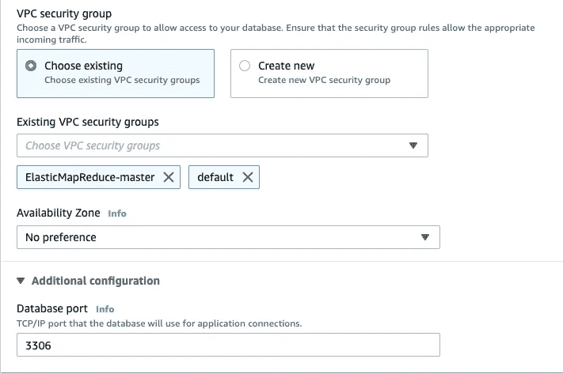

请注意，我已经选择了 EMR Master 的安全组作为 VPC 安全组以及默认的安全组。这对于允许边缘节点(将在此建立气流)和 RDS 之间的通信至关重要

展开“附加配置”并确保端口为 3306。进一步向下滚动，展开下一个“附加配置”。输入您选择的数据库名称，并记下该名称，在气流设置过程中也会用到它

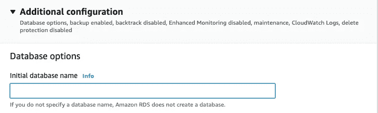

其他一切保持原样，然后点击“创建数据库”。当 AWS 花自己的时间建立 MySQL 数据库时，请保持冷静

数据库启动并运行后，单击数据库标识符

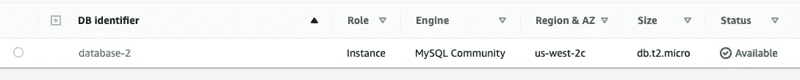

在下一个屏幕中，记下`End Point`，这将是数据库主机

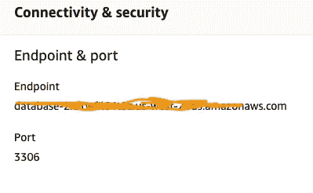

接下来向下滚动以查看安全组，并单击默认组。我们必须允许从边缘节点到此数据库的入站流量

点击`Edit Inbound Rules`,然后添加以下内容(边缘节点的公共 IP 应该放在空白处)


击中`Save rules`

现在让我们测试一下我们是否可以从边缘节点连接到数据库。执行以下步骤对此进行检查

SSH 进入边缘节点(咄！显而易见)，然后运行下面的命令

```
mysql -h [<](mailto:admin_airflow@database-2.cltwfil64t5z.us-west-2.rds.amazonaws.com)<the end point that you noted during the RDS setup>> -u <<username that you gave in the RDS setup>> -p <<the database name that you gave in the RDS setup>> (then enter password on prompt)
```

你现在应该可以看到 mysql 提示符了，在 mysql 提示符下运行下面的命令。这将确保 airflow 在元数据设置期间获得必要的字符支持(不运行这将使 airflow db 初始化失败)

```
alter database <<the database name that you gave in the RDS setup>> CHARACTER SET utf8 COLLATE utf8_unicode_ci;
```

现在，您的数据库已经设置好支持 airflow 安装和后续作业执行。

数据库创建完成后，我们现在开始安装 airflow。我们将安装气流 2.0，而不是最新版本 2.0.1。这样选择的原因是，如果 EC2 实例(在我们的例子中是边缘节点)中安装的 sqlite 版本小于 3.15，airflow 2.0.1 会出现硬故障。问题是，尽管您不打算使用 sqlite，但由于这一硬故障，您将无法启动和运行 airflow 主目录，并且如果没有设置主目录，您将无法更改 airflow 配置，因为您将无法访问 airflow.cfg 文件。

如果你知道任何其他方法来规避这个问题，请告诉我。现在，我们将避免气流 2.0.1

现在，让我们通过 SSH 进入边缘节点，并执行以下步骤来设置气流

首先检查 python 和 pip 版本

`python --version`

`pip --version`

升级 pip 版本

`curl -O [https://bootstrap.pypa.io/get-pip.py](https://bootstrap.pypa.io/get-pip.py)`

`python3 get-pip.py --user`

声明我们将用于发出 airflow 2.0.0 安装命令的变量

```
AIRFLOW_VERSION=2.0.0PYTHON_VERSION="$(python --version | cut -d " " -f 2 | cut -d "." -f 1-2)"CONSTRAINT_URL="[https://raw.githubusercontent.com/apache/airflow/constraints-${AIRFLOW_VERSION}/constraints-${PYTHON_VERSION}.txt](https://raw.githubusercontent.com/apache/airflow/constraints-${AIRFLOW_VERSION}/constraints-${PYTHON_VERSION}.txt)"
```

安装 airflow(注意，我已经在安装过程中包含了额外的包，您现在可以避免，只需从命令中去掉[amazon]部分)

```
pip install "apache-airflow[amazon]==${AIRFLOW_VERSION}" --constraint "${CONSTRAINT_URL}"
```

现在我们检查安装

```
PATH=$PATH:~/.local/binairflow version
```

最后一个命令应该显示 airflow 2.0.0(如果在安装过程中没有出现任何问题，我不希望出现任何问题)

现在到了我们需要初始化数据库的部分(这是选择 2.0.0 为我们节省时间的地方)。运行以下命令

`airflow db init`

这使得 airflow 为我们设置了 sqlite db，并为我们提供了 airflow 主目录，进入该目录并打开`airflow.cfg`文件

```
cd ~/airflowvim airflow.cfg
```

搜索`sql_alchemy_conn`的条目，修改如下

```
sql_alchemy_conn = mysql://<<username that you gave in the RDS setup>>:[<<](mailto:admin_airflow@database-2.cltwfil64t5z.us-west-2.rds.amazonaws.com)password that you gave in the RDS setup[>>@<](mailto:admin_airflow@database-2.cltwfil64t5z.us-west-2.rds.amazonaws.com)<the end point that you noted during the RDS setup>>:3306/<<the database name that you gave in the RDS setup>>
```

接下来将 executor 更改为 LocalExecutor，这一更改将允许我们在 out airflow DAGs 中实现作业并行性

```
executor = LocalExecutor
```

再次运行数据库初始化，让气流重新指向 MySQL 数据库

```
airflow db init
```

现在您已经设置好了，启动 airflow 服务器和调度程序

```
airflow webserver -D -p 8080
airflow scheduler -D
```

创建一个用户进入气流图形用户界面

```
airflow users create --username CaptainAmerica --firstname Captain --lastname America --role Admin --email [n](mailto:ganguly.04@gmail.com)osuchemail@nowhere.com
```

键入您选择的密码并记住它，将需要此凭证来进入 GUI

现在，您应该能够看到 Airflow 2.0.0 闪亮的新 GUI 了

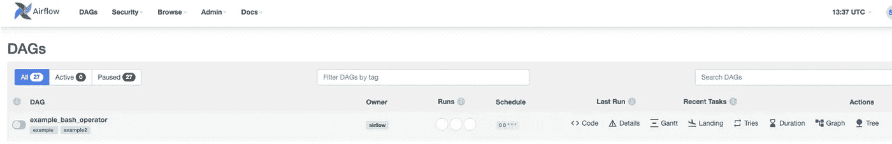

在你努力工作了这么久之后，现在是收获回报的时候了。我们现在只需要一个 DAG 和一个 spark 脚本来读写我们的 S3 存储桶

对于我的帖子，我有以下内容。第一个是我的管道的输出，第二个是源

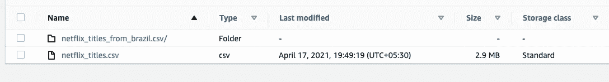

让我们编写一个样本 spark 脚本，它从桶中读取数据，执行简单的转换/过滤，然后写回到桶中

```
## We will name this script as testEMRtoS3Conn.py
import pyspark
from pyspark import SparkConf, SparkContextconf = SparkConf().setAppName('FirstSparkApp').setMaster('yarn')
sc = SparkContext(conf=conf)from pyspark.sql import SQLContext, HiveContext, SparkSession
spark = SparkSession.builder.appName('FirstSparkApp').getOrCreate()my_first_dframe = spark.read.option("header",True).csv("s3://yourBucketName/netflix_titles.csv")

my_first_dframe_filtered = my_first_dframe.filter(my_first_dframe['country']=='Brazil')

my_first_dframe_filtered.write.option("header",True).csv("s3://yourBucketName/netflix_titles_from_brazil.csv")
```

为了提交这个脚本，我们将编写一个包装器外壳脚本

```
### Let's name the script as testEMRtoS3Conn_pyWrapper.sh
#!/bin/sh

echo "calling spark script"export HADOOP_USER_NAME=hdfsspark-submit --driver-memory 2g --executor-memory 2g --executor-cores 2 --num-executors 2 --deploy-mode cluster testEMRtoS3Conn.py
```

最后，我们将创作 DAG

```
### We will name the DAG as edgeToEMRandS3
from datetime import timedeltafrom airflow import DAG
from airflow.operators.bash import BashOperator
from airflow.operators.dummy import DummyOperator
from airflow.utils.dates import days_agoargs = {
    'owner': 'airflow',
}dag = DAG(
    dag_id='edgeToEMRandS3',
    default_args=args,
    schedule_interval=None,
    start_date=days_ago(2),
    dagrun_timeout=timedelta(minutes=60),
    tags=['somethingForYouToFindYourDAG']
    #params={"example_key": "example_value"},
)run_this_first = DummyOperator(
    task_id='run_this_first',
    dag=dag,
)now_run_spark_job = BashOperator(
    task_id='now_run_spark_job',
    bash_command='bash /home/ec2-user/airflow/scripts/testEMRtoS3Conn_pyWrapper.sh ',
    dag=dag,
)run_this_first >> now_run_spark_job
```

给气流调度程序一些时间来刷新 DAGbag，然后您的 DAG 应该会显示在 GUI 中(请注意，在我的屏幕截图中，它显示为绿色，因为我已经成功运行了 DAG)

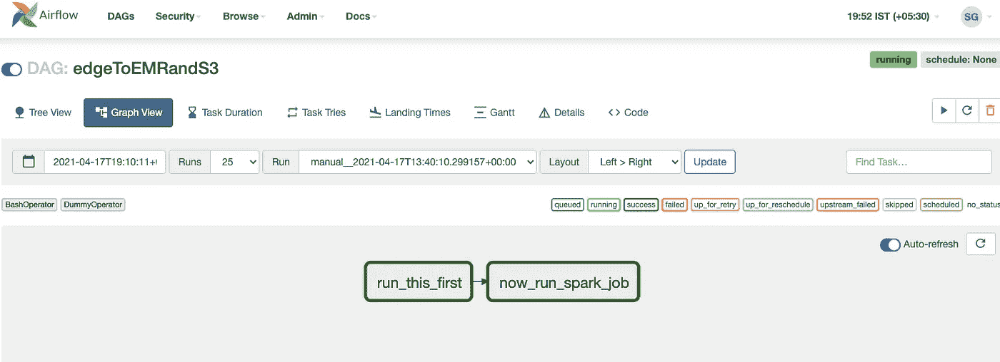

运行 DAG，一旦成功完成，您应该能够在 S3 存储桶中获得输出

希望这篇文章能帮你节省一些时间来启动和运行你的数据管道。