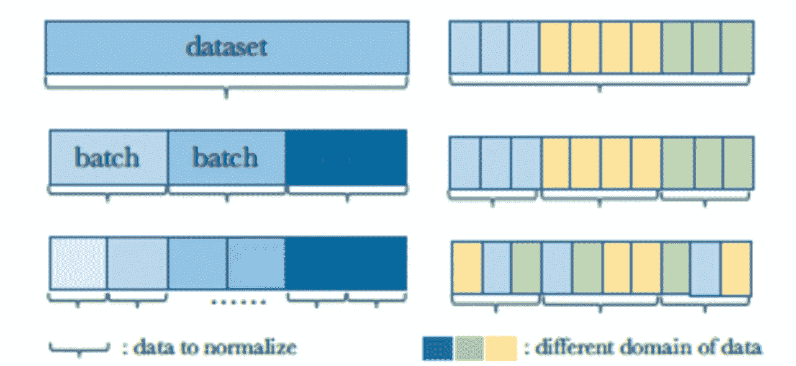

# Akira 的机器学习新闻— #18

> 原文：<https://medium.com/analytics-vidhya/akiras-machine-learning-news-18-368e82e8ae4b?source=collection_archive---------4----------------------->

2021 年第 23 周(6 月 6 日~)

## 本周特稿/新闻。

*   一项关于视觉转换器鲁棒性的研究已经发表。
*   [一项研究表明，与 ResNet](https://arxiv.org/abs/2106.01548) 相比，MLP 混合器和 ViT 更容易陷入局部最优解。MLP 混合器和 ViT 需要非常大的数据集，但如果我们能够通过使用这些学习技术来减少所需的数据量，我们将离实际应用更近一步。

## 现实世界中的机器学习

*   这里有一篇文章调查了在对抗新冠肺炎的战斗中人工智能是如何被使用的。它讨论了戴面具和人员密集的自动监控工具的巨大扩张的好处，但也讨论了由于难以消除它们而产生的道德问题。
*   [一篇文章讨论了商业高管对 AI 的理解不足](https://venturebeat.com/2021/05/25/65-of-execs-cant-explain-how-their-ai-models-make-decisions-survey-finds/)，称虽然 AI 非常强大，但使用它的人需要意识到偏见等问题。

## 报纸

*   [一项再次调查数据扩充的研究已经发表。](https://arxiv.org/abs/2105.13343)数据增强在实践中变得越来越重要，他们正在研究如何以各种方式有效地使用它。基本上，似乎数据增强越强越好。
*   [已经有一些将对比学习框架应用于监督学习的研究](https://arxiv.org/abs/2004.11362)。由于我们在实践中经常使用监督学习，我们对使用现代技术进一步开发监督学习的方法非常感兴趣。

— — — — — — — — — — — — — — — — — — –

在下面的章节中，我将介绍各种文章和论文，不仅仅是关于上述内容，还包括以下五个主题。

1.  本周特稿/新闻
2.  机器学习用例
3.  报纸
4.  机器学习技术相关文章
5.  其他主题

— — — — — — — — — — — — — — — — — — –

# 1.本周特稿/新闻

[**ViT 的鲁棒性**](https://arxiv.org/abs/2103.14586?utm_campaign=Akira%27s%20Machine%20Learning%20News%20%20%20&utm_medium=email&utm_source=Revue%20newsletter)

[2103.14586]了解用于图像分类的变压器的鲁棒性

一项检查维生素 t 稳定性的研究。在足够数据上训练的 ViT 在对抗对抗性攻击方面与 ResNet 一样健壮，但是对抗性噪声模式与 ResNet 非常不同，并且显示出略大的结构模式。他们还发现，形状感知任务受贴片大小的影响比受 ViT 模型大小的影响更大。

[**将 ViT 和 MLP-Mixer 提升到 ResNet**](https://arxiv.org/abs/2106.01548?utm_campaign=Akira%27s%20Machine%20Learning%20News%20%20%20&utm_medium=email&utm_source=Revue%20newsletter) 的水平

[2106.01548]当视觉转换器的性能优于 ResNets 时，无需预训练或强大的数据增强

MLP 混频器和 ViT 容易出现局部最优，这可以通过使用 SAM 优化器来平滑损失函数来改善。通过训练 ImageNet，准确率大大提高，达到了与 ResNet 相同的水平。

— — — — — — — — — — — — — — — — — — –

# 2.机器学习用例

[**AI 在华交易加速**](https://venturebeat.com/2021/01/26/e3-gamescom-and-other-big-events-are-still-important-to-the-games-industry/?utm_campaign=Akira%27s%20Machine%20Learning%20News%20%20%20&utm_medium=email&utm_source=Revue%20newsletter)

 [## E3、Gamescom 和其他大型活动对游戏产业仍然至关重要

### 在 Transform 2021 上提升您的企业数据技术和战略。像电子娱乐这样的大型活动…

venturebeat.com](https://venturebeat.com/2021/01/26/e3-gamescom-and-other-big-events-are-still-important-to-the-games-industry/?utm_campaign=Akira%27s%20Machine%20Learning%20News%20%20%20&utm_medium=email&utm_source=Revue%20newsletter) 

一篇关于中国如何扩大人工智能技术在投资中的应用的文章。从阅读文章来看，似乎一个名为 ZheshangFund 的 find 正在使用一种使用多智能体强化学习的算法来选择投资。

[**AI 申请去新冠肺炎**](https://thegradient.pub/how-has-ai-contributed-to-dealing-with-the-covid-19-pandemic/?utm_campaign=Akira%27s%20Machine%20Learning%20News%20%20%20&utm_medium=email&utm_source=Revue%20newsletter)

 [## 人工智能对处理新冠肺炎疫情事件有什么贡献？

### 日历上显示的是 2021 年 5 月。尽管仍有不确定性，但许多人已经接种了新冠肺炎疫苗，而且…

thegradient.pub](https://thegradient.pub/how-has-ai-contributed-to-dealing-with-the-covid-19-pandemic/?utm_campaign=Akira%27s%20Machine%20Learning%20News%20%20%20&utm_medium=email&utm_source=Revue%20newsletter) 

本文从临床应用、信息提供和安全性评估五个方面综述了人工智能在抗击新冠肺炎中的应用。它说，人工智能正被大规模用于监视目的，但一旦部署，就很难逆转，确保透明度很重要等。

[**高管对 AI 的理解低**](https://venturebeat.com/2021/05/25/65-of-execs-cant-explain-how-their-ai-models-make-decisions-survey-finds/?utm_campaign=Akira%27s%20Machine%20Learning%20News%20%20%20&utm_medium=email&utm_source=Revue%20newsletter)

 [## 调查发现，65%的高管无法解释他们的人工智能模型是如何做出决策的

### 在 Transform 2021 上提升您的企业数据技术和战略。尽管对人工智能的需求和使用日益增加…

venturebeat.com](https://venturebeat.com/2021/05/25/65-of-execs-cant-explain-how-their-ai-models-make-decisions-survey-finds/?utm_campaign=Akira%27s%20Machine%20Learning%20News%20%20%20&utm_medium=email&utm_source=Revue%20newsletter) 

许多公司正在加大对人工智能的投资，但高管们对这项技术仍缺乏了解。据一篇文章称，强大的人工智能伴随着责任，因为高管们缺乏对人工智能的道德和公平的理解。

— — — — — — — — — — — — — — — — — — –

# 3.报纸

[**将对比损失应用于监督学习**](https://arxiv.org/abs/2004.11362?utm_campaign=Akira%27s%20Machine%20Learning%20News%20%20%20&utm_medium=email&utm_source=Revue%20newsletter)

对比学习损失在监督学习中的应用研究。与通常的无监督对比学习不同，它们将具有相同标签的数据视为正例，并对其进行对比学习。比自动增强、混合等效果更好。

[**seq 2 seq 形式的物体检测**](https://arxiv.org/abs/2106.00666?utm_campaign=Akira%27s%20Machine%20Learning%20News%20%20%20&utm_medium=email&utm_source=Revue%20newsletter)**——**

****

**[2106.00666]你只看一个序列:通过物体检测重新思考视觉中的变形**

**Seq2Seq 形式的物体检测，基于 ViT 的最小变化:加入 DET 令牌，用匹配损失学习；使用 ImageNet 进行预训练，并将其用于对象检测，达到 YOLOv4-tiny 的精度。**

**[**检查如何取批次进行批次归一化**](https://arxiv.org/abs/2105.07576?utm_campaign=Akira%27s%20Machine%20Learning%20News%20%20%20&utm_medium=email&utm_source=Revue%20newsletter)**

****

**[2105.07576]重新思考 BatchNorm 中的“批处理”**

**研究如何对批次进行标准化。它表明在总体统计中使用一致性进行训练可以减少训练和测试之间的差异，并且知道哪些批次用于优化以及哪些数据用于计算总体统计是很重要的。**

**[**数据增强的强度与准确性的关系**](https://arxiv.org/abs/2105.13343?utm_campaign=Akira%27s%20Machine%20Learning%20News%20%20%20&utm_medium=email&utm_source=Revue%20newsletter)**

****

**[2105.13343]在训练期间，在每幅图像上绘制多个增强样本可有效减少测试误差**

**调查数据扩充强度和准确性之间关系的研究。这表明，由于数据扩充的引入而引起的梯度期望值的变化比梯度的方差对准确性的贡献更大。还发现，数据扩充越强，用更少的计算资源就能达到更高的精度。当使用大的小批量时，这种趋势更加明显。**

**[**结合 MLP 和变压器**](https://arxiv.org/abs/2105.14217?utm_campaign=Akira%27s%20Machine%20Learning%20News%20%20%20&utm_medium=email&utm_source=Revue%20newsletter)**

****

**[2105.14217]少即是多:少关注视觉变形金刚**

**由于自我关注的成本是图像大小的四次方，他们提出了 LIT，它在初始层使用 MLP 获取局部信息，在后半层使用自我关注。他们还采用了类似可变形 Conv 的机制。他们在目标检测和图像分类方面取得了成果。**

**— — — — — — — — — — — — — — — — — — –**

# **4.机器学习技术相关文章**

**[**强化学习对于一般 AI 来说已经足够**](https://bdtechtalks.com/2021/06/07/deepmind-artificial-intelligence-reward-maximization/?utm_campaign=Akira%27s%20Machine%20Learning%20News%20%20%20&utm_medium=email&utm_source=Revue%20newsletter)**

** [## DeepMind 科学家:强化学习对于一般 AI 来说已经足够了

### 本文是我们对人工智能研究论文的评论的一部分，这是一系列探索人工智能最新发现的文章

bdtechtalks.com](https://bdtechtalks.com/2021/06/07/deepmind-artificial-intelligence-reward-maximization/?utm_campaign=Akira%27s%20Machine%20Learning%20News%20%20%20&utm_medium=email&utm_source=Revue%20newsletter) 

【DeepMind 科学家:强化学习对于一般 AI 来说已经足够了——tech talks】

一篇解释这篇论文的文章名为“Rewad 就够了”。它认为，智力和相关能力不是来自于制定和解决复杂的问题，而是来自于坚持一个简单而有力的原则:回报最大化。** 

**[**如何用 Google Drive 和 Colab Pro 做 ka ggle**](https://hippocampus-garden.com/kaggle_colab/?utm_campaign=Akira%27s%20Machine%20Learning%20News%20%20%20&utm_medium=email&utm_source=Revue%20newsletter)**

** [## 如何使用 Colab Pro & Google Drive |海马的花园

### 2021 年 5 月 31 日| 6 分钟阅读量| 539 次浏览 Colab Pro(目前仅在美国、加拿大、日本、巴西、德国提供…

hippocampus-garden.com](https://hippocampus-garden.com/kaggle_colab/?utm_campaign=Akira%27s%20Machine%20Learning%20News%20%20%20&utm_medium=email&utm_source=Revue%20newsletter) 

一篇解释如何使用 Google Drive 和 Colab Pro 下载 Kaggle 数据并启动 Colab 实例的文章。** 

**— — — — — — — — — — — — — — — — — — –**

# **5.其他主题**

**[欧盟 **AI 规定**](https://www.lawfareblog.com/artificial-intelligence-act-what-european-approach-ai?utm_campaign=Akira%27s%20Machine%20Learning%20News%20%20%20&utm_medium=email&utm_source=Revue%20newsletter)**——**[**www.lawfareblog.com**](https://www.lawfareblog.com/artificial-intelligence-act-what-european-approach-ai)**

** [## 人工智能法案:人工智能的欧洲方法是什么？

### 在深入研究立法本身之前，重要的是要认识到……

www.lawfareblog.com](https://www.lawfareblog.com/artificial-intelligence-act-what-european-approach-ai?utm_campaign=Akira%27s%20Machine%20Learning%20News%20%20%20&utm_medium=email&utm_source=Revue%20newsletter) 

这篇文章总结了欧盟的人工智能法规。它指出，边境管制和民主进程管理等领域的人工智能将受到人类监督和透明的监管。** 

## **[用闪电分割](https://lightning-flash.readthedocs.io/en/latest/reference/semantic_segmentation.html?utm_campaign=Akira%27s%20Machine%20Learning%20News%20%20%20&utm_medium=email&utm_source=Revue%20newsletter)**

 **[## 语义分段- Flash 文档

### 语义分割，或图像分割，是在像素级执行分类的任务，这意味着每个…

闪电闪电. readthedocs.io](https://lightning-flash.readthedocs.io/en/latest/reference/semantic_segmentation.html?utm_campaign=Akira%27s%20Machine%20Learning%20News%20%20%20&utm_medium=email&utm_source=Revue%20newsletter)** 

**语义分割可以用闪电来完成，这是一种描述模型训练和推理的简单方法。正如你在文档中看到的，训练和推断是相当容易的。**

**— — — — — — — — — — — — — — — — — — –**

# **过去的时事通讯**

** [## Akira 的机器学习新闻- #17

### Akira 的机器学习新闻-2021 年第 19 周(5 月 23 日~)

www.getrevue.co](https://www.getrevue.co/profile/akiratosei/issues/akira-s-machine-learning-news-17-644315?utm_campaign=Akira%27s%20Machine%20Learning%20News%20%20%20&utm_medium=email&utm_source=Revue%20newsletter)  [## Akira 的机器学习新闻

### Akira 的机器学习新闻-2021 年 5 月 23 日摘要(第 19 周)

www.getrevue.co](https://www.getrevue.co/profile/akiratosei/issues/akira-s-machine-learning-news-417642?utm_campaign=Akira%27s%20Machine%20Learning%20News%20%20%20&utm_medium=email&utm_source=Revue%20newsletter)  [## 机器学习 2020 摘要:84 篇有趣的论文/文章

### 在这篇文章中，我总共展示了 2020 年发表的 84 篇我觉得特别有趣的论文和文章…

towardsdatascience.com](https://towardsdatascience.com/machine-learning-2020-summary-84-interesting-papers-articles-45bd45c0d35b) 

— — — — — — — — — — — — — — — — — — –

# 关于我

制造工程师/机器学习工程师/数据科学家/物理学硕士/[http://github.com/AkiraTOSEI/](https://t.co/hjHHbG24Ph?amp=1)

推特，我贴一句纸评论。**