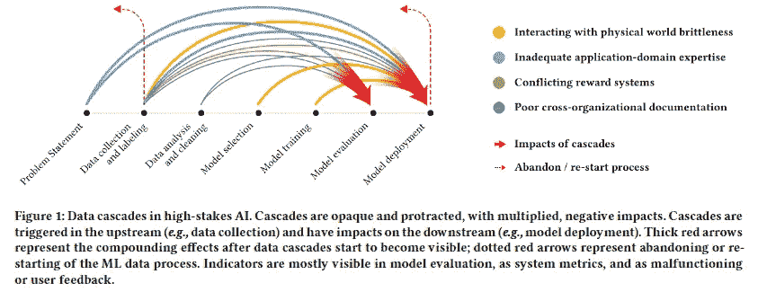
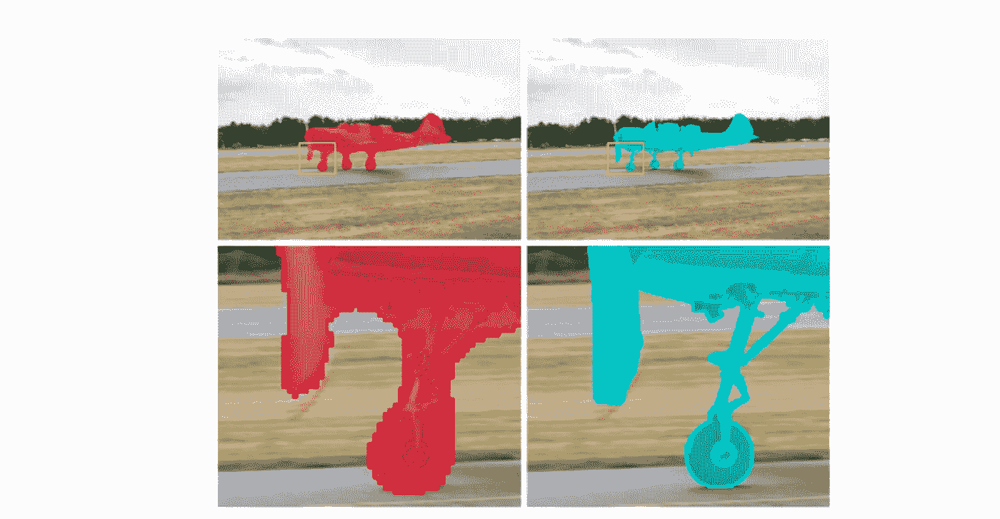
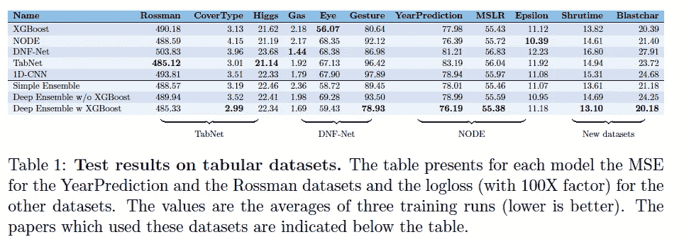
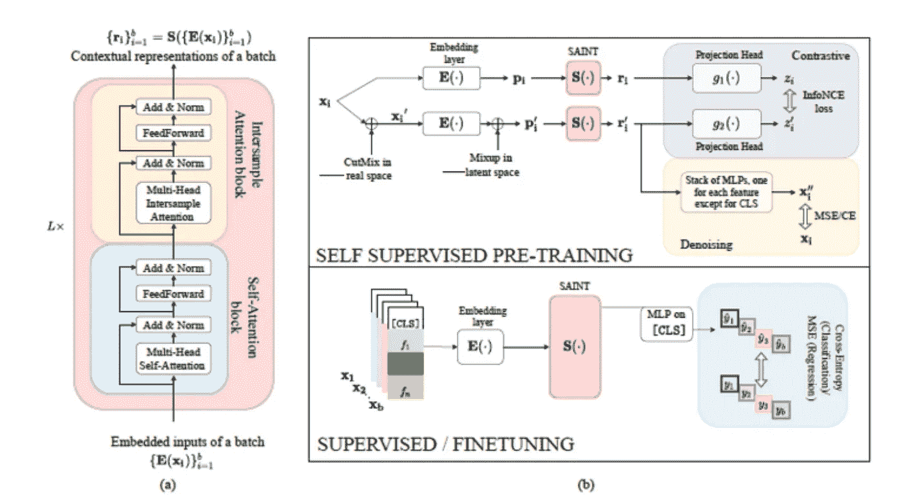
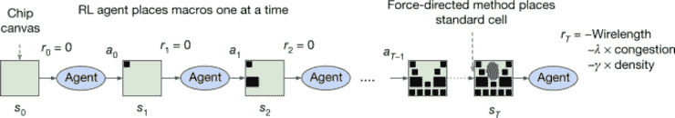

# Akira 的机器学习新闻— #19

> 原文：<https://medium.com/analytics-vidhya/akiras-machine-learning-news-19-2fcee5e6fece?source=collection_archive---------13----------------------->

2021 年第 24 周(6 月 13 日~)

## 本周特稿/新闻。

*   [有一篇论文指出，机器学习社区只关注改进模型，而忽视了坏数据可能产生的影响](https://research.google/pubs/pub49953/)。以我从业者的经验来看，改进数据比使用稍微好一点的模型影响更大，所以能看到更多这方面的研究就太好了！
*   [提出了一个模型，可以使用图像和语言解决各种任务](https://arxiv.org/abs/2104.00743)。系统用语言问开放式问题，并用语言和位置矩形来回答。图像和语言的结合增加了一次可以做的事情的数量，我们期待看到有什么实际应用出现。

## 现实世界中的机器学习

*   [有一篇文章指出深度造假对卫星图像的影响](https://www.wired.com/story/deepfake-maps-mess-sense-world/)。图像信息是如此具有说服力，以至于即使是假图像，如果作为证据出示，也可能具有欺骗性。
*   [有人提出，自主武器可能第一次攻击了人类](https://thegradientpub.substack.com/p/update-2-killer-robots-and-diffusion)，虽然 [AI 监管正在改善](https://www.lawfareblog.com/artificial-intelligence-act-what-european-approach-ai)，但还没有阻止自主武器。

## 报纸

*   有两篇关于表格数据深度学习的论文。一个显示了深度学习的优越性，另一个是 GBDT，但我认为深度学习也在向表格数据进军，一些顶级 Kaggle 获胜者正在使用 Transformer。

— — — — — — — — — — — — — — — — — — –

在下面的章节中，我将介绍各种文章和论文，不仅仅是关于上述内容，还包括以下五个主题。

1.  本周特稿/新闻
2.  机器学习用例
3.  报纸
4.  机器学习技术相关文章
5.  其他主题

— — — — — — — — — — — — — — — — — — –

# 1.本周特稿/新闻

[**数据往往被忽视，但却非常重要**](https://research.google/pubs/pub49953/?utm_campaign=Akira%27s%20Machine%20Learning%20News%20%20%20&utm_medium=email&utm_source=Revue%20newsletter)

[“每个人都想做模型工作，而不是数据工作”:高风险人工智能中的数据级联——谷歌研究]
在人工智能研究中，数据对模型评估和部署构成了重大风险，92%的人工智能从业者都经历了这种由数据引发的危机，但国际会议主要是模型改进，对数据本质的研究仍然是次要焦点。

[**一个可以使用图像和语言执行各种任务的模特**](https://arxiv.org/abs/2104.00743?utm_campaign=Akira%27s%20Machine%20Learning%20News%20%20%20&utm_medium=email&utm_source=Revue%20newsletter)

[2104.00743]对于通用视觉系统
，他们提出了一种可以使用图像和语言执行各种任务的 GPV。使用一幅图像和一个问题(文本)作为输入，系统不仅可以检测物体和绘制图像，还可以回答用语言设置的复杂任务(问题)。

— — — — — — — — — — — — — — — — — — –

# 2.机器学习用例

[**卫星图像的深度造假**](https://www.wired.com/story/deepfake-maps-mess-sense-world/?utm_campaign=Akira%27s%20Machine%20Learning%20News%20%20%20&utm_medium=email&utm_source=Revue%20newsletter)

 [## 深度假地图真的会扰乱你对世界的感觉

### 显示 2016 年至 2018 年间中国新疆大型拘留营扩张的卫星图像提供了一些…

www.wired.com](https://www.wired.com/story/deepfake-maps-mess-sense-world/) 

[Deepfake 地图真的会扰乱你对世界的感觉| WIRED]
这篇文章讨论了卫星图像深度造假的威胁。卫星图像可用于数字制图、跟踪天气系统、投资决策等。人们担心这会对他们造成负面影响。

[**自主武器可能第一次攻击人类**](https://thegradientpub.substack.com/p/update-2-killer-robots-and-diffusion?utm_campaign=Akira%27s%20Machine%20Learning%20News%20%20%20&utm_medium=email&utm_source=Revue%20newsletter)**——**[**thegradientpub.substack.com**](https://thegradientpub.substack.com/p/update-2-killer-robots-and-diffusion)

 [## 更新#2:黑仔机器人和扩散模型

### 欢迎来到渐变 1 的第二次月度更新！如果你是被朋友推荐的，我们很想见你…

thegradientpub.substack.com](https://thegradientpub.substack.com/p/update-2-killer-robots-and-diffusion) 

【更新#2:黑仔机器人和扩散模型——梯度】
有人提出，自主人工智能无人机可能首次在利比亚内战中使用。该报告指出，虽然目前在管制人工智能方面取得了进展，但如果没有停止使用人工智能武器的激励措施，仅靠管制是不够的。

— — — — — — — — — — — — — — — — — — –

# 3.报纸

[**用于编程的基准数据集**](https://arxiv.org/abs/2105.09938?utm_campaign=Akira%27s%20Machine%20Learning%20News%20%20%20&utm_medium=email&utm_source=Revue%20newsletter)

[2105.09938]用 APPS 衡量编码挑战能力
提供了一个编程基准数据集 APPS。这项任务具有很高的通用性:给定一个问题，编写代码来解决它。这是一项艰巨的任务，目前的高性能模型还不准确。

[**无需微调固定高分辨率分割蒙版**](https://arxiv.org/abs/2005.02551?utm_campaign=Akira%27s%20Machine%20Learning%20News%20%20%20&utm_medium=email&utm_source=Revue%20newsletter)**——**[**arxiv.org**](https://arxiv.org/abs/2005.02551)

[2005.02551] CascadePSP:通过全局和局部细化实现类别不可知的超高分辨率分割
一项针对未经微调的训练数据中不存在的超高分辨率图像的分割细化研究。使用多尺度掩模和图像作为输入，并且使用级联网络从低分辨率侧修改掩模并重新输入。无需任何微调就可以产生非常高分辨率的分割掩模。

[**在各种表格数据集上比较 DL 和 XGBoost**](https://arxiv.org/abs/2106.03253?utm_campaign=Akira%27s%20Machine%20Learning%20News%20%20%20&utm_medium=email&utm_source=Revue%20newsletter)**——**[**arxiv.org**](https://arxiv.org/abs/2106.03253)

【2106.03253】表格数据:深度学习不是你需要的全部
在各种表格数据集上比较 DL 和 XGBoost 的研究。在表格数据集上，XGBoost 更准确，也更容易调优。

[**变压器和表格数据的自监督学习**](https://arxiv.org/abs/2106.01342?utm_campaign=Akira%27s%20Machine%20Learning%20News%20%20%20&utm_medium=email&utm_source=Revue%20newsletter)**——**[**arxiv.org**](https://arxiv.org/abs/2106.01342)

[2106.01342] SAINT:通过行注意和对比预训练改进了用于表格数据的神经网络
对表格数据的转换器和自我监督学习的研究。在用自我监督学习进行预训练之后，执行微调。他们还提出了样本间注意，即在样本之间进行注意，以提高分类能力。

— — — — — — — — — — — — — — — — — — –

# 4.机器学习技术相关文章

[**让 AI 设计 AI 芯片**](https://www.nature.com/articles/s41586-021-03544-w?utm_campaign=Akira%27s%20Machine%20Learning%20News%20%20%20&utm_medium=email&utm_source=Revue%20newsletter)**——**[**www.nature.com**](https://www.nature.com/articles/s41586-021-03544-w)

[用于快速芯片设计的图形布局方法| Nature]

一项研究使用强化学习开发了一种计算机芯片，在不到 6 个小时的时间里，它在所有关键指标上都超过了人类，包括功耗、性能和芯片面积。

[**卡耐基梅隆大学的 MLP 讲座**](https://www.youtube.com/playlist?list=PL8PYTP1V4I8AkaHEJ7lOOrlex-pcxS-XV&utm_campaign=Akira%27s%20Machine%20Learning%20News%20%20%20&utm_medium=email&utm_source=Revue%20newsletter)**——**[**www.youtube.com**](https://www.youtube.com/playlist?list=PL8PYTP1V4I8AkaHEJ7lOOrlex-pcxS-XV)

【NLP 2021 的 CMU 神经网络】
卡耐基梅隆大学的 MLP 讲座现在可以在 youtube 上看到。他们不仅是关于变压器，而且是关于最新的话题，如改革者。

— — — — — — — — — — — — — — — — — — –

# 5.其他主题

[**AI 欧盟规定**](https://www.lawfareblog.com/artificial-intelligence-act-what-european-approach-ai?utm_campaign=Akira%27s%20Machine%20Learning%20News%20%20%20&utm_medium=email&utm_source=Revue%20newsletter)**——**[**www.lawfareblog.com**](https://www.lawfareblog.com/artificial-intelligence-act-what-european-approach-ai)

 [## 人工智能法案:人工智能的欧洲方法是什么？

### 在深入研究立法本身之前，重要的是要认识到……

www.lawfareblog.com](https://www.lawfareblog.com/artificial-intelligence-act-what-european-approach-ai) 

【人工智能法案:欧洲对 AI 的做法是什么？— Lawfare]
这篇文章概述了欧盟的人工智能法规。它指出，边境控制和民主进程管理等领域的人工智能将受到人类监督和透明的监管。

[**MIP-Mixer 的实现**](https://github.com/sayakpaul/MLP-Mixer-CIFAR10?utm_campaign=Akira%27s%20Machine%20Learning%20News%20%20%20&utm_medium=email&utm_source=Revue%20newsletter)**——**

** [## 萨亚克保罗/MLP-搅拌机-CIFAR10

### 这个库实现了 MLP 混合器中提出的 MLP 混合器:一个全 MLP 架构的愿景。本文介绍了…

github.com](https://github.com/sayakpaul/MLP-Mixer-CIFAR10) 

[GitHub-sayak Paul/MLP-Mixer-CIFAR 10:使用 CIFAR-10 数据集实现 MLP-Mixer(https://arxiv.org/abs/2105.01601)。]
实现 MLP 混合器的存储库，为 CIFAR10 中的分类和所学权重的可视化提供笔记本。

— — — — — — — — — — — — — — — — — — –

# 🌟我每周发布时事通讯！请订阅！🌟

 [## 阿基拉的机器学习新闻- Revue

### 由 Akira 的机器学习新闻-由 Akihiro FUJII:制造工程师/机器学习工程师/硕士…

www.getrevue.co](https://www.getrevue.co/profile/akiratosei) 

— — — — — — — — — — — — — — — — — — –

# 关于我

制造工程师/机器学习工程师/数据科学家/物理学硕士/[http://github.com/AkiraTOSEI/](https://t.co/hjHHbG24Ph?amp=1)

推特，我贴一句纸评论。**