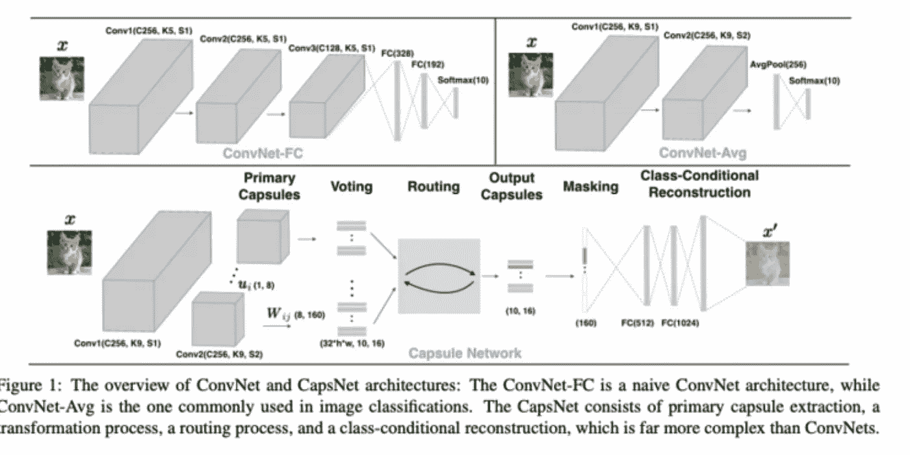
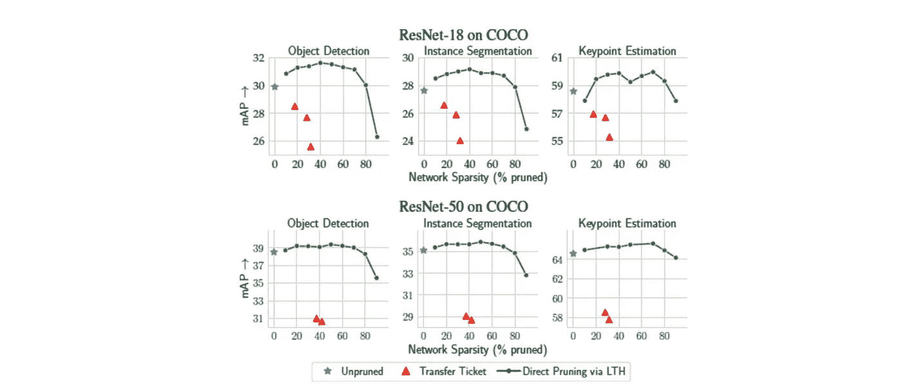
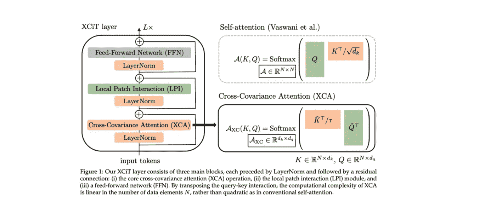
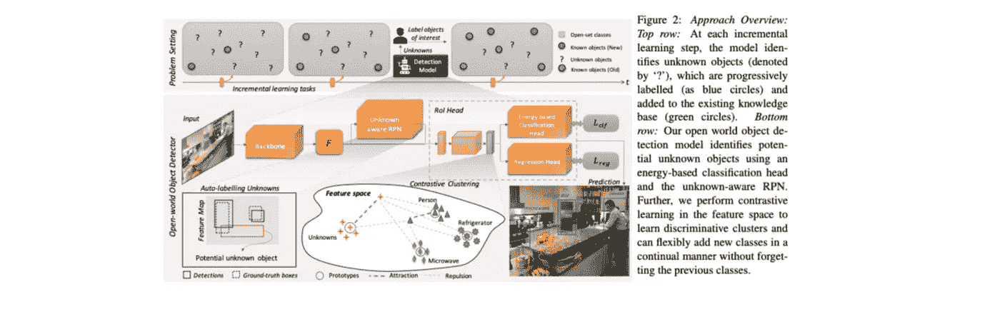
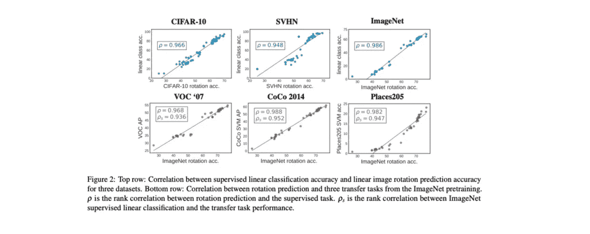
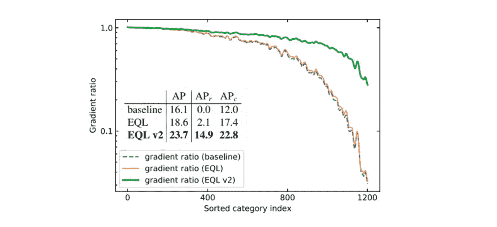
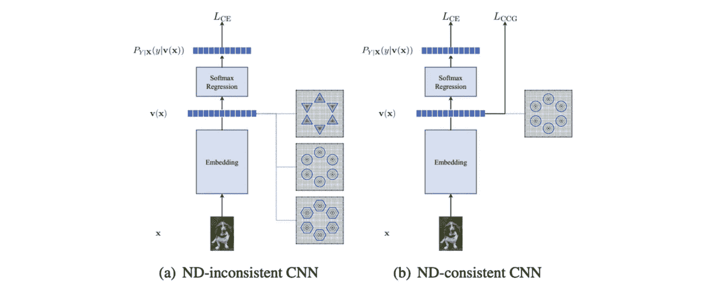
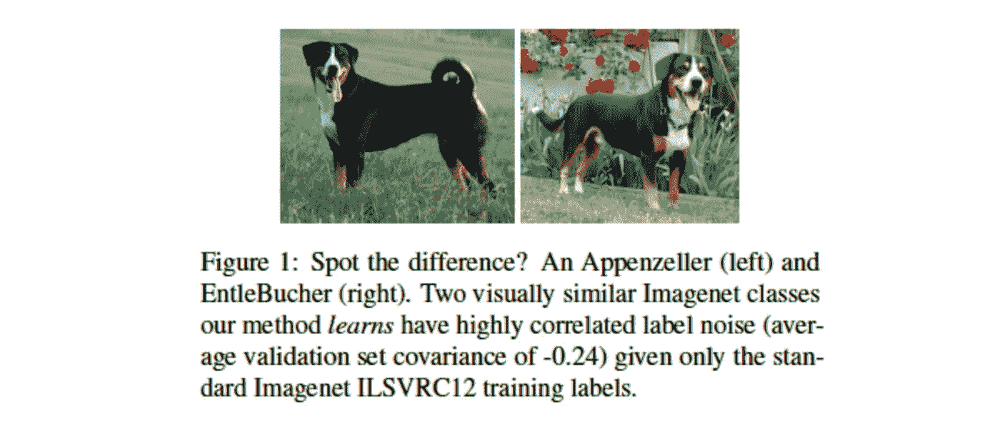
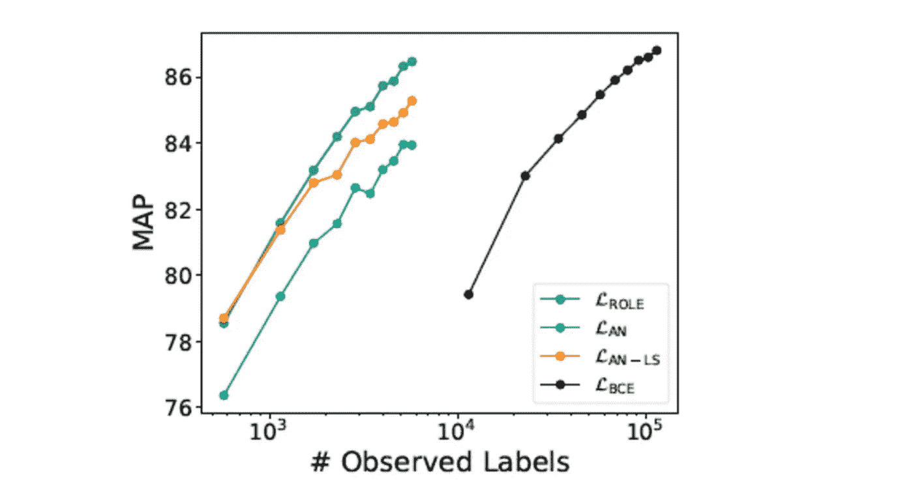

# Akira 的机器学习新闻— #20

> 原文：<https://medium.com/analytics-vidhya/akiras-machine-learning-news-20-cd10f379b0d8?source=collection_archive---------30----------------------->

2021 年第 25 周(6 月 20 日~)

## 本周特稿/新闻。

*   [已经发表的一篇论文显示，胶囊网络不如 CNN](https://arxiv.org/abs/2103.15459)健壮。核心技术动态路由似乎对准确性有负面影响。
*   在彩票假设中，少量有用的初始值(中奖彩票)对准确性有显著贡献，[一项研究表明，中奖彩票用于图像分类对对象检测效果不佳](https://arxiv.org/abs/2012.04643)。然而，由于对象检测的获胜入场券似乎对对象检测有效，因此可能难以在任务之间转移。

## 现实世界中的机器学习

*   [有一些关于打击虚假信息传播的研究。近年来，通过深度伪造传播虚假信息已经成为一个问题，这可能是抵消这一点的一种方法。](https://www.marktechpost.com/2021/06/23/ai-researchers-from-mit-lincoln-lab-developed-rio-reconnaissance-of-influence-operations-system-that-would-counter-the-spread-of-disinformation-by-making-use-of-machine-learning/)
*   根据这篇文章，应该测试自动驾驶在未知条件下的鲁棒性。人类可以应对未知，但机器学习模型是否有能力做到这一点仍有待观察，因此我们需要看看它们在不同寻常的情况下如何表现。

## 报纸

*   [提出了一个变压器模型，它比 ResNet50](https://arxiv.org/abs/2106.09681) 需要更少的内存，但实际上类似于 Conv。
*   图像分类标签容易包含许多假阴性，并且正确的标签往往是昂贵的。通过将问题集更改为不考虑负面示例的正面标签设置，提出了一种[方法，该方法可以达到与标签数量为 1/20 的全标签方法相同的精度。](https://arxiv.org/abs/2106.09708)

— — — — — — — — — — — — — — — — — — –

在下面的章节中，我将介绍各种文章和论文，不仅仅是关于上述内容，还包括以下五个主题。

1.  本周特稿/新闻
2.  机器学习用例
3.  报纸
4.  机器学习技术相关文章
5.  其他主题

— — — — — — — — — — — — — — — — — — –

# 1.本周特稿/新闻

[**CapsNet 并不比 CNN**](https://arxiv.org/abs/2103.15459?utm_campaign=Akira%27s%20Machine%20Learning%20News%20%20%20&utm_medium=email&utm_source=Revue%20newsletter)**——**[**arxiv.org**](https://arxiv.org/abs/2103.15459)

[2103.15459]胶囊网络并不比卷积网络更健壮
与之前的研究相反，胶囊网络并不比 CNN 更健壮。它说，CapsNet 论文中比较的 CNN 没有间隙结构，是较弱的基准，动态路由对鲁棒性有负面影响。

[**剪枝后的模型不能很好的在不同任务间转移。**](https://arxiv.org/abs/2012.04643?utm_campaign=Akira%27s%20Machine%20Learning%20News%20%20%20&utm_medium=email&utm_source=Revue%20newsletter)**——**[**arxiv.org**](https://arxiv.org/abs/2012.04643)

【2012.04643】对象识别的彩票假说
他们发现图像分类中的中奖彩票在对象检测任务中表现不佳:ImageNet 获得的剪枝模型在分类任务之间是可转移的，但在对象检测任务中失去了准确性。然而，当在对象检测任务中修剪模型时，对象检测任务的精度不会恶化。

— — — — — — — — — — — — — — — — — — –

# 2.机器学习用例

****——**[**www.marktechpost.com**](https://www.marktechpost.com/2021/06/23/ai-researchers-from-mit-lincoln-lab-developed-rio-reconnaissance-of-influence-operations-system-that-would-counter-the-spread-of-disinformation-by-making-use-of-machine-learning/)**

** [## 麻省理工学院林肯实验室的人工智能研究人员开发了 RIO(影响行动侦察)系统…

### 虚假信息故意操纵准确的信息来误导大众，这种信息的传播…

www.marktechpost.com](https://www.marktechpost.com/2021/06/23/ai-researchers-from-mit-lincoln-lab-developed-rio-reconnaissance-of-influence-operations-system-that-would-counter-the-spread-of-disinformation-by-making-use-of-machine-learning/) 

随着社交网站的出现，许多虚假信息变得可用，麻省理工学院开发了一个系统来打击虚假信息的传播。它还可以分析虚假信息在哪里以及如何传播，开发团队认为这在保护民主和国家安全方面是有效的。** 

**[**自动驾驶安全篇**](https://thegradient.pub/are-self-driving-cars-really-safer-than-human-drivers/?utm_campaign=Akira%27s%20Machine%20Learning%20News%20%20%20&utm_medium=email&utm_source=Revue%20newsletter)**——**[**the gradient . pub**](https://thegradient.pub/are-self-driving-cars-really-safer-than-human-drivers/)**

** [## 自动驾驶汽车真的比人类司机更安全吗？

### 自动驾驶汽车是人工智能最令人兴奋和最具影响力的应用之一。每年有超过 35，000 人死亡…

thegradient.pub](https://thegradient.pub/are-self-driving-cars-really-safer-than-human-drivers/) 

人类可以使用常识推理来处理意外情况，但很难将常识灌输到自动驾驶系统中。它说，在许多(如果不是全部)可以预期的情况下测试安全性是很重要的。** 

**— — — — — — — — — — — — — — — — — — –**

# **3.报纸**

**[**内存要求低的车型**](https://arxiv.org/abs/2106.09681?utm_campaign=Akira%27s%20Machine%20Learning%20News%20%20%20&utm_medium=email&utm_source=Revue%20newsletter)**——**[**arxiv.org**](https://arxiv.org/abs/2106.09681)**

****

**[2106.09681] XCiT:互协方差图像变换器
他们提出 XCiT，其中自我关注被 XCA 代替，可以看作是动态的 1x1 conv，以及 3x3 深度方向的 conv。虽然它被称为“变压器”，但它不使用自我关注，并且它比 ResNet-50 需要更少的内存。**

**【arxiv.org】****——****探测未知类别物体的任务探测******

************

******[2103.02603]关于开放世界物体检测
他们设计了一种称为开放世界物体检测的问题设置，可以检测未知物体并重新学习它们。物体检测是一个终身学习的问题，类似于人类所做的，检测未知物体，并从中学习。他们还为这个问题设置提出了一个名为 ORE 的基线模型。******

**********——**[**arxiv.org**](https://arxiv.org/abs/2009.07724)********

********

****[2009.07724] SelfAugment:用于自我监督学习的自动增强策略
没有标签，就不可能评估自动数据增强的最佳策略，因为没有评估它的方法，但他们从数百个实验中表明，预测旋转的任务可以代替标签。这使得自监督表示学习的自动数据扩充成为可能，并且他们表明它与现有的使用标签的自动数据扩充一样好或者更好。****

****[**通过平衡渐变检测稀有类别**](https://arxiv.org/abs/2012.08548?utm_campaign=Akira%27s%20Machine%20Learning%20News%20%20%20&utm_medium=email&utm_source=Revue%20newsletter)**——**[**arxiv.org**](https://arxiv.org/abs/2012.08548)****

********

****【2012.08548】均衡损失 v2:一种新的长尾对象检测的梯度平衡方法
由于基于类别数量的平衡不足以检测对象检测中的稀有类别，他们提出了均衡损失 v2，它基于梯度的大小进行平衡。与现有方法相比，在少数类别中，准确率有很大提高。****

****[**检测细粒度分类中的新类别**](https://openaccess.thecvf.com/content/CVPR2021/html/Cheng_Learning_Deep_Classifiers_Consistent_With_Fine-Grained_Novelty_Detection_CVPR_2021_paper.html?utm_campaign=Akira%27s%20Machine%20Learning%20News%20%20%20&utm_medium=email&utm_source=Revue%20newsletter)**——**[**openaccess.thecvf.com**](https://openaccess.thecvf.com/content/CVPR2021/html/Cheng_Learning_Deep_Classifiers_Consistent_With_Fine-Grained_Novelty_Detection_CVPR_2021_paper.html)****

********

****【学习与细粒度新奇检测一致的深度分类器，cvpr 2020】
针对细粒度分类中判别新类别的难题，提出了一种新的损失函数 CCG。最终图层的表示被假定为多元高斯图层，通过最小化 Mahanobiras 距离，该图层被强制为高斯。****

****[**建模最后一层用潜变量标注噪点**](https://arxiv.org/abs/2105.10305?utm_campaign=Akira%27s%20Machine%20Learning%20News%20%20%20&utm_medium=email&utm_source=Revue%20newsletter)**—******

************

******[2105.10305]大规模图像分类中的相关输入相关标签噪声
大规模图像分类数据通常包含噪声标签。他们提出了一种方法，通过在最后一层放置多元正态分布的潜在变量来模拟标签噪声。通过结合潜在变量的噪声建模，他们证实了在 ImageNet、JFT-300M 等上精度的显著提高。******

******[**为标签数量的 1/20，精度与全标签**](https://arxiv.org/abs/2106.09708?utm_campaign=Akira%27s%20Machine%20Learning%20News%20%20%20&utm_medium=email&utm_source=Revue%20newsletter)**——**[**arxiv.org**](https://arxiv.org/abs/2106.09708)相同******

********

****[2106.09708]从单个正标签进行多标签学习
由于标签包含许多假阴性，因此他们提出了一种角色，该角色考虑了正标签设置(即，不从负样本显式反向传播的设置)中数据中的对象数量。标签数量的 1/20，精度与全标签相同。****

****— — — — — — — — — — — — — — — — — — –****

# ****4.机器学习技术相关文章****

****[**最新库**](https://www.reddit.com/r/datascience/comments/o3l9o0/what_are_some_exciting_new_toolslibraries_in_2021/?utm_campaign=Akira%27s%20Machine%20Learning%20News%20%20%20&utm_medium=email&utm_source=Revue%20newsletter)**——**[**www.reddit.com**](https://www.reddit.com/r/datascience/comments/o3l9o0/what_are_some_exciting_new_toolslibraries_in_2021/)****

****一个讨论最新流行库的帖子，包括 Julia，Huggingface 和 Greykite。****

****— — — — — — — — — — — — — — — — — — –****

# ****5.其他主题****

## ****[机器学习文档中常用的图表](https://dvgodoy.github.io/dl-visuals/Classification/?utm_campaign=Akira%27s%20Machine%20Learning%20News%20%20%20&utm_medium=email&utm_source=Revue%20newsletter)****

**** [## 分类

### 超过 200 个最受欢迎的深度学习架构和层的图形和图表可在您的博客中免费使用…

dvgodoy.github.io](https://dvgodoy.github.io/dl-visuals/Classification/) 

这是各种深度学习网络图的储存库。你可以自由使用它们。你不需要每次做文档的时候都自己画图表。有用。**** 

****— — — — — — — — — — — — — — — — — — –****

# ****过去的时事通讯****

**** [## Akira 的机器学习新闻- #19

### 本周特稿/新闻。现实世界中的机器学习有两篇关于深度学习的论文供表…

www.getrevue.co](https://www.getrevue.co/profile/akiratosei/issues/akira-s-machine-learning-news-19-634522)  [## (Akira 的机器学习新闻- #18

### 本周特稿/新闻。现实世界中的机器学习发表了一项研究，调查数据…

www.getrevue.co](https://www.getrevue.co/profile/akiratosei/issues/akira-s-machine-learning-news-18-634523)  [## 机器学习 2020 摘要:84 篇有趣的论文/文章

### 在这篇文章中，我总共展示了 2020 年发表的 84 篇我觉得特别有趣的论文和文章…

towardsdatascience.com](https://towardsdatascience.com/machine-learning-2020-summary-84-interesting-papers-articles-45bd45c0d35b) 

— — — — — — — — — — — — — — — — — — –

# 🌟我每周发布时事通讯！请订阅！🌟

 [## 阿基拉的机器学习新闻- Revue

### 由 Akira 的机器学习新闻-由 Akihiro FUJII:制造工程师/机器学习工程师/硕士…

www.getrevue.co](https://www.getrevue.co/profile/akiratosei) 

— — — — — — — — — — — — — — — — — — –

# 关于我

制造工程师/机器学习工程师/数据科学家/物理学硕士/【http://github.com/AkiraTOSEI/ 

推特，我贴一句纸评论。****