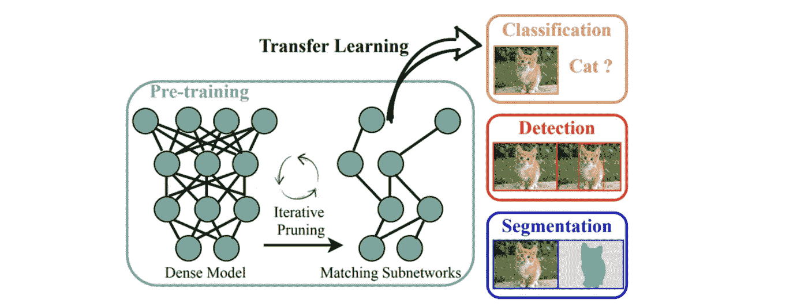
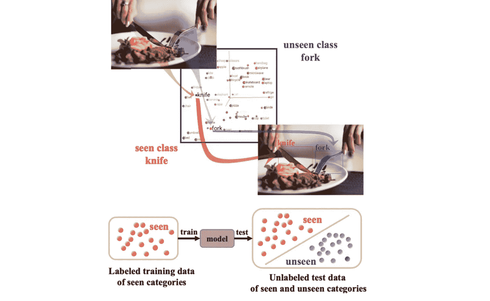
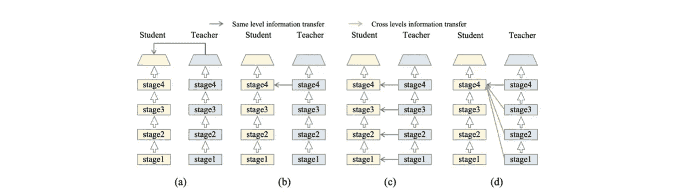
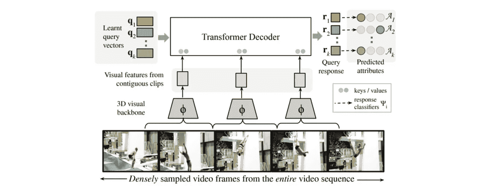
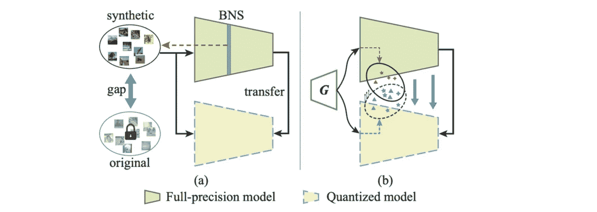
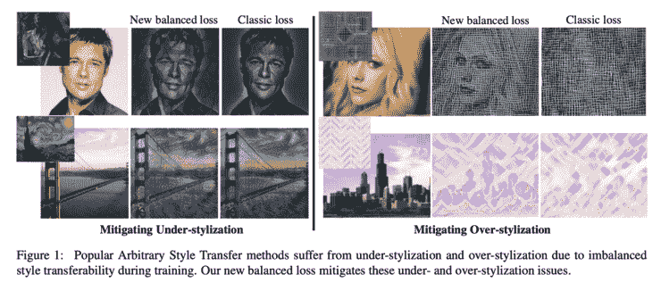

# Akira 的机器学习新闻— #21

> 原文：<https://medium.com/analytics-vidhya/akiras-machine-learning-news-21-f5fe078e1c03?source=collection_archive---------14----------------------->

2021 年第 26 周(6 月 27 日~)总结

## 本周特稿/新闻。

*   [在前期训练中，彩票假设的中奖票似乎无论有人监督还是无人监督都是存在的](https://arxiv.org/abs/2012.06908)。由于预训练模型通常非常庞大，因此有可能使用一张中奖票(一个小而快的网络)。
*   [已经提出了实例分割的零触发方法](https://arxiv.org/abs/2104.06601)。由于现实世界的任务需要检测新的物体，如果进行更多的研究，它可能会在现实世界中使用更多。

## 现实世界中的机器学习

*   [亚马逊开设了一家商店，顾客可以不通过收银机付款。](https://siliconangle.com/2021/06/15/amazon-opens-first-full-size-grocery-store-cashierless-checkout-technology/)这样的无人店每年都是某个地方的热门话题，曾经有过它们即将倒闭的形象，但这次会怎样？
*   [好像有一个监测模型偏差的工具](https://siliconangle.com/2021/06/16/fiddler-labs-opens-ai-black-box-solve-bias-problem-enable-compliance-awsshowcase2q21/)。由于模型偏差会导致大问题，我认为随着这种 ML 用例实际使用的增加，这种工具会变得越来越必要。

## 报纸

*   [提出了一种无数据量化模型的方法。](https://arxiv.org/abs/2103.15263)我感觉如果只有模型，能够缩小模型的尺寸是很实用的。

— — — — — — — — — — — — — — — — — — –

在下面的章节中，我将介绍各种文章和论文，不仅仅是关于上述内容，还包括以下五个主题。

1.  本周特稿/新闻
2.  机器学习用例
3.  报纸
4.  机器学习技术相关文章
5.  其他主题

— — — — — — — — — — — — — — — — — — –

# 1.本周特稿/新闻

[**预培训获奖门票可转让**](https://arxiv.org/abs/2012.06908?utm_campaign=Akira%27s%20Machine%20Learning%20News%20%20%20&utm_medium=email&utm_source=Revue%20newsletter)**—**[**arxiv.org**](https://arxiv.org/abs/2012.06908)

*【2012.06908】计算机视觉模型中监督和自我监督预训练的彩票假说* 一项研究，旨在检验预训练对迁移学习绩效的有效性(彩票假说中大型网络中在准确性方面占主导地位的小型有用子网)。结果表明，无论有无监督的预训练，中奖票都是存在的。

[**零镜头实例分割**](https://arxiv.org/abs/2104.06601?utm_campaign=Akira%27s%20Machine%20Learning%20News%20%20%20&utm_medium=email&utm_source=Revue%20newsletter)**——**[**arxiv.org**](https://arxiv.org/abs/2104.06601)

*【2104.06601】零镜头实例分割* 他们提出了一个零镜头实例分割的任务，用零镜头(推理时没有参数更新)对一个新类进行分割。他们认为背景表示是关键，所以利用丰富的背景表示向量来学习掩模和零炮探测头表示。

— — — — — — — — — — — — — — — — — — –

# 2.机器学习用例

****——【siliconangle.com】****

**** [## Fiddler Labs 打开人工智能“黑匣子”,解决偏差问题并实现合规性

### 随着大公司被指控做出不公平的决定，人工智能中的偏见已经获得了指数级的关注…

siliconangle.com](https://siliconangle.com/2021/06/16/fiddler-labs-opens-ai-black-box-solve-bias-problem-enable-compliance-awsshowcase2q21/?utm_campaign=Akira%27s%20Machine%20Learning%20News%20%28ja%29&utm_medium=email&utm_source=Revue%20newsletter) 

机器学习模型的偏见最近受到了很多关注，但它们很难消除；Fiddler Labs 提供了一种集中这些信息的方法，并提供了持续监控的工具。**** 

****[**亚马逊开了一家不用收银机就能付款的商店**](https://siliconangle.com/2021/06/15/amazon-opens-first-full-size-grocery-store-cashierless-checkout-technology/?utm_campaign=Akira%27s%20Machine%20Learning%20News%20%20%20&utm_medium=email&utm_source=Revue%20newsletter)**——**[**siliconangle.com**](https://siliconangle.com/2021/06/15/amazon-opens-first-full-size-grocery-store-cashierless-checkout-technology/)****

**** [## 亚马逊开设了第一家采用无收银员结账技术的大型杂货店——silicon angle

### Amazon.com 公司本周将开设第一家全尺寸的亚马逊新鲜食品杂货店，配备“只需走出去”

siliconangle.com](https://siliconangle.com/2021/06/15/amazon-opens-first-full-size-grocery-store-cashierless-checkout-technology/?utm_campaign=Akira%27s%20Machine%20Learning%20News%20%28ja%29&utm_medium=email&utm_source=Revue%20newsletter) 

亚马逊开设了一家使用机器学习和许多传感器的商店，让顾客无需通过收银机就可以购买新鲜食品，让他们只需举起手一秒钟就可以付款。**** 

****— — — — — — — — — — — — — — — — — — –****

# ****3.报纸****

****[**知识升华，允许知识在不同阶段**](https://arxiv.org/abs/2104.09044?utm_campaign=Akira%27s%20Machine%20Learning%20News%20%20%20&utm_medium=email&utm_source=Revue%20newsletter)**——**[**arxiv.org**](https://arxiv.org/abs/2104.09044)****

********

*****【2104.09044】通过知识回顾提炼知识* 在以前的研究中，知识提炼是基于学生和教师模型之间来自同一阶段的信息的比较。在这项研究中，他们提出了一种“知识回顾”的知识提炼方法，这种方法考虑了来自不同阶段的信息。蒸馏效果大大提高。****

****[**使用变压器对细粒度动作进行分类**](https://arxiv.org/abs/2104.09496?utm_campaign=Akira%27s%20Machine%20Learning%20News%20%20%20&utm_medium=email&utm_source=Revue%20newsletter)**——**[**arxiv.org**](https://arxiv.org/abs/2104.09496)****

********

*****【2104.09496】用于细粒度视频理解的时态查询网络* 他们提出了一种基于转换器的模型 TQN，用于细粒度动作检测，该模型对视频中的细粒度动作进行分类，使用类似 DETR 的查询策略来识别每个动作。他们在三个细粒度的动作检测数据集上实现了 SotA 性能。****

****[**一种采用对抗学习的无数据量化方法**](https://arxiv.org/abs/2103.15263?utm_campaign=Akira%27s%20Machine%20Learning%20News%20%20%20&utm_medium=email&utm_source=Revue%20newsletter)**——**[**【arxiv.org】**](https://arxiv.org/abs/2103.15263)****

********

*****【2103.15263】零拍对抗性量化* 在对模型进行量化时，通常需要使用训练数据对量化后的模型进行调整，但是他们提出了 ZAQ，一种使用对抗性学习框架不需要数据的量化方法。它通过将包括中间层在内的输出更紧密地结合在一个高精度模型和一个使用生成数据的量化模型中来学习。****

****[**允许个别损失在风格转换中优化**](https://arxiv.org/abs/2104.10064?utm_campaign=Akira%27s%20Machine%20Learning%20News%20%20%20&utm_medium=email&utm_source=Revue%20newsletter)**——**[**arxiv.org**](https://arxiv.org/abs/2104.10064)****

********

*****【2104.10064】用于改进任意风格转换的风格感知标准化损失*
发现个别数据的损失被平均并批量更新，这对风格转换有负面影响。他们通过使用损失上限进行标准化来避免这个问题。他们将此应用于各种方法以观察效果。****

****— — — — — — — — — — — — — — — — — — –****

# ****4.机器学习技术相关文章****

****[**关于基于分数的生成模型的解释性文章**](http://yang-song.github.io/blog/2021/score/?utm_campaign=Akira%27s%20Machine%20Learning%20News%20%20%20&utm_medium=email&utm_source=Revue%20newsletter)**—**[**yang-song . github . io**](http://yang-song.github.io/blog/2021/score/)****

**** [## 通过估计数据分布的梯度进行生成建模

### 现有的创成式建模技术可以根据它们如何表示而大致分为两类

杨-song.github.io](http://yang-song.github.io/blog/2021/score/?utm_campaign=Akira%27s%20Machine%20Learning%20News%20%28ja%29&utm_medium=email&utm_source=Revue%20newsletter) 

在描述基于可能性的生成模型和基于分数的模型之间的差异的同时，本文解释了分数函数在没有数据的区域中是如何不准确的，以及如何克服这一点。**** 

****— — — — — — — — — — — — — — — — — — –****

# ****5.其他主题****

****[**│网**](https://github.com/xuebinqin/U-2-Net?utm_campaign=Akira%27s%20Machine%20Learning%20News%20%20%20&utm_medium=email&utm_source=Revue%20newsletter)**——**[**github.com**](https://github.com/xuebinqin/U-2-Net)****

**** [## 雪彬琴/U-2-Net

### 这是我们发表在《模式识别 2020》上的论文 U2-Net(U 平方网)的官方回购:秦，…

github.com](https://github.com/xuebinqin/U-2-Net?utm_campaign=Akira%27s%20Machine%20Learning%20News%20%28ja%29&utm_medium=email&utm_source=Revue%20newsletter) 

U -Net 知识库。提供了各种预训练模型，可以立即进行分割。**** 

****— — — — — — — — — — — — — — — — — — –****

# ****过去的时事通讯****

**** [## Akira 的机器学习新闻- #20

### Akira 的机器学习新闻-2021 年第 25 周(6 月 20 日~)

www.getrevue.co](https://www.getrevue.co/profile/akiratosei/issues/akira-s-machine-learning-news-20-671751)  [## Akira 的机器学习新闻- #19

### 本周特稿/新闻。现实世界中的机器学习有两篇关于深度学习的论文供表…

www.getrevue.co](https://www.getrevue.co/profile/akiratosei/issues/akira-s-machine-learning-news-19-634522)  [## 机器学习 2020 摘要:84 篇有趣的论文/文章

### 在这篇文章中，我总共展示了 2020 年发表的 84 篇我觉得特别有趣的论文和文章…

towardsdatascience.com](https://towardsdatascience.com/machine-learning-2020-summary-84-interesting-papers-articles-45bd45c0d35b) 

— — — — — — — — — — — — — — — — — — –

# 🌟我每周发布时事通讯！请订阅！🌟

 [## 阿基拉的机器学习新闻- Revue

### 由 Akira 的机器学习新闻-由 Akihiro FUJII:制造工程师/机器学习工程师/硕士…

www.getrevue.co](https://www.getrevue.co/profile/akiratosei) 

— — — — — — — — — — — — — — — — — — –

# 关于我

制造工程师/机器学习工程师/数据科学家/物理学硕士/[http://github.com/AkiraTOSEI/](https://t.co/hjHHbG24Ph?amp=1)

推特，我贴一句纸评论。****