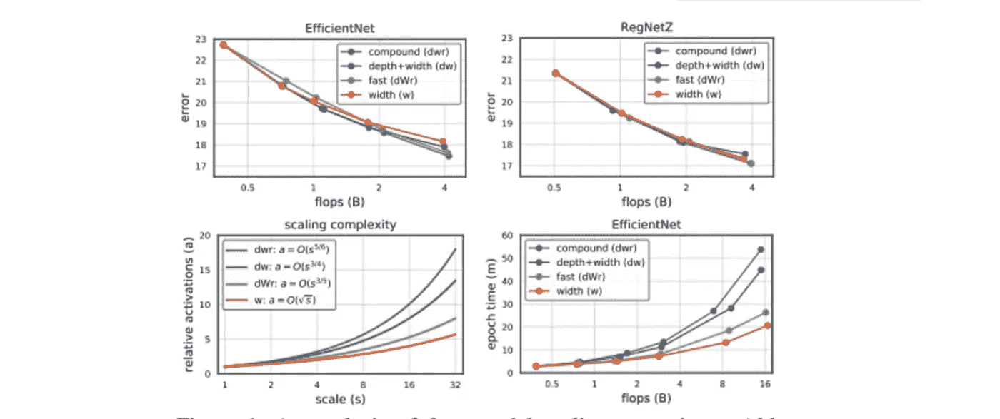
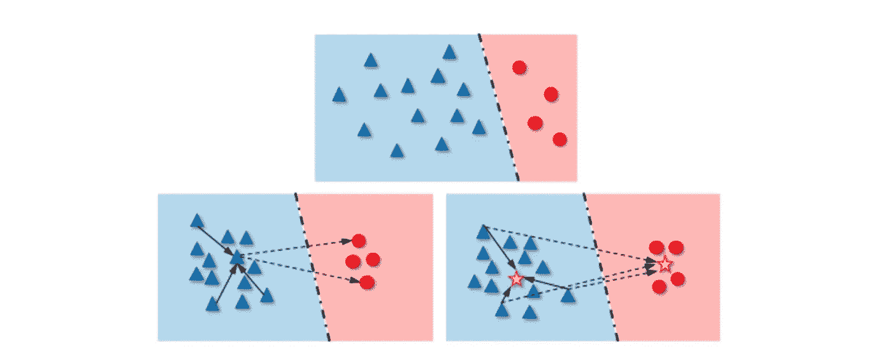
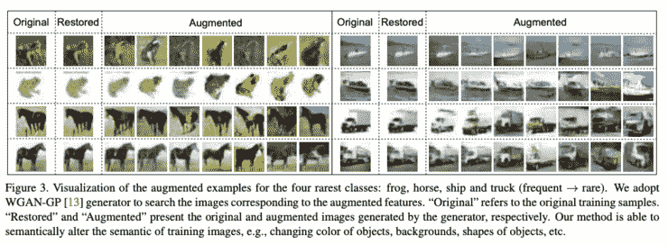
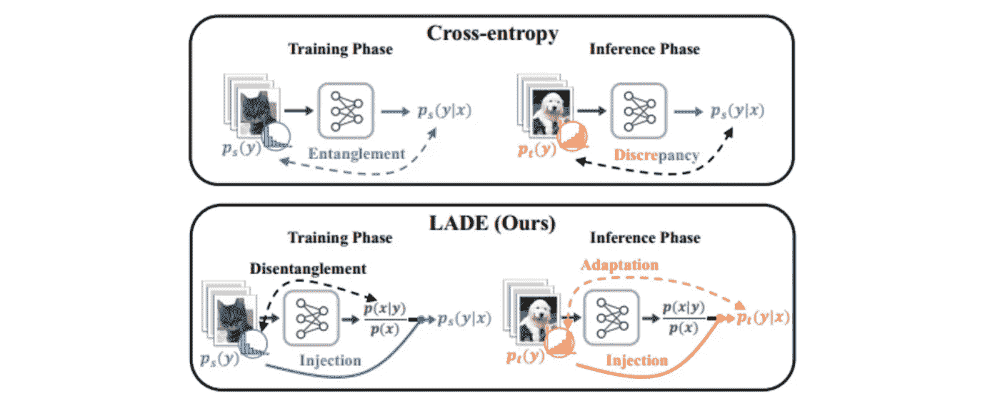
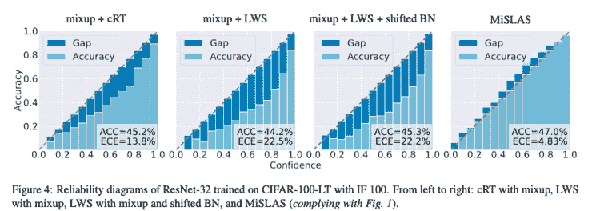
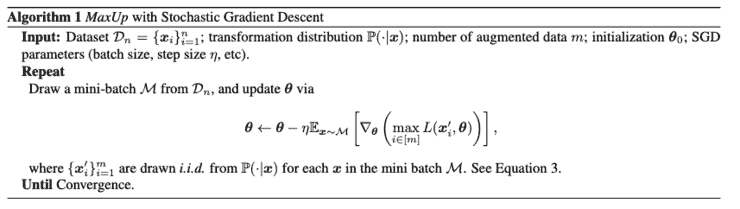
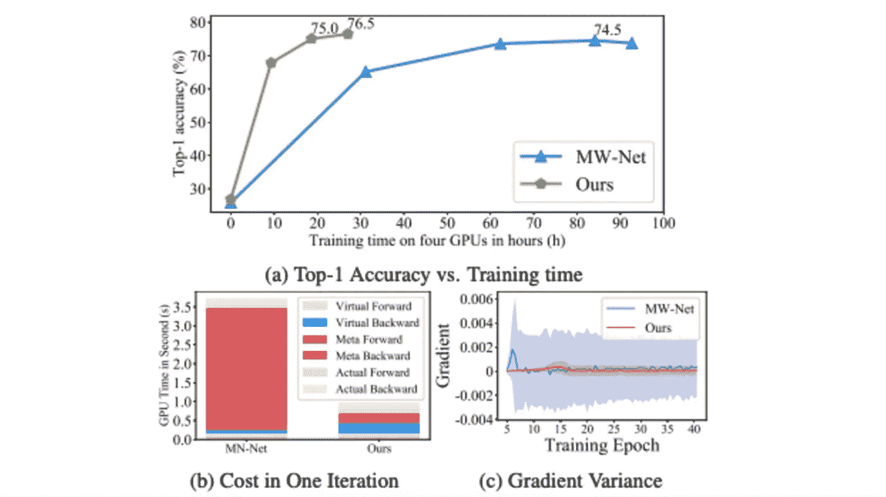

# Akira 的机器学习新闻— #22

> 原文：<https://medium.com/analytics-vidhya/akiras-machine-learning-news-22-1e7a47c9c5b2?source=collection_archive---------17----------------------->

2021 年 7 月 25 日一周总结

## 本周特稿/新闻。

*   [已经宣布的战略允许在大型模型中进行扩展](https://arxiv.org/abs/2103.06877)。由于 NAS 对于大型模型是不可能的，所以在大型模型已经成为一种趋势的情况下，它可能变得很重要。
*   [已经进行了一些研究，将对比损失应用于监督学习，同时降低存储成本](https://arxiv.org/abs/2103.14267)。对比损失使用了大量的反面例子，因此记忆成本非常高，但这可以通过对每个类别使用原型来避免。

## 现实世界中的机器学习

*   [有一篇关于使用机器学习的行业的文章](https://www.forbes.com/sites/forbestechcouncil/2021/06/02/five-industries-reaping-the-benefits-of-artificial-intelligence/?sh=6f26200759ca)。似乎机器学习不仅用于自动驾驶，还用于旅行推荐。我认为，这不仅与它可以使用的土壤有关，还与财力有关。
*   [有一篇关于不同国家 AI 规定差异的文章](https://thenextweb.com/news/beginners-guide-to-artificial-intelligence-policy)。我认为看到每个国家监管人工智能的方式不同很有趣，部分原因是他们自己的议程。

## 报纸

*   在数据数量随类别数量变化的问题设置中(长尾数据集)，CVPR 提出了各种解决方法。提出了考虑分布差异的方法，而不是简单地考虑损失的修正。

— — — — — — — — — — — — — — — — — — –

在下面的章节中，我将介绍各种文章和论文，不仅仅是关于上述内容，还包括以下五个主题。

1.  本周特稿/新闻
2.  机器学习用例
3.  报纸
4.  机器学习技术相关文章
5.  其他主题

— — — — — — — — — — — — — — — — — — –

# 1.本周特稿/新闻

— — — — — — — — — — — — — — — — — — –

[**以宽度为中心缩放，减少执行时间。**](https://arxiv.org/abs/2103.06877?utm_campaign=Akira%27s%20Machine%20Learning%20News%20%20%20&utm_medium=email&utm_source=Revue%20newsletter)**——**[**arxiv.org**](https://arxiv.org/abs/2103.06877)

*【2103.06877】快速准确的模型缩放*
现有的模型缩放策略关注的是 flops 和精度的关系，但是即使对于相同的 flops，执行时间也会因为参数和活动的数量而变化。他们开发了一种缩放策略，可以通过主要缩放宽度来减少执行时间，而不会影响精度。扩展策略非常重要，因为大型网络对于 NAS 来说几乎是不可能的

[**利用原型降低对比损失的记忆成本**](https://arxiv.org/abs/2103.14267?utm_campaign=Akira%27s%20Machine%20Learning%20News%20%20%20&utm_medium=email&utm_source=Revue%20newsletter)**——**[**【arxiv.org】**](https://arxiv.org/abs/2103.14267)

*【2103.14267】用于长尾图像分类的基于对比学习的混合网络*
使用对比损失的监督学习是强大的，但是需要大量的存储器，因为它需要大量的负样本。他们通过使用类别的原型来避免记忆问题。这种方法在类别间数据数量有偏差的长尾数据上更胜一筹。

— — — — — — — — — — — — — — — — — — –

# 2.机器学习用例

— — — — — — — — — — — — — — — — — — –

[**最受益于机器学习的行业**](https://www.forbes.com/sites/forbestechcouncil/2021/06/02/five-industries-reaping-the-benefits-of-artificial-intelligence/?sh=6f26200759ca&utm_campaign=Akira%27s%20Machine%20Learning%20News%20%20%20&utm_medium=email&utm_source=Revue%20newsletter)**——**[**www.forbes.com**](https://www.forbes.com/sites/forbestechcouncil/2021/06/02/five-industries-reaping-the-benefits-of-artificial-intelligence/?sh=6f26200759ca)

 [## 《议会邮报》:五个行业从人工智能中获益

### StrikeReady Health Care 的首席产品官和营销主管。人工智能提供了大量的…

www.forbes.com](https://www.forbes.com/sites/forbestechcouncil/2021/06/02/five-industries-reaping-the-benefits-of-artificial-intelligence/?sh=6f26200759ca&utm_campaign=Akira%27s%20Machine%20Learning%20News%20%20%20&utm_medium=email&utm_source=Revue%20newsletter) 

本文介绍了从机器学习中受益最大的行业。例如医疗保健、金融、汽车、旅游和电子商务，以及它们在这些行业中的应用。

[**各国 AI 规定**](https://thenextweb.com/news/beginners-guide-to-artificial-intelligence-policy?utm_campaign=Akira%27s%20Machine%20Learning%20News%20%20%20&utm_medium=email&utm_source=Revue%20newsletter)**——**[**thenextweb.com**](https://thenextweb.com/news/beginners-guide-to-artificial-intelligence-policy)

 [## 全球人工智能政策初学者指南

### 欢迎来到 Neural 的人工智能初学者指南。这个长期运行的系列应该为您提供一个非常基本的了解…

thenextweb.com](https://thenextweb.com/news/beginners-guide-to-artificial-intelligence-policy?utm_campaign=Akira%27s%20Machine%20Learning%20News%20%20%20&utm_medium=email&utm_source=Revue%20newsletter) 

本文描述了人工智能法规在各国的现状，并对未来进行了预测。它表明，欧盟、俄罗斯、中国、美国和其它国家有着不同的监管政策，部分原因在于它们各自的议程。

— — — — — — — — — — — — — — — — — — –

# 3.报纸

— — — — — — — — — — — — — — — — — — –

[**数据扩充是基于每一类的协方差。**](https://arxiv.org/abs/2103.12579?utm_campaign=Akira%27s%20Machine%20Learning%20News%20%20%20&utm_medium=email&utm_source=Revue%20newsletter)**——**[**arxiv.org**](https://arxiv.org/abs/2103.12579)

*【2103.12579】MetaSAug:用于长尾视觉识别的元语义增强*
学习每个类别的潜在变量的协方差矩阵的研究，以进行不改变语义方向的增强，并处理具有不同类别数量的长尾数据集。所获得的增强不会改变诸如背景变化等标签的含义，并且通过 ImageNet-LT 证实了该效果。

[**设计一个损失函数来说明评估和学习分配的差异**](https://arxiv.org/abs/2012.00321?utm_campaign=Akira%27s%20Machine%20Learning%20News%20%20%20&utm_medium=email&utm_source=Revue%20newsletter)**——**[**arxiv.org**](https://arxiv.org/abs/2012.00321)

*【2012.00321】解开长尾视觉识别的标签分布*
在长尾数据集中，数据的数量在类别之间分布不均匀，他们提出了带有分布校正项的 PC Softmax，考虑到训练和评估之间标签分布的差异可能导致精度下降。他们还提出了 LADE loss，它在训练阶段分离标签分布，并在长尾数据集上实现了 SotA 性能。

[**训练模型使两组数据的分布保持一致。**](https://openaccess.thecvf.com/content/CVPR2021/html/Guo_Long-Tailed_Multi-Label_Visual_Recognition_by_Collaborative_Training_on_Uniform_and_CVPR_2021_paper.html?utm_campaign=Akira%27s%20Machine%20Learning%20News%20%20%20&utm_medium=email&utm_source=Revue%20newsletter)**——**[**openaccess.thecvf.com**](https://openaccess.thecvf.com/content/CVPR2021/html/Guo_Long-Tailed_Multi-Label_Visual_Recognition_by_Collaborative_Training_on_Uniform_and_CVPR_2021_paper.html)

*【通过对均匀和再平衡样本的协作训练进行长尾多标签视觉识别】*
他们提出了一种对长尾数据(类间数据数量的偏差)进行多标签学习的方法，这种方法在分别具有平衡和不平衡数据输入的两个网络之间保持一致性。该方法明显优于传统方法。

[**关于长尾数据集的类数和混淆的标签平滑**](https://arxiv.org/abs/2104.00466?utm_campaign=Akira%27s%20Machine%20Learning%20News%20%20%20&utm_medium=email&utm_source=Revue%20newsletter)**——**[**arxiv.org**](https://arxiv.org/abs/2104.00466)

*【2104.00466】改进长尾识别的校准*
在长尾数据集中，每个类别的数据数量有偏差，由于少数类别(有尾)中的过度自信和误解，模型计算的置信度与实际正确率之间存在差异。他们提出了带标签平滑和混合的 MiSLAS 来解决这个问题，并实现了 SotA 性能。

[**用最大梯度样本训练。**](https://openaccess.thecvf.com/content/CVPR2021/html/Gong_MaxUp_Lightweight_Adversarial_Training_With_Data_Augmentation_Improves_Neural_Network_CVPR_2021_paper.html?utm_campaign=Akira%27s%20Machine%20Learning%20News%20%20%20&utm_medium=email&utm_source=Revue%20newsletter)**——**[**openaccess.thecvf.com**](https://openaccess.thecvf.com/content/CVPR2021/html/Gong_MaxUp_Lightweight_Adversarial_Training_With_Data_Augmentation_Improves_Neural_Network_CVPR_2021_paper.html)

*【MaxUp:轻量级对抗训练与数据增强改进神经网络训练】*
通常，我们使用小批量的平均梯度进行训练，但他们提出了 MaxUp，仅使用受到随机扰动的小批量中损失最严重的数据的梯度进行训练。他们证实了图像分类准确性的提高。

[**改善了元学习的瓶颈，学习时间减少了 2/3。**](https://arxiv.org/abs/2104.15092?utm_campaign=Akira%27s%20Machine%20Learning%20News%20%20%20&utm_medium=email&utm_source=Revue%20newsletter)**——**[**arxiv.org**](https://arxiv.org/abs/2104.15092)

*【2104.15092】噪声鲁棒深度学习的更快元更新策略*
虽然元学习很耗时，但他们确定了瓶颈是元学习反向传播，由于整个系统的梯度可以从一些层中近似得到，因此他们避免了对整个系统执行反向传播，从而降低了计算成本。与传统方法相比，他们成功地将学习时间减少了三分之二，同时保持了性能。

— — — — — — — — — — — — — — — — — — –

# 4.机器学习技术相关文章

— — — — — — — — — — — — — — — — — — –

## [人工智能伦理学会议论文集](https://tdinfoshare.kahootz.com/Virtual.Events/view?objectID=28157360&utm_campaign=Akira%27s%20Machine%20Learning%20News%20%20%20&utm_medium=email&utm_source=Revue%20newsletter)

 [## 虚拟活动和互动

### 克莱门特-琼斯勋爵于 1988 年因政治服务被授予 CBE，1998 年被授予终身贵族。他是自由民主党众议院…

tdinfoshare.kahootz.com](https://tdinfoshare.kahootz.com/Virtual.Events/view?objectID=28157360) 

"人工智能中的伦理"会议演讲集。它包括军事和政治专家以及大学教授的讲座。

## [FAISS 的解释，一个向量的相似性搜索库](https://www.pinecone.io/learn/faiss-tutorial/?utm_campaign=Akira%27s%20Machine%20Learning%20News%20%20%20&utm_medium=email&utm_source=Revue%20newsletter)

 [## Faiss 入门

### 脸书人工智能相似性搜索(FAISS)是最流行的高效相似性搜索实现之一，但…

www.pinecone.io](https://www.pinecone.io/learn/faiss-tutorial/) 

这是对脸书 AI 开发的向量相似性搜索库 FAISS 的解释。本文展示了 jupyter 中的一个示例代码，并对其进行了解释。

— — — — — — — — — — — — — — — — — — –

# 5.其他主题

— — — — — — — — — — — — — — — — — — –

[**高效数据科学团队**](https://blog.rstudio.com/2021/06/03/building-effective-data-science-teams/?utm_campaign=Akira%27s%20Machine%20Learning%20News%20%20%20&utm_medium=email&utm_source=Revue%20newsletter)**——**[**blog.rstudio.com**](https://blog.rstudio.com/2021/06/03/building-effective-data-science-teams/)

 [## 构建高效的数据科学团队——r studio 博客

### 那么，建立一个成功的数据科学团队需要什么呢？无论你是第一个“数据人”在你的…

blog.rstudio.com](https://blog.rstudio.com/2021/06/03/building-effective-data-science-teams/) 

一篇关于高效数据科学团队的文章。它讨论了如何保持团队的多样性，业务需求并不总是具有最高准确性的最新和最伟大的模型，以及您应该沟通而不是单独工作。

— — — — — — — — — — — — — — — — — — –

# 🌟我每周发布时事通讯！请订阅！🌟

 [## 阿基拉的机器学习新闻- Revue

### 由 Akira 的机器学习新闻-由 Akihiro FUJII:制造工程师/机器学习工程师/硕士…

www.getrevue.co](https://www.getrevue.co/profile/akiratosei) 

— — — — — — — — — — — — — — — — — — –

# 关于我

制造工程师/机器学习工程师/数据科学家/物理学硕士/[http://github.com/AkiraTOSEI/](https://t.co/hjHHbG24Ph?amp=1)

推特，我贴一句纸评论。