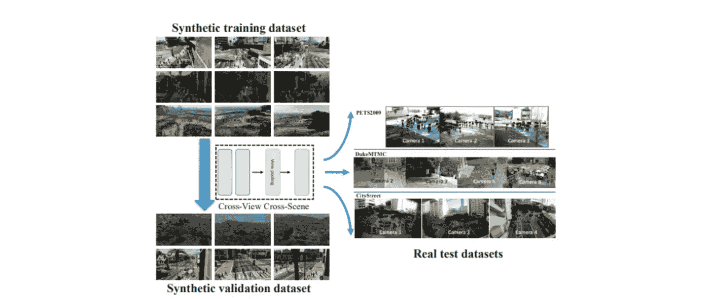
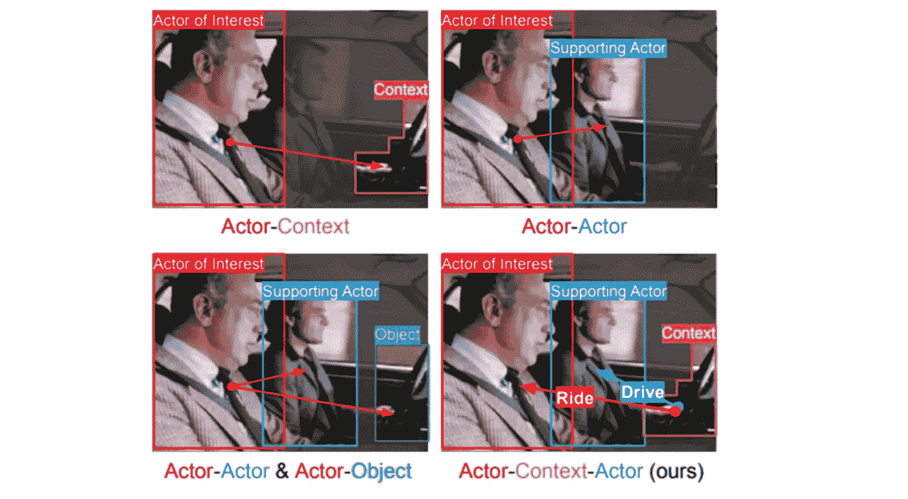
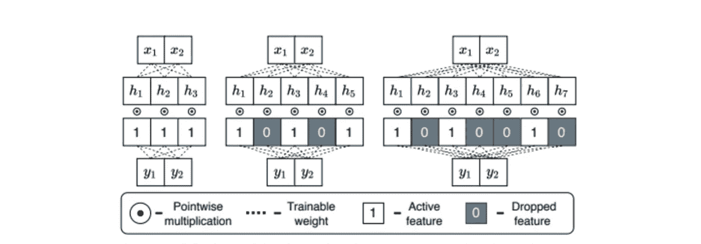
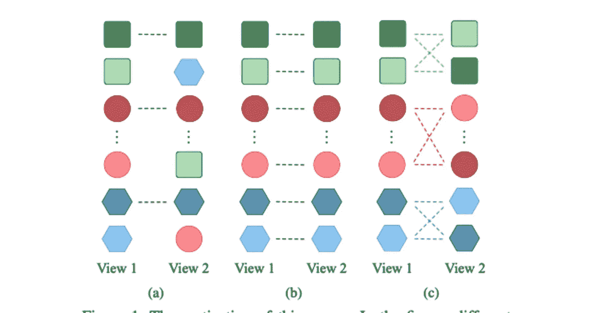
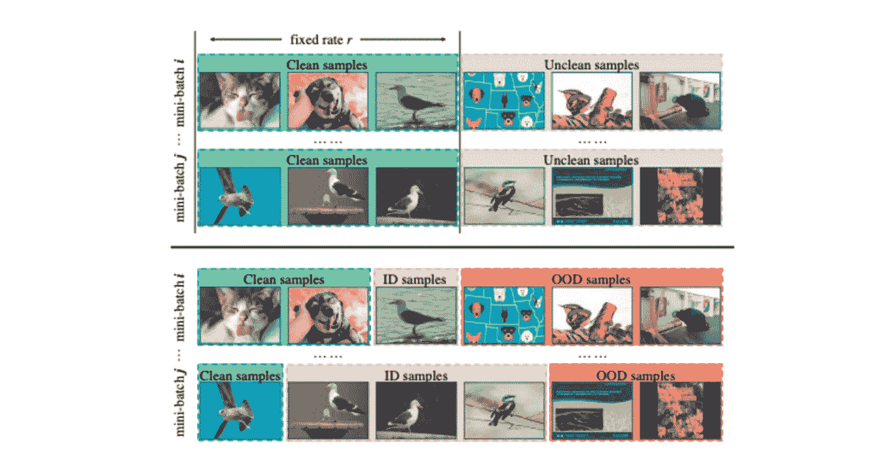
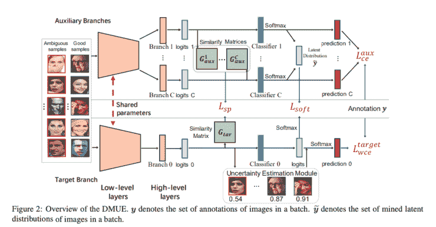

# Akira 的机器学习新闻— #24

> 原文：<https://medium.com/analytics-vidhya/akiras-machine-learning-news-24-6aeb7942bca8?source=collection_archive---------17----------------------->

2021 年第 31 周(8 月 8 日~)

## 本周特稿/新闻。

*   有一篇文章说为新冠肺炎创造的人工智能工具完全没用。主要原因似乎是泄漏和数据质量，但它提醒我，很难创建在真实环境中运行良好的东西。
*   [在人群计数的情况下，已经有使用合成数据的研究](https://openaccess.thecvf.com/content/CVPR2021/papers/Zhang_Cross-View_Cross-Scene_Multi-View_Crowd_Counting_CVPR_2021_paper.pdf)。由于深度学习需要大量的数据，因此也有[使用游戏 GTA5 中的数据进行 3D 对象检测的例子](https://arxiv.org/abs/2103.07351)，使用合成数据，其中注释是准确的，并且有大量数据可用，可能会变得更受欢迎。

## 现实世界中的机器学习

*   有一篇文章描述了基于人工智能的攻击正在做些什么。例如，攻击者正在使用 Deep Fake，但在防御方面没有投入。
*   [看起来他们正在将机器学习应用到物理模拟中](https://spectrum.ieee.org/tech-talk/artificial-intelligence/machine-learning/replacing-simulations-of-atomic-clusters-with-ai)。在大型系统中，计算成本似乎低于直接计算。[一项研究](https://arxiv.org/abs/1909.12790)也表明，在计算大系统的哈密顿量时可以实现计算成本优势。

## 报纸

*   在标签中存在错误的情况下，提出了一种[方法，该方法使用自我监督学习来区分分布内和分布外标签](https://arxiv.org/abs/2103.13029)。近年来，用自我监督学习增强监督学习的研究越来越多。然而，计算成本似乎是一个问题。

— — — — — — — — — — — — — — — — — — –

在下面的章节中，我将介绍各种文章和论文，不仅仅是关于上述内容，还包括以下五个主题。

1.  本周特稿/新闻
2.  机器学习用例
3.  报纸
4.  机器学习技术相关文章
5.  其他主题

— — — — — — — — — — — — — — — — — — –

# 1.本周特稿/新闻

[**用合成数据统计人群数据集**](https://openaccess.thecvf.com/content/CVPR2021/papers/Zhang_Cross-View_Cross-Scene_Multi-View_Crowd_Counting_CVPR_2021_paper.pdf?utm_campaign=Akira%27s%20Machine%20Learning%20News%20%20%20&utm_medium=email&utm_source=Revue%20newsletter)**——**[**openaccess.thecvf.com**](https://openaccess.thecvf.com/content/CVPR2021/papers/Zhang_Cross-View_Cross-Scene_Multi-View_Crowd_Counting_CVPR_2021_paper.pdf)

【跨视角跨场景多视角人群计数】
提出了一种多种摄像机配置(CVCS)的人群计数任务。由于在这种问题环境下，注记的成本非常高，因此他们提出了一个包含合成数据的 CVCS 数据集。通过无监督领域适应的微调，他们证明了它可以应用于现实世界的数据。

****——****人工智能工具在对抗新冠肺炎的战斗中毫无用处****

**** [## 已经建立了数百个人工智能工具来捕捉 covid。他们都没帮上忙。

### 尽管没有经过适当的测试，但有些已经在医院使用。但是疫情可以帮助制造…

www.technologyreview.com](https://www.technologyreview.com/2021/07/30/1030329/machine-learning-ai-failed-covid-hospital-diagnosis-pandemic/?utm_campaign=Akira%27s%20Machine%20Learning%20News%20%20%20&utm_medium=email&utm_source=Revue%20newsletter) 

一篇文章报道说，为新冠肺炎开发的 415 种人工智能工具中，并非所有都达到了临床应用的水平。许多人的数据质量很差，或者存在泄漏问题(训练和评估数据包含相同的数据，因此性能看起来比实际情况要好)。**** 

****— — — — — — — — — — — — — — — — — — –****

# ****2.机器学习用例****

******[来自进攻的威胁艾](https://venturebeat.com/2021/07/02/attackers-use-offensive-ai-to-create-deepfakes-for-phishing-campaigns/?utm_campaign=Akira%27s%20Machine%20Learning%20News%20%20%20&utm_medium=email&utm_source=Revue%20newsletter)****——******

****** [## 攻击者使用“攻击性人工智能”为网络钓鱼活动创建 deepfakes

### 人工智能使组织能够自动执行任务，提取信息，并创建几乎无法从…

venturebeat.com](https://venturebeat.com/2021/07/02/attackers-use-offensive-ai-to-create-deepfakes-for-phishing-campaigns/?utm_campaign=Akira%27s%20Machine%20Learning%20News%20%20%20&utm_medium=email&utm_source=Revue%20newsletter) 

一篇讨论攻击性人工智能可能导致什么的文章。它指出，攻击者可能会使用 Deep Fake 进行钓鱼欺诈和逆向工程来窃取算法，但在防御这些攻击方面没有投入。****** 

******[**物理模拟与机器学习**](https://spectrum.ieee.org/replacing-simulations-of-atomic-clusters-with-ai?utm_campaign=Akira%27s%20Machine%20Learning%20News%20%20%20&utm_medium=email&utm_source=Revue%20newsletter)**——**[**spectrum.ieee.org**](https://spectrum.ieee.org/replacing-simulations-of-atomic-clusters-with-ai)******

**** [## 物理学家教人工智能模拟原子团

### 最近，我们一直在考虑如何改进人工智能语音助手，如 Alexa 和 Siri，现在许多人…

spectrum.ieee.org](https://spectrum.ieee.org/replacing-simulations-of-atomic-clusters-with-ai?utm_campaign=Akira%27s%20Machine%20Learning%20News%20%20%20&utm_medium=email&utm_source=Revue%20newsletter) 

物理模拟是强大的，但是当试图计算巨大的原子模型时，它们需要非常大的计算量。如果使用机器学习来近似模拟，您可能能够计算非常大的系统，因为即使原子的数量以指数方式增加，计算时间也只是线性增加。**** 

****— — — — — — — — — — — — — — — — — — –****

# ****3.报纸****

****[**明确将人物-语境-人物三元组纳入模型**](https://arxiv.org/abs/2006.07976?utm_campaign=Akira%27s%20Machine%20Learning%20News%20%20%20&utm_medium=email&utm_source=Revue%20newsletter)**——**[**arxiv.org**](https://arxiv.org/abs/2006.07976)****

********

****[2006.07976]用于时空动作定位的行动者-上下文-行动者关系网络
他们提出了 ACAR 网络，该网络将人-上下文-人三元组明确纳入动作识别的模型中，因为通常无法仅从人-上下文对推断人的行为。在 ActivityNet Challenge 2020 的 AVA 动力学中，ACAR 网获得了第一名，明显优于其他方法。****

****[**一种使用遮罩来操纵连接的集成技术。**](https://arxiv.org/abs/2012.08334?utm_campaign=Akira%27s%20Machine%20Learning%20News%20%20%20&utm_medium=email&utm_source=Revue%20newsletter)**——**[**arxiv.org**](https://arxiv.org/abs/2012.08334)****

********

****[2012.08334]用于不确定度估计的 mask assembles
ensembles 用于计算不确定度，但其价格昂贵。他们提出了一种通过使用掩码伪操纵模型耦合的集成方法，并在 ImageNet 和 CIFAR-10 上证实了其有效性。****

****[**利用对比学习获得类别级对齐**](https://openaccess.thecvf.com/content/CVPR2021/html/Yang_Partially_View-Aligned_Representation_Learning_With_Noise-Robust_Contrastive_Loss_CVPR_2021_paper.html?utm_campaign=Akira%27s%20Machine%20Learning%20News%20%20%20&utm_medium=email&utm_source=Revue%20newsletter)**——******

************

******【具有噪声鲁棒性对比损失的部分视图对齐表示学习】
在 MvRL(多视图表示学习)中，这是一个从多视图/多模态中获得用于聚类和分类的有用表示的任务，存在仅对齐一部分数据的问题。因此，他们提出了使用对比学习的 MvCLN，并提出了一种在类别级别对齐的方法。******

******[**利用对比学习发现误标注。**](https://arxiv.org/abs/2103.13029?utm_campaign=Akira%27s%20Machine%20Learning%20News%20%20%20&utm_medium=email&utm_source=Revue%20newsletter)**——**[**arxiv.org**](https://arxiv.org/abs/2103.13029)******

********

****[2103.13029] Jo-SRC:对抗噪音标签的对比方法
噪音标签问题的传统方法忽略了不同小批量之间的噪音比例。为此，他们提出了 Jo-SRC，使用对比学习将每个数据标记为干净、分布内或分布外，并且只使用干净来训练。我们证实了该方法在各种环境中的有效性。****

## ****[明确地将对抗攻击的抗性加入 NAS](https://arxiv.org/abs/2012.06122?utm_campaign=Akira%27s%20Machine%20Learning%20News%20%20%20&utm_medium=email&utm_source=Revue%20newsletter)****

****[2012.06122] DSRNA:鲁棒神经架构的差异化搜索
一项将对抗敌对攻击的能力明确纳入 NAS 的研究。通过不仅最小化验证数据的损失，而且最小化测量对抗攻击的鲁棒性的可区分度量的组合，探索健壮的架构。****

****[**让模型考虑到面部表情识别中标签的模糊性**](https://arxiv.org/abs/2104.00232?utm_campaign=Akira%27s%20Machine%20Learning%20News%20%20%20&utm_medium=email&utm_source=Revue%20newsletter)**——**[**arxiv.org**](https://arxiv.org/abs/2104.00232)****

********

****[2104.00232]陷入歧义:面部表情识别的潜在分布挖掘和成对不确定性估计
面部表情识别具有歧义，因为它是主观标注的。他们提出了一种学习模糊性的方法，通过在训练期间约束网络以与 C 分支的组合网络相同的方式对 C-1 类进行分类，来避免代价高昂的推断。在 AffectNet 中获得 SotA 性能。****

****— — — — — — — — — — — — — — — — — — –****

# ****4.机器学习技术相关文章****

****[**麻省理工深度学习讲座**](https://www.youtube.com/playlist?list=PLtBw6njQRU-rwp5__7C0oIVt26ZgjG9NI&utm_campaign=Akira%27s%20Machine%20Learning%20News%20%20%20&utm_medium=email&utm_source=Revue%20newsletter)**——**[**www.youtube.com**](https://www.youtube.com/playlist?list=PLtBw6njQRU-rwp5__7C0oIVt26ZgjG9NI)****

****【麻省理工 6。S191:深度学习介绍]
麻省理工学院关于深度学习的视频列表，不仅涵盖 CNN、RNN、强化学习、生成模型等基础知识。，还有公平性，当前话题，深度学习的局限性。****

## ****[关于 MDETR 的说明文章](https://ai-scholar.tech/en/articles/transformer/mdetr?utm_campaign=Akira%27s%20Machine%20Learning%20News%20%20%20&utm_medium=email&utm_source=Revue%20newsletter)****

**** [## 又来了！又一个 DETR！多模态推理模型的创新范例。

### 3 要点✔️提出一个端到端的文本控制对象检测模型✔️实现端到端的检测在…

人工智能-学者.技术](https://ai-scholar.tech/en/articles/transformer/mdetr?utm_campaign=Akira%27s%20Machine%20Learning%20News%20%20%20&utm_medium=email&utm_source=Revue%20newsletter) 

一篇关于 MDETR 的文章，结合了语言学习和 DETR。通过执行结合语言的多模态学习，可以检测训练数据中不存在的类别，例如“粉红大象”。**** 

****— — — — — — — — — — — — — — — — — — –****

# ****5.其他主题****

****[**组合九头蛇和 Pytorch 的项目模板——闪电**](https://github.com/ashleve/lightning-hydra-template?utm_campaign=Akira%27s%20Machine%20Learning%20News%20%20%20&utm_medium=email&utm_source=Revue%20newsletter)**——**[**github.com**](https://github.com/ashleve/lightning-hydra-template)****

**** [## GitHub-ashleve/Lightning-Hydra-template:py torch Lightning+Hydra。一个非常通用、功能丰富的…

### PyTorch 闪电+九头蛇。一个非常通用的，功能丰富的模板，用于快速和可扩展的 ML 实验，具有最好的…

github.com](https://github.com/ashleve/lightning-hydra-template?utm_campaign=Akira%27s%20Machine%20Learning%20News%20%20%20&utm_medium=email&utm_source=Revue%20newsletter) 

一个项目模板库，结合了 Hydra 和 Pytorch lightning，Hydra 通过参数简化了实验控制，Pytorch lightning 是 py torch 的一个包装器。不必要的功能可以很容易地从流水线中删除并重新配置。**** 

****— — — — — — — — — — — — — — — — — — –****

# ****🌟我每周发布时事通讯！请订阅！🌟****

**** [## 阿基拉的机器学习新闻- Revue

### 由 Akira 的机器学习新闻-由 Akihiro FUJII:制造工程师/机器学习工程师/硕士…

www.getrevue.co](https://www.getrevue.co/profile/akiratosei) 

— — — — — — — — — — — — — — — — — — –

# 关于我

制造工程师/机器学习工程师/数据科学家/物理学硕士/[http://github.com/AkiraTOSEI/](https://t.co/hjHHbG24Ph?amp=1)

推特，我贴一句纸评论。****