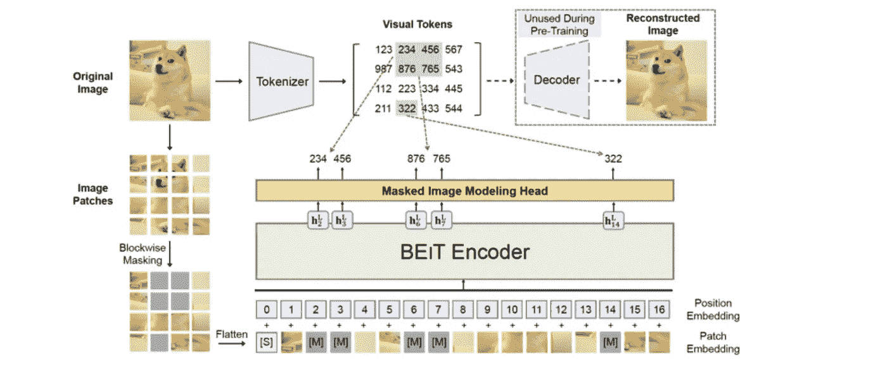
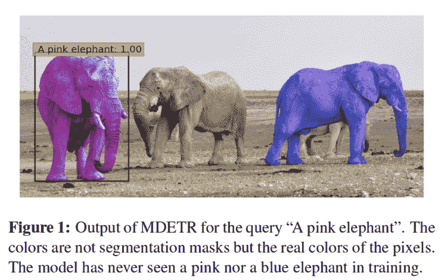
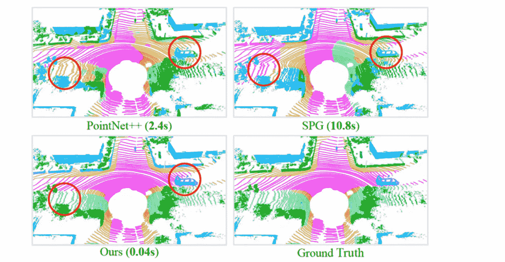
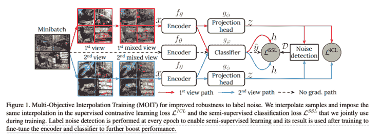
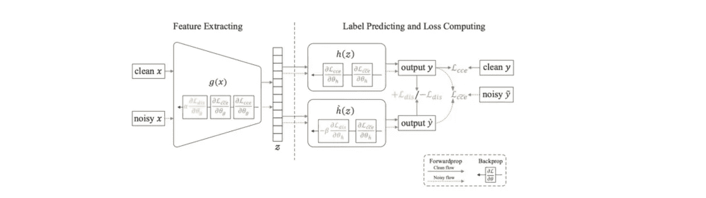

# Akira 的机器学习新闻— #25

> 原文：<https://medium.com/analytics-vidhya/akiras-machine-learning-news-25-c2b79a3814e2?source=collection_archive---------8----------------------->

## 本周特稿/新闻。

*   T [这里是一个关于在图像数据](https://arxiv.org/abs/2106.08254)上用诸如 BERT 之类的屏蔽语言模型训练变压器的研究。我个人认为这是 Vision Transformer 的一个很好的应用，因为它将图像视为标记，并以自然语言的方式处理它们。
*   [通过训练 DETR，一个使用变压器的对象检测模型，连同文本，有可能检测任意句子中表达的对象](https://arxiv.org/abs/2104.12763)。自从 ViT 以来，对视觉语言的研究变得越来越受欢迎，我认为 Transformer 将有助于利用语言和图像的力量。

— — — — — — — — — — — — — — — — — — –

在下面的章节中，我将介绍各种文章和论文，不仅仅是关于上述内容，还包括以下五个主题。

1.  本周特稿/新闻
2.  机器学习用例
3.  报纸
4.  机器学习技术相关文章
5.  其他主题

— — — — — — — — — — — — — — — — — — –

# 1.本周特稿/新闻

****——**[**arxiv.org**](https://arxiv.org/abs/2106.08254)**

****

**[2106.08254] BEiT:图像转换器的 BERT 预训练
他们提出了 BEiT，根据 ViT 对图像进行标记化，并使用 BERT 等掩模语言模型进行预训练，仅使用 ImageNet 进行无标签预训练，在分类和分割方面表现良好。它还执行图像的离散记号化，像图像的 VQ-VAE。**

**[**任意文本的对象检测。**](https://arxiv.org/abs/2104.12763?utm_campaign=Akira%27s%20Machine%20Learning%20News%20%20%20&utm_medium=email&utm_source=Revue%20newsletter)**——**【arxiv.org】**

********

****[2104.12763] MDETR —用于端到端多模态理解的调制检测
他们提出了 MDETR，可以用文本和图像对其进行训练，以使用指示对象的任意文本来执行对象检测；基于 DETR，它被训练来匹配预测对象的位置及其相应的文本。它可以检测任何文本，如“粉红色的大象”。****

****— — — — — — — — — — — — — — — — — — –****

# ****2.机器学习使用 cas****

****[**小语种问题**](https://thegradient.pub/machine-translation-shifts-power/?utm_campaign=Akira%27s%20Machine%20Learning%20News%20%20%20&utm_medium=email&utm_source=Revue%20newsletter)**——******

****** [## 机器翻译转移权力

### 2019 年，美国国土安全部(DHS)宣布计划收集社交媒体用户名…

thegradient.pub](https://thegradient.pub/machine-translation-shifts-power/) 

关于小语种机器翻译的文章。历史上，殖民土著被迫说强大的西方国家的语言，但即使在今天，即使有机器翻译，翻译次要的原始语言也有问题。文章还讨论了使用一种语言是否需要许可。****** 

******[**人工智能行业中的反垄断**](https://www.wired.com/story/opinion-bidens-antitrust-revolution-overlooks-ai-at-americans-peril/?utm_campaign=Akira%27s%20Machine%20Learning%20News%20%20%20&utm_medium=email&utm_source=Revue%20newsletter)**——**[**www.wired.com**](https://www.wired.com/story/opinion-bidens-antitrust-revolution-overlooks-ai-at-americans-peril/)******

**** [## 拜登的“反垄断革命”忽视了人工智能——美国人处于危险之中

### 尽管行政命令和国会听证会的“拜登反垄断革命”，最深刻的…

www.wired.com](https://www.wired.com/story/opinion-bidens-antitrust-revolution-overlooks-ai-at-americans-peril) 

人工智能产业实际上被 GAFA 和其他几家公司垄断了。作为对策，作者建议监控这些公司对初创公司的收购。**** 

****— — — — — — — — — — — — — — — — — — –****

# ****3.报纸****

****[【arxiv.org】](https://arxiv.org/abs/1911.11236?utm_campaign=Akira%27s%20Machine%20Learning%20News%20%20%20&utm_medium=email&utm_source=Revue%20newsletter)**——**[**加速点云分割 200 倍随机选择**](https://arxiv.org/abs/1911.11236)****

********

****【1911.11236】RandLA-Net:大规模点云的高效语义分割
他们提出了一种新方法 rand la-Net，它比现有方法快 200 倍，在 3D 点云分割中使用随机点选择，精度更高。随机选择可能会丢弃一些重要信息，但提出了一种局部特征聚合方法来解决这一问题。****

****[**对比学习有什么作用？**](https://arxiv.org/abs/2011.10566?utm_campaign=Akira%27s%20Machine%20Learning%20News%20%20%20&utm_medium=email&utm_source=Revue%20newsletter)**——**[**arxiv.org**](https://arxiv.org/abs/2011.10566)****

********

****[2011.10566]探索简单的暹罗表征学习
使用暹罗网络研究对比学习中什么是重要的。预测器和停止梯度起重要作用，批量大小对学习的稳定性贡献不大。他们还指出，由于使用了停止梯度，其行为更像 EM 算法。****

****[**应用半监督和自监督学习标注噪声**](https://arxiv.org/abs/2012.04462?utm_campaign=Akira%27s%20Machine%20Learning%20News%20%20%20&utm_medium=email&utm_source=Revue%20newsletter)**——**[**arxiv.org**](https://arxiv.org/abs/2012.04462)****

********

****[2012.04462]多目标插值训练对标签噪声的鲁棒性
为了对标签噪声具有鲁棒性，他们提出了同时执行半监督和对比学习的 MOIT。它仅从通过对比学习获得的表示中选择正确的标签数据，并执行半监督学习。SotA 性能是在有噪声的 CIFAR10/100 ImageNet 上实现的。****

****[**通过匹配特征分布解决噪声标签问题**](https://openaccess.thecvf.com/content/CVPR2021/html/Qu_DAT_Training_Deep_Networks_Robust_To_Label-Noise_by_Matching_the_CVPR_2021_paper.html?utm_campaign=Akira%27s%20Machine%20Learning%20News%20%20%20&utm_medium=email&utm_source=Revue%20newsletter)**——**[**openaccess.thecvf.com**](https://openaccess.thecvf.com/content/CVPR2021/html/Qu_DAT_Training_Deep_Networks_Robust_To_Label-Noise_by_Matching_the_CVPR_2021_paper.html)****

********

****【DAT:通过匹配特征分布来训练对标签噪声鲁棒的深度网络】
在有噪标签问题中，他们提出了通过匹配有噪和无噪数据的特征分布来进行特征提取的 DAT。他们不仅用 MNIST 和 CIFAR10 实现了 SotA 性能，还用 Cothing1M 实现了接近真实设置的性能。****

****— — — — — — — — — — — — — — — — — — –****

# ****4.机器学习技术相关文章****

****[**从卫星影像中分割建筑物**](https://ai.googleblog.com/2021/07/mapping-africas-buildings-with.html?m=1%20&utm_campaign=Akira%27s%20Machine%20Learning%20News%20%20%20&utm_medium=email&utm_source=Revue%20newsletter)**——**[**ai.googleblog.com**](https://ai.googleblog.com/2021/07/mapping-africas-buildings-with.html?m=1+)****

**** [## 用卫星图像绘制非洲的建筑

### 建筑物足迹的准确记录对于从人口估计到环境监测等一系列应用都很重要

ai.googleblog.com](https://ai.googleblog.com/2021/07/mapping-africas-buildings-with.html?m=1) 

Google 关于非洲城市建筑分割数据集模型开发的技术博客。它提到了使用 Mixup 的重要性，强调了建筑边界，并对吵闹的学生使用自我监督学习。**** 

****[**时间加权平均理论及有用情况**](https://blog.timescale.com/blog/what-time-weighted-averages-are-and-why-you-should-care/?utm_campaign=Akira%27s%20Machine%20Learning%20News%20%20%20&utm_medium=email&utm_source=Revue%20newsletter)**——**[**blog.timescale.com**](https://blog.timescale.com/blog/what-time-weighted-averages-are-and-why-you-should-care/)****

**** [## 什么是时间加权平均值，为什么你应该关心

### 了解时间加权平均值是如何计算的，为什么它们对数据分析如此强大，以及如何使用时间刻度…

blog.timescale.com](https://blog.timescale.com/blog/what-time-weighted-averages-are-and-why-you-should-care/) 

一个关于时间加权平均的博客，对于不规则采样的时间序列数据很有用。例子和理论用图表解释并且容易理解。**** 

****— — — — — — — — — — — — — — — — — — –****

# ****5.其他主题****

****[**可微物理引擎**](https://github.com/google/brax?utm_campaign=Akira%27s%20Machine%20Learning%20News%20%20%20&utm_medium=email&utm_source=Revue%20newsletter)**——**[**github.com**](https://github.com/google/brax)****

**** [## GitHub - google/brax:加速器硬件上的大规模并行刚体物理模拟。

### Brax 是一个可区分的物理引擎，模拟由刚体、关节和致动器组成的环境…

github.com](https://github.com/google/brax) 

由 Google 发布的可区分物理引擎的存储库。它可用于各种算法开发，如进化策略、PPO 等。这是在 JAX 写的。**** 

****— — — — — — — — — — — — — — — — — — –****

# ****🌟我每周发布时事通讯！请订阅！🌟****

**** [## 阿基拉的机器学习新闻- Revue

### 由 Akira 的机器学习新闻-由 Akihiro FUJII:制造工程师/机器学习工程师/硕士…

www.getrevue.co](https://www.getrevue.co/profile/akiratosei) 

— — — — — — — — — — — — — — — — — — –

# 关于我

制造工程师/机器学习工程师/数据科学家/物理学硕士/[http://github.com/AkiraTOSEI/](https://t.co/hjHHbG24Ph?amp=1)

推特，我贴一句纸评论。****