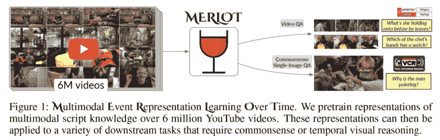
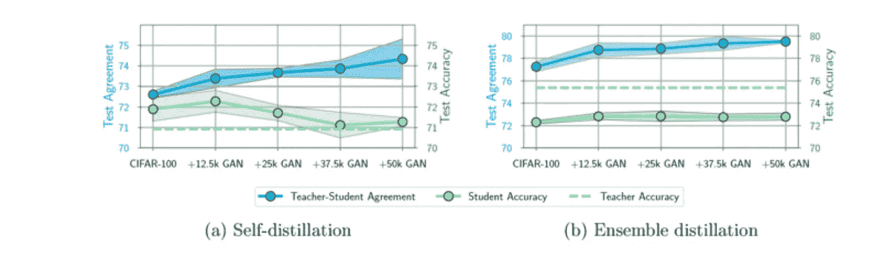
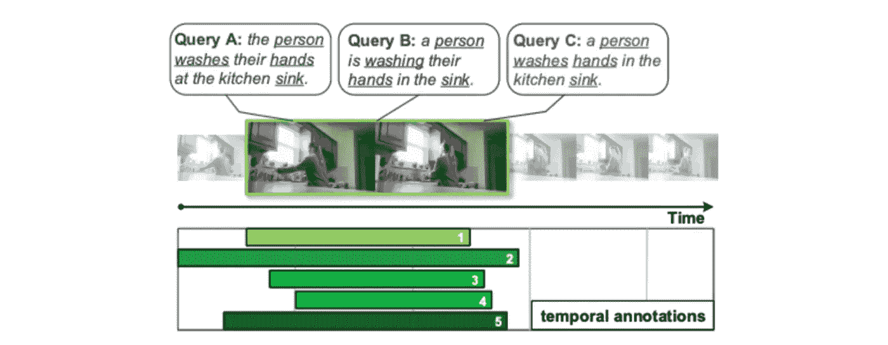
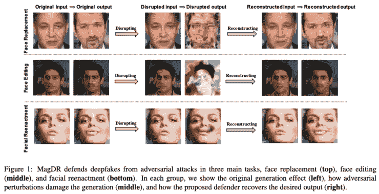
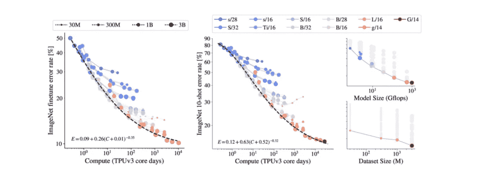
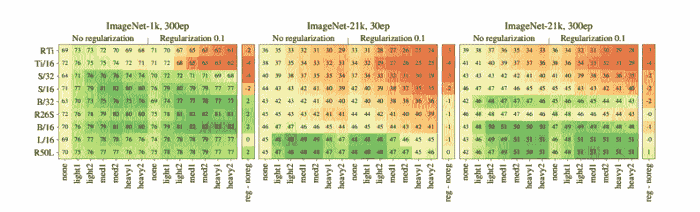

# Akira 的机器学习新闻— #26

> 原文：<https://medium.com/analytics-vidhya/akiras-machine-learning-news-26-2d0c888572f3?source=collection_archive---------10----------------------->

## 本周特稿/新闻。

*   [提出了对大量视频数据的无监督学习的研究](https://arxiv.org/abs/2106.02636)，使用 Transformer 在时间和空间方向上训练设计良好的任务。在处理 600 万条数据的同时，随着数据的增长精度的提高还没有达到上限，未来还有进一步提高的潜力。
*   知识提炼传统上被描述为“通过学习教师模型的输出分布来使学生模型更聪明”，但是[的一项研究](https://arxiv.org/abs/2106.05945)表明，教师模型的分布和学生模型的分布之间的一致程度与学生模型的成绩准确性之间的相关性很差。有一项研究表明，即使教师模型很差，学习也是可能的，正如那里所声称的，提炼可能只是正则项的函数。

— — — — — — — — — — — — — — — — — — –

在下面的章节中，我将介绍各种文章和论文，不仅仅是关于上述内容，还包括以下五个主题。

1.  本周特稿/新闻
2.  机器学习用例
3.  报纸
4.  机器学习技术相关文章

— — — — — — — — — — — — — — — — — — –

# 1.本周特稿/新闻

[**用大量视频和语言进行自我监督学习**](https://arxiv.org/abs/2106.02636?utm_campaign=Akira%27s%20Machine%20Learning%20News%20%20%20&utm_medium=email&utm_source=Revue%20newsletter)**——**[**arxiv.org**](https://arxiv.org/abs/2106.02636)

[2106.02636] MERLOT:多模态神经脚本知识模型
使用多达 600 万个视频数据和伴随的字幕，MERIOT 被提议对时间和空间任务执行自我监督学习。它不使用任何标签信息，但可以实现 SotA 性能。此外，即使有 600 万个数据，预训练的准确性也在继续增加，这被认为是未来有前途的研究方向。

[**知识升华不符合分布**](https://arxiv.org/abs/2106.05945?utm_campaign=Akira%27s%20Machine%20Learning%20News%20%20%20&utm_medium=email&utm_source=Revue%20newsletter)**——**[**arxiv.org**](https://arxiv.org/abs/2106.05945)

知识蒸馏真的有用吗？
他们声称知识的升华使学生模型学习到了教师模型的分布，但是这种一致性越高，并不意味着学生模型就越高精确。他们的结论是“知识提炼在提高学生模型的准确性方面起作用，但在匹配学生和教师模型的分布方面不起作用。”

— — — — — — — — — — — — — — — — — — –

# 2.机器学习用例

[**机器学习中的公平与透明**](https://thegradient.pub/justitia-ex-machina/?utm_campaign=Akira%27s%20Machine%20Learning%20News%20%20%20&utm_medium=email&utm_source=Revue%20newsletter)**—**[**the gradient . pub**](https://thegradient.pub/justitia-ex-machina/)

 [## 贾斯汀·玛奇纳:道德自动化的案例

### 机器学习是一种强大的技术，可以从最近成为驱动因素的数据中自动学习模型…

thegradient.pub](https://thegradient.pub/justitia-ex-machina/) 

这篇文章认为，机器学习也可以学习种族和犯罪率等歧视性因素(当相关时，包括历史上的)，并且还有透明度挑战来防止这种情况发生。

[**牛的识别与疾病检测**](https://blogs.nvidia.com/blog/2021/08/06/plainsight-cattle-management-ai/?utm_campaign=Akira%27s%20Machine%20Learning%20News%20%20%20&utm_medium=email&utm_source=Revue%20newsletter)**——**[**blogs.nvidia.com**](https://blogs.nvidia.com/blog/2021/08/06/plainsight-cattle-management-ai/)

 [## Plainsight 通过人工智能增强牛群管理 NVIDIA 官方博客

### 计算机视觉和边缘人工智能正在超越牧场。总部位于旧金山的初创公司 Plainsight 和 NVIDIA…

blogs.nvidia.com](https://blogs.nvidia.com/blog/2021/08/06/plainsight-cattle-management-ai/) 

牛的识别非常困难，并且由于错误识别造成的经济损失很高。Plainsight 不仅可以高精度地识别牛，还可以根据牛的异常行为创建检测疾病的模型。

— — — — — — — — — — — — — — — — — — –

# 3.报纸

【arxiv.org】**处理自然语言查询中的可变性****——**

****

**[2103.16848]拥抱不确定性:去耦和去偏置实现稳健的时间基础
他们提出了 DeNet(去耦和去偏置)来处理时间基础任务中的查询可变性和注释可变性，该任务使用自然语言查询从视频中提取动作。他们证实了 DeNet 对于 chariales-STA 和 ActivityNet 字幕的有效性和稳健性。**

**[**突破对抗性攻击，防止深度假冒**](https://arxiv.org/abs/2103.14211?utm_campaign=Akira%27s%20Machine%20Learning%20News%20%20%20&utm_medium=email&utm_source=Revue%20newsletter)**—****

********

****【2103.14211】MagDR:Mask-guided Detection and re construction for defense Deep fakes
作为一种针对深度假像的对策，有一种方法是通过在图像中添加对抗性噪声来防止深度假像的产生。相比之下，他们使用一个遮罩来确定图像中是否有噪声，并重建图像以使深度假工作。他们已经证明他们的方法可以处理黑盒和白盒攻击。****

****[**比例尺为 ViT**](https://arxiv.org/abs/2106.04560?utm_campaign=Akira%27s%20Machine%20Learning%20News%20%20%20&utm_medium=email&utm_source=Revue%20newsletter)**——**[**arxiv.org**](https://arxiv.org/abs/2106.04560)****

********

****[2106.04560]缩放视觉转换器
使用不同数量的数据和模型尺寸对 ViT 进行研究，以检查缩放定律。数据量越多，模型规模越大，微调后精度越好，数据量越少，精度越低。他们还改进了训练方法等。，创造了一个巨型 ViT，在 ImageNet 上取得了 90.45% (top-1)。****

****[**ViT 中的数据扩充和正则化**](https://arxiv.org/abs/2106.10270?utm_campaign=Akira%27s%20Machine%20Learning%20News%20%20%20&utm_medium=email&utm_source=Revue%20newsletter)**——**[**arxiv.org**](https://arxiv.org/abs/2106.10270)****

********

****【2106.10270】如何训练自己的 ViT？视觉转换器中的数据、扩充和规则化
一项调查数据扩充和规则化对视觉转换的影响的研究。当模型大小和计算资源较大时，强正则化和数据扩充更有效，并且数据扩充和正则化与将数据增加 10 倍一样好或更好。****

****[**用简单的正则化项**](https://arxiv.org/abs/2105.04906?utm_campaign=Akira%27s%20Machine%20Learning%20News%20%20%20&utm_medium=email&utm_source=Revue%20newsletter)**——**[**arxiv.org**](https://arxiv.org/abs/2105.04906)防止自监督学习的崩溃****

********

****[2105.04906] VICReg:用于自监督学习的方差-不变性-协方差正则化
提出了 VICReg，其在自监督学习中使用正则化来使具有不同变换的相同图像的表示更加接近，保持批次之间的数据表示的方差，并且不跨维度学习相同的表示。它不需要像对比学习那样的大批量，并且防止崩溃。****

****— — — — — — — — — — — — — — — — — — –****

# ****4.机器学习技术相关文章****

****[**【VQ-甘+夹】简述。alpha fold 2**](https://thegradientpub.substack.com/p/gradient-update-5-ai-generated-art?utm_campaign=Akira%27s%20Machine%20Learning%20News%20%20%20&utm_medium=email&utm_source=Revue%20newsletter)**——**[**thegradientpub.substack.com**](https://thegradientpub.substack.com/p/gradient-update-5-ai-generated-art)****

**** [## 渐变更新#5:人工智能生成的艺术和 AlphaFold

### 本版的新闻故事是人工智能生成的艺术场景爆炸，因为黑客创造了突破性的新工具摘要。一个…

thegradientpub.substack.com](https://thegradientpub.substack.com/p/gradient-update-5-ai-generated-art) 

一篇简要解释它们为什么重要的文章，包括专家的意见。还有很多参考链接。**** 

****[**高效深度学习模型的技术**](https://www.kdnuggets.com/2021/07/high-performance-deep-learning-part3.html?utm_campaign=Akira%27s%20Machine%20Learning%20News%20%20%20&utm_medium=email&utm_source=Revue%20newsletter)**——**[**www.kdnuggets.com**](https://www.kdnuggets.com/2021/07/high-performance-deep-learning-part3.html)****

**** [## 高性能深度学习:如何训练更小、更快、更好的模型-第 3 部分…

### 现在，您已经准备好使用正确的软件和硬件工具高效地构建高级深度学习模型…

www.kdnuggets.com](https://www.kdnuggets.com/2021/07/high-performance-deep-learning-part3.html) 

一篇讨论快速学习好模型的技巧的文章。介绍了量化、剪枝、自监督学习及其技术。**** 

****— — — — — — — — — — — — — — — — — — –****

# ****🌟我每周发布时事通讯！请订阅！🌟****

**** [## 阿基拉的机器学习新闻- Revue

### 由 Akira 的机器学习新闻-由 Akihiro FUJII:制造工程师/机器学习工程师/硕士…

www.getrevue.co](https://www.getrevue.co/profile/akiratosei) 

— — — — — — — — — — — — — — — — — — –

# 关于我

制造工程师/机器学习工程师/数据科学家/物理学硕士/[http://github.com/AkiraTOSEI/](https://t.co/hjHHbG24Ph?amp=1)

推特，我贴一句纸评论。****