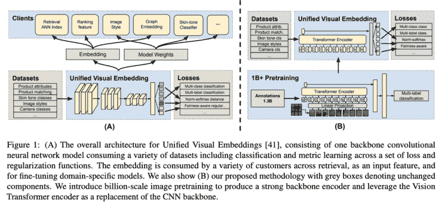
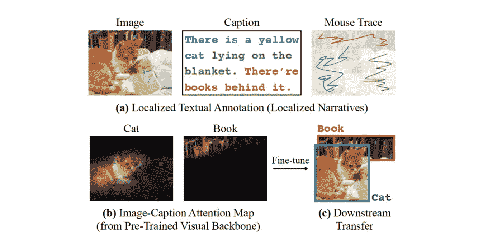
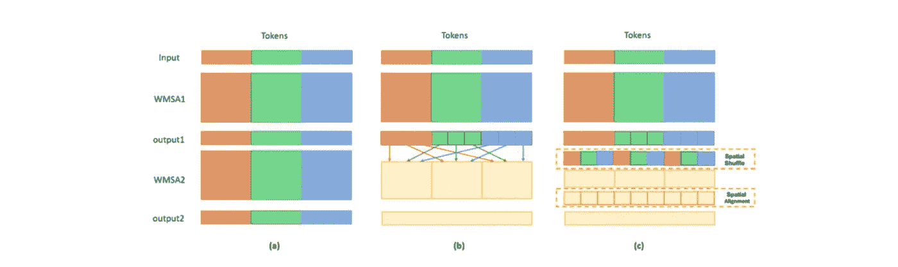
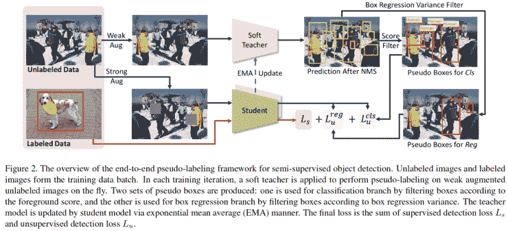
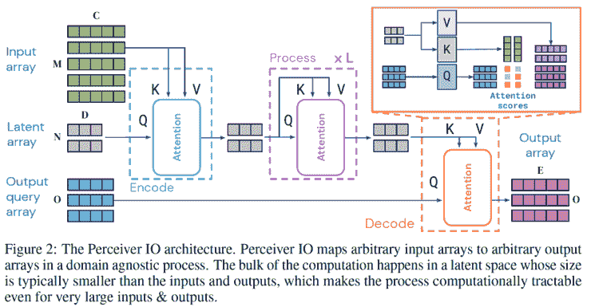
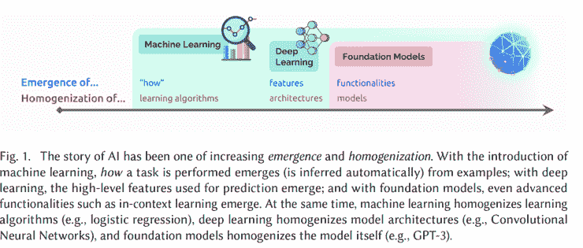
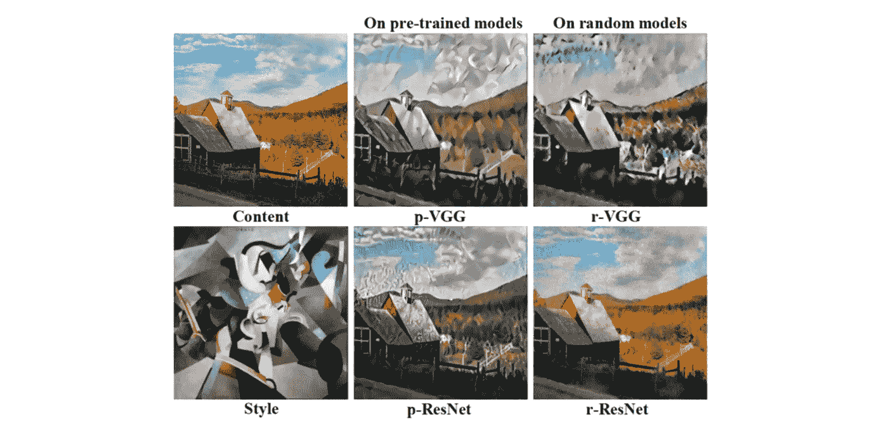
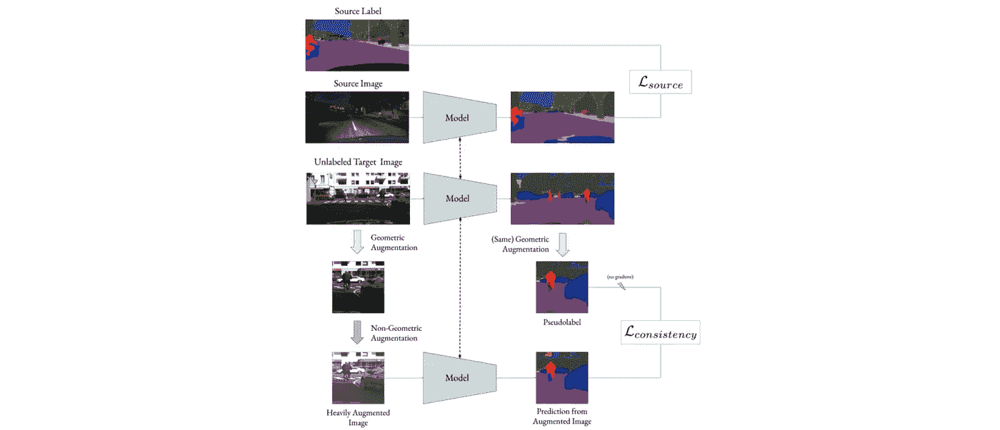
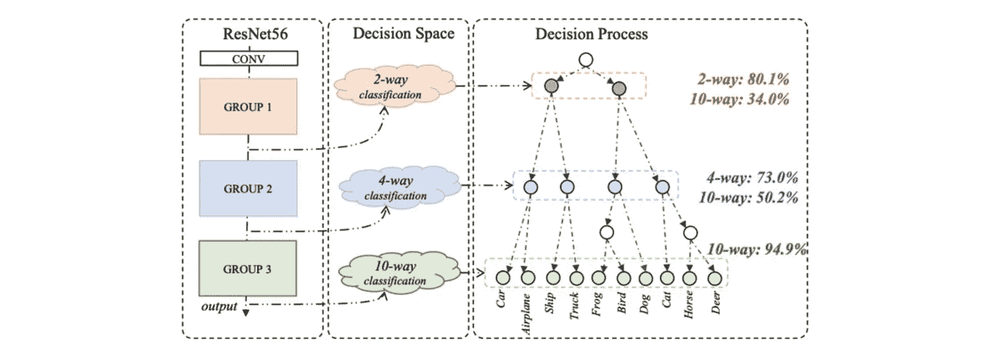

# Akira 的机器学习新闻— #27

> 原文：<https://medium.com/analytics-vidhya/akiras-machine-learning-news-27-393ebdff2b78?source=collection_archive---------11----------------------->

## 本周特稿/新闻。

*   一篇报道变压器在工业中的应用的论文已经发表。他们使用统一的视觉嵌入，将特征嵌入到一个公共的嵌入空间，并在总共 13 亿条不同的数据上训练它。
*   [介绍了一项使用带有鼠标手势的注释来训练模型的研究](https://arxiv.org/abs/2108.11950)。这在视觉语言领域可能是一个很好的先例，因为它可以用来使用文档和鼠标手势将文本映射到图像中对象的位置。

— — — — — — — — — — — — — — — — — — –

在下面的章节中，我将介绍各种文章和论文，不仅仅是关于上述内容，还包括以下五个主题。

1.  本周特稿/新闻
2.  机器学习用例
3.  报纸
4.  机器学习技术相关文章
5.  其他主题

— — — — — — — — — — — — — — — — — — –

# 1.本周特稿/新闻

【arxiv.org】**变压器在工业中的应用****——**

****

**[2108.05887]使用视觉变压器进行十亿级预训练，用于多任务视觉表示
介绍使用变压器模型的示例，该模型具有工业中各种属性的 13 亿个数据集。通过使用统一的视觉嵌入，在单个模型中训练具有各种属性的数据，用 Transformer 代替 CNN，性能得到了极大的提高。**

**[**预训练视力&标注成本数据低的语言**](https://arxiv.org/abs/2108.11950?utm_campaign=Akira%27s%20Machine%20Learning%20News%20%20%20&utm_medium=email&utm_source=Revue%20newsletter)**——**[**arxiv.org**](https://arxiv.org/abs/2108.11950)**

****

**[2108.11950] LocTex:从本地化的文本监督中学习数据高效的视觉表示
使用低注释成本鼠标手势和伴随文本进行视觉语言预训练的研究&。这种注释成本低，因为它可以由非专家来完成。它使用对比学习和使用注意力地图的局部损失来训练，并且可以在一半数据量的情况下达到相同的准确性。**

**— — — — — — — — — — — — — — — — — — –**

# **2.机器学习用例**

**[**利用机器学习建造聚变反应堆**](https://spectrum.ieee.org/can-ai-make-a-better-fusion-reactor?utm_campaign=Akira%27s%20Machine%20Learning%20News%20%20%20&utm_medium=email&utm_source=Revue%20newsletter#toggle-gdpr)**——**[**spectrum.ieee.org**](https://spectrum.ieee.org/can-ai-make-a-better-fusion-reactor#toggle-gdpr)**

** [## AI 能做出更好的聚变反应堆吗？

### 今天，仍然在谷歌，我们仍然充满希望。我们很高兴地说我们犯了一些错误。特别是…

spectrum.ieee.org](https://spectrum.ieee.org/can-ai-make-a-better-fusion-reactor#toggle-gdpr) 

物理学家每天都在努力使聚变反应堆成为现实，也有尝试在聚变反应堆的开发中使用机器学习，例如预测等离子体的行为，以更容易控制反应堆。然而，行为是一个黑箱，这就是挑战所在。** 

**[**算法阻止药物到达需要的人手中**](https://www.wired.com/story/opioid-drug-addiction-algorithm-chronic-pain/?utm_campaign=Akira%27s%20Machine%20Learning%20News%20%20%20&utm_medium=email&utm_source=Revue%20newsletter)**——**[**www.wired.com**](https://www.wired.com/story/opioid-drug-addiction-algorithm-chronic-pain/)**

** [## 药物成瘾风险算法及其对慢性疼痛患者的严峻考验

### 2020 年 7 月的一个晚上，一个叫凯瑟琳的女人带着极度的疼痛去了医院。一个 32 岁的心理学…

www.wired.com](https://www.wired.com/story/opioid-drug-addiction-algorithm-chronic-pain/) 

一篇文章声称，美国用于确定阿片类药物过量风险的算法由于算法中的误判而没有向需要药物的人提供药物。在这篇文章中的病人的例子中，宠物的处方也被考虑在内，这导致了同意或拒绝的决定。** 

**— — — — — — — — — — — — — — — — — — –**

# **3.报纸**

**[【arxiv.org】把代币混在一起的](https://arxiv.org/abs/2106.03650?utm_campaign=Akira%27s%20Machine%20Learning%20News%20%20%20&utm_medium=email&utm_source=Revue%20newsletter)**——****

********

****[2106.03650]洗牌变压器:为视觉变压器重新思考空间洗牌
他们提出了一种洗牌变压器，将属于不同令牌的令牌混合一次，只需添加两行即可实现，并在保持计算成本的同时超越了以前的研究。****

********——**[**arxiv.org**](https://arxiv.org/abs/2106.09018)的半监督对象检测模型******

********

****[2106.09018]使用软教师的端到端半监督对象检测
提出了一种半监督 E2E 对象检测方法软教师，其具有使用两个网络的简单机制:教师模型和学生模型。教师模型是学生模型的 EMA，并根据对象候选对象抖动时的稳定性进行过滤，并创建一个教师信号，该信号细化了学生模型应该学习的目标。结果明显优于以前的研究。****

****[**不仅提供多种输入，还提供多种输出的模型。**](https://arxiv.org/abs/2107.14795?utm_campaign=Akira%27s%20Machine%20Learning%20News%20%20%20&utm_medium=email&utm_source=Revue%20newsletter)**——**[**arxiv.org**](https://arxiv.org/abs/2107.14795)****

********

****[2107.14795]感知者 IO:结构化输入输出的通用架构
他们提出了感知者 IO，可以处理种类繁多的数据，但是只能处理简单的输出，比如类标签等。通过引入输出查询，它们可以产生多种形式的输出，并且可以支持诸如图像分类、光流、语言等。****

****[**基础模型调查**](https://arxiv.org/abs/2108.07258?utm_campaign=Akira%27s%20Machine%20Learning%20News%20%20%20&utm_medium=email&utm_source=Revue%20newsletter)**——**[**arxiv.org**](https://arxiv.org/abs/2108.07258)****

********

****【2108.07258】关于基础模型的机遇和风险
一份关于基础模型的调查报告，该基础模型基于多样化的大规模数据，如 GPT 协议-3。本文调查了当前可用的模型以及如何使用它们。他们表示，这种模型已经存在了几十年，但深度学习的发展正在引起范式转变。****

****[**跳过连接对风格转换有负面影响。**](https://arxiv.org/abs/2104.05623?utm_campaign=Akira%27s%20Machine%20Learning%20News%20%20%20&utm_medium=email&utm_source=Revue%20newsletter)**——**[**arxiv.org**](https://arxiv.org/abs/2104.05623)****

********

****[2104.05623]重新思考并提高图像样式转换的鲁棒性
样式转换在具有跳过连接的网络(如 ResNet)中效果不佳。他们认为这是因为深层的特征具有大的峰值和小的熵。使用 Softmax 函数，他们提出了一种方法来缓解这个问题，并使 ResNet 中的 VGG 上的样式转换成为可能。****

****[**利用对扰动的鲁棒性进行域自适应**](https://arxiv.org/abs/2105.08128?utm_campaign=Akira%27s%20Machine%20Learning%20News%20%20%20&utm_medium=email&utm_source=Revue%20newsletter)**——**[**arxiv.org**](https://arxiv.org/abs/2105.08128)****

********

****[2105.08128] PixMatch:通过逐像素一致性训练的无监督域自适应
提出了 PixMatch，一种无监督域自适应方法。基于如果图像很好地适应该域，则其对扰动的预测将是稳定的这一思想，他们对目标图像应用裁剪和其他变换，并用约束来训练它，使得输出在变换前后不改变。他们实现了 GTA5 到城市景观的 SotA 性能。****

****[**决策树状蒸馏**](https://openaccess.thecvf.com/content/CVPR2021/html/Song_Tree-Like_Decision_Distillation_CVPR_2021_paper.html?utm_campaign=Akira%27s%20Machine%20Learning%20News%20%20%20&utm_medium=email&utm_source=Revue%20newsletter)**——**[**openaccess.thecvf.com**](https://openaccess.thecvf.com/content/CVPR2021/html/Song_Tree-Like_Decision_Distillation_CVPR_2021_paper.html)****

********

****【CVPR2021 树状决策提取】
知识提取中的决策树状提取研究，其中教师模型每一层的决策过程由学生模型模拟。这是一个高度解释性的提炼方法，因为它可视化了每一层正在做的事情。****

****— — — — — — — — — — — — — — — — — — –****

# ****4.机器学习技术相关文章****

****[**一篇关于副驾驶的文章**](https://www.theverge.com/2021/6/29/22555777/github-openai-ai-tool-autocomplete-code?utm_campaign=Akira%27s%20Machine%20Learning%20News%20%20%20&utm_medium=email&utm_source=Revue%20newsletter)**——**[**www.theverge.com**](https://www.theverge.com/2021/6/29/22555777/github-openai-ai-tool-autocomplete-code)****

**** [## GitHub 和 OpenAI 推出了一种新的人工智能工具，可以生成自己的代码

### GitHub 和 OpenAI 已经发布了一个名为 Copilot 的新人工智能工具的技术预览，它存在于视觉…

www.theverge.com](https://www.theverge.com/2021/6/29/22555777/github-openai-ai-tool-autocomplete-code) 

一篇关于 Copilot 的文章，Copilot 是一个基于 GPT-3 的自动代码生成器，这篇文章说它最初是为了用自动生成工具进行结对编程。**** 

## ****[深度学习的历史和挑战](https://cacm.acm.org/magazines/2021/7/253464-deep-learning-for-ai/fulltext?utm_campaign=Akira%27s%20Machine%20Learning%20News%20%20%20&utm_medium=email&utm_source=Revue%20newsletter)****

**** [## 人工智能的深度学习

### Yoshua Bengio、Yann LeCun 和 Geoffrey Hinton 获得了 2018 年 ACM A.M .图灵奖，以表彰他们在以下方面的突破……

cacm.acm.org](https://cacm.acm.org/magazines/2021/7/253464-deep-learning-for-ai/fulltext) 

一篇讨论深度学习的历史和当前挑战的文章，从深度学习的兴起开始，包括 ReLU 的发现，以及处理与训练数据和利用先前知识和技能的更高级认知不同的案例的挑战。**** 

****— — — — — — — — — — — — — — — — — — –****

# ****5.其他主题****

****[**讲解如何使用 VQ-甘+剪辑**](https://sourceful.us/doc/935/introduction-to-vqganclip?utm_campaign=Akira%27s%20Machine%20Learning%20News%20%20%20&utm_medium=email&utm_source=Revue%20newsletter)**——**[**sourceful . us**](https://sourceful.us/doc/935/introduction-to-vqganclip)****

**** [## VQGAN+CLIP - 🟧Sourceful 简介

### 这是一个关于如何操作 VQGAN+CLIP 的简短教程，作者是 Katherine Crowson。你不需要任何编码知识…

sourceful.us](https://sourceful.us/doc/935/introduction-to-vqganclip) 

一篇文章解释了如何使用最近在 Twitter 上流行的 VQ-甘+剪辑，从任意文本生成看起来像这样的图像。**** 

****— — — — — — — — — — — — — — — — — — –****

# ****🌟我每周发布时事通讯！请订阅！🌟****

**** [## 阿基拉的机器学习新闻- Revue

### 由 Akira 的机器学习新闻-由 Akihiro FUJII:制造工程师/机器学习工程师/硕士…

www.getrevue.co](https://www.getrevue.co/profile/akiratosei) 

— — — — — — — — — — — — — — — — — — –

# 其他博客

 [## 计算机视觉 x 变形金刚的最新发展和看法

### 《变形金刚》和 CNN 的区别，为什么《变形金刚》很重要，它的弱点是什么。

towardsdatascience.com](https://towardsdatascience.com/recent-developments-and-views-on-computer-vision-x-transformer-ed32a2c72654)  [## 机器学习 2020 摘要:84 篇有趣的论文/文章

### 在这篇文章中，我总共展示了 2020 年发表的 84 篇我觉得特别有趣的论文和文章…

towardsdatascience.com](https://towardsdatascience.com/machine-learning-2020-summary-84-interesting-papers-articles-45bd45c0d35b)  [## 超大质量模型 GPT-3 的到达和极限

### 在这篇博文中，我将从技术上解释 GPT 3 号，GPT 3 号取得了什么，GPT 3 号没有取得什么…

medium.com](/analytics-vidhya/reach-and-limits-of-the-supermassive-model-gpt-3-5012a6ddff00) 

— — — — — — — — — — — — — — — — — — –

# 关于我

制造工程师/机器学习工程师/数据科学家/物理学硕士/[http://github.com/AkiraTOSEI/](https://t.co/hjHHbG24Ph?amp=1)

推特，我贴一句纸评论。****