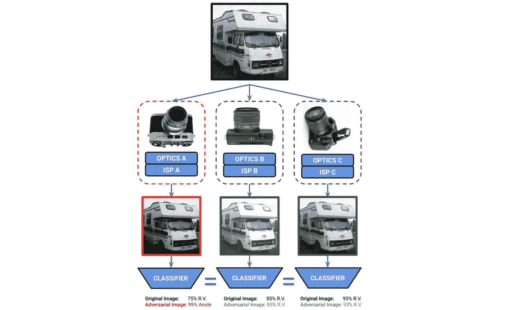
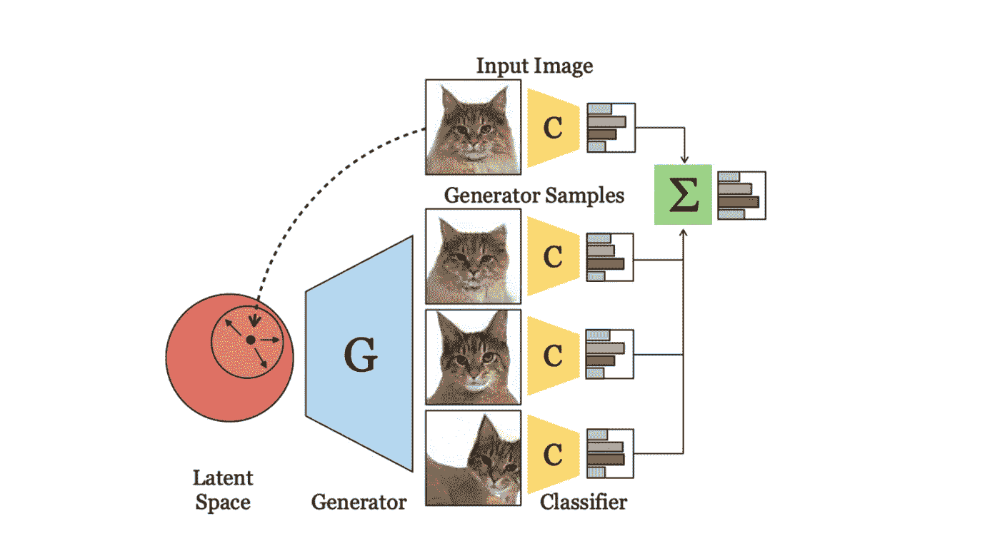
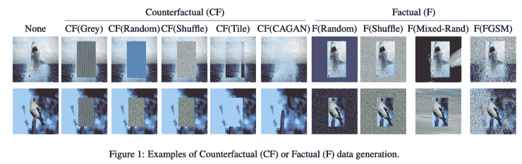
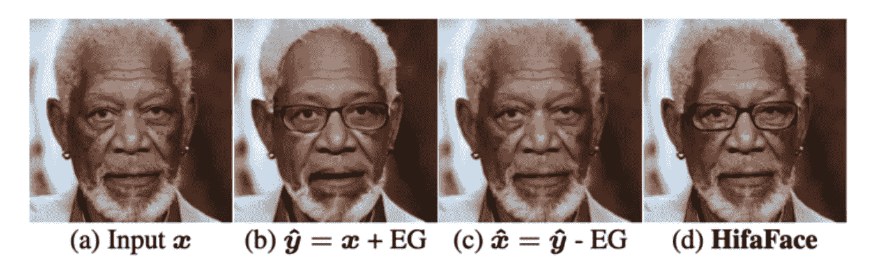
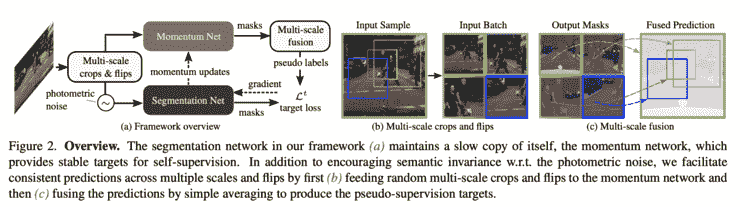

# Akira 的机器学习新闻— #28

> 原文：<https://medium.com/analytics-vidhya/akiras-machine-learning-news-28-d6bc914a2e1a?source=collection_archive---------6----------------------->

## 本周特稿/新闻。

*   [提出了一种针对硬件(摄像机)的对抗性攻击方法](https://arxiv.org/abs/2102.03728)。它似乎通过使用再现嵌入式硬件的代理模型并取不同的值来产生对立的噪声。与物理模拟一样，使用代理模型允许我们甚至反向投影输入值，所以看看我们可以用代理模型做多少事情是很有趣的。

— — — — — — — — — — — — — — — — — — –

在下面的章节中，我将介绍各种文章和论文，不仅仅是关于上述内容，还包括以下五个主题。

1.  本周特稿/新闻
2.  机器学习用例
3.  报纸
4.  机器学习技术相关文章

— — — — — — — — — — — — — — — — — — –

# 1.本周特稿/新闻

[**攻击攻击硬件**](https://arxiv.org/abs/2102.03728?utm_campaign=Akira%27s%20Machine%20Learning%20News%20%20%20&utm_medium=email&utm_source=Revue%20newsletter)**——**

****

**[2102.03728]对抗性成像管道
虽然对抗性攻击以前仅被认为是针对特定分类器的，但作者提出了一种可以选择性攻击该类型摄像机的方法。因此，即使下游的分类器是相同的，攻击者也可以根据拍摄照片的相机类型有选择地进行攻击。**

**— — — — — — — — — — — — — — — — — — –**

# **2.机器学习用例**

## **[利用机器学习帮助种植咖啡](https://www.prnewswire.com/il/news-releases/demetria-launches-ai-based-agtech-solution-to-boost-the-growth-of-high-value-coffee-301348017.html?utm_campaign=Akira%27s%20Machine%20Learning%20News%20%20%20&utm_medium=email&utm_source=Revue%20newsletter)**

**[www.prnewswire.com](https://www.prnewswire.com/il/news-releases/demetria-launches-ai-based-agtech-solution-to-boost-the-growth-of-high-value-coffee-301348017.html)**

**为了培育更好的咖啡树苗，Demetria 正致力于使用机器学习来帮助确定嫁接是否可行。根据这一批次，还可以从红外数据中判断咖啡豆的味道。**

**— — — — — — — — — — — — — — — — — — –**

# **3.报纸**

**[**文综用甘**](https://arxiv.org/abs/2104.14551?utm_campaign=Akira%27s%20Machine%20Learning%20News%20%20%20&utm_medium=email&utm_source=Revue%20newsletter)【arxiv.org】——**

********

****[2104.14551]具有深度生成视图的集合
使用预先训练的 GANs 进行的集合研究。使用预先训练的 StyleGAN，他们通过扰动对应于输入图像的潜在变量来生成相似的图像，然后对图像执行测试时间集成。****

****[**用变换后的元素生成数据，这些元素对于类别**](https://arxiv.org/abs/2106.01127?utm_campaign=Akira%27s%20Machine%20Learning%20News%20%20%20&utm_medium=email&utm_source=Revue%20newsletter)**—****是不变的******

************

******[2106.01127]通过反事实和不变数据生成实现稳健的分类模型
分类模型可能会在不直接相关但高度相关的区域(如背景)中出错，以确定类别。这项研究旨在通过生成这些领域发生变化的反事实数据，使分类更加稳健。因此，即使对于标准模型无法推断的数据，正确的预测也是可能的。******

******[**恢复人脸细节的变换**](https://arxiv.org/abs/2103.15814?utm_campaign=Akira%27s%20Machine%20Learning%20News%20%20%20&utm_medium=email&utm_source=Revue%20newsletter)**——**[**arxiv.org**](https://arxiv.org/abs/2103.15814)******

********

****【2103.15814】高保真任意人脸编辑
虽然在人脸编辑中经常使用循环一致性，但是我们可以观察到一种叫做隐写术的现象。面的细节在域变换到一侧后会丢失，但在变换到另一侧后会重新获得。为了避免这一问题，作者提出了一种利用小波变换将高频信息直接输入网络的方法。结果，他们成功地保持了改造前后面部的精细细节。****

****[**域适应与自我监督学习**](https://arxiv.org/abs/2105.00097?utm_campaign=Akira%27s%20Machine%20Learning%20News%20%20%20&utm_medium=email&utm_source=Revue%20newsletter)**——**[**arxiv.org**](https://arxiv.org/abs/2105.00097)****

********

****【2105.00097】用于调整语义分割的自监督增强一致性
提出了一种自监督学习方法，用于通过使用简单的数据扩展和移动平均，使用个人模型的副本创建伪标签来调整语义分割的领域。学习过程很简单，但它可以实现 SotA 性能。****

****— — — — — — — — — — — — — — — — — — –****

# ****4.机器学习技术相关文章****

****[**对抗畴变的对策**](https://towardsdatascience.com/5-ways-to-make-histopathology-image-models-more-robust-to-domain-shifts-323d4d21d889?gi=b274ebd96430&utm_campaign=Akira%27s%20Machine%20Learning%20News%20%20%20&utm_medium=email&utm_source=Revue%20newsletter)**——******

****** [## AI 能做出更好的聚变反应堆吗？

### 科学家们几十年前就知道，船只排放的微粒会对低洼地区产生巨大影响。

spectrum.ieee.org](https://spectrum.ieee.org/can-ai-make-a-better-fusion-reactor?utm_campaign=Akira%27s%20Machine%20Learning%20News%20%20%20&utm_medium=email&utm_source=Revue%20newsletter#toggle-gdpr) 

本文描述了针对细胞病理学图像中的域转移问题的五种对策。比如使用 GAN 的风格转换，颜色数据扩展等。，进行了描述。****** 

******[**机器学习系统**](https://thegradient.pub/systems-for-machine-learning/?utm_campaign=Akira%27s%20Machine%20Learning%20News%20%20%20&utm_medium=email&utm_source=Revue%20newsletter)**——**[**the gradient . pub**](https://thegradient.pub/systems-for-machine-learning/)******

**** [## 药物成瘾风险算法及其对慢性疼痛患者的严峻考验

### 2020 年 7 月的一个晚上，一个叫凯瑟琳的女人带着极度的疼痛去了医院。一个 32 岁的心理学…

www.wired.com](https://www.wired.com/story/opioid-drug-addiction-algorithm-chronic-pain/?utm_campaign=Akira%27s%20Machine%20Learning%20News%20%20%20&utm_medium=email&utm_source=Revue%20newsletter) 

【机器学习系统】
这篇文章从四个角度描述了使用机器学习构建系统的要素:数据收集、数据验证、训练和部署。由于数据验证不是一个新问题，所以它促进了现有工具的使用。**** 

****— — — — — — — — — — — — — — — — — — –****

# ****其他博客****

**** [## 计算机视觉 x 变形金刚的最新发展和看法

### 《变形金刚》和 CNN 的区别，为什么《变形金刚》很重要，它的弱点是什么。

towardsdatascience.com](https://towardsdatascience.com/recent-developments-and-views-on-computer-vision-x-transformer-ed32a2c72654)  [## 机器学习 2020 摘要:84 篇有趣的论文/文章

### 在这篇文章中，我总共展示了 2020 年发表的 84 篇我觉得特别有趣的论文和文章…

towardsdatascience.com](https://towardsdatascience.com/machine-learning-2020-summary-84-interesting-papers-articles-45bd45c0d35b)  [## 超大质量模型 GPT-3 的到达和极限

### 在这篇博文中，我将从技术上解释 GPT 3 号，GPT 3 号取得了什么，GPT 3 号没有取得什么…

medium.com](/analytics-vidhya/reach-and-limits-of-the-supermassive-model-gpt-3-5012a6ddff00) 

# 关于我

制造工程师/机器学习工程师/数据科学家/物理学硕士/[http://github.com/AkiraTOSEI/](https://t.co/hjHHbG24Ph?amp=1)

推特，我贴一句纸评论。****