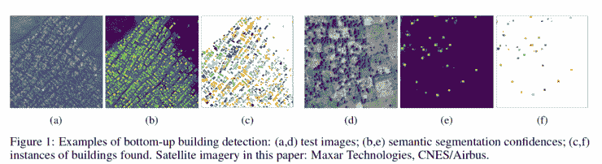
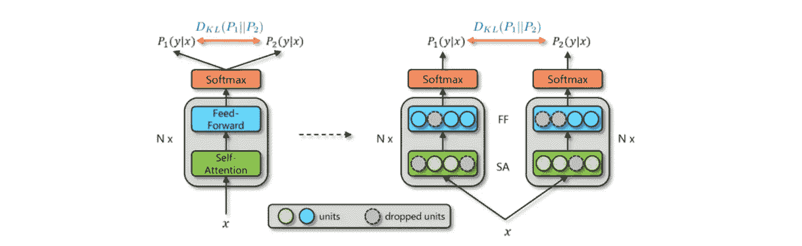
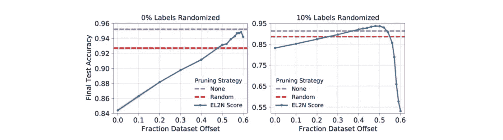
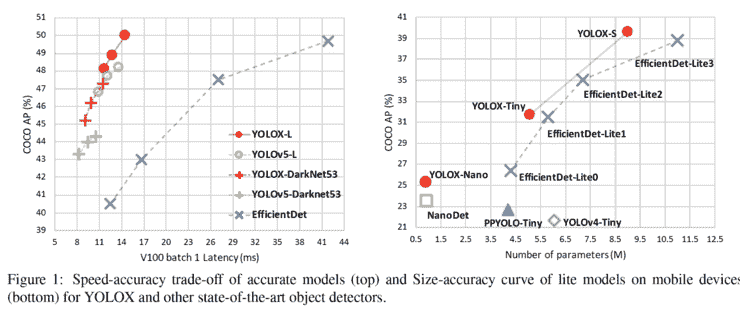
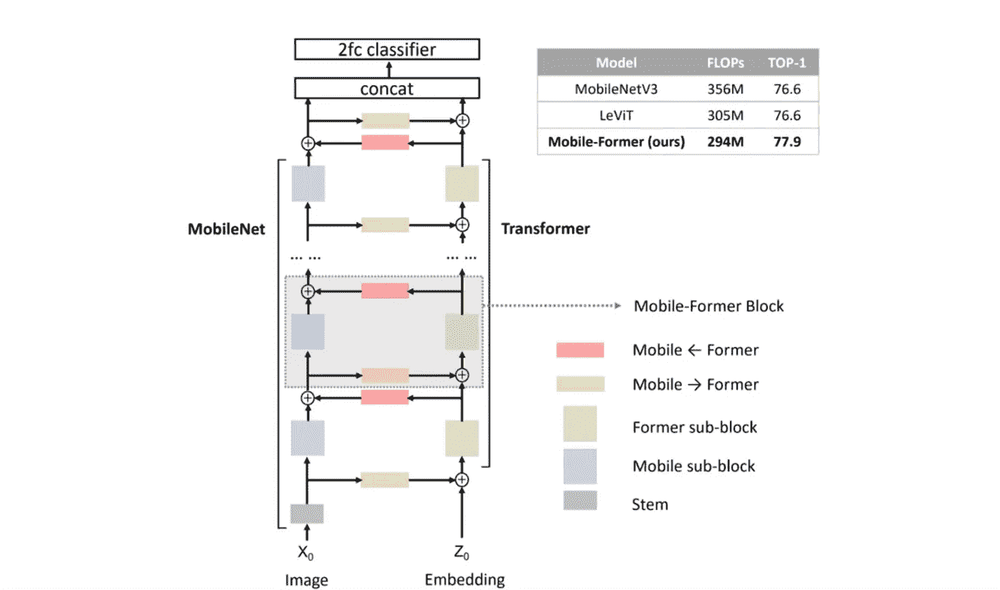
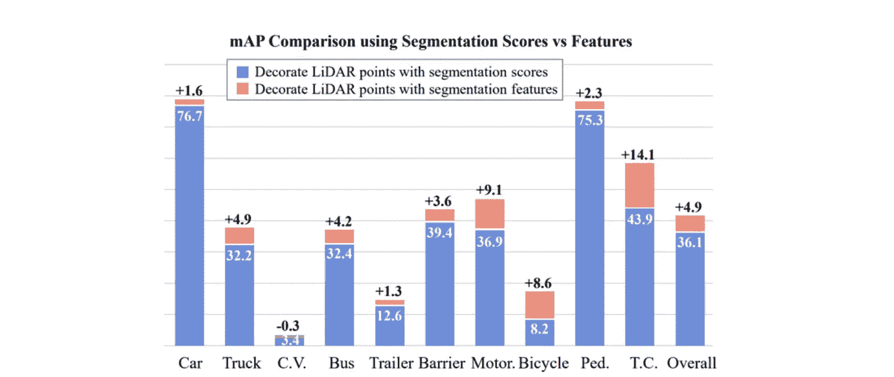
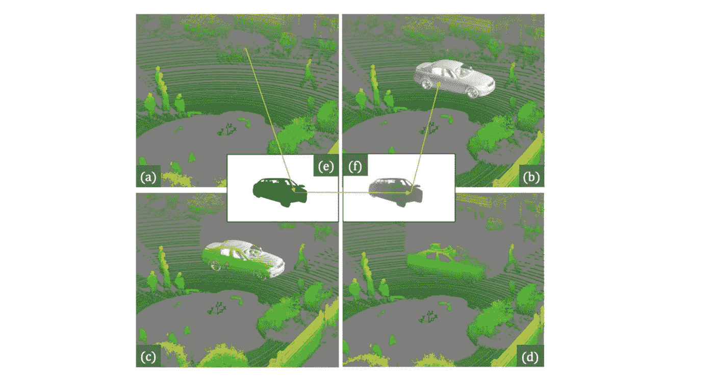

# Akira 的机器学习新闻—#第 29 期

> 原文：<https://medium.com/analytics-vidhya/akiras-machine-learning-news-issue-29-dab82a5b3cb7?source=collection_archive---------13----------------------->

## 本周特稿/新闻。

*   [关于 Pytorch Lightning 的 MLOps 系列文章](https://www.ravirajag.dev/blog/mlops-project-setup-part1)现已发布。它涵盖了很多东西，从使用 W & B 的模型到使用 GitHub 动作的 CI/CD。
*   Google Research 在[发表了一篇论文](https://arxiv.org/abs/2107.12283)，描述了他们在非洲大陆的建筑分割任务的方法和细节。这是一个很好的实例，对工程有很大的帮助。

— — — — — — — — — — — — — — — — — — –

在下面的章节中，我将介绍各种文章和论文，不仅仅是关于上述内容，还包括以下五个主题。

1.  本周特稿/新闻
2.  机器学习用例
3.  报纸
4.  机器学习技术相关文章
5.  其他主题

— — — — — — — — — — — — — — — — — — –

# 1.本周特稿/新闻

[**练习 MLOps**](https://www.ravirajag.dev/blog/mlops-project-setup-part1?utm_campaign=Akira%27s%20Machine%20Learning%20News%20%20%20&utm_medium=email&utm_source=Revue%20newsletter)**——**[**www . ravi rajag . dev**](https://www.ravirajag.dev/blog/mlops-project-setup-part1)

 [## MLOps 基础[第 0 周]:项目设置

### 本系列的目标是了解 MLOps 的基础知识(模型构建、监控、配置、测试……

www.ravirajag.dev](https://www.ravirajag.dev/blog/mlops-project-setup-part1?utm_campaign=Akira%27s%20Machine%20Learning%20News%20%20%20&utm_medium=email&utm_source=Revue%20newsletter) 

本文涵盖了使用 PyTorch lightning 的 MLOps、使用 W&B 的可视化、使用 Hydra 的参数管理以及使用 Github-Actions 的 CI/CD 的实践。

****——**[【arxiv.org】T21](https://arxiv.org/abs/2107.12283)**

****

**[2107.12283]通过高分辨率卫星图像进行大陆规模的建筑物检测
本文描述了谷歌研究的非洲大陆建筑物检测分割任务的详细方法。此外，该论文描述了各种有价值的技术，例如使用骰子损失和混合、自学(嘈杂的学生)以使用未标记的数据，以及针对建筑物中容易出错的间隙调整损失权重。**

**— — — — — — — — — — — — — — — — — — –**

# **2.机器学习用例**

**[**对机器学习建模的影响**](https://www.theregister.com/2021/09/13/ai_environmental_cost/?utm_campaign=Akira%27s%20Machine%20Learning%20News%20%20%20&utm_medium=email&utm_source=Revue%20newsletter)**——**[**www.theregister.com**](https://www.theregister.com/2021/09/13/ai_environmental_cost/)**

** [## AI caramba，那些神经网络是耗电的:计算人工…

### 下次你让 Alexa 关掉你卧室的灯或者让电脑写危险代码的时候，省下一点时间…

www.theregister.com](https://www.theregister.com/2021/09/13/ai_environmental_cost/) 

本文描述了对机器学习模型环境的影响。机器学习模型消耗大量的电力，今天的模型消耗更多的电力来使用许多参数和数据提高百分之几。作为对此的对策，它提到了边缘设备和模型简化。** 

**— — — — — — — — — — — — — — — — — — –**

# **3.报纸**

**[**正规化的辍学网络结果向更近的**](https://arxiv.org/abs/2106.14448?utm_campaign=Akira%27s%20Machine%20Learning%20News%20%20%20&utm_medium=email&utm_source=Revue%20newsletter)**——**[**arxiv.org**](https://arxiv.org/abs/2106.14448)**

****

**【2106.14448】R-Drop:神经网络的正则化漏失
作者提出了一种正则化 R-Drop，该正则化 R-Drop 使漏失网络的两个前向传播的结果分布更加接近。它可以通过简单地增加两个输出之间的 KL 距离的损失来容易地实现，并且在 NLP 和 CV 中的所有 18 个任务中实现增加的精度，并且在几个任务中实现 SotA 性能。**

**【arxiv.org】**减少训练数据****——****

********

****【2107.07075】数据饮食上的深度学习:在训练早期发现重要的例子
利用置信度和标签的差异(EL2N 分数)进行数据约简的研究。根据训练开始时(几个历元)的 EL2N 分数，可以减少训练所需的数据。50%的缩减并没有降低准确率，并且有可能处理嘈杂的标签问题。****

****[**最新版 YOLO 系列**](https://arxiv.org/abs/2107.08430?utm_campaign=Akira%27s%20Machine%20Learning%20News%20%20%20&utm_medium=email&utm_source=Revue%20newsletter)**——**[**arxiv.org**](https://arxiv.org/abs/2107.08430)****

********

****【YOLOX:2021 年超越 YOLO 系列】
作者提出了 YOLO 的改良版 YOLOX。它使用无锚点、解耦头、马赛克增强和一种新的标签分配策略。它比传统的目标检测模型更快更准确。****

****[**弥合弱监督和少镜头算法之间的鸿沟。**](https://arxiv.org/abs/2006.07502?utm_campaign=Akira%27s%20Machine%20Learning%20News%20%20%20&utm_medium=email&utm_source=Revue%20newsletter)**——**[**arxiv.org**](https://arxiv.org/abs/2006.07502)****

********

****[2006.07502] UniT:用于任意镜头对象检测和分割的统一知识转移
在新类别具有大量图像数据但很少注释的设置中，作者提出了一种称为 UniT 的算法，该算法使用了少量镜头和弱监督学习。它通过从弱监督信号到具有现有类别的完全监督信号的学习来适应少数镜头。****

****[**结合变压器与 MobileNet**](https://arxiv.org/abs/2108.05895?utm_campaign=Akira%27s%20Machine%20Learning%20News%20%20%20&utm_medium=email&utm_source=Revue%20newsletter)**——**[**arxiv.org**](https://arxiv.org/abs/2108.05895)****

********

****[2108.05895]移动模型:桥接 MobileNet 和 Transformer
作者开发了一种轻量级网络移动模型，它通过双向耦合连接 MobileNet 和 Transformer 来处理本地和全局信息。这个结果比以前的研究更准确、更轻便。****

****[**一种利用图像和点云的三维物体检测方法**](https://openaccess.thecvf.com/content/CVPR2021/html/Wang_PointAugmenting_Cross-Modal_Augmentation_for_3D_Object_Detection_CVPR_2021_paper.html?utm_campaign=Akira%27s%20Machine%20Learning%20News%20%20%20&utm_medium=email&utm_source=Revue%20newsletter)**——**[**openaccess.thecvf.com**](https://openaccess.thecvf.com/content/CVPR2021/html/Wang_PointAugmenting_Cross-Modal_Augmentation_for_3D_Object_Detection_CVPR_2021_paper.html)****

********

****【点增强:用于 3D 对象检测的跨模态增强】
本文提出了点增强，一种使用图像和点云的 3D 对象检测方法。在处理两种数据的情况下，激光雷达数据和影像之间存在不匹配。为了解决这个问题，作者提出了一种新的数据增强方法来复制和粘贴激光雷达和图像，同时保持透视一致性。使用大型 nuScenes 和 Waymo 数据集，他们展示了除激光雷达外使用图像的有效性以及数据增强的有效性。****

****[**激光雷达点云数据的数据增强方法**](https://openaccess.thecvf.com/content/CVPR2021/html/Fang_LiDAR-Aug_A_General_Rendering-Based_Augmentation_Framework_for_3D_Object_Detection_CVPR_2021_paper.html?utm_campaign=Akira%27s%20Machine%20Learning%20News%20%20%20&utm_medium=email&utm_source=Revue%20newsletter)**——**[**openaccess.thecvf.com**](https://openaccess.thecvf.com/content/CVPR2021/html/Fang_LiDAR-Aug_A_General_Rendering-Based_Augmentation_Framework_for_3D_Object_Detection_CVPR_2021_paper.html)****

********

****【LiDAR-Aug:一个通用的基于渲染的三维物体检测增强框架】
提出了一种激光雷达点云数据的数据增强方法。为了使数据与实际的激光雷达点云相同，他们通过随机放置对象来扩展点云数据，同时考虑到位置(ValidMAP)和激光的阻挡。KITTI 数据集证实了这一效果。****

****— — — — — — — — — — — — — — — — — — –****

# ****4.机器学习技术相关文章****

****[**庞大预学习模型的问题**](https://thegradient.pub/has-ai-found-a-new-foundation/?utm_campaign=Akira%27s%20Machine%20Learning%20News%20%20%20&utm_medium=email&utm_source=Revue%20newsletter)**——**[**the gradient . pub**](https://thegradient.pub/has-ai-found-a-new-foundation/)****

**** [## AI 找到新的基础了吗？

### 8 月，斯坦福大学的 32 名教师和 117 名研究科学家、博士后和学生

thegradient.pub](https://thegradient.pub/has-ai-found-a-new-foundation/) 

一篇文章讨论了可用于一般目的的大量预训练模型(基础模型)的问题，如 GPT-3。文章讨论了庞大的语言模型只会鹦鹉学舌，甚至不懂“不是”的意思。大多数商业模型不是基于大量的预训练模型。**** 

## ****[用于物理模拟的深度学习](https://physicsbaseddeeplearning.org/diffphys.html?utm_campaign=Akira%27s%20Machine%20Learning%20News%20%20%20&utm_medium=email&utm_source=Revue%20newsletter)****

****[physicsbaseddeeplearning.org](https://physicsbaseddeeplearning.org/diffphys.html)****

**** [## 基于物理的深度学习

### 作为走向深度学习方法和物理模拟的更紧密和更通用的结合的下一步，我们将…

physicsbaseddeeplearning.org](https://physicsbaseddeeplearning.org/diffphys.html) 

这是一本利用深度学习进行物理模拟的书(免费查看)。它用代码解释。它涵盖了物理学 x 深度学习的最新主题，包括可微分流体模拟。**** 

****— — — — — — — — — — — — — — — — — — –****

# ****5.其他主题****

****[**【scikit】学达 1.0.0 版本**](https://scikit-learn.org/dev/whats_new/v1.0.html?utm_campaign=Akira%27s%20Machine%20Learning%20News%20%20%20&utm_medium=email&utm_source=Revue%20newsletter)**——**[【scikit-learn.org】](https://scikit-learn.org/dev/whats_new/v1.0.html)****

****[https://scikit-learn.org/dev/whats_new/v1.0.html](https://scikit-learn.org/dev/whats_new/v1.0.html)****

****— — — — — — — — — — — — — — — — — — –****

# ****🌟我每周发布时事通讯！请订阅！🌟****

**** [## 阿基拉的机器学习新闻- Revue

### 由 Akira 的机器学习新闻-由 Akihiro FUJII:制造工程师/机器学习工程师/硕士…

www.getrevue.co](https://www.getrevue.co/profile/akiratosei) 

— — — — — — — — — — — — — — — — — — –

# 其他博客

 [## 机器学习 2020 摘要:84 篇有趣的论文/文章

### 在这篇文章中，我总共展示了 2020 年发表的 84 篇我觉得特别有趣的论文和文章…

towardsdatascience.com](https://towardsdatascience.com/machine-learning-2020-summary-84-interesting-papers-articles-45bd45c0d35b)  [## 计算机视觉 x 变形金刚的最新发展和看法

### 《变形金刚》和 CNN 的区别，为什么《变形金刚》很重要，它的弱点是什么。

towardsdatascience.com](https://towardsdatascience.com/recent-developments-and-views-on-computer-vision-x-transformer-ed32a2c72654)  [## 超大质量模型 GPT-3 的到达和极限

### 在这篇博文中，我将从技术上解释 GPT 3 号，GPT 3 号取得了什么，GPT 3 号没有取得什么…

medium.com](/analytics-vidhya/reach-and-limits-of-the-supermassive-model-gpt-3-5012a6ddff00) 

— — — — — — — —

# 关于我

制造工程师/机器学习工程师/数据科学家/物理学硕士/[http://github.com/AkiraTOSEI/](https://t.co/hjHHbG24Ph?amp=1)

推特，我贴一句纸评论。****