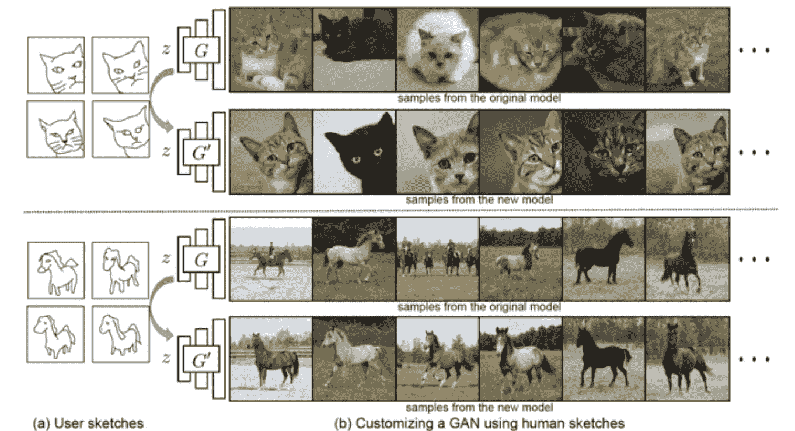
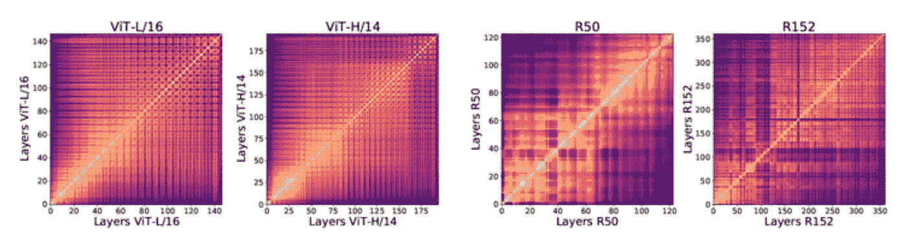
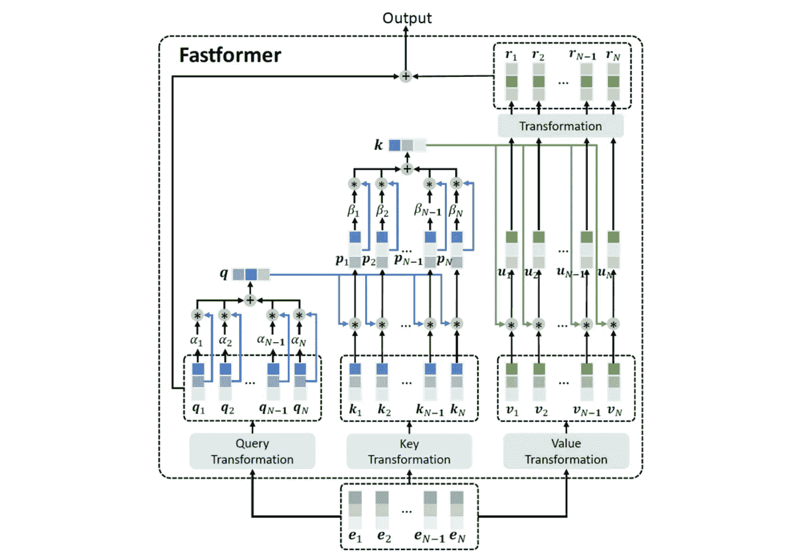
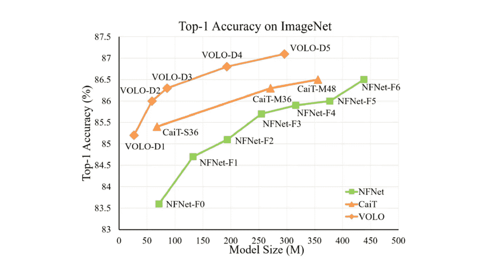
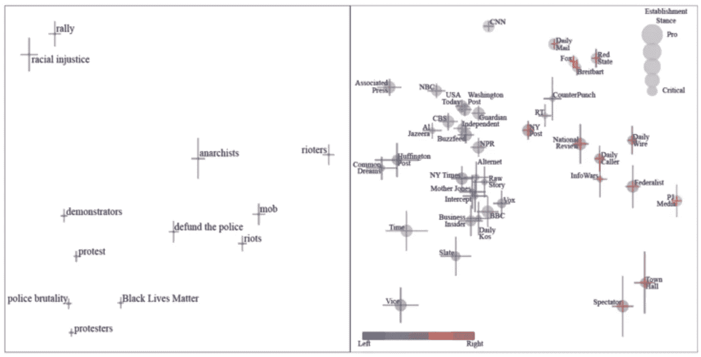
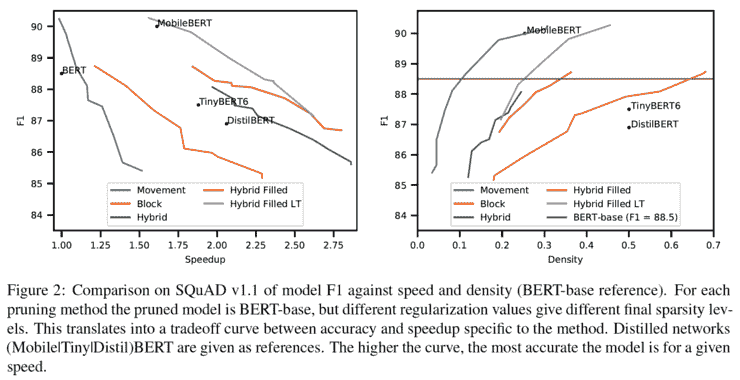
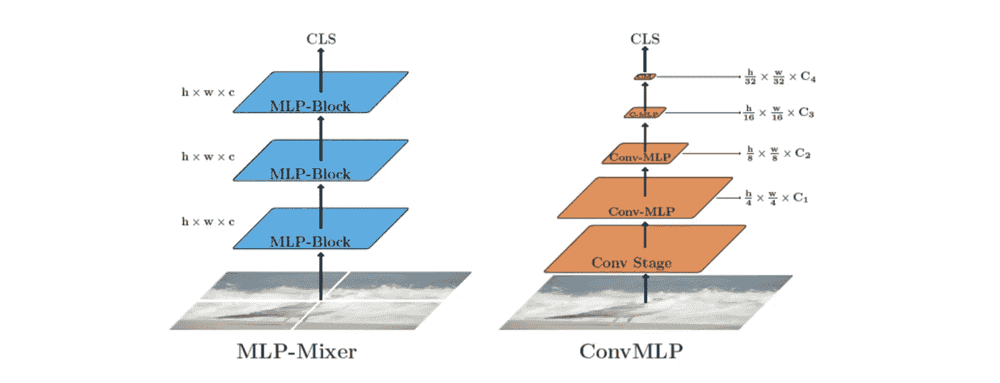
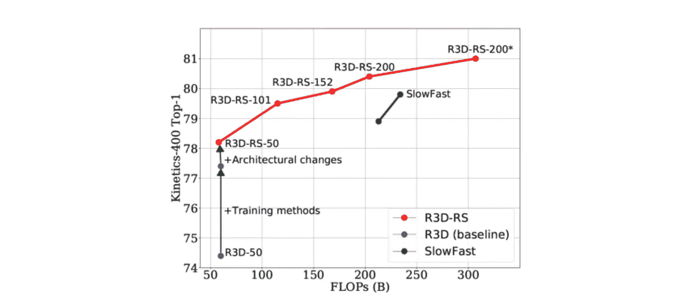

# Akira 的机器学习新闻——第 30 期

> 原文：<https://medium.com/analytics-vidhya/akiras-machine-learning-news-issue-30-6364860348eb?source=collection_archive---------11----------------------->

## 本周特稿/新闻。

*   [有人提出了一项研究](https://arxiv.org/abs/2108.02774)，该研究使用一些草图来调整 GAN 的参数。然后，它将学习生成图像来匹配草图图像。
*   [关于 ViT 和 CNN](https://arxiv.org/abs/2108.08810) s 获得的特征差异的研究已经提出。与 CNN 不同，ViT 似乎倾向于在浅层和深层获得相似的特征。这似乎与 ViT 的机制有关，它可以从初始层获取全局特征。

— — — — — — — — — — — — — — — — — — –

在下面的章节中，我将介绍各种文章和论文，不仅仅是关于上述内容，还包括以下五个主题。

1.  本周特稿/新闻
2.  机器学习用例
3.  报纸
4.  机器学习技术相关文章
5.  其他主题

— — — — — — — — — — — — — — — — — — –

# 1.本周特稿/新闻

【arxiv.org】**调整甘配图****——**

****

**[2108.02774]画出你自己的 GAN 图
这是一项研究，利用一些插图对 GAN 图进行微调，以生成与插图相匹配的图像。生成的图像被返回到草图，并用鉴别器训练以确定其真实性。也可以修改自然图像以匹配草图。**

**[**ViT 和 CNN 在获得的表征上有什么不同？**](https://arxiv.org/abs/2108.08810?utm_campaign=Akira%27s%20Machine%20Learning%20News%20%20%20&utm_medium=email&utm_source=Revue%20newsletter)**——**【arxiv.org】**

********

****[2108.08810]视觉变形器看起来像卷积神经网络吗？
ViT 与 CNN 的差异研究。上面写着:CNN 在浅层和深层得到不同的表征，而 ViT 得到相对相似的表征；ViT 从一开始就使用全局信息；ViT 的跳跃连接在层表示的相似性等方面起着重要的作用。****

****— — — — — — — — — — — — — — — — — — –****

# ****2.机器学习用例****

****[**一个 AI 创业公司的创始故事**](/predict/how-to-build-an-ai-unicorn-in-6-years-87b7967e1ac1?utm_campaign=Akira%27s%20Machine%20Learning%20News%20%20%20&utm_medium=email&utm_source=Revue%20newsletter)**——**[**medium.com**](/predict/how-to-build-an-ai-unicorn-in-6-years-87b7967e1ac1)****

**** [## 如何在 6 年内打造一只 AI 独角兽

### 我是如何做到的(你也能做到)从对技术一无所知开始

medium.com](/predict/how-to-build-an-ai-unicorn-in-6-years-87b7967e1ac1) 

Tractable 是一家市值 10 亿美元的初创公司，其前六年的经历分为四个部分，最后一部分是关于日本 Tokio Marine & Nichido 的挑战。**** 

****— — — — — — — — — — — — — — — — — — –****

# ****3.报纸****

****[**极低计算复杂度变压器**](https://arxiv.org/abs/2108.09084?utm_campaign=Akira%27s%20Machine%20Learning%20News%20%20%20&utm_medium=email&utm_source=Revue%20newsletter)**——**[**arxiv.org**](https://arxiv.org/abs/2108.09084)****

********

****[2108.09084]Fastformer:Additive Attention 可以是你所需要的全部
作者提出了 fast former，这是一种计算复杂度为 N-d 的转换器。与传统的转换器不同，它不会为整个令牌构建 N 注意力图，而是使用查询的加权平均值作为全局特征，并将其元素乘积作为注意力。在 5 个数据集上的结果与其他方法相当。****

****【arxiv.org】**注意，可以聚合本地信息****——******

************

******[2106.13112]VOLO:Vision Outlook er for Visual Recognition
作者提出了一种注意力机制 Outlook Attention，它可以聚合大小为 K 的外围信息以获得局部信息，并在仅使用 ImageNet 学习的任务上实现 SotA 性能。******

**********——**[**arxiv.org**](https://arxiv.org/abs/2109.00024)********

********

****[2109.00024]机器学习媒体偏见
这是一项可视化媒体偏见的研究。从报纸上出现的短语的频率来看，作者获得了接近人类感官的结果，使我们能够定量地可视化政治偏见和其他因素。****

****[**修剪模型中的一些参数**](https://arxiv.org/abs/2109.04838?utm_campaign=Akira%27s%20Machine%20Learning%20News%20%20%20&utm_medium=email&utm_source=Revue%20newsletter)**—******

************

******[2109.04838]用于更快的变压器的块修剪
作者提出了块修剪，该块修剪使用总结其一些参数的单元来修剪模型。与传统的剪枝不同，它可以很容易地应用于 Transformer，并且不需要与知识提取相结合。它导致模型大小减少了 74%，推理速度提高了 2.4 倍，F1 分数仅下降了 1%。******

******[**结合 arxiv.org**](https://arxiv.org/abs/2109.04454?utm_campaign=Akira%27s%20Machine%20Learning%20News%20%20%20&utm_medium=email&utm_source=Revue%20newsletter)**——********

************

******[2109.04454] ConvMLP:用于视觉的分层卷积 MLP
尽管 MLP 混合器具有很高的精度，但将其应用于物体检测仍具有挑战性，因为它只能在固定维度上进行处理。因此，他们提出了 ConvMLP，它结合了 Conv 和 MLP，并采用分层结构来处理这个问题。因此，ConvMLP 也可应用于物体检测，并以少量参数提供高度精确的结果。******

******[**改进 ResNet 在动作识别上达到 SotA 水平。**](https://arxiv.org/abs/2109.01696?utm_campaign=Akira%27s%20Machine%20Learning%20News%20%20%20&utm_medium=email&utm_source=Revue%20newsletter)**——**[**arxiv.org**](https://arxiv.org/abs/2109.01696)******

********

****[2109.01696]重温 3D ResNets 进行视频识别
这是一项在动作识别任务中将 ResNet-3D 提高到 SotA 水平的研究。通过引入 dropbox、随机深度、RandAug 等改进了网络结构。，作为正规化。****

****— — — — — — — — — — — — — — — — — — –****

# ****4.机器学习技术相关文章****

****[**把对付恶意软件当成“计算机视觉”问题**](https://bdtechtalks.com/2021/09/10/computer-vision-deep-learning-threat-detection/?utm_campaign=Akira%27s%20Machine%20Learning%20News%20%20%20&utm_medium=email&utm_source=Revue%20newsletter)**——**[**【bdtechtalks.com】**](https://bdtechtalks.com/2021/09/10/computer-vision-deep-learning-threat-detection/)****

**** [## 计算机视觉和深度学习提供了检测网络威胁的新方法

### 本文是我们对人工智能研究论文的评论的一部分，这是一系列探索人工智能最新发现的文章

bdtechtalks.com](https://bdtechtalks.com/2021/09/10/computer-vision-deep-learning-threat-detection/) 

本文介绍了一个将恶意软件检测作为计算机视觉问题来处理的案例研究。例如，恶意软件包含各种 ASCII 字符，可以将其可视化为一个计算机视觉问题。**** 

****[**检测对抗性攻击**](https://thenextweb.com/news/researchers-created-new-technique-stop-adversarial-attacks-syndication?utm_campaign=Akira%27s%20Machine%20Learning%20News%20%20%20&utm_medium=email&utm_source=Revue%20newsletter)**——**[**thenextweb.com**](https://thenextweb.com/news/researchers-created-new-technique-stop-adversarial-attacks-syndication)****

**** [## 研究人员创造了一种新技术来阻止恶意攻击

### 你知道 Neural 今年秋天会登台吗？与令人惊叹的专家阵容一起，我们将探索…

thenextweb.com](https://thenextweb.com/news/researchers-created-new-technique-stop-adversarial-attacks-syndication) 

一篇文章是关于对抗性攻击的检测方法。本文解释了如何通过从 GradCAM 等显著图中重建图像来检测对抗性攻击。**** 

****[**自学入门**](https://www.deeplearningweekly.com/p/deep-learning-weekly-self-supervised?utm_campaign=Akira%27s%20Machine%20Learning%20News%20%20%20&utm_medium=email&utm_source=Revue%20newsletter)**——**[**www.deeplearningweekly.com**](https://www.deeplearningweekly.com/p/deep-learning-weekly-self-supervised)****

**** [## 深度学习周刊:自我监督学习深度潜水

### 嘿伙计们，今天，我们向你们发送我们的第三次深潜！我们的目的是对给定的主题提供精确的检查。今天…

www.deeplearningweekly.com](https://www.deeplearningweekly.com/p/deep-learning-weekly-self-supervised) 

一篇关于自我监督学习的简介文章。它给出了概述，原则，应用和未来的前景。

— — — — — — — — — — — — — — — — — — –

# 5.其他主题

[**在 PyTorch 中加速推理**](https://twitter.com/PyTorch/status/1437838231505096708?s=20&utm_campaign=Akira%27s%20Machine%20Learning%20News%20%20%20&utm_medium=email&utm_source=Revue%20newsletter)**——**[**twitter.com**](https://twitter.com/PyTorch/status/1437838231505096708?s=20)

Pytorch 官方关于在 Pytoch 中加速推理的帖子，描述了 torch.no_grad 和 torch.inference_mode 的用法**** 

****— — — — — — — — — — — — — — — — — — –****

# ****🌟我每周发布时事通讯！请订阅！🌟****

**** [## 阿基拉的机器学习新闻- Revue

### 由 Akira 的机器学习新闻-由 Akihiro FUJII:制造工程师/机器学习工程师/硕士…

www.getrevue.co](https://www.getrevue.co/profile/akiratosei) 

— — — — — — — — — — — — — — — — — — –

# 其他博客

 [## 机器学习 2020 摘要:84 篇有趣的论文/文章

### 在这篇文章中，我总共展示了 2020 年发表的 84 篇我觉得特别有趣的论文和文章…

towardsdatascience.com](https://towardsdatascience.com/machine-learning-2020-summary-84-interesting-papers-articles-45bd45c0d35b)  [## 计算机视觉 x 变形金刚的最新发展和看法

### 《变形金刚》和 CNN 的区别，为什么《变形金刚》很重要，它的弱点是什么。

towardsdatascience.com](https://towardsdatascience.com/recent-developments-and-views-on-computer-vision-x-transformer-ed32a2c72654)  [## 超大质量模型 GPT-3 的到达和极限

### 在这篇博文中，我将从技术上解释 GPT 3 号，GPT 3 号取得了什么，GPT 3 号没有取得什么…

medium.com](/analytics-vidhya/reach-and-limits-of-the-supermassive-model-gpt-3-5012a6ddff00) 

— — — — — — — — — — — — — — — — — — –

# 关于我

制造工程师/机器学习工程师/数据科学家/物理学硕士/[http://github.com/AkiraTOSEI/](https://t.co/hjHHbG24Ph?amp=1)

推特，我贴一句纸评论。****