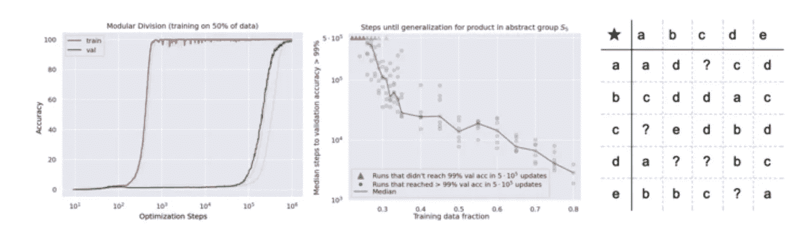
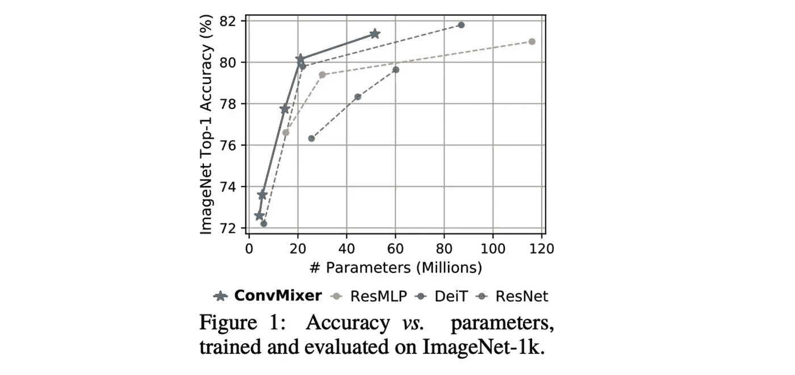
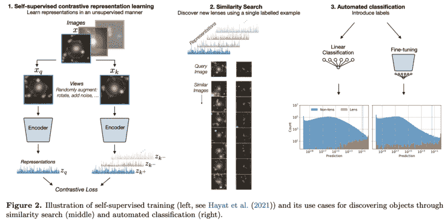
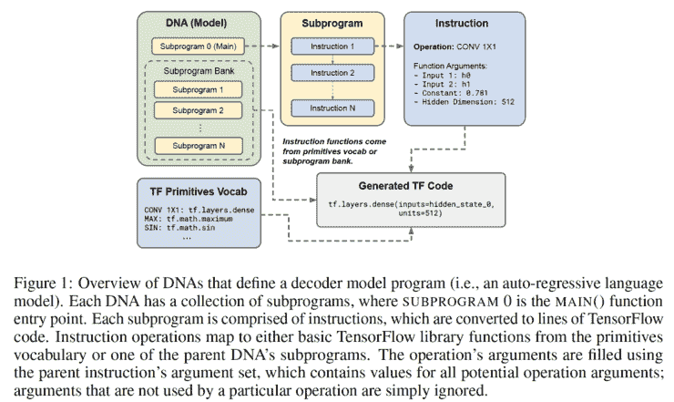
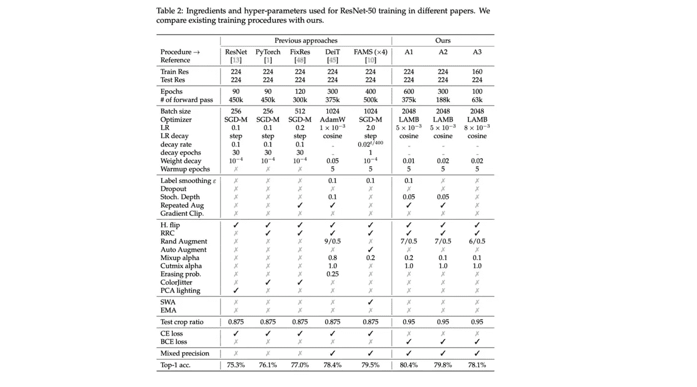
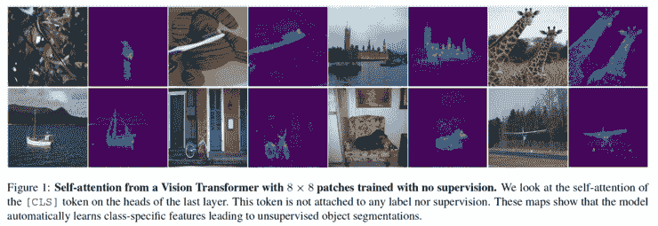
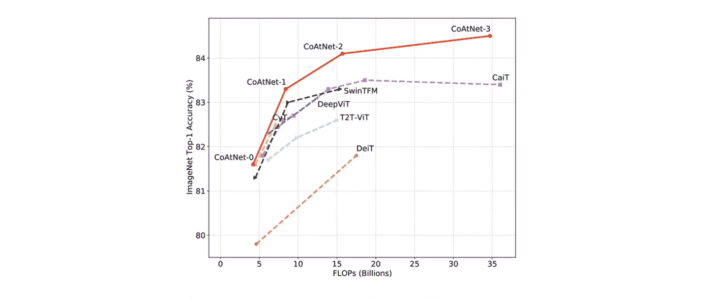

# Akira 的机器学习新闻—#第 31 期

> 原文：<https://medium.com/analytics-vidhya/akiras-machine-learning-news-issue-31-d7d5ee127df7?source=collection_archive---------16----------------------->

## 本周特稿/新闻。

*   [一项发表的研究](https://mathai-iclr.github.io/papers/papers/MATHAI_29_paper.pdf)显示了随机结果的泛化性能的突然提高:过拟合开始于大约 10 步，而随机预测的泛化性能的突然提高据报道发生在大约 10⁶步。因此，加权衰减似乎是一般化的关键。另一方面，Y [annic Kilcher 提出了](https://www.youtube.com/watch?v=dND-7llwrpw)一个假设，即“权重衰减可能会使模型在抑制突变的同时绘制出一条平滑的概括线”，我认为这非常有趣。
*   研究人员[提出](https://openreview.net/forum?id=TVHS5Y4dNvM)图像系统中的变压器模型的结果，如 ViT，可能是由于修补而不是变压器。在需要大量数据的 ViT 系统中对 CIFAR10 进行完全刮擦训练就能获得 96%的准确率，这是一个很突出的成绩。

— — — — — — — — — — — — — — — — — — –

在下面的章节中，我将介绍各种文章和论文，不仅仅是关于上述内容，还包括以下五个主题。

1.  本周特稿/新闻
2.  机器学习用例
3.  报纸
4.  机器学习技术相关文章
5.  其他主题

— — — — — — — — — — — — — — — — — — –

# 1.本周特稿/新闻

[**一段时间后，神经网络突然泛化。**](https://mathai-iclr.github.io/papers/papers/MATHAI_29_paper.pdf?utm_campaign=Akira%27s%20Machine%20Learning%20News%20%20%20&utm_medium=email&utm_source=Revue%20newsletter)**—**[**mathai-iclr . github . io**](https://mathai-iclr.github.io/papers/papers/MATHAI_29_paper.pdf)

【GROKKING:超越对小型算法数据集过度拟合的泛化】
他们发现，数据集越小，优化神经网络所需的时间就越长。虽然过度拟合发生在大约 10 个步骤中，但是推广到有效集合需要大约 10⁵步骤，这导致随机结果的准确性突然增加。对于这种概括，使用重量衰减是必要的。

[**打补丁比变压器更关键吗？**](https://openreview.net/forum?id=TVHS5Y4dNvM&utm_campaign=Akira%27s%20Machine%20Learning%20News%20%20%20&utm_medium=email&utm_source=Revue%20newsletter)**——**[**openreview.net**](https://openreview.net/forum?id=TVHS5Y4dNvM)

[您只需要补丁？| OpenReview]
这是一项使用 Conv 的变压器编码器类机制的研究，它可以用六行 PyTorch 实现，比 ViT 或 MLP 混合器更有效，即使在 CIFAR 等小数据集上也可以达到 96%的准确率。根据这一结果，作者认为修补图像比变压器本身更重要。

— — — — — — — — — — — — — — — — — — –

# 2.机器学习用例

[**中国将继续成为人工智能技术的“世界工厂”**](https://kaifulee.medium.com/china-is-still-the-worlds-factory-and-it-s-designing-the-future-with-ai-b79123ce3a65?utm_campaign=Akira%27s%20Machine%20Learning%20News%20%20%20&utm_medium=email&utm_source=Revue%20newsletter)**——**[**kaifulee.medium.com**](https://kaifulee.medium.com/china-is-still-the-worlds-factory-and-it-s-designing-the-future-with-ai-b79123ce3a65)

 [## 中国仍然是世界工厂——它正在用人工智能设计未来

### 多年来，中国一直是世界工厂。即使在 2020 年，当其他经济体还在努力应对…

kaifulee.medium.com](https://kaifulee.medium.com/china-is-still-the-worlds-factory-and-it-s-designing-the-future-with-ai-b79123ce3a65) 

这是一篇关于中国应用 AI 技术的文章。中国被称为世界工厂，这在 2020 年仍将如此，并表示随着人口放缓导致劳动力成本上升，中国正在利用人工智能技术在制造业和其他领域进行创新。

— — — — — — — — — — — — — — — — — — –

# 3.报纸

【arxiv.org】****——****

********

****[2110.00023]利用自监督学习挖掘强引力透镜
通过自监督学习寻找引力透镜候选图像的研究。首先，他们使用带有自我监督学习的预训练模型，通过已知图像中的相似性来寻找候选对象。之后，他们使用线性回归和其他方法建立分类模型。他们表示，这可以大大降低处理调查数据的门槛，并开辟许多合作渠道。****

****用进化算法优化的****——**[**arxiv.org**](https://arxiv.org/abs/2109.08668)******

********

****[2109.08668]初级读本:为语言建模寻找有效的转换器
这是对进化算法中语言模型转换器的 NAS 的研究。作为搜索的结果，他们发现了 MDHA，它在头部之间卷积信息，以及平方 ReLU，平方 ReLU，配备它们的 Primer 可以减少 1/3 到 1/4 的训练时间。****

****[**重新评估 ResNet 并重新建立学习程序的基线**](https://arxiv.org/abs/2110.00476?utm_campaign=Akira%27s%20Machine%20Learning%20News%20%20%20&utm_medium=email&utm_source=Revue%20newsletter)**——**[**arxiv.org**](https://arxiv.org/abs/2110.00476)****

********

****[2110.00476] ResNet 反击:timm 的改进培训程序
这是一项研究，其中 ResNet 使用最新的正规化和数据扩充进行了重新评估。结果，Top-1 Acc 从 75.3%提高到 80.4%。此外，不同的论文对 ResNet 的评分是不同的，但他们的学习过程通过 timm 公开，并分享了一个新的基线。****

****[**ViT 可以通过自我监督学习**](https://arxiv.org/abs/2104.14294?utm_campaign=Akira%27s%20Machine%20Learning%20News%20%20%20&utm_medium=email&utm_source=Revue%20newsletter)**——**[**arxiv.org**](https://arxiv.org/abs/2104.14294)来学习语义域切分信息****

********

****[2104.14294]自监督视觉变压器中的新兴特性
这是一项关于 vit 自监督学习的研究。他们提出了 DINO，它通过类似蒸馏的机制执行自我监督学习，来训练 vit，以便它们的分布在多个裁剪的图像中保持一致。****

****[**用更少或更多的数据实现高性能。**](https://arxiv.org/abs/2106.04803?utm_campaign=Akira%27s%20Machine%20Learning%20News%20%20%20&utm_medium=email&utm_source=Revue%20newsletter)**—******

************

******[2106.04803] CoAtNet:为所有数据大小结合卷积和注意力
这是结合 Transformer 和 CNN 的研究。首先，使用相对位置编码进行自我关注，然后在舞台级别选择 CNN 或 Transformer 层，并建立舞台。最后，使用 ImageNet 获得 SotA 性能，用更少或更多的数据实现高性能。******

******— — — — — — — — — — — — — — — — — — –******

# ******4.机器学习技术相关文章******

******[**背景与前景分离**](https://ai.googleblog.com/2021/08/introducing-omnimattes-new-approach-to.html?utm_campaign=Akira%27s%20Machine%20Learning%20News%20%20%20&utm_medium=email&utm_source=Revue%20newsletter)**——**[**ai.googleblog.com**](https://ai.googleblog.com/2021/08/introducing-omnimattes-new-approach-to.html)******

**** [## 介绍 Omnimattes:一种使用分层神经渲染生成遮罩的新方法

### 图像和视频编辑操作通常依赖于精确的图像来定义前景和…

ai.googleblog.com](https://ai.googleblog.com/2021/08/introducing-omnimattes-new-approach-to.html) 

这是谷歌的博客“Omnimatte:在视频中关联对象及其效果”(CVPR2021)。它指出，通过让 CNN 学习人和阴影之间的相关性，分离相关性较低的部分是可能的，它可以分离背景和前景。**** 

****[**ViT 和 CNN 的区别**](https://syncedreview.com/2021/08/27/deepmind-podracer-tpu-based-rl-frameworks-deliver-exceptional-performance-at-low-cost-92/?utm_campaign=Akira%27s%20Machine%20Learning%20News%20%20%20&utm_medium=email&utm_source=Revue%20newsletter)**——**[**syncedreview.com**](https://syncedreview.com/2021/08/27/deepmind-podracer-tpu-based-rl-frameworks-deliver-exceptional-performance-at-low-cost-92/)****

**** [## 谷歌大脑揭示了 CNN 和视觉转换器之间的表征结构差异

### 尽管卷积神经网络(CNN)已经统治了计算机视觉领域多年，但新的视觉…

syncedreview.com](https://syncedreview.com/2021/08/27/deepmind-podracer-tpu-based-rl-frameworks-deliver-exceptional-performance-at-low-cost-92/) 

一篇评论文章【视觉变形金刚看起来像卷积神经网络吗？]讨论 ViT 和 CNN 的区别。它指出，ViT 用于表示传播的跳过连接比 ResNet 连接更有影响，并且可能会显著影响性能和表示相似性。

— — — — — — — — — — — — — — — — — — –

# 5.其他主题

[**张量流相似度**](https://blog.tensorflow.org/2021/09/introducing-tensorflow-similarity.html?utm_campaign=Akira%27s%20Machine%20Learning%20News%20%20%20&utm_medium=email&utm_source=Revue%20newsletter)**——**[**blog.tensorflow.org**](https://blog.tensorflow.org/2021/09/introducing-tensorflow-similarity.html)

 [## 引入张量流相似性

### 2021 年 9 月 13 日-由 Elie Bursztein 和 Owen Vallis 发布，Google 今天发布了第一版…

blog.tensorflow.org](https://blog.tensorflow.org/2021/09/introducing-tensorflow-similarity.html) 

【TensorFlow 相似度介绍—tensor flow 博客】
tensor flow 相似度介绍，可以搜索最近邻数据，可以用 20 行代码实现。

— — — — — — — — — — — — — — — — — — –

# 其他博客

 [## 机器学习 2020 摘要:84 篇有趣的论文/文章

### 在这篇文章中，我总共展示了 2020 年发表的 84 篇我觉得特别有趣的论文和文章…

towardsdatascience.com](https://towardsdatascience.com/machine-learning-2020-summary-84-interesting-papers-articles-45bd45c0d35b)  [## 计算机视觉 x 变形金刚的最新发展和看法

### 《变形金刚》和 CNN 的区别，为什么《变形金刚》很重要，它的弱点是什么。

towardsdatascience.com](https://towardsdatascience.com/recent-developments-and-views-on-computer-vision-x-transformer-ed32a2c72654)  [## 超大质量模型 GPT-3 的到达和极限

### 在这篇博文中，我将从技术上解释 GPT 3 号，GPT 3 号取得了什么，GPT 3 号没有取得什么…

medium.com](/analytics-vidhya/reach-and-limits-of-the-supermassive-model-gpt-3-5012a6ddff00) 

# 关于我

制造工程师/机器学习工程师/数据科学家/物理学硕士/[http://github.com/AkiraTOSEI/](https://t.co/hjHHbG24Ph?amp=1)

推特，我贴一句纸评论。****